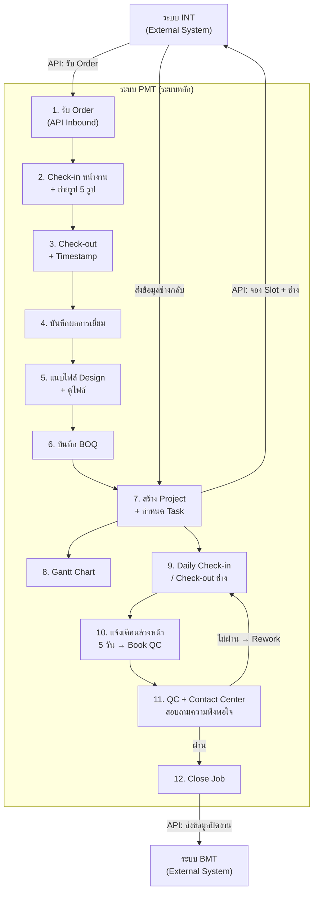
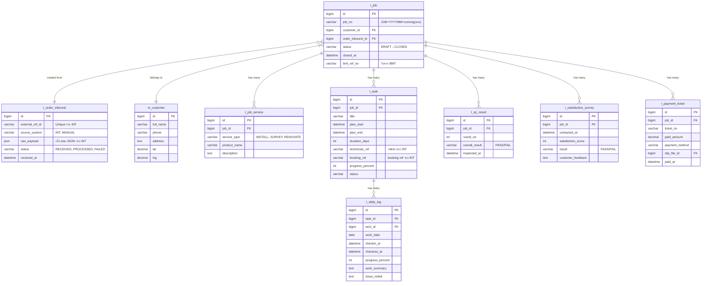
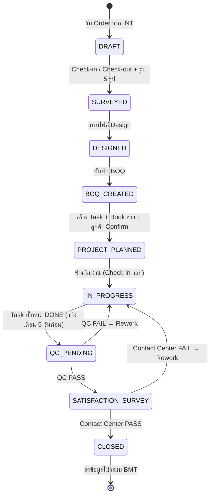

# SPMT — วิเคราะห์ระบบจาก Requirement ฉบับสมบูรณ์
> เวอร์ชัน: 1.3 | วันที่: 1 กันยายน 2569 | สถานะ: ✅ OQ ยืนยันครบ 10/10 ข้อ — พร้อมเริ่มพัฒนา

---

## ภาพรวม End-to-End Flow



---

## รายละเอียด Requirement ทั้ง 12 ข้อ

---

### ข้อ 1 — รับ Order จากระบบ INT (API Inbound)

**Actor:** ระบบ INT (External System) → ระบบ PMT

**รูปแบบ:** REST API (Server-to-Server) แบบ Push

#### ข้อมูลที่ต้องรับ (Inbound Payload):

| กลุ่มข้อมูล | ฟิลด์ | ประเภท | หมายเหตุ |
|:---|:---|:---|:---|
| **ลูกค้า** | ชื่อ (`first_name`) | string | แยกฟิลด์กับนามสกุล |
| | นามสกุล (`last_name`) | string | แยกฟิลด์กับชื่อ |
| | เบอร์โทร (`phone`) | string | |
| | ที่อยู่ติดตั้ง (`address`) | string | ที่อยู่เต็ม |
| | ละติจูด (`lat`) | number | พิกัด GPS Latitude (เช่น 13.7563) |
| | ลองจิจูด (`lng`) | number | พิกัด GPS Longitude (เช่น 100.5018) |
| **บริการ/สินค้า** | รายการสินค้าที่ซื้อ | array | เช่น เครื่องทำน้ำอุ่น, ปั้มแท็งก์ |
| | บริการที่ซื้อ | array | เช่น ติดตั้ง, Renovate ครัว, สำรวจหน้างาน |
| **ช่าง (ถ้ามี)** | ชื่อช่าง | string | อาจยังไม่มีตอนรับ Order |
| | เบอร์โทรช่าง | string | |
| | Line ID ช่าง | string | |
| **นัดหมาย (ถ้ามี)** | วันนัดติดตั้ง | date | |
| | เวลานัด | time | |

#### Business Rules:
- Order ที่ส่งมาซ้ำ (ด้วย `external_ref_id` เดิม) ระบบต้องปฏิเสธ (Idempotency)
- หาก Order มาโดยไม่มีช่างและวันนัด → สร้างเป็น Lead/Draft Job รอกำหนดในข้อ 7
- บันทึกทุก Payload ลง Integration Log ทันที ก่อนประมวลผล

#### API Spec ที่เสนอ:
```json
POST /api/v1/integration/orders
Headers: Authorization: ApiKey {key}, X-Idempotency-Key: {ref_id}
Body: {
  "external_ref_id": "REF-2026-001",
  "customer": {
    "first_name": "สมชาย",
    "last_name": "ใจดี",
    "phone": "0812345678",
    "address": "123 ถนนพหลโยธิน แขวงพญาไท เขตพญาไท กรุงเทพฯ",
    "lat": 13.7563,
    "lng": 100.5018
  },
  "products": ["เครื่องทำน้ำอุ่น"],
  "services": ["ติดตั้งเครื่องทำน้ำอุ่น"],
  "technician": { "name": "สมศักดิ์", "phone": "0899999999" },
  "appointment": { "date": "2026-09-10", "time": "10:00" }
}
Response: { "success": true, "data": { "job_id": 101, "job_no": "JOB202609001", "status": "DRAFT" } }
```

---

### ข้อ 2 — Check-in หน้างาน (รับข้อมูลจาก Visit Plan)

**Actor:** ช่าง (Mobile App) / ระบบ Visit Plan

**Flow:**
1. ระบบ PMT แสดงรายการ Job ที่นัดวันนี้ให้ช่าง
2. ช่างกด Check-in → ระบบบันทึก GPS + Timestamp จากเซิร์ฟเวอร์
3. ช่างถ่ายรูป **อย่างน้อย 5 รูป** → อัปโหลดพร้อม Metadata (เวลาถ่าย, พิกัด)
4. ระบบตรวจว่าอยู่ในรัศมีบ้านลูกค้าหรือไม่ → ถ้าไม่อยู่ต้องระบุเหตุผล

#### ข้อมูลที่บันทึก:
| ฟิลด์ | รายละเอียด |
|:---|:---|
| `checkin_at` | Timestamp จากเซิร์ฟเวอร์ (ไม่ใช้เวลาเครื่อง) |
| `checkin_lat / checkin_lng` | พิกัด GPS ขณะ Check-in |
| `out_of_radius` | flag ว่าอยู่นอกรัศมีหรือไม่ |
| `photos[]` | รูปอย่างน้อย 5 รูป พร้อม angle tag |

#### Business Rules:
- ถ่ายรูปไม่ครบ 5 รูป → ระบบไม่อนุญาตให้ Check-out
- **การ Add รูปเพิ่มเติม (PMT Side):** ช่างหรือทีมประสานงานสามารถถ่ายภาพ/อัปโหลดรูปภาพหน้างานเพิ่มเติมในระบบ PMT ได้ไม่จำกัด เพื่อบันทึกจุดสำคัญหรือปัญหาหน้างาน
- รองรับ **Offline Mode** → เก็บข้อมูลและรูปในเครื่องก่อน ซิงก์เมื่อมีสัญญาณ
- รูปต้องบีบอัดฝั่ง Client ก่อนอัปโหลด (แนะนำ ≤ 1MB/รูป)

---

### ข้อ 3 — Check-out + Timestamp

**Actor:** ช่าง (Mobile App)

**Flow:**
1. ช่างกด Check-out เมื่อจบงานในวันนั้น
2. ระบบบันทึก `checkout_at` จากเซิร์ฟเวอร์
3. ระบบคำนวณ **ระยะเวลาที่หน้างาน** (`checkout_at - checkin_at`)

#### Business Rules:
- Check-out ได้ต่อเมื่อ Check-in แล้วเท่านั้น
- บันทึกเวลาลง Daily Work Log ของช่าง (เชื่อมกับระบบ HR ถ้าต้องการ)

---

### ข้อ 4 — บันทึกคำสั่งพิเศษ ข้อมูลเพิ่มเติม & รูปถ่ายหน้างานโดยทีม QC (PMT Native)

**Actor:** **ทีม QC (Quality Control)** ในระบบ PMT (หลังจากได้รับข้อมูลการบันทึกงานตั้งต้นมาจากระบบ AE)

**ภาพรวมกระบวนการ:**
1. ระบบ AE ทำการบันทึกและส่งข้อมูลงาน/ลูกค้า/รายการสินค้าและบริการเข้าสู่ระบบ PMT
2. **ทีม QC** เข้ามาตรวจสอบข้อมูลในระบบ PMT และดำเนินการ:
   - บันทึก **คำสั่งพิเศษ (`special_instructions`)** เพื่อแจ้งข้อควรระวังหรือเงื่อนไขเฉพาะหน้างานให้ช่างทราบ
   - บันทึก **ข้อมูลเพิ่มเติม (`additional_notes`)** เกี่ยวกับสภาพพื้นที่หรือความต้องการพิเศษ
   - **ถ่ายภาพ / Add รูปภาพเพิ่มเติม (`photos[]`)** ในระบบ PMT เพื่อกำกับมาตรฐานและใช้เป็นหลักฐานประกอบการตรวจ QC และส่งต่อการปิดงาน

**ข้อมูลที่บันทึกโดยทีม QC:**
| ฟิลด์ | ผู้บันทึก / บทบาท | รายละเอียด |
|:---|:---|:---|
| **คำสั่งพิเศษ (`special_instructions`)** | **ทีม QC** บน PMT | คำสั่งเฉพาะหน้างานและข้อควรระวัง (บันทึกหลังรับงานจาก AE พร้อม Quick Tags เช่น ระวังหมาดุ, เข้าหลัง 10:00 น., สวมถุงคลุมรองเท้า) |
| **ข้อมูลเพิ่มเติม (`additional_notes`)** | **ทีม QC** บน PMT | บันทึกข้อสังเกต สภาพหน้างานจริง หรือความต้องการลูกค้าเพิ่มเติม |
| **รูปถ่ายเพิ่มเติม (`photos[]`)** | **ทีม QC / ช่าง** บน PMT | ถ่ายภาพหรือ Add รูปภาพเพิ่มเติมจากหน้างานเพื่อกำกับมาตรฐานและเป็นหลักฐานตรวจรับ |
| ผลการเยี่ยม & ขนาดพื้นที่ | **ทีม QC / ช่าง** | สรุปผลการเข้าพื้นที่และขนาดพื้นที่จริง |

---

### ข้อ 5 — ศูนย์รวมแบบติดตั้ง & ไฟล์แบบงาน (Blueprints & Design Files)

**Actor:** Designer / Sale / Project Manager / QC

**Functional Requirements:**
- **แยกเป็นเมนูหลักใน Menu Bar (Sidebar):** "แบบติดตั้ง (Blueprints)" สำหรับเป็นศูนย์รวมคลังแบบแปลน CAD/PDF และไดอะแกรมงานติดตั้งทั้งหมด
- อัปโหลดไฟล์ออกแบบได้หลายไฟล์ รองรับ: `.pdf`, `.jpg`, `.png`, `.dwg`, `.skp`
- รองรับ **หลายเวอร์ชัน (Versioning)** → แต่ละครั้งที่อัปโหลดใหม่ระบบเพิ่ม Version Number อัตโนมัติ (v1, v2, v3 Final)
- **ดูไฟล์ได้ใน Browser:** PDF และรูปภาพดูแบบ Inline Preview, ไฟล์ DWG/SKP ให้ดาวน์โหลด
- ไม่ลบเวอร์ชันเก่า → ระบุว่าเวอร์ชันใดเป็น Current Version
- เชื่อมโยงตรงไปยัง Job Detail และสามารถเปิดดูแบบแปลนได้สะดวกรวดเร็ว

#### ข้อมูลที่บันทึก:
| ฟิลด์ | รายละเอียด |
|:---|:---|
| `version` | เลขเวอร์ชัน (v1, v2, v3 Final...) |
| `file_name / file_type` | ชื่อไฟล์และประเภท (PDF, DWG, CAD) |
| `file_size` | ขนาดไฟล์ |
| `uploaded_by / uploaded_at` | ผู้อัปโหลดและเวลา |
| `is_current` | flag ชี้เวอร์ชันปัจจุบัน |
| `remark` | หมายเหตุประกอบแต่ละเวอร์ชัน |

---

### ข้อ 6 — บันทึก BOQ บนระบบ PMT (PMT-Native BOQ Entry)

> [!NOTE]
> **PMT-Native Workflow:** เมื่อมีการบันทึกรับงานเข้าสู่ระบบ PMT จากระบบ AE/INT เรียบร้อยแล้ว **Step การบันทึกและจัดการ BOQ จะเกิดขึ้นที่ระบบ PMT โดยตรง**

**Actor:** PMT User / Project Manager / QC / Cost Controller

**Functional Requirements:**
- **บันทึกรายการคำนวณราคาและวัสดุ (BOQ Breakdown) บน PMT:** เพิ่ม/แก้ไข/ลบ รายการวัสดุและค่าแรงในแต่ละ Job ได้โดยตรง
- เลือกรายการวัสดุ/ค่าแรงจาก Master Data หรือเพิ่มรายการเฉพาะกิจหน้างาน
- ระบบ **คำนวณอัตโนมัติแบบ Real-time:** ราคารวม (Subtotal) → ส่วนลดโครงการ (Discount) → ภาษีมูลค่าเพิ่ม (VAT 7%) → ยอดสุทธิ (Grand Total)
- **ตรึงราคา ณ เวลาที่บันทึกรายการ** → การเปลี่ยน Master Price ในภายหลังไม่กระทบ BOQ เดิม
- รองรับการบันทึกสถานะพร้อมส่งต่อตรวจ QC (QC Inspection)
- ส่งออกเป็น PDF และ Excel

#### Business Rules:
- เมื่อกด "รับเข้าระบบ PMT" งานจะพร้อมเข้าสู่ขั้นตอนบันทึก BOQ บน PMT ทันที
- BOQ ที่ผูกกับสัญญาที่อนุมัติแล้ว → แก้ไขไม่ได้ ต้องสร้างเวอร์ชันใหม่
- ส่วนลดคำนวณก่อน VAT เสมอ

---

### ข้อ 7 — สร้าง Project จาก Lead + จัดการ Task

**Actor:** Project Manager / Sale

#### 7.1 กำหนด Task

| ฟิลด์ | รายละเอียด |
|:---|:---|
| ชื่อ Task | เช่น "ติดตั้งเครื่องทำน้ำอุ่น", "เดินท่อ", "ปูกระเบื้อง" |
| วันเริ่ม-วันสิ้นสุด | ระบุเองหรือป้อนจำนวนวัน → ระบบคำนวณให้ |
| ช่างที่ assigned | อ้างอิงจาก INT (ข้อ 7.4) |
| สถานะ | PENDING → IN_PROGRESS → DONE |

- รองรับ **หลาย Task ต่อ 1 Project**
- Task อาจเป็น Dependency กัน (งานถัดไปเริ่มได้เมื่องานก่อนเสร็จ) → ต้องยืนยันกับ SA

#### 7.2 ส่งข้อมูล API ไปจองกับระบบ INT
```
POST {INT_BASE_URL}/booking/slots
Body: { job_id, service_type, preferred_date, location }
Response: { available_slots[], booking_ref }
```

#### 7.3 จัดเก็บแผนใน PMT
- บันทึก Task ทั้งหมดลง Database ของ PMT
- เชื่อม `booking_ref` จาก INT กับ Task

#### 7.4 จองช่างจาก INT → ลูกค้า Confirm ผ่าน **Line** ✅

```
Flow:
PMT → POST {INT}/booking/technicians → รับรายชื่อช่างพร้อม Profile
PMT แสดงรายชื่อช่างให้เลือก (บน Web / หน้าจอ Sale)
PMT ส่ง Line Message พร้อม Profile ช่าง + ลิงก์ยืนยันให้ลูกค้า
ลูกค้ากดยืนยันในหน้า Web (จากลิงก์ใน Line)
PMT ส่ง Confirm กลับ INT → INT ยืนยัน Booking ช่าง
```

**Line Message Template (เสนอ):**
```
📋 [ชื่อบริการ] — [วันนัด]
ช่างที่ได้รับมอบหมาย:
👷 ชื่อ: [ชื่อช่าง]
📞 เบอร์: [เบอร์โทร]
🔗 กดยืนยัน: https://pmt.example.com/confirm/{token}
(ลิงก์มีอายุ 24 ชั่วโมง)
```

> **ต้องออกแบบเพิ่ม:**
> - หน้า Web Public สำหรับลูกค้ากดยืนยัน (Token-based, ไม่ต้อง Login)
> - กรณีลูกค้าไม่กดใน 24 ชั่วโมง → ระบบแจ้งเตือน Sale ให้โทรติดตาม

#### 7.5 ลูกค้าจ่ายเงิน + Ticket + Slip

| ฟิลด์ | รายละเอียด |
|:---|:---|
| `ticket_no` | เลขที่ Ticket (Auto Generate) |
| `paid_amount` | ยอดที่ชำระ |
| `paid_at` | วันเวลาที่ชำระ |
| `payment_method` | โอนเงิน / เงินสด / บัตรเครดิต |
| `slip_file_id` | ไฟล์ Slip แนบ |
| `booking_ref` | อ้างอิง INT |

---

### ข้อ 8 — Gantt Chart

**Actor:** Project Manager (View Only สำหรับบทบาทอื่น)

**Functional Requirements:**
- แสดง Gantt Chart จาก Task ทั้งหมดในข้อ 7.1
- แต่ละ Bar แสดง: ชื่อ Task, ระยะเวลา (Start–End), ชื่อช่าง
- กรองได้ตาม: ช่าง, ทีม, พื้นที่, สถานะ Task
- ปรับเส้นเวลาได้ (Day / Week / Month View)
- แสดงสีตามสถานะ Task:

| สี | สถานะ |
|:---|:---|
| 🔵 น้ำเงิน | PENDING |
| 🟡 เหลือง | IN_PROGRESS |
| 🟢 เขียว | DONE |
| 🔴 แดง | OVERDUE |
| 🟠 ส้ม | REWORK |

---

### ข้อ 9 — Daily Check-in / Check-out ช่าง (รายงานให้ QC)

**Actor:** ช่าง (Mobile) → QC (Web)

**Flow:**
1. ช่างทำ Check-in/Check-out ทุกวันที่ทำงาน
2. ช่างบันทึกรายละเอียดงานประจำวัน: สิ่งที่ทำ, ปัญหาที่พบ, รูปความคืบหน้า, % ความคืบหน้า
3. ข้อมูลทั้งหมดแสดงในหน้า QC Dashboard เพื่อ QC ติดตาม

#### ข้อมูล Daily Work Log:
| ฟิลด์ | รายละเอียด |
|:---|:---|
| `work_date` | วันที่ทำงาน |
| `checkin_at / checkout_at` | เวลาเข้า-ออกจากเซิร์ฟเวอร์ |
| `checkin_lat/lng` | พิกัด |
| `progress_percent` | ความคืบหน้า 0-100% |
| `work_summary` | สรุปงานที่ทำวันนี้ |
| `issue_noted` | ปัญหาที่พบ |
| `photos[]` | รูปความคืบหน้า |
| `task_id` | Task ที่ทำงาน |

---

### ข้อ 10 — แจ้งเตือนล่วงหน้า 5 วัน เพื่อ Book QC

**Actor:** ระบบ (Automated) → Project Manager / QC

**Logic:**
```
ทุกวัน ระบบตรวจสอบ:
  IF (task.plan_end - TODAY) <= 5 วัน
  AND task.status IN (IN_PROGRESS, PENDING)
  AND ยังไม่มี QC scheduled
  → แจ้งเตือน Manager + QC
  → แสดงใน "งานรอ Book QC" Dashboard
```

**ช่องทางแจ้งเตือน:**
- In-App Notification
- Push Notification (Mobile)
- อาจส่ง Line Notify ถ้าต้องการ → ต้องยืนยัน

---

### ข้อ 11 — QC ตรวจสอบ + Contact Center สอบถามความพึงพอใจ

**Actor:** QC → Contact Center

#### Flow QC:
```
QC เข้าหน้างาน
  → บันทึกผลตาม Checklist (PASS / FAIL / N/A)
  → ถ่ายรูปประกอบแต่ละข้อ

ผลรวม PASS?
  ├─ ใช่ → ส่ง Order ให้ Contact Center (ข้อ 11B)
  └─ ไม่ใช่ → บันทึก REWORK → สร้างงานแก้ไขให้ช่าง → วนกลับข้อ 9
```

#### Flow Contact Center (11B):
```
Contact Center ได้รับ Order
  → โทรหาลูกค้า
  → บันทึกผล: พึงพอใจ / ไม่พึงพอใจ + หมายเหตุ
  → คะแนนความพึงพอใจ (เช่น 1-5 ดาว)

ผลผ่าน?
  ├─ ใช่ → ส่งต่อขั้นตอน Close Job (ข้อ 12)
  └─ ไม่ใช่ → บันทึก Rework + แจ้ง Manager
```

#### ข้อมูล Satisfaction Survey:
| ฟิลด์ | รายละเอียด |
|:---|:---|
| `contacted_at` | วันเวลาที่โทร |
| `contacted_by` | พนักงาน Contact Center |
| `satisfaction_score` | คะแนน 1-5 |
| `satisfaction_result` | PASS / FAIL |
| `customer_feedback` | ความคิดเห็นลูกค้า |
| `follow_up_required` | ต้องติดตามเพิ่มหรือไม่ |

---

### ข้อ 12 — Close Job + ส่งข้อมูลไประบบ BMT

**Actor:** Project Manager / Account → ระบบ BMT

#### Conditions ก่อน Close Job:
- [ ] QC ผ่านแล้ว (`qc_result = PASS`)
- [ ] Contact Center สอบถามความพึงพอใจแล้วผ่าน
- [ ] ยอดชำระครบตาม Contract (หรือตาม Business Rule ที่กำหนด)

#### Flow:
```
1. PM/Account กด Close Job
2. ระบบบันทึก closed_at timestamp
3. ระบบเปลี่ยนสถานะ Job เป็น CLOSED
4. ระบบส่ง API ไประบบ BMT
5. บันทึกผลการส่ง (Integration Log)
```

#### API Outbound ไป BMT:
```
POST {BMT_BASE_URL}/projects/close
Headers: Authorization: ApiKey {key}, X-PMT-Job-Id: {job_id}
Body: {
  job_no, customer, service_list,
  technician_list, start_date, end_date,
  qc_result, satisfaction_score,
  total_amount, payment_status,
  closed_at
}
Response: { success, bmt_ref_no }
```

> [!IMPORTANT]
> ต้องยืนยันกับทีม BMT:
> - BMT รับข้อมูลรูปแบบใด (REST / SFTP / Batch)?
> - ส่งข้อมูลแบบ Real-time หรือ End-of-Day Batch?
> - ต้องการ Payload ระดับใด (Summary หรือรายละเอียดทุก Task)?

---

## Data Model (ตารางหลักที่เสนอ)



---

## Job Status State Machine (สถานะงาน)



---

## ประเด็นค้างยืนยัน (Open Questions — OQ)

> [!NOTE]
> ✅ **ยืนยันครบทั้ง 10/10 ข้อแล้ว** — พร้อมเริ่มออกแบบและพัฒนาได้ทันที

| รหัส | ประเด็น | คำตอบ / ผลกระทบ |
|:---:|:---|:---|
| ~~**OQ-A01**~~ | ~~ลูกค้า Confirm ช่างผ่านช่องทางใด?~~ | ✅ **ทำนอกระบบ PMT (ผ่าน Line โดยตรง)** |
| ~~**OQ-A02**~~ | ~~ระบบ BMT รับข้อมูลรูปแบบใด?~~ | ✅ **REST API (Push จาก PMT ไป BMT)** |
| ~~**OQ-A03**~~ | ~~Payload ที่ส่งไป BMT ต้องการรายละเอียดระดับใด?~~ | ✅ **เฉพาะ Task ที่สถานะ QC Pass เท่านั้น** |
| ~~**OQ-A04**~~ | ~~Task ใน Gantt Chart มี Dependency กันหรือไม่?~~ | ✅ **ไม่มี Dependency — Task อิสระจากกัน, Gantt เป็น Timeline View** |
| ~~**OQ-A05**~~ | ~~Contact Center อยู่ในระบบ PMT หรือแยก?~~ | ✅ **ทำใน PMT — เป็นส่วน After Sale หลังจาก QC Pass** |
| ~~**OQ-A06**~~ | ~~การจ่ายเงินลูกค้า มีกี่งวด? ผูกกับ Task หรือไม่?~~ | ✅ **บันทึกเลขที่ + แนบ Slip เท่านั้น ยังไม่เชื่อมต่อ Payment Gateway** |
| ~~**OQ-A07**~~ | ~~รัศมี Check-in บ้านลูกค้ากี่เมตร?~~ | ✅ **400 เมตร (Default) — สามารถ Configuration ได้** |
| ~~**OQ-A08**~~ | ~~ข้อมูลช่างจาก INT แสดงให้ลูกค้าดูก่อน Confirm?~~ | ✅ **ไม่ต้องแสดง Profile ช่าง** |
| ~~**OQ-A09**~~ | ~~"บริการสำรวจ" มี Flow ต่างจากติดตั้งหรือไม่?~~ | ✅ **ไม่ต่างกัน — ใช้ Flow เดียวกัน** |
| ~~**OQ-A10**~~ | ~~ระบบต้องส่ง Line Notify / SMS แจ้งลูกค้าหรือไม่?~~ | ✅ **ไม่ต้อง — ไม่มี Notification ออกนอกระบบ** |

---

## ผลกระทบต่อ Design จากคำตอบที่ได้รับ

### ✅ OQ-A01 — ทำนอกระบบ
- **ตัดออก:** ไม่ต้องพัฒนา Line API Integration สำหรับ Technician Confirmation
- **ลดขอบเขต:** ไม่มีหน้า Public Confirm Web Page

### ✅ OQ-A02 — BMT รับแบบ REST API
- PMT เป็น **Caller** → เรียก POST ไปยัง BMT Endpoint เมื่อ Job ถูก Close
- ต้องมี Retry Logic + Integration Log

### ✅ OQ-A03 — ส่งเฉพาะ Task ที่ QC Pass
```json
// Payload ที่ส่งไป BMT (เสนอ)
{
  "job_no": "JOB202609001",
  "customer": { "name": "...", "phone": "...", "address": "..." },
  "services": ["ติดตั้งเครื่องทำน้ำอุ่น"],
  "tasks_qc_passed": [
    {
      "task_id": 101,
      "title": "ติดตั้งเครื่องทำน้ำอุ่น",
      "technician_ref": "TECH-001",
      "completed_date": "2026-09-01",
      "qc_passed_at": "2026-09-01T14:00:00+07:00"
    }
  ],
  "closed_at": "2026-09-01T16:00:00+07:00"
}
```

### ✅ OQ-A04 — ไม่มี Task Dependency
- **ลดความซับซ้อนอย่างมาก:** Gantt Chart เป็น **Timeline View** แบบ Simple Bar Chart เท่านั้น
- ไม่ต้องพัฒนา Dependency Engine (Finish-to-Start, Start-to-Start ฯลฯ)
- ไม่ต้องคำนวณ Critical Path
- Task แต่ละตัวอิสระ → เริ่ม/จบเมื่อไรก็ได้ ไม่ block กัน

### ✅ OQ-A05 — Contact Center เป็นส่วน After Sale ใน PMT
- หลังจาก QC Pass → สร้าง After Sale Case อัตโนมัติ
- Contact Center กรอกผลการโทรใน PMT โดยตรง
- สถานะงาน: `QC_PASSED` → `AFTER_SALE` → `CLOSED`

### ✅ OQ-A06 — Payment บันทึกเลขที่ + Slip เท่านั้น
- **ไม่เชื่อมต่อ Payment Gateway** ในระยะนี้
- บันทึก: เลขที่อ้างอิง (manual), รูป Slip, วันที่รับเงิน
- **เพิ่ม Phase ถัดไป:** เชื่อมต่อ POST payment ในอนาคต

### ✅ OQ-A07 — รัศมี 400 เมตร (Configurable)
- เก็บค่า `checkin_radius_meters` ใน System Config Table
- Default = 400, ผู้ดูแลระบบแก้ได้จากหน้า Admin

### ✅ OQ-A08 & A09 & A10 — ไม่ต้องพัฒนา
- ไม่มี Technician Profile Display
- Survey และ Installation ใช้ Flow เดียวกัน → **ลดความซับซ้อนลงได้มาก**
- ไม่มี Notification ออกนอกระบบ (ไม่ใช้ LINE API / SMS Gateway)

---

## แผนพัฒนาที่ปรับปรุงแล้ว (Revised Roadmap)

| ระยะ | โมดูล | ผลลัพธ์ | หมายเหตุ |
|:---:|:---|:---|:---|
| **Phase 1** | INT Inbound API, Master Data, Customer, Job CRUD | รับ Order จาก INT สร้าง Job Draft | — |
| **Phase 2** | Check-in/out (Mobile + GPS 400m), Site Photo (5 รูป) | ช่างทำงานหน้างานได้ | Offline Mode |
| **Phase 3** | Design File (Versioning), BOQ, Task Creation, Gantt Chart | PM วางแผนได้ | Gantt = Timeline (ไม่มี Dependency) |
| **Phase 4** | INT Booking API, Payment Ticket (Slip บันทึก) | จองช่างและบันทึกการรับเงินได้ | ไม่มี Payment GW |
| **Phase 5** | Daily Log, QC Checklist, 5-Day Alert, After Sale + CSAT | ตรวจคุณภาพและสอบถามพึงพอใจ | Contact Center ใน PMT |
| **Phase 6** | Close Job → BMT REST API, Reports & Dashboard | ปิดงานและส่ง BMT ได้ | เฉพาะ QC Passed Tasks |

---

*เวอร์ชัน 1.3 — ✅ ยืนยันครบทั้ง 10/10 ข้อ — พร้อมเริ่มพัฒนา*
