# PMT Flow — Scenario Test & UAT Test Plan (คู่มือชุดทดสอบสำหรับผู้ใช้งาน)

> **เอกสารชุดทดสอบระบบ (User Acceptance Testing - Test Scenarios)**  
> **ระบบ**: PMT Flow (Enterprise Operations & Field Service Management)  
> **เวอร์ชันทดสอบ**: Production Ready (2026)  
> **URL ระบบสำหรับทดสอบ**: [https://vibepmt.online](https://vibepmt.online)  
> **คำแนะนำก่อนเริ่ม**: แนะนำให้กด `Ctrl + F5` (Hard Refresh) บนเบราว์เซอร์ เพื่อให้มั่นใจว่าโหลดไฟล์ JavaScript และสไตล์เวอร์ชันล่าสุด

---

## 📋 1. ข้อมูลภาพรวมและบัญชีผู้ใช้งานสำหรับทดสอบ (Test Accounts Matrix)

ระบบ PMT Flow ใช้การควบคุมสิทธิ์ตามบทบาท (Role-Based Access Control - RBAC) แบ่งเป็น 4 บทบาทหลัก กรุณาใช้บัญชีทดสอบตามตารางด้านล่างนี้:

| ลำดับ | บทบาท (Role) | Username | รหัสผ่าน (Password) | สิทธิ์และขอบเขตความรับผิดชอบที่ต้องทดสอบ |
| :---: | :--- | :--- | :--- | :--- |
| **1** | **ADMIN** (ผู้ดูแลระบบ) | `admin` | `Admin@1234` | จัดการผู้ใช้ทั้งหมด, รีเซ็ตรหัสผ่าน, ดู Audit Logs, ตั้งค่า SLA & API, สิทธิ์เต็มทุกหน้าจอ |
| **2** | **AE** (ฝ่ายขาย/ประสานงาน) | `ae.somchai` | `Ae@1234` | รับคำสั่งซื้อใหม่ (Step 1), แนบแบบแปลน Design (Step 2), นำ BOQ เข้าระบบและคำนวณราคา (Step 3) |
| **3** | **QC** (ตรวจสอบคุณภาพ) | `qc.wichai` | `Qc@1234` | บันทึกงานช่าง, ตรวจรับมอบงานหน้างาน (QC Inspection), ประเมิน Checklist 4 ข้อ, อนุมัติ/ส่งแก้งาน |
| **4** | **CONTACT_CENTER** (บริการลูกค้า) | `cc.nipa` | `Cc@1234` | บันทึก Ticket ปัญหา & สลิปค่าใช้จ่าย (Step 4), ดูแลสัญญา MA และแบบสำรวจความพึงพอใจ CSAT |

> [!NOTE]
> รหัสผ่านสำรองสำหรับบัญชี Admin พิเศษ: `isarachootip@gmail.com` / `Admin@1234` หรือ `pm.somrak` / `Admin@1234`

---

## 🎯 2. สรุปภาพรวม Workflow ที่ต้องทดสอบ (End-to-End Test Journey)

```mermaid
flowchart LR
    A["🔐 เข้าสู่ระบบ (Auth)"] --> B["Step 1: รับ Order (INT/New)"]
    B --> C["Step 2: แนบแบบ Design & CAD"]
    C --> D["Step 3: ทำ BOQ & ราคา"]
    D --> E["Step 4: Ticket & สลิป"]
    E --> F["Step 5: แปลง BOQ เข้า Gantt"]
    F --> G["🛠️ Daily Work Log (24 ชม. + 5 รูป)"]
    G --> H["✅ QC Inspection (ตรวจคุณภาพ)"]
    H --> I["⭐ CSAT & สัญญา MA"]
```



---

## 🧪 3. ชุดทดสอบตามสถานการณ์ (Test Scenarios & Test Cases)

---

### 🔹 SCENARIO 01: การยืนยันตัวตนและความปลอดภัย (Authentication & Session Security)

**เป้าหมาย**: ตรวจสอบระบบล็อกอิน, การบล็อกหน้าจอผู้ใช้ที่ไม่ผ่านการยืนยันตัวตน, การจดจำสิทธิ์ และกระบวนการ Log-off ที่ต้อง Hard Redirect กลับสู่หน้าแรกเสมอ

| Case ID | ขั้นตอนการทดสอบ (Test Steps) | ข้อมูลที่ใช้ทดสอบ (Test Data) | ผลลัพธ์ที่คาดหวัง (Expected Results) | ผลการตรวจ (Pass/Fail) |
| :--- | :--- | :--- | :--- | :---: |
| **TC-AUTH-01** | 1. เปิดหน้าเว็บ `https://vibepmt.online`<br>2. สังเกตหน้าจอด่านแรก | - | หน้าจอต้องมี `#login-overlay` ปิดทับ ไม่สามารถกดคลิกดูข้อมูลหลังบ้านได้ และโฟกัสเคอร์เซอร์อยู่ที่ช่อง Username ทันที | [ ] Pass<br>[ ] Fail |
| **TC-AUTH-02** | 1. ป้อน Username ถูกต้อง<br>2. ป้อน Password ไม่ถูกต้อง<br>3. กดปุ่ม "เข้าสู่ระบบ" | User: `admin`<br>Pass: `WrongPass123` | ระบบปฏิเสธการเข้าสู่ระบบ แสดงข้อความเตือน Error สีแดงชัดเจน ไม่เข้าหน้าแดชบอร์ด | [ ] Pass<br>[ ] Fail |
| **TC-AUTH-03** | 1. ป้อน Username และ Password ที่ถูกต้อง<br>2. กดปุ่มรูปดวงตา (Password Toggle) เพื่อดูรหัสผ่าน<br>3. กดปุ่ม "เข้าสู่ระบบ" | User: `admin`<br>Pass: `Admin@1234` | รหัสผ่านแสดงตัวอักษรเมื่อกดดวงตา, ล็อกอินสำเร็จ, หน้าจอ Login Overlay ปิดลง นำทางเข้าสู่หน้า Dashboard, แถบโปรไฟล์มุมซ้ายล่างและมุมขวาบนแสดงชื่อและ Role ถูกต้อง | [ ] Pass<br>[ ] Fail |
| **TC-AUTH-04** | 1. เมื่ออยู่ในระบบ ให้กดปุ่ม **"ออกจากระบบ"** ที่มุมขวาบน หรือที่ Sidebar ซ้ายล่าง | คลิกปุ่ม "ออกจากระบบ" (Logout) | ระบบทำการล้าง Token (`localStorage`, `sessionStorage`) และทำ **Hard Redirect** กลับสู่หน้าหลัก (`/`) นำหน้าต่าง Login กลับมาบังคับล็อกอินใหม่ทันที | [ ] Pass<br>[ ] Fail |

---

### 🔹 SCENARIO 02: การจัดการผู้ใช้งานและสิทธิ์ (User Management & Audit Logs)

**เป้าหมาย**: ตรวจสอบการสร้าง แก้ไข รีเซ็ตรหัสผ่าน ปิดใช้งานบัญชี (Soft Delete) และตรวจสอบประวัติการเข้าใช้งาน (Login Audit Trail) โดยใช้สิทธิ์ Admin

| Case ID | ขั้นตอนการทดสอบ (Test Steps) | ข้อมูลที่ใช้ทดสอบ (Test Data) | ผลลัพธ์ที่คาดหวัง (Expected Results) | ผลการตรวจ (Pass/Fail) |
| :--- | :--- | :--- | :--- | :---: |
| **TC-USER-01** | 1. เข้าสู่ระบบด้วย `admin`<br>2. คลิกเมนู **"จัดการผู้ใช้งาน (User Management)"** ใน Sidebar<br>3. ตรวจสอบการ์ดสถิติ (Stat Cards) ด้านบน | - | การ์ดแสดงจำนวนผู้ใช้งานรวม และแยกตาม Role (Admin, AE, QC, Contact Center) ตัวเลขถูกต้อง เมื่อคลิกการ์ด รายชื่อตารางด้านล่างจะถูกกรองทันที | [ ] Pass<br>[ ] Fail |
| **TC-USER-02** | 1. พิมพ์คำค้นหาในช่อง Search (ค้นหาชื่อ, Username หรือ Email)<br>2. สลับแท็บสถานะ (เปิดใช้งาน / ปิดใช้งาน) | คำค้น: `somchai` | ตารางอัปเดตกรองรายชื่อผู้ใช้ที่ตรงกับคำค้นหาแบบเรียลไทม์ทันที | [ ] Pass<br>[ ] Fail |
| **TC-USER-03** | 1. คลิกปุ่ม **"+ เพิ่มผู้ใช้งานใหม่"**<br>2. กรอกข้อมูล: ชื่อ-นามสกุล, Username, Email, เลือก Role `AE`, รหัสผ่าน<br>3. กดบันทึก | ชื่อ: `ทดสอบ สมหวัง`<br>User: `ae.test`<br>Role: `AE`<br>Pass: `Test@1234` | เพิ่มผู้ใช้สำเร็จ มี Toast แจ้งเตือน รายชื่อใหม่ปรากฏในตาราง พร้อม Badge สี Role `AE` สีฟ้าถูกต้อง | [ ] Pass<br>[ ] Fail |
| **TC-USER-04** | 1. ในแถวของผู้ใช้ใหม่ ให้คลิกปุ่ม **"รีเซ็ตรหัสผ่าน"** (ไอคอนกุญแจ)<br>2. กำหนดรหัสผ่านใหม่ และยืนยันรหัสผ่าน<br>3. บันทึก | New Pass: `NewPass@999` | รีเซ็ตรหัสผ่านสำเร็จ มีแจ้งเตือน และผู้ใช้สามารถใช้รหัสใหม่ล็อกอินได้ | [ ] Pass<br>[ ] Fail |
| **TC-USER-05** | 1. คลิกปุ่มระงับการใช้งาน (Toggle Status / ปิดใช้งาน)<br>2. ตรวจสอบสถานะในตาราง<br>3. ลองล็อกอินด้วยบัญชีที่ถูกระงับ | บัญชี: `ae.test` | สถานะเปลี่ยนเป็น "ปิดใช้งาน" (Inactive) สีเทา และเมื่อลองล็อกอิน ระบบจะปฏิเสธด้วยแจ้งเตือนว่าบัญชีถูกระงับ | [ ] Pass<br>[ ] Fail |
| **TC-USER-06** | 1. เลื่อนลงมาดูส่วน **"ประวัติการเข้าสู่ระบบ (Login Audit Logs)"**<br>2. ตรวจสอบรายการที่เพิ่งล็อกอิน | รายการล่าสุด | แสดงวันเวลาในรูปแบบ `DD/MM/YYYY HH:mm:ss`, Username, IP Address, เบราว์เซอร์ และสถานะ Success / Failed ชัดเจน | [ ] Pass<br>[ ] Fail |

---

### 🔹 SCENARIO 03: ขั้นตอนที่ 1 — คิวงานรับคำสั่งซื้อ (Step 1: Order Intake)

**เป้าหมาย**: ตรวจสอบการรับคำสั่งซื้อใหม่ ทั้งจากระบบภายนอก (INT) และการสร้างคำสั่งซื้อด้วยตนเอง

| Case ID | ขั้นตอนการทดสอบ (Test Steps) | ข้อมูลที่ใช้ทดสอบ (Test Data) | ผลลัพธ์ที่คาดหวัง (Expected Results) | ผลการตรวจ (Pass/Fail) |
| :--- | :--- | :--- | :--- | :---: |
| **TC-ORD-01** | 1. เข้าสู่ระบบด้วย `ae.somchai` หรือ `admin`<br>2. เข้าเมนู **"Step 1: บันทึกงาน / รับ Order"** (`nav-jobs`)<br>3. ตรวจสอบการแสดงผลวันที่ในตาราง | ข้อมูล Order ในระบบ | วันที่ทุกแถวต้องแสดงผลในรูปแบบ **`DD/MM/YYYY`** (ห้ามแสดง YYYY-MM-DD หรือ MM/DD/YYYY) | [ ] Pass<br>[ ] Fail |
| **TC-ORD-02** | 1. คลิกปุ่ม **"+ สร้างคำสั่งซื้อใหม่"**<br>2. กรอกชื่อลูกค้า, เบอร์โทร, ประเภทบริการ, ที่อยู่, ทีมช่าง, กำหนดวันนัดหมาย<br>3. กดบันทึกคำสั่งซื้อ | ลูกค้า: `คุณทดสอบ วงศ์สว่าง`<br>เบอร์: `081-999-8877`<br>บริการ: `ติดตั้งเครื่องปรับอากาศ 24,000 BTU` | บันทึกคำสั่งซื้อสำเร็จ ปรากฏ Order ใหม่ในสถานะ `DRAFT (0%)` พร้อมรหัส `JOB...` | [ ] Pass<br>[ ] Fail |
| **TC-ORD-03** | 1. เลือก Order ที่มีสถานะ `DRAFT`<br>2. คลิกปุ่ม **"รับงานเข้า PMT"** (Accept Order) | Order ที่สร้างไว้ | สถานะของงานเปลี่ยนเป็นยืนยันรับงาน มี Timestamp บันทึกเวลา และ Order พร้อมเข้าสู่ Step 2 | [ ] Pass<br>[ ] Fail |

---

### 🔹 SCENARIO 04: ขั้นตอนที่ 2 — บันทึก Design & แบบแปลนติดตั้ง (Step 2: Blueprints & CAD)

**เป้าหมาย**: ตรวจสอบการอัปโหลด แนบแบบแปลน 2D/3D บันทึกสเปกงานช่าง และส่งต่องานเข้าสู่ขั้นตอน BOQ

| Case ID | ขั้นตอนการทดสอบ (Test Steps) | ข้อมูลที่ใช้ทดสอบ (Test Data) | ผลลัพธ์ที่คาดหวัง (Expected Results) | ผลการตรวจ (Pass/Fail) |
| :--- | :--- | :--- | :--- | :---: |
| **TC-DES-01** | 1. เข้าเมนู **"Step 2: บันทึก Design"** (`nav-blueprints`)<br>2. เลือก Order ที่รับงานมาจาก Step 1<br>3. ตรวจสอบรูปแบบการแสดงผล (Card View / Table View) | สลับปุ่มมุมมองการ์ด/ตาราง | สามารถสลับมุมมองได้ราบรื่น ค่าการเลือกถูกบันทึกลงหน่วยความจำ | [ ] Pass<br>[ ] Fail |
| **TC-DES-02** | 1. คลิก **"แนบแบบแปลน / อัปโหลดไฟล์"**<br>2. เลือกประเภทแบบ (เช่น แบบสถาปัตย์, แบบเดินท่อ, แบบวงจรไฟฟ้า)<br>3. อัปโหลดไฟล์ภาพหรือระบุ URL แบบแปลน<br>4. กรอกหมายเหตุสเปก แล้วกดบันทึก | ประเภท: `แบบวงจรไฟฟ้าและตำแหน่งติดตั้ง`<br>หมายเหตุ: `เดินท่อ EMT ร้อยสายไฟเบอร์ 4` | แบบแปลนถูกบันทึก แสดงภาพ Thumbnail ตัวอย่าง และมีปุ่มขยายดูรูปขนาดเต็มได้สมบูรณ์ | [ ] Pass<br>[ ] Fail |
| **TC-DES-03** | 1. คลิกปุ่ม **"อนุมัติแบบแปลน & ส่งต่อ BOQ"** | Order ที่แนบแบบแล้ว | สถานะของขั้นตอน Step 2 อนุมัติสำเร็จ งานพร้อมเปิดใบเสนอราคาและถอดแบบใน Step 3 | [ ] Pass<br>[ ] Fail |

---

### 🔹 SCENARIO 05: ขั้นตอนที่ 3 — นำ BOQ เข้าระบบ & ประมาณการราคา (Step 3: Bill of Quantities)

**เป้าหมาย**: ตรวจสอบการเพิ่มรายการวัสดุอุปกรณ์ ค่าแรง ค่าติดตั้ง การคำนวณยอดรวม ภาษี ส่วนลด และการอนุมัติงบประมาณ

| Case ID | ขั้นตอนการทดสอบ (Test Steps) | ข้อมูลที่ใช้ทดสอบ (Test Data) | ผลลัพธ์ที่คาดหวัง (Expected Results) | ผลการตรวจ (Pass/Fail) |
| :--- | :--- | :--- | :--- | :---: |
| **TC-BOQ-01** | 1. เข้าเมนู **"Step 3: นำ BOQ เข้าระบบ"** (`nav-boq`)<br>2. เลือก Order ที่ต้องการจัดทำ BOQ<br>3. คลิก **"แก้ไขรายการ BOQ"** | Order จาก Step 2 | เปิด Modal หน้าต่าง BOQ Editor พร้อมแสดงรายการเดิม (ถ้ามี) และยอดรวมคำนวณ | [ ] Pass<br>[ ] Fail |
| **TC-BOQ-02** | 1. เพิ่มรายการวัสดุ: ระบุชื่อวัสดุ, จำนวน, ราคาต่อหน่วย<br>2. เพิ่มรายการค่าแรง: ระบุค่าแรงติดตั้ง, จำนวนวัน/จุด<br>3. ใส่ส่วนลด (Discount) เช่น `500` บาท | รายการ 1: แอร์ 24,000 BTU x 1 = 28,000<br>รายการ 2: ขาแขวนคอยล์ร้อน x 1 = 800<br>รายการ 3: ค่าแรงติดตั้ง x 1 = 2,500 | ระบบคำนวณยอดรวม (Subtotal), หักส่วนลด และคำนวณยอดสุทธิ (Grand Total) อัตโนมัติแบบเรียลไทม์ ตัวเลขถูกต้องแม่นยำ | [ ] Pass<br>[ ] Fail |
| **TC-BOQ-03** | 1. กดปุ่ม **"บันทึก BOQ"**<br>2. คลิกปุ่ม **"อนุมัติ BOQ & ส่งต่องาน"** | ยอดเงินรวมที่คำนวณได้ | สถานะ BOQ ปรับเป็น `APPROVED` บันทึก Timestamp สำเร็จ งานพร้อมแปลงเป็นแผนงานช่าง | [ ] Pass<br>[ ] Fail |

---

### 🔹 SCENARIO 06: ขั้นตอนที่ 4 — บันทึก Ticket & สลิปใบเสร็จ (Step 4: Tickets & Receipts)

**เป้าหมาย**: ตรวจสอบการเปิด Ticket ค่าใช้จ่าย/ปัญหาหน้างาน การแนบสลิป/ใบเสร็จ และการติดตามสถานะ

| Case ID | ขั้นตอนการทดสอบ (Test Steps) | ข้อมูลที่ใช้ทดสอบ (Test Data) | ผลลัพธ์ที่คาดหวัง (Expected Results) | ผลการตรวจ (Pass/Fail) |
| :--- | :--- | :--- | :--- | :---: |
| **TC-TCK-01** | 1. เข้าสู่ระบบด้วย `cc.nipa` หรือ `admin`<br>2. เข้าเมนู **"Step 4: บันทึก Ticket & ใบเสร็จ"** (`nav-tickets`)<br>3. คลิกปุ่ม **"+ สร้าง Ticket ใหม่"** | - | Modal สร้าง Ticket เปิดขึ้นมา พร้อมฟอร์มระบุข้อมูล | [ ] Pass<br>[ ] Fail |
| **TC-TCK-02** | 1. เลือก Order ที่เกี่ยวข้อง<br>2. เลือกประเภท Ticket: `เบิกจ่ายค่าอุปกรณ์หน้างาน`<br>3. ระบุยอดเงินค่าใช้จ่าย<br>4. อัปโหลดภาพสลิป/ใบเสร็จ<br>5. กดบันทึก Ticket | ยอดเงิน: `1,250` บาท<br>หัวข้อ: `ซื้อข้อต่อท่อทองแดงและเทปพันสายไฟเพิ่มเติม` | Ticket ถูกบันทึกเข้าสู่ระบบ ภาพสลิปแสดงผลแบบพรีวิว วันที่แสดงในรูปแบบ `DD/MM/YYYY` ถูกต้อง | [ ] Pass<br>[ ] Fail |
| **TC-TCK-03** | 1. เปลี่ยนสถานะ Ticket จาก `OPEN` เป็น `RESOLVED` (อนุมัติ/แก้ไขแล้ว)<br>2. ตรวจสอบการสรุปยอดค่าใช้จ่ายในการ์ดสถิติ | - | สถานะอัปเดตเป็นสีเขียว (`Resolved`) ตัวเลขสถิติยอดใช้จ่ายรวมสรุปถูกต้อง | [ ] Pass<br>[ ] Fail |

---

### 🔹 SCENARIO 07: ขั้นตอนที่ 5 — แปลง BOQ เข้า Project & แผนงาน (Step 5: Project Conversion)

**เป้าหมาย**: ตรวจสอบการแปลงหมวดหมู่งานและค่าแรงใน BOQ ให้เป็นชื่องานช่าง (Tasks) บนตาราง Gantt

| Case ID | ขั้นตอนการทดสอบ (Test Steps) | ข้อมูลที่ใช้ทดสอบ (Test Data) | ผลลัพธ์ที่คาดหวัง (Expected Results) | ผลการตรวจ (Pass/Fail) |
| :--- | :--- | :--- | :--- | :---: |
| **TC-CNV-01** | 1. เข้าเมนู **"Step 5: บันทึก BOQ เข้า Project"** (`nav-project-conversion`)<br>2. เลือกโครงการที่ผ่านการอนุมัติ BOQ | Order ที่ผ่าน Step 3 | แสดงรายการงานที่แยกตาม Labor/Material พร้อมปุ่มสร้าง Task | [ ] Pass<br>[ ] Fail |
| **TC-CNV-02** | 1. กำหนดช่างผู้รับผิดชอบ (Tech Team)<br>2. กำหนดวันที่เริ่มงาน และจำนวนวันทำงาน (Duration)<br>3. คลิกปุ่ม **"แปลง BOQ เป็นแผนงาน Gantt (Convert to Project Tasks)"** | ทีมช่าง: `Team A (สมศักดิ์)`<br>ระยะเวลา: 3 วัน | ระบบสร้างแถบงาน (Tasks) ส่งเข้าสู่ฐานข้อมูล Gantt Chart อัตโนมัติ สถานะโครงการปรับเป็น `IN_PROGRESS` (60%) | [ ] Pass<br>[ ] Fail |

---

### 🔹 SCENARIO 08: แผนงาน Gantt & บันทึกงานช่างประจำวัน (Daily Work Log with 24-Hr Time & 5 Photos)

**เป้าหมาย**: **(ไฮไลต์สำคัญ)** ตรวจสอบการบันทึกรายงานประจำวันของช่าง, ระบบเวลา 24 ชั่วโมง (ห้ามมี AM/PM เด็ดขาด), แผงแนบรูปถ่าย 5 ภาพ, ระบบ Lightbox และการส่งตรวจ QC

| Case ID | ขั้นตอนการทดสอบ (Test Steps) | ข้อมูลที่ใช้ทดสอบ (Test Data) | ผลลัพธ์ที่คาดหวัง (Expected Results) | ผลการตรวจ (Pass/Fail) |
| :--- | :--- | :--- | :--- | :---: |
| **TC-DLOG-01** | 1. เข้าเมนู **"แผนงาน Gantt เต็มรูป"** (`nav-gantt`)<br>2. สังเกตแถบงานใน Gantt Timeline<br>3. คลิกปุ่ม **"บันทึกช่าง"** ในแถวงาน หรือเข้าจากเมนู **"บันทึกงานช่างประจำวัน"** (`nav-daily-logs`) | Task ของโครงการ | เปิดหน้าจอ/Modal บันทึกงานช่างประจำวันขึ้นมาได้ถูกต้อง | [ ] Pass<br>[ ] Fail |
| **TC-DLOG-02** | 1. **ตรวจสอบระบบเลือกเวลา (24-Hour Time Standard)**:<br>   - ตรวจดูช่องเวลาเริ่ม และเวลาเสร็จสิ้น<br>   - คลิกเลือกชั่วโมง และนาที<br>   - คลิกปุ่มทางลัดกะเวลา เช่น `08:30 - 17:00` | ตัวเลือกเวลา: `08:30 - 17:00 น.` | **ต้องแสดงผลเป็นระบบ 24 ชั่วโมงเท่านั้น (`00:00 - 23:59`)**<br>**ข้อห้ามเด็ดขาด**: ต้องไม่มีตัวเลือกหรือข้อความ `AM` หรือ `PM` ปรากฏบนจอเด็ดขาด<br>ระบบสรุปเวลารวมให้อัตโนมัติ เช่น `⏱️ รวม 8 ชม. 30 นาที (08:30 - 17:00 น.)` | [ ] Pass<br>[ ] Fail |
| **TC-DLOG-03** | 1. ระบุวันที่ทำงาน (ตรวจสอบว่าแสดง `DD/MM/YYYY`)<br>2. ลาก Slider ปรับเปอร์เซ็นต์ความคืบหน้าสะสม หรือกดปุ่ม 35%, 70%, 100%<br>3. กรอกรายละเอียดงานที่ทำวันนี้, อุปกรณ์ที่ติดตั้ง และอุปสรรคหน้างาน | ความคืบหน้า: `70%`<br>รายละเอียด: `เดินท่อน้ำยาและติดตั้งคอยล์เย็นเสร็จเรียบร้อย` | ป้ายเปอร์เซ็นต์อัปเดตตามการเลื่อน Slider ทันที ข้อมูลช่องกรอกครบถ้วน | [ ] Pass<br>[ ] Fail |
| **TC-DLOG-04** | 1. **ทดสอบแผงแนบรูปถ่าย 5 ขั้นตอน (5-Photo Slots)**:<br>   - ช่อง 1: ก่อนเริ่มงาน (Before)<br>   - ช่อง 2: ระหว่างทำ #1 (During 1)<br>   - ช่อง 3: ระหว่างทำ #2 (During 2)<br>   - ช่อง 4: ความปลอดภัย & ทดสอบ (Testing)<br>   - ช่อง 5: งานเสร็จสมบูรณ์ (After)<br>2. ทดสอบคลิกปุ่ม **"โหลดรูปตัวอย่าง 5 รูป (Load Sample Photos)"** หรืออัปโหลดไฟล์จริง | ปุ่ม Load Sample Photos หรือไฟล์ภาพจริง | ช่องรูปทั้ง 5 แสดง Thumbnail ภาพพรีวิวพร้อม Badge ระบุสถานะ และข้อความ "แนบแล้ว 5 / 5 รูป" | [ ] Pass<br>[ ] Fail |
| **TC-DLOG-05** | 1. คลิกที่รูป Thumbnail รูปใดรูปหนึ่งเพื่อเปิดดูพรีวิว | คลิกที่รูปภาพ | เปิดหน้าต่าง **Lightbox Preview** ขยายดูภาพขนาดใหญ่ คมชัด มีข้อความระบุชื่อรูป, ช่างผู้บันทึก และปุ่มกดปิด [X] ทำงานได้สมบูรณ์ | [ ] Pass<br>[ ] Fail |
| **TC-DLOG-06** | 1. เลื่อนความคืบหน้าเป็น `100%`<br>2. ติ๊กเครื่องหมาย **"☑️ ช่างบันทึกสำเร็จ (งานติดตั้งเสร็จสมบูรณ์ 100%)"**<br>3. หรือคลิกปุ่ม **"🚀 ยืนยันสำเร็จ & ส่งตรวจ QC"** | ความคืบหน้า 100% | ระบบบันทึก Log ลงฐานข้อมูล ปรับสถานะ Task ใน Gantt เป็น `DONE (100%)` และปรับสถานะโครงการเป็น `QC_PENDING (85%)` พร้อมกำหนดวันนัดตรวจ QC ในระบบอัตโนมัติ | [ ] Pass<br>[ ] Fail |

---

### 🔹 SCENARIO 09: การตรวจรับงานคุณภาพ (Step 6: QC Inspection & Sign-off)

**เป้าหมาย**: ตรวจสอบการลงตรวจงานของฝ่าย QC, การทำ Checklist มาตรฐาน 4 ข้อ, การแนบภาพตรวจรับ และการอนุมัติ/ปฏิเสธงาน

| Case ID | ขั้นตอนการทดสอบ (Test Steps) | ข้อมูลที่ใช้ทดสอบ (Test Data) | ผลลัพธ์ที่คาดหวัง (Expected Results) | ผลการตรวจ (Pass/Fail) |
| :--- | :--- | :--- | :--- | :---: |
| **TC-QC-01** | 1. เข้าสู่ระบบด้วย `qc.wichai` หรือ `admin`<br>2. เข้าเมนู **"ตรวจคุณภาพ (QC)"** (`nav-qc`)<br>3. ตรวจสอบแท็บ **"คิวนัดตรวจ QC (Pending Bookings)"** | โครงการที่ส่งตรวจจาก Daily Work Log | รายการโครงการที่ช่างส่งมอบงานปรากฏในตารางคิวรอตรวจ สถานะ `QC_PENDING` วันนัดหมายแสดงแบบ `DD/MM/YYYY` | [ ] Pass<br>[ ] Fail |
| **TC-QC-02** | 1. คลิกปุ่ม **"เริ่มตรวจรับงาน (Start Inspection)"**<br>2. ตรวจสอบแบบฟอร์ม Checklist คุณภาพ 4 ข้อ:<br>   - Q1: ความสะอาดพื้นที่หน้างาน (บังคับ)<br>   - Q2: ระบบน้ำไม่รั่วซึม และแรงดันน้ำปกติ (บังคับ)<br>   - Q3: การเก็บรอยต่อซิลิโคนและงานผิวสัมผัสเรียบร้อย<br>   - Q4: ส่งมอบคู่มือการใช้งาน & ใบรับประกันให้ลูกค้า (บังคับ)<br>3. ติ๊กผ่านเกณฑ์ครบทุกข้อ | Checklist ครบทั้ง 4 ข้อ | เครื่องหมายถูกสีเขียวขึ้นครบทั้ง 4 ข้อ ระบบสรุปคะแนนประเมินผ่านเกณฑ์ | [ ] Pass<br>[ ] Fail |
| **TC-QC-03** | 1. แนบรูปถ่ายการตรวจหน้างานของ QC<br>2. กรอกความเห็นการตรวจ: "ผลการทดสอบแรงดันน้ำและความเย็นสมบูรณ์ ไม่มีจุดรั่วซึม"<br>3. คลิกปุ่ม **"อนุมัติผ่านเกณฑ์ (Approve & Close Job)"** | ผลการอนุมัติ | สถานะของงานเปลี่ยนเป็น `COMPLETED (100%)` มีตราประทับสีเขียว "QC APPROVED" ปรากฏในรายงาน และส่งต่องานเข้าสู่การดูแลหลังการขาย | [ ] Pass<br>[ ] Fail |
| **TC-QC-04** | *(ทดสอบกรณีปฏิเสธงาน)*<br>1. ติ๊ก Checklist ไม่ครบ หรือเลือกผลการตรวจเป็น **"ไม่ผ่านเกณฑ์ (Reject / Send back to Fix)"**<br>2. ระบุเหตุผลข้อบกพร่อง<br>3. กดส่งบันทึก | เหตุผล: `พบรอยรั่วซึมบริเวณข้อต่อ ให้ช่างแก้ไขภายใน 24 ชม.` | งานถูกส่งกลับไปยังสถานะ `REWORK` แจ้งเตือนไปยังทีมช่างให้เข้าแก้ไขงานใหม่ | [ ] Pass<br>[ ] Fail |

---

### 🔹 SCENARIO 10: บริการหลังการขาย, สัญญา MA & แบบประเมิน CSAT (CSAT & MA Management)

**เป้าหมาย**: ตรวจสอบการทำแบบประเมินความพึงพอใจของลูกค้า (CSAT) และการจัดการสัญญาบำรุงรักษา (Maintenance Agreement - MA)

| Case ID | ขั้นตอนการทดสอบ (Test Steps) | ข้อมูลที่ใช้ทดสอบ (Test Data) | ผลลัพธ์ที่คาดหวัง (Expected Results) | ผลการตรวจ (Pass/Fail) |
| :--- | :--- | :--- | :--- | :---: |
| **TC-CSAT-01** | 1. เข้าสู่ระบบด้วย `cc.nipa` หรือ `admin`<br>2. เข้าเมนู **"ความพึงพอใจลูกค้า (CSAT)"** (`nav-csat`)<br>3. เลือกงานที่ผ่าน QC 100% เรียบร้อยแล้ว<br>4. ให้คะแนนดาวความพึงพอใจ (1 ถึง 5 ดาว)<br>5. บันทึกคำติชมของลูกค้า แล้วกดยืนยัน | ดาว: 5 ดาว<br>คำติชม: `ช่างสุภาพ ทำงานตรงเวลา เก็บกวาดสะอาดมาก` | บันทึกแบบสำรวจ CSAT สำเร็จ การ์ดสถิติคำนวณค่าเฉลี่ย CSAT Score และ % ความพึงพอใจอัปเดตเรียลไทม์ | [ ] Pass<br>[ ] Fail |
| **TC-MA-01** | 1. เข้าเมนู **"บริการหลังการขาย & สัญญา MA"** (`nav-ma-contracts`)<br>2. คลิกดูรายการสัญญา MA ประจำปี<br>3. คลิกปุ่ม **"+ สร้างสัญญา MA ใหม่"** หรือดูข้อมูลสัญญาที่มีอยู่ | ลูกค้าจากโครงการที่เสร็จสิ้น | สัญญา MA แสดงระยะเวลาสัญญา (แสดงวันที่ `DD/MM/YYYY ถึง DD/MM/YYYY`) จำนวนรอบเข้าบริการบำรุงรักษา (เช่น 3 รอบ/ปี) ชัดเจน | [ ] Pass<br>[ ] Fail |
| **TC-MA-02** | 1. ในสัญญา MA ให้คลิก **"บันทึกตรวจรอบ MA (Maintenance Round)"**<br>2. เลือก Template Checklist เช่น `Checklist ล้างแอร์มาตรฐาน` (8 รายการ)<br>3. ติ๊กตรวจสอบแต่ละข้อ (ล้างฟิลเตอร์, ล้างคอยล์, ตรวจแรงดันน้ำยา ฯลฯ)<br>4. บันทึกผลรอบบริการ | รอบที่: 1 / 3<br>ช่างผู้ตรวจ: ทีมบริการ MA | รอบตรวจ MA ถูกบันทึกเป็นสถานะ Completed พร้อมนับรอบถัดไป และคำนวณวันหมดอายุสัญญาถูกต้อง | [ ] Pass<br>[ ] Fail |

---

### 🔹 SCENARIO 11: การตรวจสอบมาตรฐานระบบส่วนรวม (System Wide Quality & UI Checks)

**เป้าหมาย**: ตรวจสอบความเป็นเลิศของระบบตามข้อกำหนดมาตรฐาน (Standard Compliance): วันที่ DD/MM/YYYY, เวลา 24 ชม., โหมดมืด/สว่าง และ Inbound API Logs

| Case ID | จุดที่ต้องตรวจสอบ (Inspection Areas) | เกณฑ์มาตรฐานที่ระบบต้องผ่าน (Acceptance Criteria) | ผลการตรวจ (Pass/Fail) |
| :--- | :--- | :--- | :---: |
| **TC-STD-01** | **มาตรฐานรูปแบบวันที่ (Date: DD/MM/YYYY)**<br>ตรวจสอบทั่วทุกหน้า: Dashboard, Step 1-5, Gantt, Daily Log, QC, CSAT, MA, User Mgmt | **ต้องแสดงผลเป็น `DD/MM/YYYY` ทุกจุด** (เช่น `07/09/2026`)<br>⚠️ ห้ามพบรูปแบบ `YYYY-MM-DD` หรือ `MM/DD/YYYY` บน UI ที่ผู้ใช้มองเห็นเด็ดขาด | [ ] Pass<br>[ ] Fail |
| **TC-STD-02** | **มาตรฐานระบบเวลา 24 ชั่วโมง (Time: 24-Hour Clock)**<br>ตรวจสอบฟอร์มบันทึกเวลาใน Daily Work Log, ตารางนัด QC, Log ประวัติ | **ต้องใช้ระบบเวลา 24 ชั่วโมง (`00:00 - 23:59 น.`)**<br>⚠️ ห้ามมีตัวเลือก AM หรือ PM ปรากฏบนหน้าจอเด็ดขาด<br>มีปุ่ม Quick Shift Presets ใช้งานได้สะดวก | [ ] Pass<br>[ ] Fail |
| **TC-STD-03** | **การสลับโหมดมืด/สว่าง (Theme Toggle)**<br>คลิกปุ่มไอคอนดวงจันทร์/พระอาทิตย์ที่ Topbar ขวาบน | หน้าจอเปลี่ยนเป็น Dark Mode / Light Mode ทันที สีข้อความ กราฟ Chart.js และตารางปรับสีสวยงาม อ่านง่าย ไม่กลืนกับพื้นหลัง เมื่อรีเฟรชหน้าเว็บยังจดจำธีมเดิมไว้ | [ ] Pass<br>[ ] Fail |
| **TC-STD-04** | **ประวัติ API ขาเข้า (Inbound API Logs)**<br>เข้าเมนู "Inbound API Logs" ใน Sidebar | แสดงประวัติการเรียก Endpoint ย้อนหลัง เช่น `/api/v1/jobs`, `/api/v1/auth/login`, สถานะ HTTP 200 OK, เวลาตอบสนอง และปุ่มดูรายละเอียด JSON Payload | [ ] Pass<br>[ ] Fail |

---

## 📝 4. แบบฟอร์มรายงานข้อผิดพลาดที่พบ (Defect / Bug Report Template)

กรณีที่ User หรือ Tester พบข้อผิดพลาดระหว่างการทดสอบ กรุณากรอกข้อมูลตามแบบฟอร์มนี้เพื่อส่งให้ฝ่ายพัฒนาแก้ไข:

```markdown
### 🐞 รายงานข้อผิดพลาดจากการทดสอบ (Bug Report)
- **รหัสการทดสอบที่พบปัญหา (Case ID)**: (เช่น TC-DLOG-02, TC-QC-02)
- **หน้าจอ / เมนูที่พบปัญหา**: (เช่น แผนงาน Gantt / บันทึกงานช่างประจำวัน)
- **บัญชีผู้ใช้งานที่ใช้ทดสอบ (Role & User)**: (เช่น `qc.wichai` / Role: QC)
- **ขั้นตอนการทำให้เกิดปัญหา (Steps to Reproduce)**:
  1. เข้าสู่ระบบด้วย ...
  2. คลิกเมนู ...
  3. กดปุ่ม ...
- **ผลลัพธ์ที่เกิดขึ้นจริง (Actual Result)**: (เช่น ปุ่มไม่ตอบสนอง / แสดงวันที่เป็น 2026-09-07)
- **ผลลัพธ์ที่ควรจะเป็น (Expected Result)**: (เช่น ควรบันทึกสำเร็จและแสดงวันที่ 07/09/2026)
- **ภาพถ่ายหน้าจอ / Screenshot**: (แนบภาพหน้าจอขณะเกิดปัญหา)
- **อุปกรณ์ / เบราว์เซอร์ที่ใช้ทดสอบ**: (เช่น Google Chrome บน Windows 11 / Safari บน iPad)
```

---

## ✍️ 5. ใบลงนามรับรองผลการทดสอบ (UAT Sign-Off Sheet)

| ส่วนงาน | ชื่อผู้ทดสอบ | ผลการทดสอบ (สรุป) | วันที่ทดสอบ | ลายมือชื่อ |
| :--- | :--- | :--- | :---: | :---: |
| **ผู้ดูแลระบบ (Admin)** | ____________________ | [ ] ผ่านเกณฑ์ [ ] มีข้อแก้ไข | ___/___/2026 | ____________________ |
| **ฝ่ายขาย (AE)** | ____________________ | [ ] ผ่านเกณฑ์ [ ] มีข้อแก้ไข | ___/___/2026 | ____________________ |
| **ฝ่ายช่าง & QC** | ____________________ | [ ] ผ่านเกณฑ์ [ ] มีข้อแก้ไข | ___/___/2026 | ____________________ |
| **ฝ่ายบริการลูกค้า (CC)** | ____________________ | [ ] ผ่านเกณฑ์ [ ] มีข้อแก้ไข | ___/___/2026 | ____________________ |
