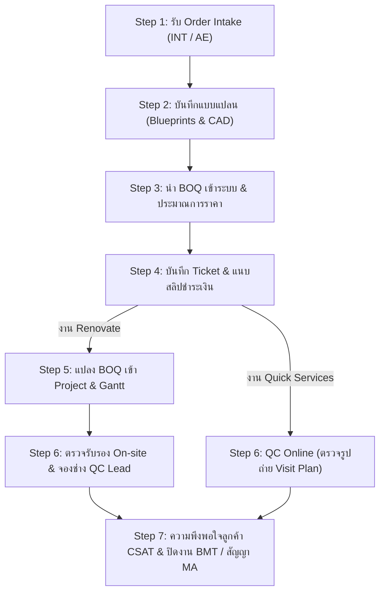

# 📘 คู่มือการใช้งานระบบ PMT Flow (Enterprise Operations Manual)
### เอกสารประกอบการฝึกอบรมผู้ใช้งาน (User & Trainer Training Manual)

---

## 📑 สารบัญ (Table of Contents)
1. [ภาพรวมระบบและสถาปัตยกรรมกระบวนการ (System Overview)](#1-ภาพรวมระบบและสถาปัตยกรรมกระบวนการ)
2. [บทบาทและหน้าที่ผู้ใช้งาน (User Roles & Responsibilities)](#2-บทบาทและหน้าที่ผู้ใช้งาน)
3. [ขั้นตอนการปฏิบัติงานมาตรฐาน 5 ขั้นตอน (Standard Operating Procedure: 5 Steps)](#3-ขั้นตอนการปฏิบัติงานมาตรฐาน-5-ขั้นตอน)
   - [Step 1: การรับงานเข้าสู่ระบบ PMT (Order Ingestion & Acceptance)](#step-1-การรับงานเข้าสู่ระบบ-pmt)
   - [Step 2: ช่าง Check-in หน้างาน & ตรวจสอบรูปถ่ายและบันทึกข้อมูล (Check-in & Site Records)](#step-2-ช่าง-check-in-หน้างาน--บันทึกข้อมูล)
   - [Step 3: ศูนย์รวมแบบติดตั้ง & การบันทึก/นำเข้า BOQ (Blueprints & BOQ Entry)](#step-3-ศูนย์รวมแบบติดตั้ง--การบันทึกนำเข้า-boq)
   - [Step 4: การตรวจรับรองคุณภาพงาน (QC Inspection & Checklist)](#step-4-การตรวจรับรองคุณภาพงาน)
   - [Step 5: สรุปผลความพึงพอใจ & ปิดงานส่งไประบบ BMT (CSAT & Close Job)](#step-5-สรุปผลความพึงพอใจ--ปิดงานส่งไประบบ-bmt)
4. [ฟังก์ชันเสริมและการติดตามงาน (Additional Features)](#4-ฟังก์ชันเสริมและการติดตามงาน)
5. [คำถามที่พบบ่อยและข้อควรระวัง (FAQ & Best Practices)](#5-คำถามที่พบบ่อยและข้อควรระวัง)

---

## 1. ภาพรวมระบบและสถาปัตยกรรมกระบวนการ

ระบบ **PMT Flow** ถูกออกแบบมาเพื่อเป็นศูนย์กลางการบริหารจัดการงานติดตั้ง, ควบคุมคุณภาพ (QC), บันทึกรายการคำนวณวัสดุ (BOQ) และประสานงานทีมช่าง โดยเชื่อมต่อกับระบบภายนอกอย่างสมบูรณ์:

### จุดเด่นของ Workflow:
1. **Seamless Handover:** รับงานอัตโนมัติจาก INT/AE โดยไม่ต้องคีย์ข้อมูลซ้ำ
2. **GPS & Photo Verification:** ยืนยันพิกัดเข้างานจริงด้วย Geo-fence รัศมี 400 เมตร พร้อมตรวจสอบภาพถ่ายหน้างาน
3. **PMT-Native BOQ & Blueprints:** มีศูนย์รวมแบบแปลน CAD/PDF ในเมนูหลัก และจัดการเพิ่ม/แก้ไข/นำเข้า BOQ ได้โดยตรงใน PMT
4. **Standardized QC Checklist:** ระบบประเมินเกณฑ์ความปลอดภัยและมาตรฐานงานติดตั้งแบบบังคับผ่าน (Zero Defects)
5. **CSAT to BMT:** เก็บผลคะแนนความพึงพอใจลูกค้า 5 ดาว และส่งข้อมูลปิดงานเข้าสู่ระบบบัญชี/การเงิน BMT อัตโนมัติ

---

## 2. บทบาทและหน้าที่ผู้ใช้งาน

| บทบาท (Role) | สิทธิ์และหน้าที่หลักในระบบ PMT |
| :--- | :--- |
| **Project Manager (PM) / หัวหน้างาน** | ตรวจสอบภาพรวมบน Dashboard, กดรับงานเข้า PMT, จัดสรรทีมช่าง และติดตามความคืบหน้าบน Gantt Timeline |
| **ทีมช่างเทคนิค (Field Technician)** | กด Check-in ยืนยันพิกัด GPS, บันทึกรูปถ่ายหน้างาน (5 รูปหลัก + รูปเพิ่มเติม) |
| **เจ้าหน้าที่ควบคุมคุณภาพ (QC Inspector)** | บันทึกคำสั่งพิเศษ/ข้อควรระวังหน้างาน, ตรวจสอบแบบฟอร์ม Checklist (PASS/FAIL), อนุมัติส่งมอบงาน |
| **Cost Controller / Designer** | อัปโหลดแบบแปลน (Blueprints) เข้าคลังกลาง, บันทึก/นำเข้าไฟล์ BOQ (Excel/CSV/Template) และตรวจสอบต้นทุน |
| **Contact Center / บริการหลังการขาย** | โทรสอบถามประเมินความพึงพอใจลูกค้า (CSAT), บันทึกข้อเสนอแนะ, กด Close Job ส่งข้อมูลไประบบ BMT |

---

## 3. ขั้นตอนการปฏิบัติงานมาตรฐานของระบบ PMT Flow (Pipeline Architecture)

ระบบ PMT Flow รองรับการไหลของงาน 2 สายหลัก:
- **Renovate Projects**: Step 1 ➔ Step 2 ➔ Step 3 ➔ Step 4 ➔ Step 5 ➔ Step 6 (On-site QC) ➔ Step 7 (CSAT)
- **Quick Services**: Step 1 ➔ Step 4 ➔ **ข้าม Step 5 เข้าสู่ Step 6 (QC Online จากภาพถ่าย Visit Plan) ทันที** ➔ Step 7 (CSAT)

---

### Step 1: การรับงานเข้าสู่ระบบ PMT
*(Order Ingestion & Acceptance)*

1. **การรับงานอัตโนมัติ:** เมื่อฝ่ายขายหรือระบบ INT ยืนยันคำสั่งซื้อ Order จะถูกส่งเข้ามาแสดงในหน้ารายการงาน (`รายการงานทั้งหมด`) อัตโนมัติในสถานะ **`Draft`**
2. **การตรวจสอบข้อมูลเบื้องต้น:**
   - คลิกที่รหัสงาน เช่น `JOB202609001` เพื่อเปิดหน้า **รายละเอียดงาน**
   - ตรวจสอบชื่อลูกค้า, เบอร์โทร, ประเภทบริการ, ที่อยู่หน้างาน และทีมช่างผู้รับผิดชอบ
3. **การรับงานเข้าสู่ระบบ:**
   - คลิกปุ่ม **`รับเข้าระบบ PMT`** (สีม่วง)
   - สถานะงานจะเปลี่ยนเป็น **`In Progress`** พร้อมเริ่มดำเนินงาน

> [!TIP]
> สำหรับผู้สอน (Trainer): สามารถใช้ปุ่ม **`รับ Order ใหม่ (INT)`** หรือ **`จำลอง 10 งาน (INT)`** ที่อยู่บนหน้ารายการงานทั้งหมด เพื่อจำลองการยิง Order ใหม่จากระบบ INT ข้ามมาทดสอบได้ทันที

---

### Step 2: บันทึก Design & แบบแปลนติดตั้ง (Blueprints & CAD)
*(Design Management & Blueprints Center)*

*(สำหรับคู่มือฝึกอบรมฉบับสมบูรณ์ โปรดดูที่: [คู่มือการใช้งาน_Step2_บันทึกแบบแปลนติดตั้ง.md](คู่มือการใช้งาน_Step2_บันทึกแบบแปลนติดตั้ง.md))*

1. **คิวงานออกแบบ (Single State Queue):** 
   - เมนู **`Step 2: บันทึก Design`** จะแสดงเฉพาะงานที่รับเข้ามาจาก Step 1 หรือยังรอจัดทำแบบแปลน
   - ตรวจสอบประเภทบริการ (Quick Services, Renovate, MA) และเวลานับถอยหลัง SLA (เกณฑ์ 24 ชม.)
2. **การบันทึกและอัปโหลดแบบแปลน:**
   - คลิกปุ่ม **`บันทึก Design`** หรือคลิก **`แนบไฟล์ด่วน`** ที่การ์ดโครงการด้านล่าง
   - ระบุ **โซนงาน / งานย่อย** (เช่น ห้องครัว Built-in, ห้องนอนใหญ่, ห้องน้ำ)
   - แนบไฟล์แบบแปลน AutoCAD (`.dwg`, `.dxf`), เอกสาร PDF หรือภาพ Perspective 3D
   - เลือกระดับเวอร์ชัน (เช่น `v1 Draft`, `v2 Approved`, `v3 Final`) และระบุชื่อผู้ออกแบบ
3. **การจัดการโครงการหลายโซน/ห้อง (Multi-Zone Management):**
   - หากโครงการมีหลายห้อง ให้กดปุ่ม **`+ เพิ่มงานย่อย/ห้อง`** เพื่อแนบแบบแปลนห้องถัดไป ระบบจะจัดเก็บแบบทุกห้องไว้ภายใต้ Job เดียวกันอย่างเป็นระเบียบ
   - คลิกที่รูปภาพเพื่อเปิด **Lightbox Preview** ขยายดูรายละเอียดแบบแปลนความละเอียดสูง
4. **การส่งต่องานไปยัง Step 3:**
   - เมื่อแนบแบบแปลนครบถ้วน ให้คลิกปุ่มสีม่วง **`ยืนยันย้ายไป Step 3`**
   - ตรวจสอบรายการแบบแปลนในหน้าต่างสรุป แล้วกดยืนยัน งานจะย้ายเข้าสู่คิวถอดราคา **Step 3 (นำ BOQ เข้าระบบ)** ทันที

---

### Step 3: ศูนย์รวมแบบติดตั้ง & การบันทึก/นำเข้า BOQ
*(Blueprints & PMT-Native BOQ Entry)*

#### 3.1 การดูและจัดการแบบติดตั้ง (Blueprints Center)
- คลิกเมนู **`แบบติดตั้ง (Blueprints)`** ที่แถบเมนูด้านซ้าย (Sidebar)
- สามารถค้นหาแบบแปลนตามเลข Job, ชื่อลูกค้า หรือประเภทบริการ
- ดูเวอร์ชันแบบแปลน (เช่น `v3 Final`, `v2 Approved`), ผู้ออกแบบ และดาวน์โหลดไฟล์ PDF/CAD
- สามารถกดปุ่ม **`+ อัปโหลดแบบแปลน`** เพื่อแนบไฟล์แบบติดตั้งฉบับปรับปรุงใหม่

#### 3.2 การบันทึกและนำเข้า BOQ บนระบบ PMT
- เข้าไปที่หน้ารายละเอียดงาน ➔ เลือกแท็บ **`บันทึกรายการ BOQ (PMT)`**
- **วิธีที่ 1: กรอกข้อมูลในตารางโดยตรง**
  - คลิก **`+ เพิ่มรายการวัสดุ/ค่าแรง`**
  - แก้ไขชื่อรายการ, จำนวน, หน่วย และราคาต่อหน่วยในตาราง
  - ระบบจะคำนวณยอดรวม (Subtotal), ส่วนลด, ภาษี VAT 7% และ Grand Total ให้อัตโนมัติ Real-time
- **วิธีที่ 2: นำเข้าใบ BOQ (Import Excel / CSV / Template)**
  - คลิกปุ่ม **`📥 นำเข้าใบ BOQ (Import)`**
  - เลือกวิธีนำเข้าที่สะดวก:
    1. *อัปโหลดไฟล์:* ลากไฟล์ Excel (`.xlsx`, `.csv`) มาวาง (มี Template ให้ดาวน์โหลด)
    2. *เลือก Template สำเร็จรูป:* เลือกชุดติดตั้งแอร์ 18000 BTU, ชุดปั๊มน้ำ, เครื่องทำน้ำอุ่น หรือ Renovate ครัว
    3. *Paste Direct:* Copy ข้อมูลตารางจาก Excel แล้ววางลงในช่องข้อความได้ทันที
  - เลือกรูปแบบ: "แทนที่รายการเดิม" หรือ "เพิ่มต่อท้าย"
  - ตรวจสอบตัวอย่างใน Live Preview แล้วกด **`ยืนยันนำเข้ารายการ BOQ`**
- คลิกปุ่ม **`💾 บันทึกข้อมูล BOQ`** เพื่อบันทึกข้อมูลเข้าฐานข้อมูล PMT

#### 3.3 การแปลงรายการ BOQ เป็น Task ปฏิบัติงาน (Convert BOQ to Project Tasks)
- คลิกปุ่ม **`⚡ แปลงเป็น Task แผนงาน (Convert to Tasks)`** ที่แถบ Header หรือด้านล่างตาราง BOQ
- ระบบจะดึงรายการจาก BOQ มาสร้างเป็น Task ปฏิบัติงานให้อัตโนมัติ:
  1. **กำหนดชื่องาน (Task Name):** แก้ไขชื่องานให้สอดคล้องกับงานปฏิบัติการจริง
  2. **กำหนดช่วงเวลา (Start - End Date):** เลือกวันเริ่มต้นและวันสิ้นสุด ระบบจะคำนวณจำนวนวัน (Duration) ให้อัตโนมัติ
  3. **มอบหมายช่าง (Assignee / Crew):** สามารถเลือก **ช่างคนเดียว** หรือ **ทีมช่างหลายคน (Crew เช่น Team A: สมศักดิ์ + ประเสริฐ)** สำหรับ Task ที่ต้องใช้แรงงานร่วมกัน
  4. สามารถกด **`+ เพิ่ม Task กำหนดเอง`** หรือ **`🔄 รีเซ็ตจาก BOQ`** ได้
- กดปุ่ม **`⚡ ยืนยันสร้าง Task & ซิงค์เข้า Gantt Timeline`**
- รายการ Task จะถูกสร้างและส่งต่อไปแสดงผลในเมนู **`แผนงาน (Gantt Timeline)`** พร้อมส่งข้อมูลไปจอง Slot ช่างกับระบบ INT ได้ทันที

---

### Step 4: การตรวจรับรองคุณภาพงาน
*(QC Inspection & Checklist)*

1. คลิกเมนู **`ตรวจคุณภาพ (QC)`** ที่แถบเมนูด้านซ้าย
2. เลือกงานที่อยู่ในคิว **`รอตรวจ (QC Pending)`**
3. เจ้าหน้าที่ QC ตรวจสอบรูปถ่ายหน้างาน และประเมินหัวข้อ Checklist มาตรฐาน:
   - ตรวจสอบการเดินท่อและการระบายน้ำทิ้ง
   - ตรวจสอบความแน่นหนาของขายึดและโครงสร้าง
   - ตรวจสอบการต่อสายดินและความปลอดภัยทางไฟฟ้า
   - ตรวจสอบการเก็บกวาดและความสะอาดพื้นที่
4. เลือกสถานะ **`PASS`**, **`FAIL`** หรือ **`N/A`** ในแต่ละหัวข้อ
5. กดปุ่ม **`อนุมัติผลการตรวจ QC (Pass Inspection)`**
   - สถานะของงานจะเปลี่ยนเป็น **`QC_PASSED`** และส่งต่อไปยังขั้นตอนบริการหลังการขาย

---

### Step 5: สรุปผลความพึงพอใจ & ส่งต่อบริการหลังการขาย
*(CSAT Evaluation & After-Sales Management)*

1. คลิกเมนู **`ความพึงพอใจลูกค้า (CSAT)`**
2. เลือกงานที่ผ่านการตรวจ QC แล้ว (สถานะ `QC_PASSED`)
3. Contact Center โทรสอบถามลูกค้าและบันทึกคะแนน:
   - บันทึกระดับคะแนนความพึงพอใจ (⭐ 1 ถึง 5 ดาว)
   - บันทึกคำติชมหรือข้อเสนอแนะจากลูกค้า
4. คลิกปุ่ม **`บันทึกโทรประเมิน (5 ดาว)`** (สถานะจะเปลี่ยนเป็น `AFTER_SALE`)
5. สามารถกด **`Close & ส่ง BMT`** เพื่อส่งปิดงาน หรือคลิก **`บริการหลังการขาย ➔`** เพื่อเปิดสัญญา MA หรือติดตามการรับประกัน

---

## 4. ฟังก์ชันเสริมและการติดตามงาน

### 4.1 แผนงาน Gantt Timeline
- เมนู **`แผนงาน (Gantt Timeline)`** แสดงตารางเวลาการทำงานของแต่ละทีมช่าง (Team A, B, C) ในรูปแบบแถบสี Timeline
- แถบสีเขียว = งานเสร็จสิ้น (`DONE`), แถบสีม่วง = กำลังดำเนินการ (`IN_PROGRESS`)

### 4.2 บริการหลังการขาย & สัญญาบำรุงรักษา (MA Contracts)
- เมนู **`บริการหลังการขาย`** แยกออกจากแบบสำรวจ CSAT เพื่อการบริหารจัดการงานหลังการขายอย่างเป็นสัดส่วน
- **แท็บสัญญาบำรุงรักษา MA**: ติดตามสัญญา Preventive Maintenance, รอบการล้างแอร์ (3-4 รอบ/ปี), Checklist อุปกรณ์ และประวัติการเข้าบริการรายงวด
- **แท็บงานส่งมอบหลังการขาย & ประกัน**: ติดตามงานที่เสร็จสิ้น พร้อมปุ่ม **`เปิดสัญญา MA`** ที่ดึงข้อมูลลูกค้าและประเภทบริการเดิมมาสร้างสัญญาได้ทันที และส่งปิดงาน BMT

### 4.3 ระบบค้นหาด่วน & Dark Mode
- กดคีย์ลัด `Ctrl + K` หรือคลิกช่องค้นหาด้านบน เพื่อค้นหาเลข Job, ชื่อลูกค้า หรือเบอร์โทรได้ทันที
- ปุ่มสลับ **Dark / Light Mode** ที่มุมขวาบนเพื่อความสบายตาในการใช้งาน

---

## 5. คำถามที่พบบ่อยและข้อควรระวัง (FAQ & Best Practices)

> [!IMPORTANT]
> **Q: หากพิกัด GPS ขึ้นเตือนว่าอยู่นอกรัศมี 400 เมตร ต้องทำอย่างไร?**
> **A:** ตรวจสอบว่าเปิดระบบ Location Services บนโทรศัพท์มือถือหรือไม่ หากช่างอยู่ในพื้นที่จริงแต่ตำแหน่งคลาดเคลื่อนเนื่องจากสัญญาณ ให้ถ่ายรูปหน้าบ้านลูกค้าที่มีบ้านเลขที่ชัดเจนแนบในรูปภาพเพิ่มเติม แล้วแจ้งทีม QC เพื่อตรวจสอบและอนุมัติเป็นกรณีพิเศษ

> [!NOTE]
> **Q: สามารถแก้ไขรายการ BOQ หลังจากปิดงาน (Close Job) แล้วได้หรือไม่?**
> **A:** งานที่สถานะเป็น `CLOSED` และส่งข้อมูลไประบบ BMT เรียบร้อยแล้วจะไม่สามารถแก้ไขยอดเงินได้ หากมีความจำเป็นต้องปรับปรุง จะต้องทำเป็นเอกสาร Change Order หรือติดต่อแผนกบัญชีเพื่อปรับปรุงในระบบ BMT

> [!TIP]
> **Q: ไฟล์ Excel ที่ใช้ Import BOQ ต้องเรียงคอลัมน์อย่างไร?**
> **A:** เรียงลำดับดังนี้: `[ลำดับ] | [รายการวัสดุ/บริการ] | [จำนวน] | [หน่วย] | [ราคาต่อหน่วย]` โดยสามารถกดปุ่ม "ดาวน์โหลด Template BOQ (.csv)" ในหน้าต่าง Import เพื่อใช้เป็นไฟล์ตัวอย่างได้เสมอ

---

**จัดทำโดย:** ทีมพัฒนาระบบ PMT Flow (Enterprise Operations)  
**เวอร์ชันเอกสาร:** v1.2 (PMT-Native BOQ & Blueprint Center Edition)  
**วันที่ปรับปรุงล่าสุด:** กันยายน 2026
