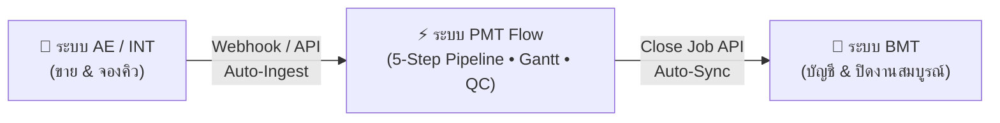

# 📘 คู่มือการใช้งานระบบ PMT Flow (Enterprise Operations Manual)
### เอกสารประกอบการฝึกอบรมผู้ใช้งาน (User & Trainer Training Manual)

---

## 📑 สารบัญ (Table of Contents)
1. [ภาพรวมระบบและสถาปัตยกรรมกระบวนการ (System Overview)](#1-ภาพรวมระบบและสถาปัตยกรรมกระบวนการ)
2. [บทบาทและหน้าที่ผู้ใช้งาน (User Roles & Responsibilities)](#2-บทบาทและหน้าที่ผู้ใช้งาน)
3. [ขั้นตอนการปฏิบัติงานมาตรฐาน (Standard Operating Procedure: 5-Step Pipeline)](#3-ขั้นตอนการปฏิบัติงานมาตรฐานของระบบ-pmt-flow-5-step-pipeline-architecture)
   - [Step 1: ศูนย์รับ Order, Design & BOQ Studio](#step-1-ศูนย์รับ-order-design--boq-studio-order-intake--boq)
   - [Step 2: บันทึก Ticket & ใบเสร็จรับเงิน](#step-2-บันทึก-ticket--ใบเสร็จรับเงิน-tickets--receipts)
   - [Step 3: บันทึก BOQ เข้า Project & แผนงาน Gantt](#step-3-บันทึก-boq-เข้า-project--แผนงาน-gantt-labor-to-task--timeline)
   - [Step 4: การตรวจรับรองคุณภาพงาน (QC Inspection)](#step-4-การตรวจรับรองคุณภาพงาน-qc-inspection)
   - [Step 5: ความพึงพอใจลูกค้า CSAT, ปิดงาน BMT & สัญญา MA](#step-5-ความพึงพอใจลูกค้า-csat-ปิดงาน-bmt--สัญญา-ma-csat--after-sales)
4. [คลังข้อมูลกลางและการดำเนินงาน (Central Repositories & Operations)](#4-คลังข้อมูลกลางและการดำเนินงาน)
   - [4.1 คลังแบบแปลนและไฟล์ CAD กลาง (Central Blueprints & CAD Repository)](#41-คลังแบบแปลนและไฟล์-cad-กลาง-central-blueprints--cad-repository)
   - [4.2 คลังรายการประมาณการราคา BOQ กลาง (Central BOQ Repository)](#42-คลังรายการประมาณการราคา-boq-กลาง-central-boq-repository)
   - [4.3 แผนงาน Gantt Timeline โครงการ](#43-แผนงาน-gantt-timeline-โครงการ)
   - [4.4 บันทึกงานช่างประจำวัน (Daily Technician Work Logs)](#44-บันทึกงานช่างประจำวัน-daily-technician-work-logs)
   - [4.5 บริการหลังการขาย & สัญญา MA](#45-บริการหลังการขาย--สัญญา-ma)
5. [คำถามที่พบบ่อยและข้อควรระวัง (FAQ & Best Practices)](#5-คำถามที่พบบ่อยและข้อควรระวัง)

---

## 1. ภาพรวมระบบและสถาปัตยกรรมกระบวนการ

ระบบ **PMT Flow** ถูกออกแบบมาเพื่อเป็นศูนย์กลางการบริหารจัดการงานโครงการติดตั้ง, ออกแบบแปลน, ควบคุมต้นทุน (BOQ), วางแผนงานช่าง (Gantt), ควบคุมคุณภาพ (QC) และบริการหลังการขาย โดยเชื่อมต่อกับระบบภายนอกอย่างสมบูรณ์:



### จุดเด่นของ Workflow:
1. **One-Stop Order Studio (Step 1):** รวมการรับ Order, แนบแบบแปลน CAD/PDF และจัดทำรายการประมาณการ BOQ ไว้ในหน้าต่างเดียวจบในขั้นตอนแรก
2. **Dual Fast-track & Project Track:** รองรับทั้งงาน Quick Services (จบงานเร็วใน 1 คลิกข้าม Gantt ไป QC Online) และงาน Renovate (แปลงค่าแรงเข้าสู่ระบบวิศวกรรมและผัง Gantt)
3. **GPS & Photo Verification:** ยืนยันพิกัดเข้างานจริงด้วย Geo-fence รัศมี 400 เมตร พร้อมตรวจสอบภาพถ่ายหน้างาน 5 รูปหลัก
4. **Standardized QC Inspection (Step 4):** ตรวจสอบคุณภาพงานทั้งแบบ QC Online (งานด่วน) และ QC On-site พร้อมระบบประเมินงานย่อย BOQ 1-5 ดาว
5. **CSAT to BMT (Step 5):** บันทึกคะแนนความพึงพอใจลูกค้า 5 ดาว และส่งข้อมูลปิดงานเข้าสู่ระบบบัญชี/การเงิน BMT อัตโนมัติ

---

## 2. บทบาทและหน้าที่ผู้ใช้งาน

| บทบาท (Role) | สิทธิ์และหน้าที่หลักในระบบ PMT |
| :--- | :--- |
| **Project Manager (PM) / Solutions Architect (SA)** | บริหารจัดการคำสั่งซื้อผ่าน One-Stop Studio ใน Step 1, จัดสรรทีมช่าง, และติดตามภาพรวมความคืบหน้าบน Gantt Timeline |
| **ทีมช่างเทคนิค (Field Technician)** | กด Check-in ยืนยันพิกัด GPS, บันทึกรูปถ่ายหน้างาน (5 รูปหลัก) และลงบันทึกประจำวัน (Daily Logs) |
| **เจ้าหน้าที่ควบคุมคุณภาพ (QC Inspector)** | บันทึกข้อควรระวังหน้างาน, ตรวจสอบ Checklist มาตรฐาน (PASS/FAIL), ประเมินงานย่อย BOQ 1-5 ดาว (QC Online / On-site) |
| **Cost Controller / Designer** | จัดการคลังแบบแปลน (Blueprints) และคลังรายการ BOQ กลาง, นำเข้า/ส่งออกและวิเคราะห์ต้นทุน |
| **Contact Center / บริการหลังการขาย** | โทรสอบถามประเมินความพึงพอใจลูกค้า (CSAT), บันทึกข้อเสนอแนะ, กด Close Job ส่งข้อมูลไประบบ BMT และดูแลสัญญา MA |

---

## 3. ขั้นตอนการปฏิบัติงานมาตรฐานของระบบ PMT Flow (5-Step Pipeline Architecture)

ระบบ PMT Flow จัดลำดับการทำงานเป็น 5 ขั้นตอนหลัก (5-Step Pipeline):

```mermaid
graph TD
    S1["Step 1: ศูนย์รับ Order, Design & BOQ Studio<br/>(Intake + CAD Blueprints + BOQ Pricing)"]
    
    S1 --> S2["Step 2: บันทึก Ticket & แนบสลิปใบเสร็จ<br/>(Tickets & Receipts)"]
    
    S2 -->|Quick Services (Fast-track)| S4["Step 4: ตรวจรับรองคุณภาพ QC<br/>(QC Online ผ่านรูปถ่ายหน้างาน)"]
    S2 -->|Renovate Projects| S3["Step 3: บันทึก BOQ เข้า Project & Gantt<br/>(Labor-to-Task & Planning)"]
    
    S3 --> S4B["Step 4: ตรวจรับรองคุณภาพ QC<br/>(QC On-site & ประเมินงานย่อย BOQ)"]
    
    S4 --> S5["Step 5: ประเมิน CSAT, ปิดงาน BMT & สัญญา MA<br/>(CSAT Survey & After-Sales)"]
    S4B --> S5
```

---

### Step 1: ศูนย์รับ Order, Design & BOQ Studio (Order Intake & BOQ)
*(สำหรับคู่มือฝึกอบรมฉบับสมบูรณ์ โปรดดูที่: [คู่มือการใช้งาน_Step1_คิวงานรับคำสั่งซื้อใหม่.md](คู่มือการใช้งาน_Step1_คิวงานรับคำสั่งซื้อใหม่.md))*

1. **การรับงานและเปิด Studio:**
   - Order ใหม่จากระบบ INT จะปรากฏในสถานะ **`Draft`** พร้อมป้ายแสดงสถานะแบบแปลน (Design) และราคา (BOQ) ในตาราง
   - คลิกปุ่ม **`[ Studio: จัดการ Order/แบบ/BOQ ]`** เพื่อเปิดหน้าต่าง One-Stop Studio
2. **การทำงานใน 3 แท็บ:**
   - **แท็บ 1 (ข้อมูลคำสั่งซื้อ & ลูกค้า):** ตรวจสอบข้อมูลลูกค้า, เบอร์โทร, พิกัด GPS, นัดหมายเวลา (รูปแบบ 24 ชม.) และมอบหมายทีมช่าง
   - **แท็บ 2 (แบบแปลน & CAD Studio):** เลือกโซนงาน (เช่น ครัว, ห้องน้ำ) และแนบไฟล์แปลนติดตั้ง CAD/PDF
   - **แท็บ 3 (รายการถอดราคา BOQ):** บันทึกรายการวัสดุและค่าแรง คำนวณยอดเงิน Subtotal, ส่วนลด, VAT 7% และ Grand Total แบบ Real-time
3. **การส่งต่องาน:**
   - ตรวจสอบความพร้อมของข้อมูลทั้ง 3 แท็บ
   - คลิกปุ่ม **`🚀 ยืนยันข้อมูล & ส่งต่อไปขั้นตอนถัดไป`** เพื่อส่งต่องานเข้าสู่ Step 2 (บันทึก Ticket & ใบเสร็จ) ทันที

---

### Step 2: บันทึก Ticket & ใบเสร็จรับเงิน (Tickets & Receipts)
*(สำหรับคู่มือฝึกอบรมฉบับสมบูรณ์ โปรดดูที่: [คู่มือการใช้งาน_Step4_บันทึกTicketและใบเสร็จ.md](คู่มือการใช้งาน_Step4_บันทึกTicketและใบเสร็จ.md))*

1. เปิดใบสั่งงาน (Work Ticket) สำหรับมอบหมายให้ทีมช่างเข้าปฏิบัติงาน
2. บันทึกและแนบหลักฐานสลิปการชำระเงิน หรือใบเสร็จรับเงินจากลูกค้า
3. เมื่อตรวจสอบความถูกต้องเรียบร้อย:
   - งาน Quick Services: ส่งต่อไปยัง **Step 4: QC Inspection (Online)**
   - งาน Renovate: ส่งต่อไปยัง **Step 3: บันทึก BOQ เข้า Project & แผนงาน Gantt**

---

### Step 3: บันทึก BOQ เข้า Project & แผนงาน Gantt (Labor-to-Task & Timeline)
*(สำหรับคู่มือฝึกอบรมฉบับสมบูรณ์ โปรดดูที่: [คู่มือการใช้งาน_Step5_บันทึกBOQเข้าProjectและGantt.md](คู่มือการใช้งาน_Step5_บันทึกBOQเข้าProjectและGantt.md))*

1. ระบบดึงเฉพาะรายการหมวด **"ค่าแรง / บริการ"** จาก BOQ มาแปลงเป็น Tasks บน Gantt Chart โดยอัตโนมัติ
2. กำหนดช่วงเวลาปฏิบัติงาน (Start - End Date รูปแบบ 24 ชม.) และมอบหมายทีมช่าง
3. ติดตามสถานะงานบน Gantt Chart แบบ Real-time

---

### Step 4: การตรวจรับรองคุณภาพงาน (QC Inspection)
*(สำหรับคู่มือฝึกอบรมฉบับสมบูรณ์ โปรดดูที่: [คู่มือการใช้งาน_Step6_ตรวจรับรองคุณภาพQC.md](คู่มือการใช้งาน_Step6_ตรวจรับรองคุณภาพQC.md))*

1. **QC Online (สำหรับงาน Quick Services):** ตรวจสอบรูปถ่ายหน้างาน 5 รูปหลักที่ช่างอัปโหลดผ่าน Visit Plan และอนุมัติผลผ่านระบบ
2. **QC On-site (สำหรับงาน Renovate):** จองคิวช่าง Lead QC เข้าตรวจสอบหน้างานจริงพร้อมประเมินและให้คะแนนงานย่อย BOQ 1-5 ดาว

---

### Step 5: ความพึงพอใจลูกค้า CSAT, ปิดงาน BMT & สัญญา MA (CSAT & After-Sales)
*(สำหรับคู่มือฝึกอบรมฉบับสมบูรณ์ โปรดดูที่: [คู่มือการใช้งาน_Step7_CSATและบริการหลังการขาย.md](คู่มือการใช้งาน_Step7_CSATและบริการหลังการขาย.md))*

1. Contact Center โทรสอบถามความพึงพอใจลูกค้า บันทึกคะแนน (⭐ 1 ถึง 5 ดาว) และข้อเสนอแนะ
2. คลิกปุ่ม **`Close & ส่ง BMT`** เพื่อส่งข้อมูลปิดงานเข้าสู่ระบบการเงินและบัญชี BMT
3. ดูแลสัญญาบำรุงรักษาต่อเนื่องประจำปี (MA Contracts 3-4 รอบ/ปี) พร้อมแจ้งเตือนรอบบริการ

---

## 4. คลังข้อมูลกลางและการดำเนินงาน

### 4.1 คลังแบบแปลนและไฟล์ CAD กลาง (Central Blueprints & CAD Repository)
- ศูนย์กลางจัดเก็บและบริหารแบบแปลนของทุกโครงการ (Multi-Zone Blueprints Library)
- รองรับการเปิดดูแบบแปลนความละเอียดสูงผ่าน Lightbox, จัดการเวอร์ชันแบบแปลน (`v1 Draft`, `v2 Approved`, `v3 Final`) และดาวน์โหลดไฟล์ CAD/PDF

### 4.2 คลังรายการประมาณการราคา BOQ กลาง (Central BOQ Repository)
- ศูนย์กลางคลังรายการ BOQ รวมของระบบ
- รองรับการนำเข้าไฟล์ใบเสนอราคาภายนอก (Excel `.xlsx` / `.csv` / vFIX), การเลือกชุด Template สำเร็จรูป และการส่งออกข้อมูล

### 4.3 แผนงาน Gantt Timeline โครงการ
- แสดงตารางเวลาการทำงานของแต่ละทีมช่างในรูปแบบแถบสี Timeline ชัดเจน

### 4.4 บันทึกงานช่างประจำวัน (Daily Technician Work Logs)
- รองรับการบันทึกชั่วโมงการทำงานจริง (รูปแบบ 24 ชม.), หมายเหตุหน้างาน และรูปถ่ายผลงาน 5 รูปพร้อม Lightbox

### 4.5 บริการหลังการขาย & สัญญา MA
- บริหารจัดการสัญญาบำรุงรักษาเครื่องปรับอากาศและอุปกรณ์ประจำปี กำหนดรอบบริการล่วงหน้า

---

## 5. คำถามที่พบบ่อยและข้อควรระวัง (FAQ & Best Practices)

> [!IMPORTANT]
> **Q: ระบบ PMT Flow กำหนดมาตรฐานวันที่และเวลาอย่างไร?**
> **A:** ทุกหน้าจอของระบบแสดงผลวันที่ในรูปแบบ **`DD/MM/YYYY`** (เช่น `10/09/2026`) และรูปแบบเวลา **24 ชั่วโมง (`00:00 - 23:59 น.`)** โดยไม่มีระบบ AM/PM

> [!NOTE]
> **Q: สามารถแก้ไขข้อมูล BOQ หรือแบบแปลนหลังจากบันทึกผ่าน Step 1 Studio ได้หรือไม่?**
> **A:** สามารถเปิด Studio กลับมาแก้ไขได้ตลอดเวลา หรือเข้าไปจัดการผ่านเมนูคลังแบบแปลนกลาง และคลังรายการ BOQ กลาง โดยข้อมูลจะซิงค์กันแบบ Real-time 100%

---

**จัดทำโดย:** ทีมพัฒนาระบบ PMT Flow (Enterprise Operations)  
**เวอร์ชันเอกสาร:** v4.0 (5-Step Pipeline + Central Repositories Edition)  
**วันที่ปรับปรุงล่าสุด:** กันยายน 2026
