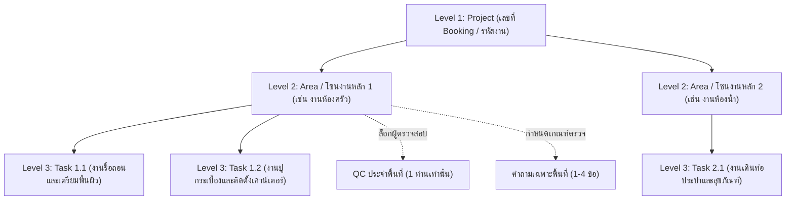
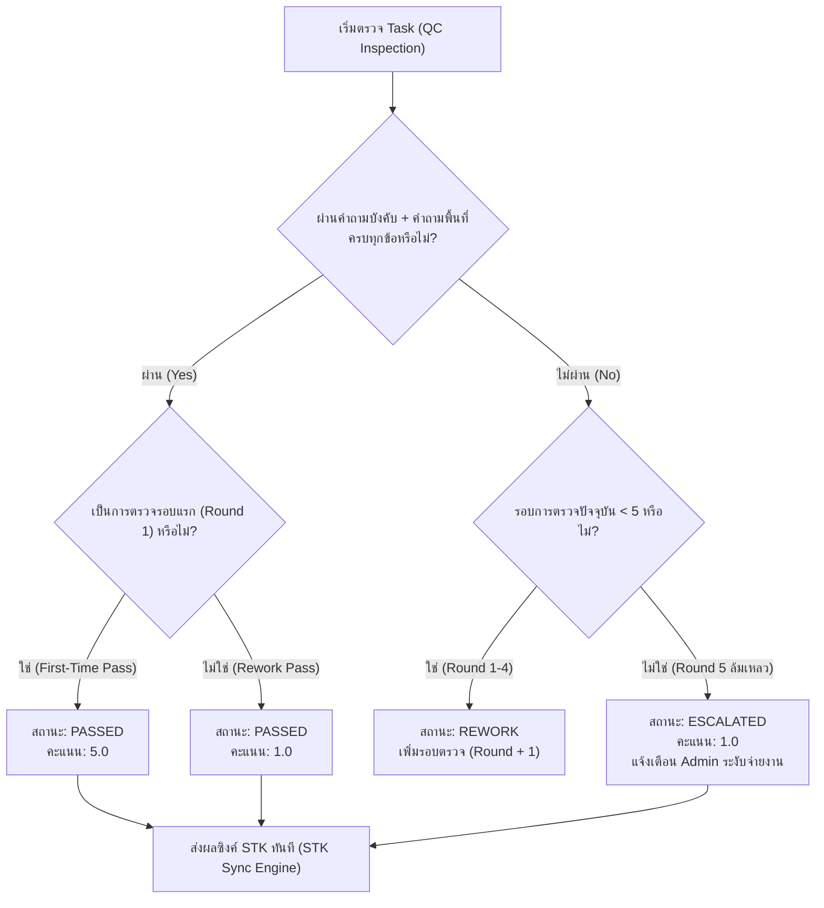

# คู่มือมาตรฐานระบบ PMT Flow ฉบับปรับปรุงใหม่ (System Overhaul Manual 2026)

---

## 📌 บทนำและภาพรวม (System Architecture & Overview)

ระบบ **PMT Flow (Project Management & Quality Control System)** ได้รับการยกระดับสถาปัตยกรรมและกระบวนการทำงานให้เป็นมาตรฐานระดับองค์กร (Enterprise Grade) ครอบคลุม 5 เสาหลักสำคัญ:

1. **Inbound Integration & Booking Idempotency**: การเชื่อมโยงคำสั่งซื้อขาเข้าจากระบบ INT พร้อมจำแนกประเภทงานอัตโนมัติ (Quick Services vs Renovate) และป้องกันข้อมูลซ้ำซ้อน
2. **3-Level Project Hierarchy**: โครงสร้างลำดับชั้นโครงการ 3 ระดับ (Project ➔ Main Work/Area ➔ Task) พร้อมการล็อก QC รายพื้นที่ และการคุ้มครองเวอร์ชัน BOQ Revision
3. **QC Inspection & Binary Scoring Engine (5 / 1)**: กลไกการตรวจรับรองคุณภาพด้วยชุดคำถามมาตรฐาน + คำถามเฉพาะพื้นที่ (สูงสุด 4 ข้อ) พร้อมระบบคะแนน 5 (ผ่านครั้งแรก) หรือ 1 (ผ่านรอบแก้/Escalated)
4. **Outbound STK Synchronization & Resilience**: ระบบส่งต่อผลการตรวจไปยังระบบตัดสต็อก STK ทันทีแบบ Real-time พร้อม Idempotency Key และระบบกู้คืนอัตโนมัติ 3x Retry Backoff
5. **Dashboard, API Health Monitor & Audit Logs**: แดชบอร์ดสรุปผลแบบเรียลไทม์ ตารางจัดอันดับช่าง รายงานสุขภาพ API และบันทึกประวัติธุรกรรมที่ไม่สามารถแก้ไขได้ (Immutable Audit Trail)

---

## 🏗️ 1. โครงสร้างลำดับชั้นโครงการ 3 ระดับ (3-Level Project Hierarchy)

ระบบจำลองโครงสร้างโครงการก่อสร้างและปรับปรุงจริงเป็น 3 ระดับชั้น เพื่อการควบคุมดูแลที่รัดกุมและแม่นยำ:



### กฎเกณฑ์สำคัญของลำดับชั้น (Hierarchy Business Rules):
- **1 QC per Area**: แต่ละโซนงานหลัก (Area) สามารถมอบหมายผู้ตรวจสอบคุณภาพ (QC) ได้เพียง **1 ท่าน** เพื่อความชัดเจนในหน้าที่และความรับผิดชอบ
- **QC Area Validation Guard**: เมื่อช่างเริ่มปฏิบัติงานใน Task ใดๆ (`POST /api/v1/jobs/:id/tasks/:taskId/start`) ระบบจะตรวจสอบว่า Area ดังกล่าวมี QC ประจำพื้นที่แล้วหรือไม่ หากยังไม่มี จะไม่อนุญาตให้เริ่มงานและตอบกลับด้วยรหัสข้อผิดพลาด `QC_REQUIRED` (HTTP 400)
- **BOQ Revision Protection**: ในกรณีที่มีการแก้ไขใบเสนอราคาหรือนำเข้า BOQ ใหม่ (`convert-project` หรือ `import-boq`) รายการ Task ใดๆ ที่มีสถานะ `PASSED` หรือ `ESCALATED` หรือได้รับการให้คะแนน QC เรียบร้อยแล้ว จะถูก **ล็อกและคุ้มครอง (Preserved)** ข้อมูลผลการตรวจและคะแนนจะไม่ถูก Reset หรือสูญหายโดยเด็ดขาด

---

## 📥 2. การรับข้อมูลขาเข้า & การจำแนกประเภทงาน (Inbound Integration & Routing)

### Endpoint รับข้อมูล: `POST /api/v1/integration/orders`

### กฎการจำแนกประเภทงานอัตโนมัติ (Auto-Classification Engine):
1. **งานด่วน / งานซ่อมย่อย (Q - Quick Services)**:
   - ตรวจพบประเภทบริการ เช่น `ปั้มแท็งก์`, `ติดตั้งเครื่องทำน้ำอุ่น`, `ติดตั้งเครื่องปรับอากาศ`, `สำรวจหน้างาน` หรือรายการ BOQ ย่อย
   - เมื่อยอมรับงาน ระบบจะ Route งานมุ่งตรงสู่ **`WAIT_QC` (QC Online)** ทันที เพื่อความรวดเร็วในการตรวจผ่านภาพถ่าย Visit Plan
2. **งานโครงการปรับปรุง (R - Renovate)**:
   - ตรวจพบประเภทบริการ เช่น `Renovate ครัว`, `งานต่อเติม`, `งานปรับปรุงบ้าน`
   - เมื่อยอมรับงาน ระบบจะ Route งานเข้าสู่ **`PLANNED` (Step 3/4 Gantt Planning)** เพื่อวางแผนงาน มอบหมายช่าง และจัดทำตารางเวลา
3. **งานที่ต้องตรวจสอบ (NEED_REVIEW)**:
   - ในกรณีที่ข้อมูลจากภายนอกไม่ระบุบริการที่ตรงตามเงื่อนไข งานจะถูกพักไว้ที่สถานะ `NEED_REVIEW` โดยระบบจะไม่อนุญาตให้กด Accept จนกว่า Admin/AE จะทำการระบุประเภทงานที่ถูกต้อง (`PATCH /api/v1/jobs/:id/classify`)

### การป้องกันข้อมูลซ้ำซ้อน (Booking Idempotency):
- หากมีคำสั่งซื้อส่งเข้ามาด้วย `booking_no` เดิม ระบบจะทำการอัปเดตข้อมูลของใบงานเดิมที่มีอยู่อย่างชาญฉลาด โดยไม่สร้างใบงานซ้ำและไม่รบกวนสถานะการทำงานปัจจุบัน

---

## 🔍 3. กลไกการตรวจรับรองคุณภาพ & ระบบคะแนน (QC Inspection & Binary Scoring Engine)

### ชุดคำถามการตรวจรับรอง (Inspection Questionnaire):
1. **คำถามบังคับของระบบ (Mandatory System Question)**:
   - *"ช่างได้ทำตามมาตรฐานที่กำหนดหรือไม่"* (แชร์ร่วมกันทุก Task และต้องผ่านเป็น `true`)
2. **คำถามเฉพาะพื้นที่ (Area-Level Custom Questions)**:
   - หัวหน้างาน/QC สามารถตั้งคำถามเจาะจงราย Area ได้ **สูงสุด 4 ข้อ** (เช่น ความลาดเอียงของท่อระบาย, การตัดขอบบัว, การทดสอบแรงดันน้ำ)
   - หากมีการพยายามเพิ่มข้อที่ 5 ระบบจะปฏิเสธคำขอทันที (HTTP 400 - `MAX_QUESTIONS_EXCEEDED`)
   - คำถามทั้งหมดของ Area จะถูกส่งต่อไปยังทุก Task ภายใต้ Area นั้นโดยอัตโนมัติ

### เกณฑ์การให้คะแนนแบบ 5.0 หรือ 1.0 (Strict Binary Scoring Standard):
ระบบใช้มาตรฐานการประเมินคุณภาพแบบเด็ดขาด **ห้ามมีคะแนน 2, 3 หรือ 4** เพื่อสะท้อนประสิทธิภาพ First-Time-Right ของทีมช่างอย่างแท้จริง:

| ผลการตรวจสอบ | รอบที่ตรวจ (Round) | สถานะที่ได้ | คะแนนคุณภาพ (QC Score) | คำอธิบาย |
|---|:---:|:---:|:---:|---|
| **ผ่านหมดทุกข้อ** | รอบที่ 1 (First Time) | `PASSED` | **5.0** | ผ่านการรับรองตั้งแต่รอบแรก (ช่างได้คะแนนเต็ม) |
| **ผ่านหมดทุกข้อ** | รอบที่ 2 - 5 (Rework) | `PASSED` | **1.0** | ผ่านหลังจากการแก้ไขงาน (ลดเหลือ 1 คะแนน) |
| **ไม่ผ่านอย่างน้อย 1 ข้อ** | รอบที่ 1 - 4 | `REWORK` | *ยังไม่มี* | ช่างต้องแก้ไขงานและส่งให้ QC ตรวจซ้ำ |
| **ไม่ผ่านในรอบที่ 5** | รอบที่ 5 (Max Limit) | `ESCALATED` | **1.0** | เกินขีดจำกัดการแก้ไข ส่งเรื่องถึง Admin ทันที |



---

## 🚀 4. การเชื่อมโยงระบบตัดสต็อก STK & ระบบกู้คืน (STK Outbound Integration)

เมื่อ Task ได้รับการประเมินผลขั้นสุดท้าย (`PASSED` หรือ `ESCALATED`) ระบบ PMT จะเรียกใช้งาน **STK Dispatcher** ส่งข้อมูลไปยังระบบ STK ทันทีแบบ Real-time:

### โครงสร้างข้อมูล STK Payload (8 ฟิลด์มาตรฐาน):
```json
{
  "ref_no": "PMT-202609-001",
  "ticket": "TK-2026-0001",
  "booking_no": "BK-889920",
  "qc_date": "25/09/2026 14:30:00 น.",
  "customer_name": "คุณสมชาย ใจดี",
  "customer_phone": "0812345678",
  "qc_round": 1,
  "qc_score": 5
}
```

### กลไกความทนทานต่อข้อผิดพลาด (Resilience & Retry Mechanism):
- **Idempotency Key**: ใช้รูปแบบ `STK_${booking_no}_${taskId}_R${qc_round}` เพื่อป้องกันการส่งข้อมูลซ้ำในระดับเครือข่าย
- **3x Exponential Backoff Retry**: ในกรณีที่ Server ปลายทางของ STK ไม่ตอบสนอง ระบบจะพยายามส่งซ้ำอัตโนมัติ 3 ครั้ง
- **Manual Retry Recovery**: หากล้มเหลวครบ 3 ครั้ง รายการจะถูกบันทึกลงตาราง `stk_sync_logs` พร้อมสถานะ `SYNC_FAILED` โดยผู้ดูแลระบบสามารถกดส่งซ้ำได้ผ่าน API `POST /api/v1/stk/retry/:idempotencyKey`

---

## 📊 5. แดชบอร์ดสรุปผล, ตารางคะแนนช่าง & ประวัติการตรวจสอบ (Dashboard & Audit)

### 1. แดชบอร์ดวิเคราะห์ผลงาน (`GET /api/v1/jobs/summary`):
- **KPI ภาพรวม**: จำนวนงานทั้งหมด, สัดส่วนงาน Quick vs Renovate, อัตราผ่านครั้งแรก (First-Time Pass Rate), และรายการงานที่ถูกส่งต่อพิเศษ (Escalated Count)
- **Technician Leaderboard**: ตารางจัดอันดับช่างตามจำนวนงานที่สำเร็จ, สัดส่วนงานที่ได้คะแนน 5.0 vs 1.0 และค่าเฉลี่ยคะแนนคุณภาพ
- **API Health Monitor**: แสดงสถานะและจำนวน Transaction ของ API ขาเข้า (INT), การแปลง BOQ และ API ขาออก (STK)

### 2. การส่งออกรายงาน Excel/CSV:
- รองรับการ Export ผ่าน `GET /api/v1/jobs/export-excel`
- ฝัง **UTF-8 BOM (`\uFEFF`)** ที่ต้นไฟล์ เพื่อให้เปิดไฟล์ภาษาไทยใน Microsoft Excel ได้อย่างถูกต้อง 100% โดยตัวอักษรไม่เพี้ยน

### 3. บันทึกประวัติการทำธุรกรรม (Immutable Audit Logs):
- บันทึกการเปลี่ยนแปลงทุกขั้นตอน (User ID, Role, Action, Old Value, New Value, IP Address)
- แสดงผลเวลามาตรฐานประเทศไทย **Asia/Bangkok (`+07:00`)** ในรูปแบบ `DD/MM/YYYY HH:mm:ss น.`

---

## 📋 6. สรุปตาราง API Endpoints ที่สำคัญ

| Endpoint | Method | บทบาทที่อนุญาต | วัตถุประสงค์ |
|---|:---:|:---:|---|
| `/api/v1/integration/orders` | `POST` | System / INT | รับคำสั่งซื้อขาเข้าแบบ Idempotent |
| `/api/v1/jobs/:id/classify` | `PATCH` | ADMIN, AE | กำหนดประเภทงาน (Q vs R) สำหรับงานที่รอตรวจสอบ |
| `/api/v1/jobs/:id/areas` | `GET / POST` | ADMIN, AE, QC | ดูและสร้างโซนงานหลัก (Area) ภายใต้โครงการ |
| `/api/v1/jobs/:id/areas/:areaId/assign-qc` | `PUT` | ADMIN, QC | มอบหมาย QC ประจำ Area (สูงสุด 1 ท่าน) |
| `/api/v1/jobs/:id/areas/:areaId/questions` | `POST` | ADMIN, QC | เพิ่มคำถามเฉพาะพื้นที่ (สูงสุด 4 ข้อ) |
| `/api/v1/jobs/:id/tasks/:taskId/assign-tech` | `PUT` | ADMIN, AE | มอบหมายช่างประจำงานย่อย |
| `/api/v1/jobs/:id/tasks/:taskId/start` | `POST` | ADMIN, AE, QC | เริ่มงาน (ตรวจสอบ QC Area Guard & บันทึกเวลา 24 ชม.) |
| `/api/v1/jobs/:id/tasks/:taskId/complete` | `POST` | ADMIN, AE, QC | บันทึกช่างทำงานเสร็จ ➔ ส่งเข้าคิว QC |
| `/api/v1/jobs/:id/tasks/:taskId/qc-inspect` | `POST` | ADMIN, QC | บันทึกการตรวจ QC และคำนวณคะแนน 5 / 1 |
| `/api/v1/stk/retry/:idempotencyKey` | `POST` | ADMIN, QC | ส่งซ้ำข้อมูลไปยัง STK กรณีเกิดข้อผิดพลาด |
| `/api/v1/jobs/summary` | `GET` | ทุก Role | สรุปภาพรวม KPI, Leaderboard ช่าง และ Health Monitor |
| `/api/v1/jobs/export-excel` | `GET` | ทุก Role | ส่งออกรายงานโครงการเป็น Excel/CSV พร้อม UTF-8 BOM |
| `/api/v1/audit-logs` | `GET` | ADMIN, QC | เรียกดูประวัติการดำเนินงานทั้งหมดของระบบ |
