# 📘 หลักสูตรฝึกอบรมแม่บทและการจัดการองค์ความรู้ (PMT Flow KM & Master Training Curriculum)
### กรอบหลักสูตรการเรียนรู้และคลังความรู้ปฏิบัติการระดับองค์กร (Enterprise Operations Knowledge Management)
**รหัสโปรแกรม:** `TRN-PMT-MASTER-2026` | **ระบบ:** PMT Flow (Store Project Management Tool) | **เวอร์ชัน:** 3.0 (6-Step Pipeline Architecture)

---

## 📑 สารบัญหลักสูตรและดัชนีคู่มือรายหน้าจอ (Curriculum Index)

ระบบ **PMT Flow** ได้รับการออกแบบโครงสร้างการฝึกอบรมแบบ 6-Step Operational Pipeline + Central Repositories ครอบคลุมทั้งสิ้น **9 โมดูลหลัก** ดังนี้:

| โมดูล | รหัสหลักสูตร | ชื่อคู่มือหน้าจอ / ฟังก์ชันงาน | ตำแหน่งงานเป้าหมาย | เอกสารคู่มือฉบับเต็ม |
| :---: | :--- | :--- | :--- | :--- |
| **01** | `TRN-PMT-STEP01` | **Step 1: ศูนย์รับ Order, Design & BOQ Studio** | Intake Officer, AE, Admin | [คู่มือ Step 1](คู่มือการใช้งาน_Step1_คิวงานรับคำสั่งซื้อใหม่.md) |
| **02** | `TRN-PMT-STEP02` | **Step 2: บันทึก Ticket & สลิปใบเสร็จ** (Tickets & Slips) | ประสานงานช่าง, แคชเชียร์, AE | [คู่มือ Step 2](คู่มือการใช้งาน_Step4_บันทึกTicketและใบเสร็จ.md) |
| **03** | `TRN-PMT-STEP03` | **Step 3: เตรียมแผนงานและทีมช่าง** (Work Preparation & Conversion) | Planner, หัวหน้าช่าง, PM | [คู่มือ Step 3](คู่มือการใช้งาน_Step5_บันทึกBOQเข้าProjectและGantt.md) |
| **04** | `TRN-PMT-STEP04` | **Step 4: แผนงาน Gantt & บันทึกช่างประจำวัน** (Gantt & Daily Logs) | ช่างเทคนิคหน้างาน, Planner, PM | [คู่มือ Step 4](คู่มือการใช้งาน_การเข้าหน้างานและCheckIn.md) |
| **05** | `TRN-PMT-STEP05` | **Step 5: การตรวจรับรองคุณภาพ** (QC Online & On-site) | เจ้าหน้าที่ QC, หัวหน้าช่าง | [คู่มือ Step 5](คู่มือการใช้งาน_Step6_ตรวจรับรองคุณภาพQC.md) |
| **06** | `TRN-PMT-STEP06` | **Step 6: CSAT, สัญญา MA & ปิดงานส่ง BMT** (Close Job) | Contact Center, บริการหลังการขาย | [คู่มือ Step 6](คู่มือการใช้งาน_Step7_CSATและบริการหลังการขาย.md) |
| **07** | `TRN-PMT-REPO01` | **คลังแบบแปลนและไฟล์ CAD กลาง** (Blueprints Repository) | สถาปนิก, มัณฑนากร, วิศวกร | [คู่มือแบบแปลนกลาง](คู่มือการใช้งาน_Step2_บันทึกแบบแปลนติดตั้ง.md) |
| **08** | `TRN-PMT-REPO02` | **คลังรายการ BOQ กลาง** (BOQ Repository & Master Cost) | เจ้าหน้าที่ BOQ, ฝ่ายคิดราคา | [คู่มือ BOQ กลาง](คู่มือการใช้งาน_Step3_นำBOQเข้าระบบ.md) |
| **09** | `TRN-PMT-SYS01` | **แดชบอร์ดภาพรวม & การจัดการผู้ใช้งาน** (Dashboard & Users) | ผู้บริหาร, Admin, PM | [คู่มือ Dashboard & Admin](คู่มือการใช้งาน_แดชบอร์ดและจัดการผู้ใช้งาน.md) |
| **10** | `TRN-PMT-PRC01` | **บันทึกราคาโครงการ: งานที่ปิดแล้ว** (แยกราคาทุน vs ราคาขาย No VAT) | เจ้าหน้าที่คิดราคา, AE, Admin | [คู่มือบันทึกราคาโครงการ](คู่มือการใช้งาน_บันทึกราคาโครงการ_แยกทุนและราคาขาย.md) |
| **14** | `TRN-PMT-RENOVATE01` | **คู่มือการดำเนินงานโครงการ Renovate** (Renovate Master SOP) | AE, PM, Cost Controller, QC Lead, Admin | [คู่มือโครงการ Renovate](คู่มือการดำเนินงาน_โครงการRenovate.md) |
| **15** | `TRN-PMT-MON01` | **การ Monitor ระบบ & ตรวจสอบ API Traffic** (System & Inbound API Monitor) | System Admin, Integrator, PM, Auditor, NOC | [คู่มือการ Monitor ระบบ](คู่มือการMonitorระบบ_และตรวจสอบAPITraffic.md) |
| **16** | `TRN-PMT-ORD01` | **สรุปคำสั่งซื้อทั้งหมด & Job 360° Retrospective Audit Hub** | ผู้บริหาร, PM, AE, QC, Contact Center, Auditor | [คู่มือสรุปคำสั่งซื้อและ Job 360°](คู่มือการใช้งาน_สรุปคำสั่งซื้อทั้งหมด_Job360Audit.md) |
| **17** | `TRN-PMT-KM01` | **ศูนย์จัดการองค์ความรู้ และคู่มือการจัดทำ KM** (KM Portal & Training Architecture) | ผู้บริหาร, Admin, Lead Trainer, ทีมพัฒนา | [คู่มือการใช้งานระบบ KM](คู่มือการใช้งาน_ระบบคลังความรู้KM.md) |

---

## 🗺️ เส้นทางการเรียนรู้แยกตามตำแหน่งงาน (Role-Based Learning Pathways)

เพื่อให้การฝึกอบรมบรรลุผลสัมฤทธิ์สูงสุด วิทยากรผู้สอน (Trainer) ควรจัดกลุ่มผู้เรียนและกำหนดโมดูลการเรียนรู้ตามแผนภูมิดังนี้:

```mermaid
graph TD
    subgraph P1["เส้นทางที่ 1: ฝ่ายขายและรับงาน (Intake & AE Pathway)"]
        M1["โมดูล 1: Step 1 Studio (Order/Design/BOQ)"] --> M2["โมดูล 2: Step 2 Ticket & ใบเสร็จ"]
        M2 --> M3["โมดูล 3: Step 3 เตรียมแผนงาน & ทีมช่าง"]
    end

    subgraph P2["เส้นทางที่ 2: ฝ่ายออกแบบและถอดราคา (Design & Costing Pathway)"]
        M7["โมดูล 7: คลังแบบแปลน CAD กลาง"] --> M8["โมดูล 8: คลัง BOQ กลาง & ราคา"]
        M8 --> M3_b["โมดูล 3: Step 3 เตรียมแผนงาน & ทีมช่าง"]
    end

    subgraph P3["เส้นทางที่ 3: ฝ่ายช่างและควบคุมคุณภาพ (Field Tech & QC Pathway)"]
        M4["โมดูล 4: Step 4 Gantt Timeline & Daily Logs"] --> M5["โมดูล 5: Step 5 QC ตรวจรับรองคุณภาพ"]
    end

    subgraph P4["เส้นทางที่ 4: บริการลูกค้าและส่งมอบงาน (CSAT & Closeout Pathway)"]
        M5_b["โมดูล 5: Step 5 QC ตรวจรับรองคุณภาพ"] --> M6["โมดูล 6: Step 6 CSAT, ปิดงาน BMT & MA"]
    end

    subgraph P5["เส้นทางที่ 5: ผู้บริหารและไอที (Executive & Admin Pathway)"]
        M9["โมดูล 9: แดชบอร์ดภาพรวม & จัดการผู้ใช้"]
        M_ALL["ภาพรวมทั้ง 6-Step Pipeline + Repositories"]
    end
```

---

## 🎯 แผนการจัดคลาสฝึกอบรมมาตรฐาน (Standard 1-Day Training Agenda)

| เวลา | กิจกรรม / หัวข้อการบรรยาย | โมดูลที่ใช้ | กิจกรรมปฏิบัติการ (Hands-on) |
| :---: | :--- | :---: | :--- |
| **09:00 - 09:30** | พิธีเปิด และภาพรวมสถาปัตยกรรม 6-Step Pipeline | บทนำ | แนะนำแนวคิด Single State Queue & Unified Studio |
| **09:30 - 10:30** | Step 1 & 2: ศูนย์รับ Order, ออกแบบแปลน และบันทึก Ticket & ใบเสร็จ | โมดูล 1, 2, 7 | ฝึกรับ Order จำลอง, แนบแบบแปลน CAD, ออก Ticket และแนบสลิป |
| **10:30 - 10:45** | *พักรับประทานอาหารว่างช่วงเช้า* | - | - |
| **10:45 - 12:00** | Step 3: การเตรียมแผนงานและทีมช่าง (Labor-to-Task Conversion) | โมดูล 3, 8 | แปลงค่าแรงจาก BOQ เข้าแผนงาน และมอบหมายช่างหลัก |
| **12:00 - 13:00** | *พักรับประทานอาหารกลางวัน* | - | - |
| **13:00 - 14:15** | Step 4: แผนงาน Gantt Timeline & บันทึกงานช่างประจำวัน 24 ชม. | โมดูล 4 | จัดการตารางเวลา Gantt, ถ่ายรูป 5 จุด, บันทึกเวลางาน 24h |
| **14:15 - 15:15** | Step 5: การตรวจรับรองคุณภาพ QC (Online & On-site) | โมดูล 5 | ตรวจ QC Online งานด่วน, ให้คะแนนมาตรฐาน 5 ข้อ (Yes=5/No=1) |
| **15:15 - 15:30** | *พักรับประทานอาหารว่างช่วงบ่าย* | - | - |
| **15:30 - 16:30** | Step 6: ประเมินความพึงพอใจลูกค้า CSAT, ปิดงาน BMT & สัญญา MA | โมดูล 6, 9 | โทรประเมิน CSAT (ผ่าน=5/ไม่ผ่าน=1), ปิดงานส่งต่อ BMT, สัญญา MA |
| **16:30 - 17:00** | ทดสอบวัดผลความรู้ (Post-Test) และมอบใบรับรอง | สรุปผล | แบบทดสอบ 20 ข้อ (เกณฑ์ผ่าน 80%) |

---

## 🏆 เกณฑ์การวัดผลและการรับรอง (Certification Criteria)

ผู้เข้ารับการอบรมจะได้รับ **ใบรับรองความสามารถการใช้งานระบบ PMT Flow (Certified PMT Flow Operator)** เมื่อผ่านเกณฑ์ 3 ประการ:
1. เข้าร่วมการฝึกอบรมครบตามเวลาไม่น้อยกว่า 90%
2. ทำแบบฝึกหัดปฏิบัติการ (Hands-on Workshops) ครบถ้วนทุกข้อ
3. ผ่านการทดสอบภาคปฏิบัติและทฤษฎีด้วยคะแนนไม่ต่ำกว่า **80%**

---

**จัดทำและอนุมัติโดย:**  
- **Project Manager (PM):** คณะทำงานพัฒนาระบบ PMT Flow  
- **Lead Enterprise Trainer:** ฝ่ายฝึกอบรมและพัฒนาทรัพยากรบุคคล  
- **สถานะ:** Approved Corporate Standard v2.0