# 📘 คู่มือฝึกอบรมแม่บทระบบ PMT Flow (Master Training Curriculum & Syllabus)
### กรอบหลักสูตรการเรียนรู้และคู่มือปฏิบัติการระดับองค์กร (Enterprise Operations Training Program)
**รหัสโปรแกรม:** `TRN-PMT-MASTER-2026` | **ระบบ:** PMT Flow (Store Project Management Tool) | **เวอร์ชัน:** 2.0 (Pipeline Architecture)

---

## 📑 สารบัญหลักสูตรและดัชนีคู่มือรายหน้าจอ (Curriculum Index)

ระบบ **PMT Flow** ได้รับการออกแบบโครงสร้างการฝึกอบรมแบบ 5-Step Operational Pipeline + Central Repositories ครอบคลุมทั้งสิ้น **9 โมดูลหลัก** ดังนี้:

| โมดูล | รหัสหลักสูตร | ชื่อคู่มือหน้าจอ / ฟังก์ชันงาน | ตำแหน่งงานเป้าหมาย | เอกสารคู่มือฉบับเต็ม |
| :---: | :--- | :--- | :--- | :--- |
| **01** | `TRN-PMT-STEP01` | **Step 1: ศูนย์รับ Order, Design & BOQ Studio** | Intake Officer, AE, Admin | [คู่มือ Step 1](คู่มือการใช้งาน_Step1_คิวงานรับคำสั่งซื้อใหม่.md) |
| **02** | `TRN-PMT-STEP02` | **Step 2: บันทึก Ticket & สลิปใบเสร็จ** (Tickets & Slips) | ประสานงานช่าง, แคชเชียร์, AE | [คู่มือ Step 2](คู่มือการใช้งาน_Step4_บันทึกTicketและใบเสร็จ.md) |
| **03** | `TRN-PMT-STEP03` | **Step 3: บันทึก BOQ เข้า Project & Gantt** (Conversion & Scheduling) | Planner, หัวหน้าช่าง, PM | [คู่มือ Step 3](คู่มือการใช้งาน_Step5_บันทึกBOQเข้าProjectและGantt.md) |
| **04** | `TRN-PMT-STEP04` | **Step 4: การตรวจรับรองคุณภาพ** (QC Online & On-site) | เจ้าหน้าที่ QC, หัวหน้าช่าง | [คู่มือ Step 4](คู่มือการใช้งาน_Step6_ตรวจรับรองคุณภาพQC.md) |
| **05** | `TRN-PMT-STEP05` | **Step 5: CSAT, สัญญา MA & ปิดงานส่ง BMT** (Close Job) | Contact Center, บริการหลังการขาย | [คู่มือ Step 5](คู่มือการใช้งาน_Step7_CSATและบริการหลังการขาย.md) |
| **06** | `TRN-PMT-REPO01` | **คลังแบบแปลนและไฟล์ CAD กลาง** (Blueprints Repository) | สถาปนิก, มัณฑนากร, วิศวกร | [คู่มือแบบแปลนกลาง](คู่มือการใช้งาน_Step2_บันทึกแบบแปลนติดตั้ง.md) |
| **07** | `TRN-PMT-REPO02` | **คลังรายการ BOQ กลาง** (BOQ Repository & Master Cost) | เจ้าหน้าที่ BOQ, ฝ่ายคิดราคา | [คู่มือ BOQ กลาง](คู่มือการใช้งาน_Step3_นำBOQเข้าระบบ.md) |
| **08** | `TRN-PMT-SYS01` | **แดชบอร์ดภาพรวม & การจัดการผู้ใช้งาน** (Dashboard & Users) | ผู้บริหาร, Admin, PM | [คู่มือ Dashboard & Admin](คู่มือการใช้งาน_แดชบอร์ดและจัดการผู้ใช้งาน.md) |
| **09** | `TRN-PMT-SITE01` | **บันทึกงานช่างประจำวัน & Check-in GPS** (Daily Logs & Site Visit) | ช่างเทคนิคหน้างาน, ทีมสำรวจ AE | [คู่มือ Site & Daily Logs](คู่มือการใช้งาน_การเข้าหน้างานและCheckIn.md) |

---

## 🗺️ เส้นทางการเรียนรู้แยกตามตำแหน่งงาน (Role-Based Learning Pathways)

เพื่อให้การฝึกอบรมบรรลุผลสัมฤทธิ์สูงสุด วิทยากรผู้สอน (Trainer) ควรจัดกลุ่มผู้เรียนและกำหนดโมดูลการเรียนรู้ตามแผนภูมิดังนี้:

```mermaid
graph TD
    subgraph P1["เส้นทางที่ 1: ฝ่ายขายและรับงาน (Intake & AE Pathway)"]
        M1["โมดูล 1: Step 1 Studio (Order/Design/BOQ)"] --> M2["โมดูล 2: Step 2 Ticket & ใบเสร็จ"]
        M2 --> M9["โมดูล 9: สำรวจหน้างาน & GPS Check-in"]
    end

    subgraph P2["เส้นทางที่ 2: ฝ่ายออกแบบและถอดราคา (Design & Costing Pathway)"]
        M6["โมดูล 6: คลังแบบแปลน CAD กลาง"] --> M7["โมดูล 7: คลัง BOQ กลาง & ราคา"]
        M7 --> M3["โมดูล 3: Step 3 Project Conversion & Gantt"]
    end

    subgraph P3["เส้นทางที่ 3: ฝ่ายช่างและควบคุมคุณภาพ (Field Tech & QC Pathway)"]
        M9_2["โมดูล 9: Daily Logs & Check-in 5 รูป"] --> M3_2["โมดูล 3: แผนงาน Gantt Timeline"]
        M3_2 --> M4["โมดูล 4: Step 4 QC ตรวจรับรองคุณภาพ"]
    end

    subgraph P4["เส้นทางที่ 4: บริการลูกค้าและบัญชี (CSAT & Accounting Pathway)"]
        M4_2["โมดูล 4: Step 4 QC ตรวจรับรองคุณภาพ"] --> M5["โมดูล 5: Step 5 CSAT, สัญญา MA & Close BMT"]
    end

    subgraph P5["เส้นทางที่ 5: ผู้บริหารและไอที (Executive & Admin Pathway)"]
        M8["โมดูล 8: แดชบอร์ดภาพรวม & จัดการผู้ใช้"]
        M_ALL["ภาพรวมทั้ง 5-Step Pipeline + Repositories"]
    end
```

---

## 🎯 แผนการจัดคลาสฝึกอบรมมาตรฐาน (Standard 1-Day Training Agenda)

| เวลา | กิจกรรม / หัวข้อการบรรยาย | โมดูลที่ใช้ | กิจกรรมปฏิบัติการ (Hands-on) |
| :---: | :--- | :---: | :--- |
| **09:00 - 09:30** | พิธีเปิด และภาพรวมสถาปัตยกรรม 5-Step Pipeline | บทนำ | แนะนำแนวคิด Single State Queue & Unified Studio |
| **09:30 - 10:30** | Step 1: ศูนย์รับ Order, Design & BOQ Studio และคลังแบบแปลน | โมดูล 1, 6 | ฝึกรับ Order จำลอง, แนบแบบแปลน CAD และคำนวณ BOQ |
| **10:30 - 10:45** | *พักรับประทานอาหารว่างช่วงเช้า* | - | - |
| **10:45 - 12:00** | Step 2: การออก Ticket และแนบสลิปใบเสร็จรับเงิน | โมดูล 2, 7 | ออกใบเสร็จ Ticket, แนบสลิปโอนเงิน และตรวจทาน BOQ |
| **12:00 - 13:00** | *พักรับประทานอาหารกลางวัน* | - | - |
| **13:00 - 14:15** | Step 3: Project Conversion & Gantt Timeline (Labor-to-Task) | โมดูล 3 | แปลงค่าแรงเข้า Gantt และมอบหมายทีมช่าง |
| **14:15 - 15:15** | Step 4 & ช่างหน้างาน: Daily Logs, GPS Check-in & QC Inspection | โมดูล 9, 4 | จำลองการถ่ายรูป 5 จุด, บันทึกเวลางาน 24h และตรวจ QC |
| **15:15 - 15:30** | *พักรับประทานอาหารว่างช่วงบ่าย* | - | - |
| **15:30 - 16:30** | Step 5: CSAT 5 ดาว, สัญญา MA, ปิดงาน BMT และแดชบอร์ดบริหาร | โมดูล 5, 8 | โทรประเมิน CSAT จำลอง, เปิดสัญญา MA, ปิดงาน BMT และดู KPI |
| **16:30 - 17:00** | ทดสอบวัดผลความรู้ (Post-Test) และมอบใบรับรอง | สรุปผล | แบบทดสอบ 20 ข้อ (เกณฑ์ผ่าน 80%) |

---

## 🏆 เกณฑ์การวัดผลและการรับรอง (Certification Criteria)

ผู้เข้ารับการอบรมจะได้รับ **ใบรับรองความสามารถการใช้งานระบบ PMT Flow (Certified PMT Flow Operator)** เมื่อผ่านเกณฑ์ 3 ประการ:
1. เข้าร่วมการฝึกอบรมครบตามเวลาไม่น้อยกว่า 90%
2. ทำแบบฝึกหัดปฏิบัติการ (Hands-on Workshops) ครบถ้วนทุกข้อ
3. ผ่านการทดสอบภาคปฏิบัติและทฤษฎีด้วยคะแนนไม่ต่ำกว่า **80%**

---

**จัดทำและอนุมัติโดย:**  
- **Project Manager (PM):** คณะทำงานพัฒนาระบบ PMT Flow  
- **Lead Enterprise Trainer:** ฝ่ายฝึกอบรมและพัฒนาทรัพยากรบุคคล  
- **สถานะ:** Approved Corporate Standard v2.0