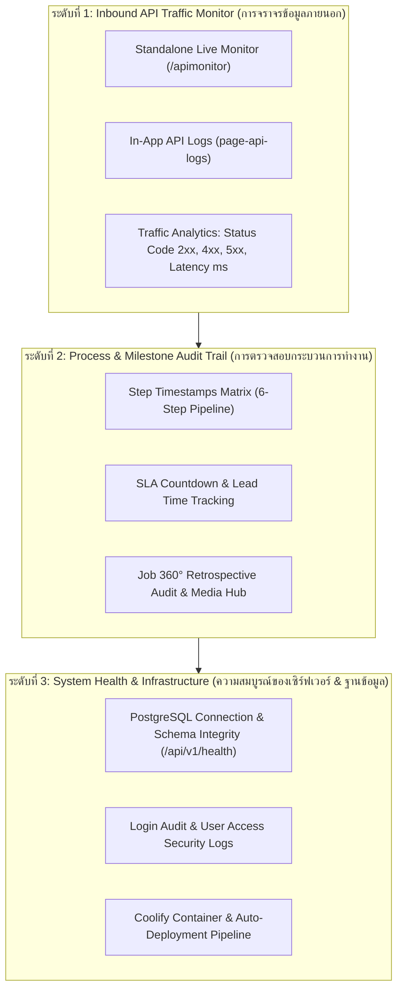

# 🎓 คู่มือฝึกอบรมการใช้งานหน้าจอระบบ PMT Flow
## โมดูลที่ 15: การ Monitor ระบบ และตรวจสอบ Inbound API Traffic แบบ Real-time (System Health & Live API Traffic Monitoring Guide)
**รหัสหลักสูตร:** `TRN-PMT-MON01` | **ระบบ:** PMT Flow (Store Project Management Tool) | **เวอร์ชัน:** 3.0 (Enterprise Architecture) | **กลุ่มเป้าหมาย:** ผู้ดูแลระบบ (System Admin), ทีมสถาปัตยกรรมระบบและเชื่อมต่อภายนอก (System Integrators / INT Team), ผู้จัดการโครงการ (PM), ผู้ตรวจสอบคุณภาพ (Auditor) และเจ้าหน้าที่ศูนย์ปฏิบัติการ (NOC / Operations Center)

---

## 📌 บทสรุปและวัตถุประสงค์หลักสูตร (Overview & Objectives)

ระบบ **PMT Flow (Store Project Management Tool)** ทำงานเป็นศูนย์กลางในการรับ-ส่งคำสั่งซื้อ, แบบแปลน CAD, ประมาณการราคา BOQ และผลตรวจรับรองคุณภาพ QC ระหว่างระบบภายในและระบบภายนอก (เช่น ระบบสำรวจ INT, ระบบตัดสต็อก STK, และโมบายแอปพลิเคชันทีมช่าง)

เพื่อให้ทีมปฏิบัติการและวิศวกรระบบสามารถ **เฝ้าระวังความพร้อมใช้งาน (High Availability)**, **ตรวจจับข้อผิดพลาดของข้อมูล (Error & Defect Detection)** และ **ตรวจสอบวันเวลาการทำงาน (Audit Trail & SLA Traceability)** ได้อย่างรวดเร็วและแม่นยำ ระบบ PMT Flow จึงได้รับการออกแบบโครงสร้างการ Monitor ออกเป็น **3 ระดับชั้น (3-Tier Monitoring Architecture)**:

---

## 🧭 กายวิภาคของเครื่องมือ Monitor ในระบบ (Tools Anatomy Breakdown)

| เครื่องมือ Monitor | URL / ตำแหน่งที่เข้าถึง | หน้าที่หลัก | กลุ่มผู้ใช้งานเป้าหมาย |
| :--- | :--- | :--- | :--- |
| **1. Standalone Live API Monitor** | `https://vibepmt.online/apimonitor` | หน้าต่างอิสระสำหรับตั้งบนจอ Monitor ในห้องปฏิบัติการ (NOC Screen) มอนิเตอร์ทราฟฟิกสด 24/7 พร้อมเสียงเตือน | Integrator, DevOps, Admin |
| **2. In-App API Request Logs** | แถบเมนูด้านข้าง `ประวัติการยิง API ขาเข้า` | ตรวจสอบคำขอที่ยิงเข้ามาในระบบ ค้นหาตาม Method, Status, Endpoint และกรองช่วงวัน | Admin, PM, AE |
| **3. Step Audit & Timestamps Matrix** | เมนู Report > ปุ่ม `[ Audit ทุกงาน ]` | ตรวจสอบเวลาที่เข้า-ออกทุกสเต็ป (Step 1 ถึง Step 6) คำนวณ Lead Time และเวลาเกิน SLA | ผู้บริหาร, PM, Auditor |
| **4. Login & Security Audit Logs** | เมนู User Management > แท็บ `Login Audit` | ตรวจสอบประวัติการล็อกอิน IP Address, อุปกรณ์, วันเวลา และสถานะการผ่านสิทธิ์ | Security Admin, HR |
| **5. Job 360° Retrospective Audit** | ปุ่ม `[ 👁️ ดูงาน ]` ในทุกตารางคิวงาน | ตรวจสอบรูปภาพหน้างานทุกขั้นตอน, เอกสาร INT, แบบ CAD, สลิป, ไฟล์ BOQ ต้นฉบับ, ภาพช่าง 5 รูป, ผลตรวจ QC | ทุกบทบาทหน้าที่ |

---

## 🖥️ ส่วนที่ 1: การใช้งาน Standalone Live API Monitor (`/apimonitor`)

หน้าจอ **Standalone Inbound API Monitor** ได้รับการพัฒนาเป็นหน้าต่างเว็บอิสระที่ทำงานแยกขาดจาก UI หลัก (Single Dedicated Page) เพื่อให้เปิดทิ้งไว้บนจอที่ 2 หรือหน้าจอ Operations Center ได้อย่างลื่นไหล ไม่หน่วงเบราว์เซอร์

### 1. การเข้าใช้งาน (Access Modes)
1. **เข้าผ่าน URL โดยตรง:** พิมพ์ `https://vibepmt.online/apimonitor` ในเบราว์เซอร์
2. **เข้าผ่านระบบ PMT Flow หลัก:** คลิกปุ่ม `[ ↗ เปิดหน้าต่างแยก (Standalone Monitor) ]` บนหัวตาราง Inbound API Logs หรือแถบเมนูด้านข้าง
3. **ระบบ Auto-Detect Authentication:**
   - หากผู้ใช้ล็อกอินอยู่ใน PMT Flow หน้าจอ Monitor จะดึง Token มาทำงานอัตโนมัติ 100%
   - หากเปิดในโหมด Incognito หรือเปิดบนอุปกรณ์แยก จะมี **Quick Sign-in Modal** ให้ล็อกอินด้วยบัญชี Admin/PMT ได้ทันทีโดยไม่ต้องเปิดหน้าหลัก

---

### 2. แดชบอร์ดสรุปสถิติสด (Live Metrics Cards)
ด้านบนของหน้าจอแสดงตัวชี้วัดประสิทธิภาพ 4 มิติแบบ Real-time:
- **🟢 Total Requests:** จำนวนคำขอทั้งหมดที่ยิงเข้ามาในระบบ
- **🟢 Success (2xx):** จำนวนคำขอที่ประมวลผลสำเร็จและตอบกลับ HTTP 200 / 201 (แถบสีเขียว)
- **🟠 Client Errors (4xx):** จำนวนคำขอที่มีข้อผิดพลาดจากฝั่งผู้เรียก เช่น Headers ผิด, JSON Schema ไม่ตรง, ขาดรูปถ่าย (แถบสีส้ม)
- **🔴 Server Errors (5xx):** จำนวนคำขอที่ระบบเกิดข้อผิดพลาดภายใน (แถบสีแดง)
- **⚡ Average Latency:** เวลาตอบสนองเฉลี่ยของเซิร์ฟเวอร์ (เช่น `45ms`, `112ms`)

---

### 3. การควบคุมการดึงข้อมูลสด & เสียงแจ้งเตือน (Live Controls & Alerts)
ที่แถบควบคุมด้านบนขวามือ มีฟังก์ชันอำนวยความสะดวก:
1. **ตัวเลือกรอบ Auto-Refresh (Polling Rate Switcher):**
   - `⚡ 2 วินาที` (สำหรับช่วงทดสอบระบบหรือชั่วโมงเร่งด่วน)
   - `✓ 3 วินาที` (ค่ามาตรฐาน Default แนะนำสำหรับการมอนิเตอร์ทั่วไป)
   - `⏱️ 5 วินาที` และ `⏱️ 10 วินาที` (สำหรับลดการใช้ทรัพยากรเครือข่าย)
   - `⏸️ หยุดชั่วคราว (Pause)` (เมื่อต้องการหยุดอ่านข้อมูลเจาะลึกไม่ให้ตารางเลื่อน)
2. **ระบบแจ้งเตือนด้วยเสียง (Audio Alert Toggle):**
   - คลิกปุ่มไอคอนลำโพงเพื่อเปิดใช้งาน
   - เมื่อมี Request ที่ตอบกลับด้วยรหัส **4xx (Client Error)** หรือ **5xx (Server Error)** ระบบจะส่งเสียงแจ้งเตือนสั้นๆ ทันที เพื่อให้วิศวกรระบบทราบเหตุการณ์ได้ทันท่วงทีแม้ไม่ได้มองหน้าจอ

---

### 4. การตรวจสอบ Payload เชิงลึก & 1-Click Copy cURL
เมื่อมี Request ยิงเข้ามาในตาราง:
1. คลิกที่แถวรายการเพื่อเปิดหน้าต่าง **"Inspect Inbound Request Details"**
2. หน้าต่างจะแสดงข้อมูล 4 แท็บอย่างชัดเจน:
   - **Summary:** Method, Endpoint, Status Badge, เวลาที่ยิงเข้ามา (24 ชม. `HH:mm:ss น.`), และระยะเวลาประมวลผล (Duration)
   - **Request Headers:** ตรวจสอบ `Content-Type`, `Authorization`, `X-API-Key`, `User-Agent`
   - **Request Body (JSON):** ตรวจสอบโครงสร้างข้อมูลที่ส่งมาจากระบบภายนอก (INT Payload) พร้อม Highlight Syntax สีสดใส
   - **Response Body:** ตรวจสอบสิ่งที่ PMT Flow ตอบกลับไปยังผู้เรียก เช่น `{ "success": true, "job_id": "2609..." }` หรือ Error Code
3. **ปุ่ม 1-Click Copy cURL Command:**
   - คลิกปุ่ม `[ 📋 คัดลอก cURL ]` ด้านบนขวาของหน้าต่าง
   - ระบบจะแปลงคำขอนั้นเป็นคำสั่ง `curl -X POST ... -H ... -d '...'` ลงในคลิปบอร์ดทันที สามารถนำไปรันบน Terminal หรือ Import เข้า Postman เพื่อ Replay และ Debug ได้ในเสี้ยววินาที!

---

## 📋 ส่วนที่ 2: หน้าจอ Inbound API Logs ในระบบหลัก (`page-api-logs`)

สำหรับผู้ใช้งานที่ปฏิบัติงานอยู่บนหน้าจอหลักของ PMT Flow สามารถตรวจสอบประวัติการยิง API ได้โดยตรง:
1. **การนำทาง:** คลิกเมนู **`ประวัติการยิง API ขาเข้า`** ที่แถบเมนูด้านข้าง
2. **แถบค้นหาและตัวกรอง (Multi-Field Search & Filter):**
   - ค้นหาด้วยรหัสงาน, รหัสคำขอ, Path หรือ Endpoint
   - กรองตามสถานะ HTTP (ทั้งหมด, 2xx สำเร็จ, 4xx ข้อมูลผิดพลาด, 5xx เซิร์ฟเวอร์ขัดข้อง)
   - กรองตาม HTTP Method (`POST`, `GET`, `PATCH`, `DELETE`)
3. **การล้างประวัติ (Clear Logs):**
   - ปุ่มสีแดง `[ 🗑️ ล้างประวัติ Log ]` มีไว้สำหรับเคลียร์ขยะข้อมูลการทดสอบออกจากหน้าจอ โดยไม่ส่งผลกระทบต่อข้อมูลคำสั่งซื้อในตารางหลัก

---

## ⏱️ ส่วนที่ 3: ระบบตรวจสอบสถานะและเวลาปฏิบัติงาน (Step Audit & SLA Timestamps)

การ Monitor ไม่จำกัดเพียงแค่ Network Traffic แต่ยังรวมถึง **การตรวจสอบความเร็วในการปฏิบัติงานของทีมงานตามกระบวนการ 6 ขั้นตอน**:

### 1. การเปิดดูหน้าต่าง Step Audit Report
- ในหน้าจอ **Report** คลิกปุ่มสีม่วง **`[ ⏱️ Audit ทุกงาน ]`**
- หรือคลิกปุ่มบนแถบเครื่องมือรายงาน เพื่อเปิดหน้าต่าง **"รายงานบันทึกเวลาตามขั้นตอนปฏิบัติงาน (Workflow Step Timestamps Audit Trail)"**

### 2. โครงสร้างการบันทึก Timestamp 6 ขั้นตอน

| ขั้นตอน | ตัวแปร Timestamp ในระบบ | ความหมายของจุดบันทึกเวลา |
| :--- | :--- | :--- |
| **Step 1: Order Intake** | `step1_intake_at` / `step1_order_at` | เวลาที่คำสั่งซื้อถูกส่งเข้ามาในระบบหรือสร้างงานใหม่ |
| **Step 2: Ticket & Receipt** | `step2_ticket_at` | เวลาที่มีการเปิด Ticket และแนบสลิปชำระเงินเรียบร้อย |
| **Step 3: Conversion** | `step3_conversion_at` | เวลาที่นำเข้า BOQ และจัดสรรทีมช่างเตรียมแปลงเข้า Gantt |
| **Step 4: Gantt & Daily** | `step4_gantt_at` | เวลาที่สร้าง Task ในแผนงานและช่างเริ่มลงบันทึกงาน |
| **Step 5: QC Inspection** | `qc_passed_at` / `qc_inspected_at` | เวลาที่หัวหน้างาน QC ตรวจรับรองคุณภาพผ่านเกณฑ์ |
| **Step 6: STK & CSAT** | `stk_sent_at` / `csat_completed_at` | เวลาที่ส่งข้อมูลปิดงานออกไปยัง STK และบันทึก CSAT |

### 3. การคำนวณ SLA และระบบแจ้งเตือนงานเกินกำหนด
- ระบบจะนำเวลาปัจจุบันลบด้วยเวลาที่เข้าสู่ขั้นตอนนั้น (`Enter State Timestamp`)
- หากเวลาที่ใช้เกินกว่าเกณฑ์ SLA ที่กำหนดไว้ (เช่น Step 1 ต้องจัดการภายใน 24 ชม.) ป้ายสถานะจะเปลี่ยนเป็นสีแดงเตือน **`เกิน SLA +X ชม.`** ทันที เพื่อให้ผู้จัดการโครงการเร่งรัดงานได้ตรงจุด

---

## 🔒 ส่วนที่ 4: การตรวจสอบความปลอดภัยและการเข้าใช้งาน (Login Audit Logs)

เพื่อความมั่นคงปลอดภัยตามมาตรฐาน ISO/IEC 27001 และ PDPA ระบบจัดเก็บบันทึกการเข้าสู่ระบบทุกครั้ง:
1. เข้าไปที่เมนู **`User Management`** (มุมบนขวาหรือแถบเมนูข้าง)
2. คลิกแท็บ **`ประวัติการเข้าใช้งาน (Login Audit Logs)`**
3. รายละเอียดที่สามารถ Monitor ได้:
   - **วันเวลา (Timestamp):** แสดงในรูปแบบ `DD/MM/YYYY HH:mm:ss น.`
   - **ชื่อผู้ใช้งาน (Username) & บทบาท (Role):** เช่น `Admin`, `AE_Somchai`, `QC_Lead`
   - **ที่อยู่ไอพี (IP Address):** ตรวจสอบพิกัดเครื่องที่ร้องขอเข้าสู่ระบบ
   - **อุปกรณ์และเบราว์เซอร์ (User-Agent):** เช่น `Chrome on Windows 11`, `Safari on iPadOS`
   - **สถานะ (Status):** `SUCCESS` (เข้าสู่ระบบสำเร็จ) หรือ `FAILED` (รหัสผ่านไม่ถูกต้อง)

---

## 🛠️ ส่วนที่ 5: การตรวจสอบสถานะเซิร์ฟเวอร์และฐานข้อมูล (Server & Deployment Health)

### 1. Health-check Endpoint
- ระบบเปิดบริการ Endpoint ตรวจสอบสถานะที่ `GET /api/v1/health`
- ตอบกลับ JSON แสดงสถานะการเชื่อมต่อ PostgreSQL, สถานะหน่วยความจำ (Memory Usage) และเวลาเซิร์ฟเวอร์แบบเสี้ยววินาที

### 2. ความแตกต่างระหว่างสภาพแวดล้อม DEV และ PRODUCTION

> [!IMPORTANT]
> **🚨 กฎเหล็กของระบบ PMT Flow: ระบบทำงานแยกขาดกัน 2 เซิร์ฟเวอร์อิสระ 100%**

| มิติการตรวจสอบ | สภาพแวดล้อมทดสอบ (Dev / Staging) | สภาพแวดล้อมจริง (Production) |
| :--- | :--- | :--- |
| **URL ระบบ** | `https://vibepmt.online` | `https://prod.vibepmt.online` |
| **Git Branch** | `main` | `production` |
| **การ Deploy** | **อัตโนมัติ (Auto-deploy on Git Push):** เมื่อ Agent พุชโค้ดไปยัง `main` Coolify จะ Build และ Restart อัตโนมัติ | **โดยมนุษย์เท่านั้น (Manual Deploy by User):** ห้าม Agent แตะต้อง branch `production` และผู้ใช้จะเป็นผู้กดปุ่ม Deploy ใน Coolify ด้วยตนเอง |
| **การสังเกตความแตกต่าง** | ตรวจสอบผ่าน Header `Last-Modified` หรือรหัส Commit SHA ล่าสุด | แถบ URL ขึ้น `prod.` ชัดเจน |

---

## ❓ คำถามที่พบบ่อยและการแก้ปัญหาหน้างาน (FAQ & Troubleshooting)

### Q1: หากหน้าจอ `/apimonitor` ขึ้นตัวเลขสีส้มในช่อง Client Errors (4xx) เกิดจากสาเหตุใดบ่อยที่สุด?
> **คำตอบ:** เกิดจาก 3 สาเหตุหลัก:
> 1. **ขาด Authorization Header หรือ API Key ไม่ถูกต้อง:** ระบบจะตอบกลับ `401 Unauthorized`
> 2. **ข้อมูล Payload ขาดฟิลด์บังคับ (Missing Mandatory Fields):** เช่น ไม่ได้ส่งพิกัด GPS, เลขที่คำสั่งซื้อซ้ำ หรือรูปถ่ายหน้างานไม่ถึง 5 รูปตามเกณฑ์
> 3. **Format วันที่ไม่ตรงมาตรฐาน:** วันที่ต้องเป็นรูปแบบที่รองรับ (ระบบ PMT Flow มาตรฐานสากลแปลงเป็น ISO ก่อนจัดเก็บ)
> *วิธีแก้:* คลิกดูแถวที่ขึ้นสีส้ม กดปุ่ม `[ 📋 คัดลอก cURL ]` แล้วนำไปทดสอบบน Postman เพื่อดูข้อความ Error Message ใน Response Body

### Q2: หากหน้าจอ Monitor ไม่มีการขยับตัวเลขหรือขึ้นสถานะหยุดชั่วคราว ต้องทำอย่างไร?
> **คำตอบ:** ตรวจสอบว่าปุ่มสลับเวลารีเฟรชถูกกดเป็น `⏸️ Pause` หรือไม่ หากเป็น Pause ให้กดเลือก `3s` หรือกดปุ่มรีเฟรช และตรวจสอบการเชื่อมต่ออินเทอร์เน็ตของเครื่อง

### Q3: สามารถเปิดหน้าจอ Monitor ทิ้งไว้ข้ามคืนโดยไม่หลุดออกจากระบบได้หรือไม่?
> **คำตอบ:** **สามารถเปิดทิ้งไว้ได้ 24/7** เนื่องจากระบบ Monitor มีกลไก Token Auto-Refresh ในเบื้องหลัง และมีระบบ Lightweight Polling ที่ใช้หน่วยความจำต่ำมาก ไม่ทำให้แท็บเบราว์เซอร์ Crash หรือ Memory Leak

---

> [!TIP]
> **มาตรฐานองค์กร:** เพื่อการประสานงานที่มีประสิทธิภาพ เมื่อพบปัญหาข้อมูลไม่เข้าสู่ระบบ ให้ Integrator คัดลอก cURL Command จากหน้าจอ Monitor ส่งให้ทีมประสานงานทันที จะช่วยลดระยะเวลาค้นหาต้นตอของปัญหาลงได้มากกว่า 80%
