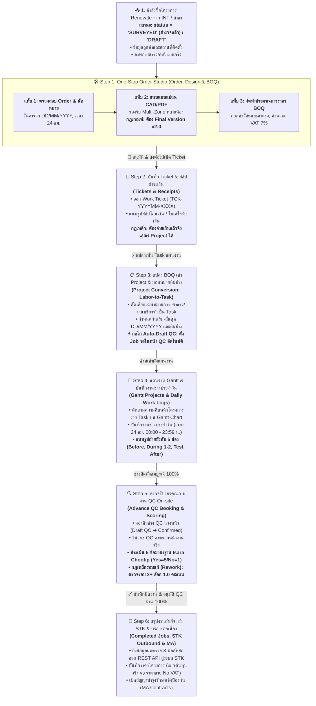

# 🎓 คู่มือฝึกอบรมและมาตรฐานขั้นตอนการดำเนินงานระบบ PMT Flow
## โมดูลที่ 14: คู่มือและขั้นตอนการดำเนินงานโครงการ Renovate (Renovate Projects End-to-End SOP)
**รหัสหลักสูตร:** `TRN-PMT-RENOVATE01` | **ระบบ:** PMT Flow (Enterprise Operations) | **เวอร์ชัน:** 3.0 (Full Pipeline Architecture) | **กลุ่มเป้าหมาย:** ฝ่ายขาย (AE) / ผู้จัดการโครงการ (PM) / เจ้าหน้าที่ประมาณราคา (Cost Controller) / ทีมวิศวกรและหัวหน้าช่าง QC / เจ้าหน้าที่ลูกค้าสัมพันธ์ (Contact Center)

---

## 📌 วัตถุประสงค์ของหลักสูตร (Training Objectives)
1. เพื่อให้เจ้าหน้าที่ทุกฝ่ายเข้าใจขั้นตอนและวงจรชีวิตของ **งานโครงการปรับปรุง/ต่อเติม (Renovate Projects)** ตั้งแต่ต้นน้ำถึงปลายน้ำอย่างถูกต้องครบถ้วน
2. เข้าใจความแตกต่างระหว่าง **Renovate Projects (งานโครงการขนาดใหญ่)** และ **Quick Services (งานบริการติดตั้งด่วน)**
3. ปฏิบัติตามกฎเกณฑ์ความปลอดภัยและจุดควบคุม (Gating Rules) ของระบบ เช่น กฎ Final Version v2.0 ของแบบแปลน, การบันทึกจ่ายเงินก่อนแปลงแผนงาน, การบันทึกงานช่าง 24 ชม. พร้อมรูปถ่าย 5 ใบ, และการประเมิน QC 5 ข้อมาตรฐาน

---

## 🚀 สรุปผังกระบวนการทำงานโครงการ Renovate (End-to-End Workflow)

---

## ⚖️ เปรียบเทียบความแตกต่าง: Renovate Projects vs Quick Services

| มิติการทำงาน | 🛠️ Renovate Projects (งานปรับปรุง/ต่อเติม) | ⚡ Quick Services (งานบริการด่วน) |
|---|---|---|
| **รูปแบบกระบวนการ (Pipeline)** | **ดำเนินงานครบ 6 ขั้นตอนเต็มรูปแบบ** (Step 1 ➔ 2 ➔ 3 ➔ 4 ➔ 5 ➔ 6) | **Fast-track** (Step 1 ➔ ข้าม 2, 3, 4 ➔ Step 5 ➔ 6) |
| **หน้าต่าง One-Stop Studio** | เปิดเต็ม 3 ส่วน: ข้อมูล Order, แบบแปลน Design, ตาราง BOQ | ยุบเหลือเฉพาะข้อมูล Order + ภาพถ่ายหน้างาน (ปิดแท็บ Design/BOQ) |
| **แบบแปลนติดตั้ง (Design)** | **บังคับ** (รองรับ CAD, Multi-Room หลายห้อง, ต้อง Final v2.0) | ข้ามอัตโนมัติ (ไม่ต้องใช้แบบแปลน) |
| **การจัดทำ BOQ** | **บังคับ** (ต้องมีรายการค่าแรง เพื่อนำไปแปลงเป็น Task แผนงาน) | ข้ามอัตโนมัติ |
| **Ticket & ใบเสร็จ (Step 2)** | **บังคับ** ออก Ticket และแนบสลิปชำระเงินก่อนแปลงเข้าแผนงาน | STAMP ข้อมูลช่างจาก INT โดยตรง ไม่ต้องเข้าหน้า Ticket |
| **แผนงาน Gantt (Step 4)** | **มีผังแผนงาน Gantt** (คัดเฉพาะค่าแรงจาก BOQ มาสร้าง Task) | ไม่มี Task ใน Gantt (เป็นงานด่วนวันเดียวจบ) |
| **บันทึกงานช่าง (Daily Log)** | บันทึกผ่านปุ่ม "บันทึกช่าง" บน Task ใน Gantt (เวลา 24 ชม. + 5 รูป) | ช่างรายงานผลงานผ่านแอปหน้างาน INT / Visit Plan |
| **รูปแบบการตรวจ QC (Step 5)** | ตรวจแบบ **On-site ณ พื้นที่จริง** (มีระบบ Advance Booking ล่วงหน้า) | ตรวจแบบ **Online** ผ่านภาพถ่าย Visit Plan / INT |
| **เกณฑ์การประเมิน QC** | **5 ข้อคำถามมาตรฐาน Isara Chootip** (Yes=5 / No=1) | **1 ข้อคำถามเดียวจบกระบวนการ** |
| **การปิดงานโครงการ** | วิศวกร QC ลงตรวจหน้างานจริง ครบ 100% จึงกดอนุมัติปิดงาน | เจ้าหน้าที่ตรวจรูป Online 1 ข้อ แล้วกดปิดงานส่ง STK ทันที |

---

## 📋 เจาะลึกการปฏิบัติงาน 6 ขั้นตอนอย่างละเอียด (SOP & Gating Rules)

### 1️⃣ Step 1: รับ Order, Design แบบแปลน & จัดทำ BOQ ใน One-Stop Studio
* **ผู้รับผิดชอบหลัก:** ฝ่ายขาย (AE) / ผู้ประสานงานโครงการ / ผู้ดูแลระบบ (Admin)
* **การปฏิบัติงาน:**
  1. เปิดดูคิวงานในหน้า `Step 1: บันทึกงาน / รับ Order` สังเกตป้ายกำกับสีคราม **`RENOVATE`**
  2. คลิกปุ่ม **`[Studio]`** เพื่อเข้าสู่ **ศูนย์จัดการคำสั่งซื้อ • แบบแปลน Design • BOQ (PM & SA Studio)**
  3. **ส่วนที่ 1 ข้อมูลคำสั่งซื้อ (Order Intake):**
     * ตรวจสอบข้อมูลลูกค้า เบอร์โทรศัพท์ และสถานที่ติดตั้ง
     * กำหนดวันนัดหมายสำรวจหน้างานในรูปแบบ **`DD/MM/YYYY`** และช่วงเวลาด้วยระบบ **24 ชั่วโมง (เช่น 09:00 - 12:00 น.)**
     * ตรวจสอบภาพถ่ายสำรวจหน้างาน (Before Photos)
  4. **ส่วนที่ 2 แบบแปลนติดตั้ง (Design & Blueprints):**
     * รองรับงานปรับปรุงขนาดใหญ่ที่มีหลายโซน/หลายห้อง (**Multi-Zone / Multi-Room** เช่น โซนห้องครัว, ห้องน้ำ, โรงจอดรถ)
     * อัปโหลดไฟล์แบบแปลน AutoCAD (`.dwg`, `.dxf`), เอกสาร PDF หรือรูปภาพ Perspective 3D
     * **🚨 จุดควบคุมสำคัญ:** แบบแปลนต้องผ่านการอนุมัติและปรับสถานะเป็น **Final Version v2.0** มิฉะนั้นระบบจะแจ้งเตือนและไม่อนุญาตให้ผ่านไปขั้นตอนถัดไป
  5. **ส่วนที่ 3 รายการประมาณการราคา (BOQ):**
     * บันทึกรายการวัสดุและค่าแรง โดยสามารถกรอกในตาราง, Import ไฟล์ Excel (`.xlsx`) หรือเลือกจากชุด Template มาตรฐาน (เช่น *Renovate ห้องครัวมาตรฐาน*)
     * ระบบจะคำนวณ Subtotal, ภาษีมูลค่าเพิ่ม (VAT 7%) และ Grand Total ให้อัตโนมัติแบบ Real-time
     * **🚨 จุดควบคุมสำคัญ:** ต้องมีรายการ BOQ อย่างน้อย 1 รายการ
  6. **การส่งต่องาน:** คลิกปุ่ม **`🚀 อนุมัติ & ส่งต่อไปเปิด Ticket`** ระบบจะบันทึกประทับเวลา Audit Timestamps (`step1_accepted_at`, `step1_intake_at`, `step2_ticket_at`) ปรับสถานะเป็น `IN_PROGRESS` (Progress 45%) และนำทางไปยัง Step 2

---

### 2️⃣ Step 2: ออกใบสั่งงาน Ticket & แนบสลิปชำระเงิน (Tickets & Receipts)
* **ผู้รับผิดชอบหลัก:** เจ้าหน้าที่ประสานงานช่าง / ฝ่ายการเงิน (Finance)
* **การปฏิบัติงาน:**
  1. เข้าสู่หน้าจอ `Step 2: บันทึก Ticket & ใบเสร็จ`
  2. ออกใบสั่งงานช่าง (Work Ticket) พร้อมสร้างรหัสอ้างอิงมาตรฐาน เช่น `TCK-YYYYMM-XXXX`
  3. บันทึกข้อมูลการชำระเงินของลูกค้า แนบรูปภาพสลิปโอนเงิน / ใบเสร็จรับเงิน เพื่อยืนยันธุรกรรมทางการเงิน
  4. **🚨 กฎเหล็กของระบบ (Strict Payment Rule):**
     > [!IMPORTANT]
     > ระบบ PMT Flow กำหนดกฎเกณฑ์เคร่งครัด: **"แผนงานจะเกิดได้ก็ต่อเมื่อ มีการบันทึกชำระเงินและออก Ticket (Step 2) เรียบร้อยแล้วเท่านั้น"** หากยังไม่บันทึกจ่ายเงิน ระบบจะล็อกปุ่มแปลงแผนงานในขั้นตอนถัดไปทันที

---

### 3️⃣ Step 3: แปลง BOQ เข้า Project & วางแผนจัดสรรทีมช่าง (Project Conversion)
* **ผู้รับผิดชอบหลัก:** ผู้จัดการโครงการ (PM) / เจ้าหน้าที่วางแผนโครงการ (Planner)
* **การปฏิบัติงาน:**
  1. เข้าสู่หน้าจอ `Step 2 (Task ย่อย): Convert เข้า Project`
  2. โครงการ Renovate ที่มี BOQ และบันทึกชำระเงินแล้ว จะเข้ามาอยู่ในคิว **"รอแปลงเข้า Project"**
  3. คลิกปุ่ม **`⚡ แปลงเป็น Task แผนงาน` (`openConvertBOQToTasksModal`)**:
     * **ระบบคัดกรองอัตโนมัติ (Labor-to-Task Conversion):** ระบบจะสแกนรายการ BOQ และคัดเลือกเฉพาะรายการที่เป็น **"ค่าแรง/งานบริการ" (Labor Items)** มาแปลงเป็น Task งานช่าง และตัดรายการวัสดุออกให้อัตโนมัติ
     * กำหนดวันเริ่มต้นและสิ้นสุดของแต่ละ Task ในรูปแบบ **`DD/MM/YYYY`** โดยระบบจะคำนวณระยะเวลาทำงาน (Duration Days) ให้อัตโนมัติ
     * มอบหมายทีมช่างผู้รับผิดชอบ (Assigned Tech / Multi-Technician)
     * สามารถกดแทรกงานย่อยเพิ่มเติม หรือคลิกจัดเรียงตามวันเริ่มต้นงานได้
  4. กดยืนยันสร้าง Project & ซิงค์เข้าสู่แผนงาน Gantt Timeline
  5. **⚡ กลไก Auto-Draft QC อัตโนมัติ:** ทันทีที่กดยืนยันแปลง Task ระบบจะสร้าง Job รอในหน้า QC (Step 5) เป็นสถานะ **`Draft QC` (`DRAFT_QC`, `PENDING_CONFIRM`)** โดยอัตโนมัติ เพื่อให้หัวหน้าทีม QC สามารถวางแผนและจองคิวตรวจหน้างานจริงล่วงหน้าได้ทันที

---

### 4️⃣ Step 4: แผนงาน Gantt Timeline & บันทึกงานช่างประจำวัน (Daily Work Logs)
* **ผู้รับผิดชอบหลัก:** ช่างหน้างาน (Technician) / หัวหน้าทีมช่าง / ผู้ควบคุมงาน
* **การปฏิบัติงาน:**
  1. **ติดตามแผนงาน:** ตรวจสอบความคืบหน้าของแต่ละ Task บนผัง Gantt Chart ได้แบบ Real-time
  2. **บันทึกงานช่างประจำวัน (Daily Technician Work Log):**
     * คลิกปุ่ม **`บันทึกช่าง`** บนแถบ Task ของช่างใน Gantt Chart เพื่อเปิดโมดอลแบบรวมศูนย์ (`#modal-daily-work-log`)
     * ระบุวันที่เข้าทำงานในรูปแบบ **`DD/MM/YYYY`**
     * ระบุรอบวันทำงาน (เช่น วันที่ 1 / 3 วัน)
     * บันทึกเวลาทำงานด้วย **ระบบเวลา 24 ชั่วโมง (00:00 - 23:59 น.)** เช่น `08:30 - 17:00 น.` พร้อมระบบสรุปเวลารวมเรียลไทม์
     * ระบุรายละเอียดงานที่ทำเสร็จในวันนั้น, รายการอุปกรณ์/อะไหล่ที่ติดตั้งจริง และปัญหาอุปสรรคหน้างาน
     * **แนบภาพถ่ายหน้างานบังคับ 5 ช่องตามลำดับ:**
       1. *รูปที่ 1: ก่อนเริ่มงาน (Before)*
       2. *รูปที่ 2: ระหว่างทำ #1 (During 1)*
       3. *รูปที่ 3: ระหว่างทำ #2 (During 2)*
       4. *รูปที่ 4: ความปลอดภัย & ทดสอบ (Testing)*
       5. *รูปที่ 5: งานเสร็จสมบูรณ์ (After)*
     * มีระบบ **Lightbox Preview** ขยายดูภาพถ่ายขนาดใหญ่พร้อมคำบรรยายและเวลาบันทึก
  3. **การส่งต่องาน:** เมื่อทีมช่างทำงานเสร็จสมบูรณ์ 100% โครงการจะถูกส่งต่อเข้าสู่คิวรอตรวจของฝ่าย QC (การบันทึกปิดงานโครงการถูกย้ายไปอยู่ที่ขั้นตอน QC เพื่อให้วิศวกรผู้ตรวจเป็นผู้ปิดงานอย่างเป็นทางการ)

---

### 5️⃣ Step 5: ตรวจรับรองคุณภาพงาน On-site & จองคิว QC ล่วงหน้า
* **ผู้รับผิดชอบหลัก:** หัวหน้าช่าง QC (Lead QC Inspector) / วิศวกรตรวจสอบคุณภาพ
* **การปฏิบัติงาน:**
  1. **การจองคิวช่างตรวจล่วงหน้า (Advance QC Booking):**
     * เข้าสู่หน้าจอ `Step 5: ตรวจรับรองคุณภาพ (QC)` เลือกดูงานที่อยู่ในสถานะ `Draft QC`
     * เลือกรายชื่อหัวหน้าช่างผู้ตรวจ (Lead Inspector เช่น วิชัย ตรวจดี)
     * กำหนดวันนัดตรวจ (`DD/MM/YYYY`) และเวลา 24 ชม. (เช่น `10:00 น.`) แล้วกดยืนยันการจองคิว (`CONFIRMED`)
  2. **การลงตรวจหน้างานจริง (On-site Inspection):**
     * เมื่อช่างติดตั้งเสร็จ วิศวกร QC เดินทางไปตรวจประเมิน ณ สถานที่ติดตั้งจริง
  3. **การประเมิน 5 ข้อคำถามมาตรฐาน (Isara Chootip Standard):**
     1. *ช่างทำงานตาม BOQ / มาตรฐานการติดตั้งที่กำหนด* (หมวด: มาตรฐาน & BOQ)
     2. *ความเรียบร้อยของงานติดตั้ง* (หมวด: คุณภาพงานติดตั้ง)
     3. *ช่างเข้าปฏิบัติงานตรงตามเวลาที่นัดหมายกับลูกค้า* (หมวด: การตรงต่อเวลา)
     4. *ส่งมอบงานได้ตามกำหนดเวลา* (หมวด: กำหนดเวลาส่งมอบ)
     5. *ช่างป้องกันพื้นที่ติดตั้งและส่งมอบพื้นที่คืนโดยไม่เกิดความเสียหาย* (หมวด: การป้องกัน & คืนพื้นที่)
  4. **เกณฑ์การให้คะแนนและกฎเหล็กการตรวจ:**
     * **Yes** = ได้ 5 คะแนน (สำหรับการตรวจรอบแรก)
     * **No** = ได้ 1 คะแนน (ถือเป็นข้อบกพร่อง Defect)
     * **🚨 กฎเหล็กคะแนนรอบแก้ไข (Strict 1.0 Score Penalty for Round >= 2):**
       > [!CAUTION]
       > หากโครงการเคยแจ้งส่งกลับแก้ไขงาน (Rework) หรือเป็นการตรวจตั้งแต่ครั้งที่ 2 เป็นต้นไป แม้จะแก้ไขเสร็จสมบูรณ์และกดให้ผ่าน (Yes) ระบบจะ **บังคับล็อกคะแนนที่ 1.0 คะแนนอัตโนมัติ** เสมอ เพื่อความโปร่งใสและสะท้อนคุณภาพงานตามเกณฑ์ First-time Pass
     * แนบรูปภาพหลักฐานและระบุหมายเหตุรายข้อ
  5. **กฎเหล็กการตรวจครบ 100% (Strict 100% Gating Rule):**
     * ต้องประเมินครบทั้ง 5 ข้อ และผ่านทั้งหมด ระบบจึงจะปลดล็อกปุ่ม **`✓ บันทึกปิดงาน & อนุมัติผ่านเกณฑ์ QC & ส่งข้อมูลไป STK`**

---

### 6️⃣ Step 6: สรุปงานสำเร็จ, ส่งต่อระบบ STK & บริการต่อเนื่อง
* **ผู้รับผิดชอบหลัก:** เจ้าหน้าที่บริการลูกค้า (Contact Center) / ฝ่ายบัญชีและการเงิน
* **การปฏิบัติงาน:**
  1. **การส่งข้อมูลออกระบบ STK (Outbound STK Integration):**
     * ทันทีที่ QC กดอนุมัติผ่านเกณฑ์ สถานะโครงการจะเปลี่ยนเป็น **`QC_PASSED` (Progress 100%)**
     * ระบบจะออกรหัสอ้างอิง `STK-QC-YYYY-XXXXXX` และยิงข้อมูลผลตรวจปิดงาน 8 ฟิลด์หลักผ่าน REST API สู่ระบบ STK ทันที:
       1. *เลขที่ Ref (`ref_no`)*
       2. *เลขที่ Ticket (`ticket`)*
       3. *เลขที่ Booking (`booking_no`)*
       4. *วันเวลาบันทึก QC แบบ 24 ชม. (`qc_date` เช่น `22/09/2026 14:30:00 น.`)*
       5. *ชื่อ-นามสกุลลูกค้า (`customer_name`)*
       6. *เบอร์โทรศัพท์ (`customer_phone`)*
       7. *รอบการตรวจ QC (`qc_round` และ `qc_round_text`)*
       8. *คะแนนประเมิน (`qc_score` และ `qc_score_text`)*
  2. **บริการหลังการขาย & สัญญาบำรุงรักษา (MA Contracts):**
     * เจ้าหน้าที่บริการลูกค้าสามารถเปิดสัญญาบำรุงรักษาเชิงป้องกัน (Preventive Maintenance) หรือติดตามการรับประกันของงาน Renovate ได้อย่างต่อเนื่อง
   3. **การบันทึกราคาโครงการ (Project Pricing):**
      * งาน Renovate ที่ปิดงานแล้วจะถูกส่งเข้าคิวในหน้า **`ราคาโครงการ (Project Pricing)`** เพื่อให้ฝ่ายการเงิน/บัญชีบันทึกแยก **ต้นทุนจริง (Cost Price)** และ **ราคาขายจริง (Selling Price No VAT)** พร้อมคำนวณกำไรขั้นต้น (Gross Profit Margin) ของโครงการได้อย่างแม่นยำ

---

### 7️⃣ การตรวจสอบข้อมูลย้อนหลังครบวงจร (Job 360° Retrospective Audit & Media Hub)
* **ผู้รับผิดชอบหลัก:** ผู้บริหาร, PM & SA, AE, QC Lead, เจ้าหน้าที่ตรวจสอบ (Auditor)
* **การปฏิบัติงาน:**
  1. **การเปิดหน้าต่าง 360° Audit:**
     * ในตารางคิวงานทุกสเต็ป (Step 1 ถึง Step 6) และหน้า **สรุปคำสั่งซื้อทั้งหมดในระบบ (Master All-Orders Tracking)** สามารถคลิกปุ่ม **`[👁️ ดูงาน]`** หรือคลิกที่แถวรายการงานเพื่อเปิดหน้าต่าง **"รายละเอียดโครงการและหลักฐานย้อนหลังครบวงจร (Job 360° Retrospective Audit & Media Hub)"**
  2. **การเรียกดูข้อมูลและรูปภาพย้อนหลังทุกขั้นตอน:**
     * **Step 1 (Order & ภาพสำรวจ):** พิกัด GPS, เอกสารสำรวจหน้างาน INT, รูปถ่ายสำรวจพื้นที่หน้างานจริง พร้อม Lightbox พรีวิวรูปขนาดใหญ่
     * **Step 2 (แบบแปลน & Ticket):** แบบแปลน CAD/DWG/PDF ครบทุกโซน, สัญญาจ้างงาน และสลิปการโอนเงิน/ใบเสร็จรับเงิน
     * **Step 3 (BOQ & ต้นฉบับ):** ตารางแจกแจงรายการงานช่าง-วัสดุ พร้อม **ปุ่มดาวน์โหลดไฟล์ BOQ ต้นฉบับ (.xlsx / .csv)** กลับมาเปิดดูในเครื่องได้ตลอดเวลา
     * **Step 4 (แผนงาน & ภาพช่าง):** แผนงาน Gantt Tasks และประวัติการลงบันทึกงานช่าง (Daily Work Log) พร้อมแผงรูปภาพหน้างาน 5 รูป (ก่อนเริ่ม, ระหว่างทำ 1-2, ทดสอบ, หลังแล้วเสร็จ)
     * **Step 5 (ตรวจรับรอง QC):** ผลคะแนน QC, เกณฑ์คำถาม 5 ข้อมาตรฐาน, บันทึกผู้ตรวจ และตารางประวัติการตรวจย้อนหลังทุกรอบ
     * **Step 6 (ปิดงาน & STK):** สถานะการส่ง API ไปยังระบบตัดสต็อก STK, เลขที่อ้างอิง, คะแนนดาว CSAT และรูปถ่ายส่งมอบงาน
  3. **ศูนย์รวมไฟล์ & รูปภาพโครงการทั้งหมด (Central Media & Files Hub):**
     * รวบรวมหลักฐานและเอกสารทั้งหมดของโครงการมาจัดแสดงในแกลเลอรี่รวม พร้อมปุ่มกรองแยกหมวดหมู่ (ภาพสำรวจ, เอกสาร INT, แบบ CAD, สลิป/สัญญา, ไฟล์ BOQ, ภาพช่าง 5 รูป, ภาพ QC, ภาพ CSAT) และคลิกเพื่อพรีวิวหรือดาวน์โหลดได้ในคลิกเดียว

---

## 🛡️ สรุปกฎเกณฑ์และจุดควบคุมสำคัญ (Key Control Points Checklist)
* [x] **Light Theme 100%:** ทุกหน้าจอทำงานในธีมสว่าง คมชัดสูง ตัวหนังสือสีดำ `#000000` (Pure Black)
* [x] **วันที่ DD/MM/YYYY:** วันที่ทุกจุดแสดงผลในรูปแบบ วัน/เดือน/ปี ค.ศ. มีเลข 0 นำหน้าเสมอ (ห้ามใช้ Native Date Input ของเบราว์เซอร์)
* [x] **เวลา 24 ชั่วโมง:** เวลาทุกจุดใช้ระบบ `00:00 - 23:59 น.` (ห้ามมี AM/PM เด็ดขาด)
* [x] **Gating Design v2.0:** แบบแปลนต้อง Final v2.0 จึงจะส่งต่อทำ BOQ และ Ticket ได้
* [x] **Gating Payment:** ต้องบันทึกชำระเงินและออก Ticket ก่อน จึงจะแปลงเป็น Task ใน Gantt ได้
* [x] **Daily Log 5 รูป:** ช่างหน้างานต้องแนบรูปถ่ายครบ 5 ช่องขั้นตอนงาน พร้อมเวลา 24 ชม.
* [x] **QC 5 ข้อ & 1.0 Penalty:** งาน Renovate ตรวจประเมิน 5 ข้อมาตรฐาน และล็อกคะแนน 1.0 สำหรับรอบตรวจแก้ไข (Round >= 2)
* [x] **360° Retrospective Audit & Media Hub:** สามารถดูย้อนหลังและดาวน์โหลดไฟล์ รูปถ่าย เอกสาร แบบแปลน และ BOQ ต้นฉบับได้ครบ 100%
* [x] **100% Sync Documentation:** คู่มือระบบ Online ทุกฉบับต้องเปิดอ่านได้จริงผ่านเมนู KM ระบบบนเว็บ Online (`https://vibepmt.online`) เสมอ
