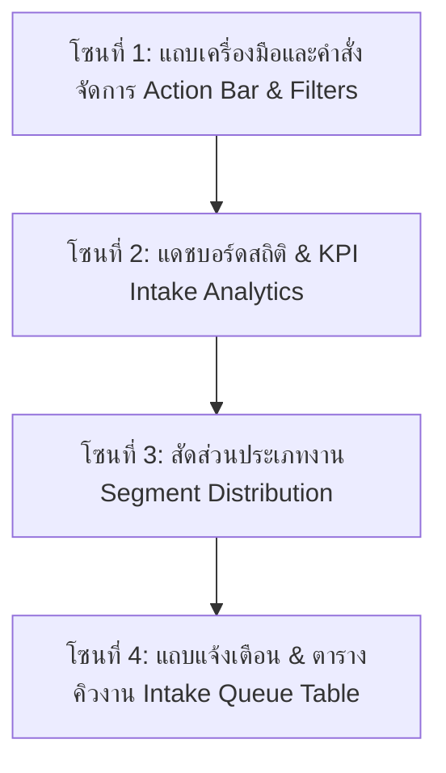
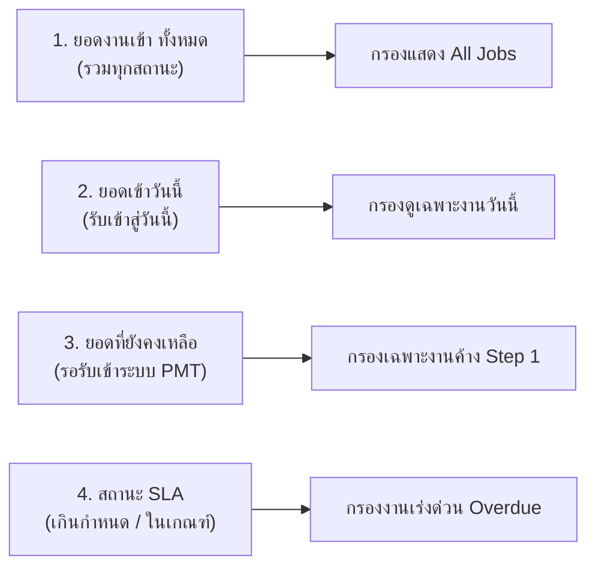
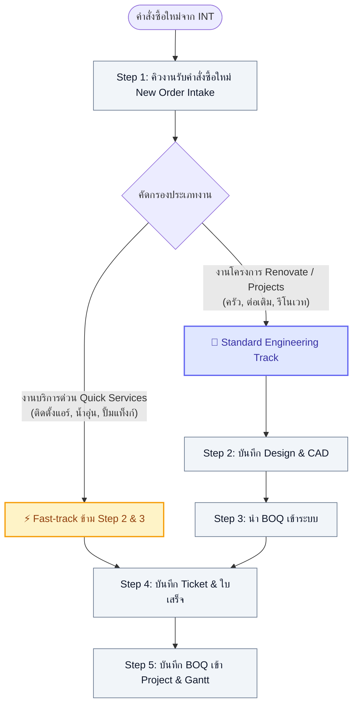

# 🎓 คู่มือฝึกอบรมการใช้งานระบบ PMT Flow
## โมดูลที่ 1: หน้าจอแรก — Step 1: คิวงานรับคำสั่งซื้อใหม่ (New Order Intake)
**รหัสหลักสูตร:** `TRN-PMT-STEP01` | **เวอร์ชันระบบ:** 2.0 (Pipeline Architecture) | **ระดับ:** พื้นฐานถึงหัวหน้างาน

---


---

## 🎯 1. วัตถุประสงค์การเรียนรู้ (Learning Objectives)

เมื่อผู้เข้าอบรมเรียนรู้และฝึกปฏิบัติตามคู่มือนี้แล้ว จะสามารถ:
1. เข้าใจบทบาทของหน้าจอ **Step 1 (Order Intake)** ในฐานะ **"ประตูบานแรก"** ของระบบบริหารจัดการงานติดตั้งโครงการ
2. แยกแยะความแตกต่างระหว่าง **งานบริการด่วน (Quick Services)** และ **งานโครงการปรับปรุง (Renovate / Projects)** ได้อย่างถูกต้อง
3. ใช้งานปุ่มฟังก์ชันทุกปุ่มบนแถบเครื่องมือได้อย่างคล่องแคล่ว เช่น การจำลองงาน, การสร้าง Order ใหม่, และการ Export ข้อมูล
4. อ่านค่าและใช้แดชบอร์ด **Order Intake Analytics & KPI** เพื่อบริหารจัดการเกณฑ์เวลา (SLA 4 ชม.) ได้อย่างมีประสิทธิภาพ
5. ดำเนินการคัดกรองและส่งต่องาน (Fast-track Dispatching) เข้าสู่ขั้นตอนที่ถูกต้องภายในระยะเวลามาตรฐาน

---

## 🧭 2. แนะนำภาพรวมหน้าจอ (Screen Anatomy Overview)

หน้าจอ Step 1 แบ่งโครงสร้างหลักออกเป็น **4 โซนการทำงาน (Operational Zones)** ดังนี้:



---

## 🔍 3. เจาะลึก 4 โซนการทำงานบนหน้าจอ (Detailed Breakdown)

### 🔹 โซนที่ 1: แถบเครื่องมือและคำสั่งจัดการ (Action Bar & Filters)

แถบด้านบนของหน้าจอเป็นศูนย์รวมคำสั่งคัดกรองและบริหารจัดการระบบ:

| ปุ่ม / ตัวควบคุม | สี / ลักษณะ | หน้าที่การทำงาน | คำแนะนำจาก Trainer |
| :--- | :--- | :--- | :--- |
| **ตัวกรองบริการ** | Dropdown | กรองดูเฉพาะประเภทงาน เช่น ติดตั้งเครื่องทำน้ำอุ่น, ปั้มแท็งก์, Renovate ครัว, สำรวจหน้างาน | ใช้เมื่อต้องการตรวจเช็กปริมาณงานเฉพาะสายงานช่าง |
| **ตัวกรองสถานะ** | Dropdown | ค่าเริ่มต้นคือ `📥 คิวงาน Step 1 (Order ใหม่ / Draft)` สามารถสลับเป็น `🗂️ ทั้งหมดทุกขั้นตอน` ได้ | ปกติควรเปิดค้างไว้ที่ "คิวงาน Step 1" เพื่อดูเฉพาะงานที่ค้างรอรับเข้า |
| **ถอยสถานะเป็น Draft** | ปุ่มขอบเหลือง-ส้ม | ปรับสถานะทุกงานในระบบกลับมาเป็นสถานะเริ่มต้น (Draft 0%) | ใช้สำหรับการเทรนนิ่ง หรือทดสอบเวิร์กโฟลว์รอบใหม่ |
| **ล้างข้อมูลโครงการ** | ปุ่มขอบแดง | ลบรายการโครงการทั้งหมดออกจากระบบ | ⚠️ ใช้เฉพาะช่วงเตรียมสอนหรือเริ่มระบบใหม่ (มีระบบยืนยันก่อนลบ) |
| **Export รายงาน Timestamps** | ปุ่มขอบเขียว | ดาวน์โหลดไฟล์ `.CSV` สรุปเวลาบันทึกทั้ง 5 ขั้นตอนของทุกงาน | ใช้ส่งรายงาน KPI และ SLA ให้ผู้บริหารประจำสัปดาห์ |
| **จำลอง 10 งาน (INT)** | ปุ่มขอบม่วง + สายฟ้า | สร้างข้อมูลคำสั่งซื้อตัวอย่าง 10 รายการเสมือนส่งมาจากระบบ INT | **เครื่องมือสำคัญสำหรับผู้เรียน!** กดปุ่มนี้เพื่อสร้างเคสฝึกงานทันที |
| **รับ Order ใหม่ (INT)** | ปุ่มสีม่วงทึบ | เปิดหน้าต่าง Modal เพื่อบันทึกคำสั่งซื้อใหม่ด้วยตนเอง | ใช้เมื่อมีลูกค้านอกระบบ หรือต้องการเปิดงานเร่งด่วนหน้าสาขา |

---

### 🔹 โซนที่ 2: แดชบอร์ดติดตามสถิติและ SLA (Order Intake Analytics & KPI)

แดชบอร์ดสรุปตัวเลขสถิติแบบ **Realtime Live** ซึ่งการ์ดแต่ละใบสามารถ **"คลิกเพื่อกรองข้อมูลในตาราง"** ได้ทันที:



1. **ยอดงานเข้า ทั้งหมด (All Jobs):** ปริมาณงานสะสมทั้งหมดในระบบ ช่วยให้เห็นภาพรวมภาระงานรวม
2. **ยอดเข้าวันนี้ (Today):** จำนวนงานที่เพิ่งเชื่อมโยงเข้ามาในวันปัจจุบัน ใช้ตรวจเช็กว่าวันนี้มีงานใหม่ไหลเข้ามาเท่าใด
3. **ยอดที่ยังคงเหลือ (Remaining Queue):** งานที่ยังค้างอยู่ใน Step 1 (สถานะ Draft / 0%) และยังไม่ได้รับเข้า PMT เป้าหมายคือ **ต้องเคลียร์ให้เหลือ 0** ในแต่ละรอบวัน
4. **สถานะ SLA 4 ชม. (SLA Performance):** 
   - ตัวเลขสีแดงใหญ่: จำนวนงานที่เกินกำหนด (Overdue)
   - ตัวเลขด้านล่าง: แสดงจำนวนงานที่อยู่ในเกณฑ์ (On-time) และงานที่ใกล้ครบกำหนด (Warning)
   - ปุ่ม `⚙️ Config`: คลิกเพื่อปรับเวลา SLA ตามนโยบายองค์กร (เช่น 2 ชม. หรือ 4 ชม.)

> [!IMPORTANT]
> **กฎเหล็กของ Intake Officer:** ตัวเลขในการ์ดที่ 3 (ยอดคงเหลือ) และการ์ดที่ 4 (เกินกำหนด SLA) ต้องได้รับการตรวจสอบเป็นอันดับแรก หากพบตัวเลขสีแดง ให้รีบกดจัดการงานนั้นทันที!

---

### 🔹 โซนที่ 3: สัดส่วนประเภทงาน (Segment Distribution Summary)

แถบแสดงสัดส่วนโครงสร้างของงาน เพื่อช่วยให้ทีมกระจายกำลังช่างได้อย่างสมดุล:

* 🟡 **Quick Services (งานติดตั้งด่วน):** งานบริการติดตั้งอุปกรณ์เดี่ยว มีราคากลางแน่นอน (ไม่ต้องเขียนแบบ)
* 🔵 **Renovate (งานปรับปรุง):** งานโครงสร้าง/ต่อเติม/ตกแต่ง ที่จำเป็นต้องเขียนแบบแปลน CAD และถอด BOQ
* 🟣 **MA & Maintenance (บำรุงรักษา):** สัญญาตรวจเช็กและซ่อมบำรุงตามรอบระยะเวลา
* 🟢 **รับเข้า PMT แล้ว (Step 2 ขึ้นไป):** สัดส่วนของงานที่หลุดออกจากคิว Step 1 เข้าสู่กระบวนการผลิตแล้ว

> 💡 **ลูกเล่นพิเศษ:** ผู้ใช้งานสามารถคลิกที่กล่องประเภทงาน เช่น คลิกที่ **Quick Services** เพื่อให้ตารางด้านล่างกรองแสดงเฉพาะงานกลุ่มนั้นได้ทันที

---

### 🔹 โซนที่ 4: แถบแจ้งเตือน & ตารางคิวงาน (Single State Intake Queue)

#### แถบแจ้งเตือน (Contextual Queue Banner)
มีแถบสีฟ้าด้านบนตารางระบุว่า:
> *"คิวงาน Step 1 (Order Intake Queue): แสดงเฉพาะ Order ใหม่จาก INT ที่รอรับเข้าระบบ PMT เมื่อกดยืนยันรับเข้า รายการจะย้ายเข้าสู่ Step 2 (บันทึก Design) หรือย้ายเข้าสู่ Step 4 (บันทึก Ticket & ใบเสร็จ) ทันทีสำหรับงานด่วน (Quick Services) — Single State Queue"*

#### คอลัมน์สำคัญในตาราง:
1. **เลขที่งาน:** รหัสอ้างอิงของงาน (เช่น `JB-20260906-01`)
2. **ลูกค้า & เบอร์ติดต่อ:** ชื่อผู้สั่งซื้อ และเบอร์โทรศัพท์สำหรับประสานงาน
3. **ประเภทบริการ:** ระบุ Badge ประเภทงาน (`quick` สีเหลือง / `renovate` สีน้ำเงิน) พร้อมชื่อบริการ
4. **ช่าง / ผู้รับผิดชอบ:** ทีมช่างที่ถูกจัดสรรเบื้องต้น
5. **สถานะ:** แสดงสถานะ เช่น `Draft`, `New`
6. **ขั้นตอน (STAGE):** แสดงแถบเปอร์เซ็นต์ (0%) และสถานะการนับเวลา SLA
7. **การจัดการ (Action Button):** แยกตามประเภทของงานอย่างชาญฉลาด:

```carousel
```markdown
### ⚡ กรณีที่ 1: งานบริการด่วน (Quick Services)
ปุ่มที่ปรากฏจะเป็น **ปุ่มสีเขียว** เขียนว่า:
`[ ⚡ รับเข้า (ไป Step 4) ➡️ ]`

**ความหมาย:**
ระบบจะรับงานเข้า PMT และ **Fast-track ข้ามขั้นตอนเขียนแบบ (Step 2) และข้ามการถอด BOQ (Step 3)** เพื่อมุ่งตรงไปเปิด Ticket และสลิปใบเสร็จใน **Step 4** ทันที!
```
<!-- slide -->
```markdown
### 📐 กรณีที่ 2: งานโครงการ (Renovate / MA)
ปุ่มที่ปรากฏจะเป็น **ปุ่มสีม่วง** เขียนว่า:
`[ รับเข้าระบบ PMT ➡️ ]`

**ความหมาย:**
ระบบจะรับงานเข้า PMT และย้ายงานเข้าสู่คิวของฝ่ายออกแบบสถาปัตย์ใน **Step 2 (บันทึก Design & แบบแปลน)** เพื่อเริ่มการสำรวจหน้างานและอัปโหลดไฟล์ CAD/PDF ต่อไป
```
````

---

## ⚡ 4. แผนผังเปรียบเทียบ Fast-Track vs Standard Flow

เพื่อให้ผู้เข้าอบรมเห็นภาพการไหลของงานที่ชัดเจน:



---

## 📋 5. ขั้นตอนปฏิบัติงานมาตรฐาน (SOP: Standard Operating Procedure)

### ลำดับขั้นตอนการทำงานประจำวันของเจ้าหน้าที่:

```
[ขั้นตอนที่ 1] เข้าสู่ระบบ PMT Flow -> คลิกเมนู "Step 1: บันทึกงาน / รับ Order" ที่แถบซ้าย
     │
[ขั้นตอนที่ 2] ตรวจเช็กแดชบอร์ดด้านบน -> ดูว่ามีงานค้าง (Remaining) หรือเกิน SLA หรือไม่
     │
[ขั้นตอนที่ 3] หากยังไม่มีงาน ให้กดปุ่ม "จำลอง 10 งาน (INT)" เพื่อโหลดรายการเข้ามาฝึกปฏิบัติ
     │
[ขั้นตอนที่ 4] พิจารณารายการทีละแถวในตาราง:
     ├── หากเป็น Quick Service (เช่น ติดตั้งเครื่องทำน้ำอุ่น):
     │    └─ ตรวจชื่อ-เบอร์โทรลูกค้า -> คลิกปุ่มเขียว [รับเข้า (ไป Step 4)]
     │
     └── หากเป็น Renovate (เช่น Renovate ครัว):
          └─ ตรวจสอบรายละเอียด -> คลิกปุ่มม่วง [รับเข้าระบบ PMT]
     │
[ขั้นตอนที่ 5] สังเกตผลลัพธ์: รายการที่กดรับแล้วจะหายออกจากคิว Step 1 ไปปรากฏใน Step ถัดไปทันที
```

---

## 🧪 6. แบบฝึกหัดภาคปฏิบัติในห้องเรียน (Hands-on Class Exercises)

### 🏋️ แบบฝึกหัดที่ 1: การจำลองงานและการคัดกรองเบื้องต้น
1. ให้ผู้เรียนคลิกปุ่ม **"ล้างข้อมูลโครงการ"** เพื่อให้คิวงานว่างสะอาด
2. คลิกปุ่ม **"จำลอง 10 งาน (INT)"** หนึ่งครั้ง สังเกตตัวเลขในแดชบอร์ดที่เพิ่มขึ้นเป็น 10 รายการ
3. สังเกตการกระจายตัวของงานในการ์ด **Segment Distribution** (Quick, Renovate, MA)

### 🏋️ แบบฝึกหัดที่ 2: ทดสอบการทำงานของปุ่ม Fast-track (Quick Services)
1. ค้นหารายการงานบริการด่วน (เช่น งานติดตั้งเครื่องทำน้ำอุ่น)
2. คลิกที่ปุ่มสีเขียว **"รับเข้า (ไป Step 4)"**
3. สังเกตว่างานดังกล่าวจะหายไปจากคิว Step 1 และตัวเลขในเมนูฝั่งซ้ายของ **Step 4** จะเพิ่มขึ้น
4. ระบบจะแสดง Dialog ถามว่าต้องการเปิดไปหน้า Step 4 ทันทีหรือไม่ ให้ลองกด "ตกลง" เพื่อดูปลายทาง

### 🏋️ แบบฝึกหัดที่ 3: ทดสอบการส่งต่องานโครงการ (Renovate)
1. กลับมาที่หน้า Step 1 ค้นหางานที่เป็น **Renovate**
2. คลิกที่ปุ่มสีม่วง **"รับเข้าระบบ PMT"**
3. ตรวจสอบว่างานได้ถูกส่งไปยัง **Step 2 (บันทึก Design)** เรียบร้อยแล้ว

---

## ❓ 7. คำถามที่พบบ่อยสำหรับผู้ใช้งาน (FAQ)

### Q1: ทำไมพอกดปุ่ม "รับเข้า" แล้ว งานถึงหายไปจากตารางหน้า Step 1?
> **คำตอบ:** หน้าจอนี้ออกแบบด้วยสถาปัตยกรรม **Single State Queue (คิวงานสถานะเดี่ยว)** เพื่อให้เห็นเฉพาะงานที่ "รอการจัดการ" เท่านั้น เมื่อกดรับงานแล้ว ถือว่างานผ่านการคัดกรองเบื้องต้นเสร็จสิ้น จึงย้ายไปปรากฏในคิวของขั้นตอนถัดไปทันที ทำให้คิวไม่สะสมจนสับสน

### Q2: หากต้องการดูงานทั้งหมด ทั้งที่ส่งต่อแล้วและยังไม่ส่งต่อ ต้องทำอย่างไร?
> **คำตอบ:** ให้เปลี่ยนตัวกรองสถานะ (Dropdown ตัวที่ 2 ด้านบน) จาก `📥 คิวงาน Step 1 (Order ใหม่ / Draft)` ให้เป็น `🗂️ ทั้งหมดทุกขั้นตอน (All Work Orders)` ระบบจะแสดงรายการงานทั้งหมดทุกสเต็ปพร้อม Progress Bar

### Q3: จะตั้งค่าเวลา SLA ให้เปลี่ยนจาก 4 ชั่วโมง เป็น 2 ชั่วโมง ได้จากที่ไหน?
> **คำตอบ:** คลิกที่ปุ่ม **"⚙️ ตั้งค่า SLA"** หรือปุ่ม **"Config"** บนการ์ดสถานะ SLA หน้าต่างตั้งค่าจะเปิดขึ้นมา ให้กรอกตัวเลขชั่วโมงที่ต้องการ แล้วกดบันทึก ระบบจะคำนวณเวลานับถอยหลังใหม่ให้ทันที

### Q4: สามารถส่งออกข้อมูลเวลาทั้งหมดเพื่อนำไปทำรายงานใน Excel ได้หรือไม่?
> **คำตอบ:** ได้ทันที เพียงคลิกที่ปุ่ม **"Export รายงาน Timestamps"** ระบบจะดาวน์โหลดไฟล์ CSV ที่บันทึก Timestamp ทั้ง 5 สเต็ปอย่างละเอียด นำไปเปิดใน Microsoft Excel หรือ Google Sheets ได้ทันที

---

> [!TIP]
> **สำหรับเทรนเนอร์ (Trainer Note):** ทุกครั้งก่อนเริ่มบรรยาย ให้กดปุ่ม `ถอยสถานะเป็น Draft` หรือ `จำลอง 10 งาน (INT)` เพื่อให้ผู้เรียนทุกคนมีชุดข้อมูลเริ่มต้นที่เหมือนกัน จะช่วยให้ผู้เข้าอบรมทำตามขั้นตอนได้อย่างราบรื่นและเห็นผลลัพธ์พร้อมกัน
