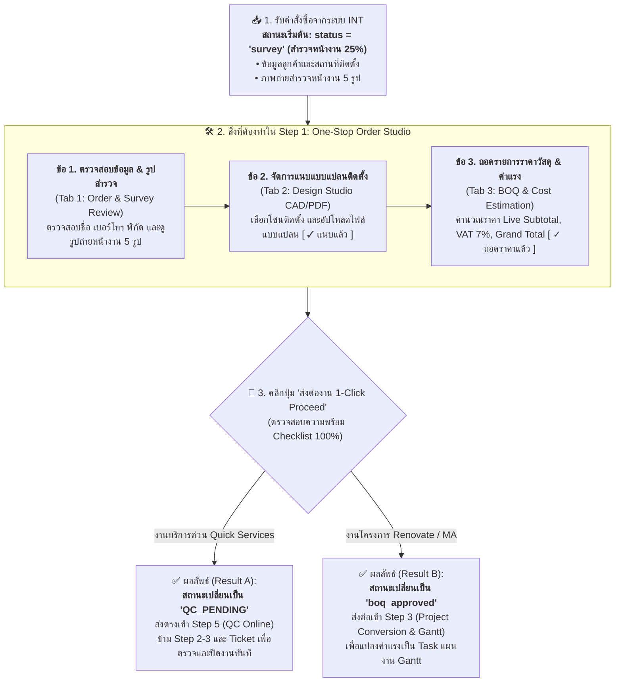
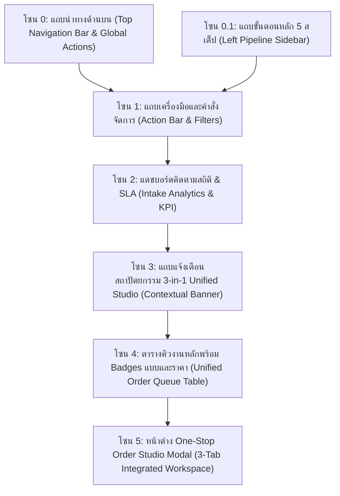
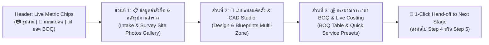

# 🎓 คู่มือฝึกอบรมการใช้งานหน้าจอระบบ PMT Flow
## โมดูลที่ 1: เจาะลึกหน้าจอ Step 1 — รับ Order, Design & BOQ (Unified One-Stop Order Studio)
**รหัสหลักสูตร:** `TRN-PMT-STEP01` | **ระบบ:** PMT Flow (Store Project Management Tool) | **เวอร์ชัน:** 3.0 (Unified Studio Architecture) | **ระดับ:** เจ้าหน้าที่รับงาน (Intake Officer) / PM & SA / หัวหน้างาน / วิทยากรผู้ฝึกอบรม (Trainer)

---

---

## 🚀 สรุปผังกระบวนการทำงาน Step 1 (Workflow Flowchart & Result)

---

## 📋 เจาะลึก 3 ขั้นตอนการปฏิบัติงาน & ผลลัพธ์ที่ได้ (SOP Guide)

### 📥 ที่มาของงาน: รับ Order จากระบบ INT (`status = "survey"`)
- **สถานะเริ่มต้น:** ทุกคำสั่งซื้อใหม่ที่ไหลเข้ามาจากระบบ INT (Inbound Order API) จะมีสถานะตั้งต้นเป็น **`status = "survey"` (สำรวจหน้างาน / ความคืบหน้า 25%)**
- **สิ่งที่ระบบส่งมาให้พร้อมใช้งาน:**
  1. ข้อมูลลูกค้า: ชื่อ-นามสกุล, เบอร์โทรศัพท์, ที่อยู่สถานที่ติดตั้ง
  2. ข้อมูลบริการ: ประเภทบริการ (Quick Services, Renovate หรือ MA)
  3. ภาพถ่ายสำรวจหน้างาน 5 รูป (Before Photos) ที่ช่างสำรวจถ่ายจากหน้างานจริง

---

### 🛠️ ในขั้นตอนนี้ เจ้าหน้าที่ (Intake Officer / AE / PM) ต้องทำอะไรบ้าง:

#### ▶ **ข้อ 1. ตรวจสอบข้อมูลคำสั่งซื้อ & ภาพถ่ายสำรวจหน้างาน (Tab 1: ข้อมูลคำสั่งซื้อ)**
- คลิกปุ่ม **`Studio >`** หรือคลิกที่แถวงานเพื่อเปิดหน้าต่าง **One-Stop Order Studio**
- ตรวจสอบความถูกต้องของชื่อลูกค้า, เบอร์โทรติดต่อ, และสถานที่ติดตั้ง
- ตรวจดูรูปถ่ายสำรวจหน้างาน 5 รูป (Before Photos) เพื่อประเมินสภาพพื้นที่ก่อนเริ่มออกแบบและประมาณราคา

#### ▶ **ข้อ 2. จัดการแนบแบบแปลนติดตั้ง (Tab 2: แบบแปลน CAD/PDF)**
- สลับมาที่ **Tab 2: แบบแปลน CAD/PDF**
- เลือกระบุโซนการติดตั้ง (เช่น ห้องครัว, ห้องน้ำ, โถงทางเดิน, ภายนอกอาคาร)
- อัปโหลดไฟล์แบบแปลน (รองรับไฟล์ `.pdf`, `.dwg`, `.dxf`, `.png`, `.jpg`) หรือคลิกเลือกแบบแปลนมาตรฐานจากคลัง
- เมื่อบันทึกเสร็จ ป้าย Badge บนตาราง Step 1 จะเปลี่ยนเป็นสีเขียว **`[ ✓ แนบแล้ว (1 ไฟล์) ]`**

#### ▶ **ข้อ 3. ถอดรายการราคาวัสดุ & ค่าแรง (Tab 3: รายการถอดราคา BOQ)**
- สลับมาที่ **Tab 3: ถอดรายการราคา BOQ**
- เพิ่มรายการวัสดุ อุปกรณ์ และค่าแรงติดตั้งตามแบบแปลน
- ระบบจะคำนวณยอดรวม (Subtotal), หักส่วนลด, คำนวณภาษีมูลค่าเพิ่ม VAT 7% และยอดสุทธิ (Grand Total) ให้อัตโนมัติแบบ Real-time Live
- เมื่อบันทึกเสร็จ ป้าย Badge บนตาราง Step 1 จะเปลี่ยนเป็นสีเขียว **`[ ✓ ถอดราคาแล้ว (฿XX,XXX) ]`**

---

### 🎯 ผลลัพธ์ที่ได้คืออะไร (Result Output):
เมื่อทำครบทั้ง 3 ข้อแล้ว ให้ตรวจสอบช่อง Checklist Validation ที่มุมล่าง และคลิกปุ่มสีม่วง **`[ ส่งต่องาน 1-Click Proceed ]`**:

1. **กรณีงานบริการด่วน (Quick Services - ติดตั้งอุปกรณ์เดี่ยว/แอร์/เครื่องทำน้ำอุ่น):**
   - **ผลลัพธ์ (Result):** ระบบจะ **Disable Step 2 (Design) และ Step 3 (BOQ)** โดยอัตโนมัติ ข้อมูลช่างจะถูก **STAMP ตรงมาจากระบบ INT** และไม่ต้องไปหน้า Ticket เมื่อกดปุ่ม **Save (บันทึกข้อมูล)** หรือ **🚀 บันทึก & วิ่งไปหน้า QC ทันที** ระบบจะส่งตรงเข้าสู่ **Step 5: ตรวจรับงาน QC (QC Online)** ทันทีเพื่อปิดงาน
   - **ประโยชน์:** เจ้าหน้าที่ไม่ต้องเสียเวลาทำแบบหรือ BOQ และข้ามหน้า Ticket ทันที ทำให้ทีม QC สามารถตรวจสอบภาพถ่ายหน้างานและอนุมัติปิดงานได้อย่างรวดเร็วใน 1 คลิก

2. **กรณีงานโครงการปรับปรุง (Renovate) หรือสัญญาบำรุงรักษา (MA):**
   - **ผลลัพธ์ (Result):** งานจะเปลี่ยนสถานะเป็น **`boq_approved`** (ความคืบหน้า 50%) และส่งต่อไปยัง **Step 3: เตรียมแผนงานและทีมช่าง (Project Conversion)** ทันที
   - **ประโยชน์:** นำรายการค่าแรงจาก BOQ ไปจับคู่แปลงเป็นงานย่อย (Labor-to-Task Conversion) และสร้างแท่งแผนงานบน **Gantt Chart Timeline (Step 4)** ได้ทันทีโดยไม่ต้องกรอกข้อมูลซ้ำ

---

## 📌 บทสรุปและวัตถุประสงค์ (Course Overview & Objectives)

หน้าจอ **Step 1: รับ Order, Design & BOQ (Unified One-Stop Order Studio)** คือ **"ศูนย์กลางบริการครบวงจร (One-Stop Proposal Hub)"** ที่ออกแบบจากมุมมองของ **Project Manager (PM)** และ **Solutions Architect (SA)** เพื่อรวมกระบวนการ **รับคำสั่งซื้อ (Intake)**, **แนบแบบแปลน CAD/PDF (Design Studio)** และ **ถอดรายการราคาวัสดุ/ค่าแรง (BOQ & Costing)** ไว้ในจุดเดียวอย่างราบรื่น

ช่วยลดขั้นตอนการเปลี่ยนหน้าจอไปมาระหว่างแผนก ทำให้งานบริการด่วน (Quick Services) สามารถจบแบบแปลนและราคาเพื่อส่งต่อไปเปิด Ticket ใน **Step 2** ได้ทันทีใน 1 คลิก หรือสำหรับงานโครงการปรับปรุง (Renovate / MA) สามารถส่งต่อไปยัง **Step 3 (แปลงเข้า Gantt Timeline ใน Step 4)** ได้อย่างรวดเร็ว

### 🎯 วัตถุประสงค์การเรียนรู้สำหรับผู้เข้าอบรม (Learning Objectives):
1. **เข้าใจสถานะ Inbound จาก INT:** เข้าใจที่มาของงานสถานะ `status = "survey"` และการนำภาพถ่ายสำรวจมาต่อยอด
2. **เข้าใจสถาปัตยกรรม Unified Order Studio:** เข้าใจการทำงานร่วมกันของ 3 แท็บในหน้าต่างเดียว (Tab 1: ข้อมูลคำสั่งซื้อ, Tab 2: แบบแปลน CAD/PDF, Tab 3: รายการถอดราคา BOQ)
3. **อ่านสถานะความพร้อมของแบบและราคาในตาราง Step 1:** ใช้งานคอลัมน์ **"แบบแปลน (Design)"** และ **"ถอดราคา (BOQ)"** พร้อมคลิกป้าย Badge เพื่อเปิด Studio ตรงแท็บที่ต้องการทันที
4. **การนำเข้าและจัดการแบบแปลน CAD/PDF:** รองรับการเลือกโซนงาน (เช่น ห้องครัว, ห้องน้ำ, ห้องนั่งเล่น) และการอัปโหลดไฟล์แปลนติดตั้ง
5. **การถอดราคาและคำนวณ BOQ แบบ Live:** จัดการเพิ่ม/ลบรายการวัสดุ-ค่าแรง และคำนวณยอดรวม Subtotal, ส่วนลด, VAT 7% และ Grand Total อัตโนมัติ
6. **การส่งต่องาน 1-Click Proceed:** สามารถตรวจสอบสถานะความพร้อม (Checklist Validation) และคลิกปุ่มส่งต่องานไปยัง Step 4 (Quick Services) หรือ Step 5 (Renovate Projects) ได้อย่างแม่นยำ 100%

---

## 🧭 กายวิภาคของหน้าจอ Step 1 (Screen Anatomy Breakdown)

โครงสร้างหน้าจอ Step 1 แบ่งออกเป็น **6 โซนสำคัญ** ดังนี้:

---

### 🔹 โซน 0: แถบนำทางด้านบน (Top Navigation Bar & Global Actions)

| องค์ประกอบ | สัญลักษณ์ / สี | หน้าที่การทำงาน | คำแนะนำจาก Trainer |
| :--- | :--- | :--- | :--- |
| **โลโก้ & ชื่อระบบ** | `PMT Flow` | แสดงแบรนด์ระบบและสถานะระบบ Enterprise Operations | คลิกเพื่อกลับสู่หน้าหลัก |
| **Breadcrumb** | `PMT Flow > Step 1: รับ Order, Design & BOQ` | ระบุตำแหน่งหน้าจอที่กำลังใช้งานอยู่แบบ Real-time | ช่วยให้ทราบว่าขณะนี้อยู่ ณ จุดใดของกระบวนการ |
| **ค้นหางานด่วน** | `🔍 ค้นหางาน, ช่าง, ลูกค้า... [⌘K]` | ค้นหาเลขที่งาน (Job ID), ชื่อลูกค้า, เบอร์โทรศัพท์ หรือชื่อช่างผู้รับผิดชอบได้ทันทีทั่วทั้งระบบ | กดคีย์ลัด `Ctrl + K` (หรือ `⌘K`) เพื่อเปิดค้นหาได้รวดเร็ว |
| **User Management** | ปุ่ม `[ 👥 User Management ]` | ทางลัดเข้าสู่ระบบ **จัดการผู้ใช้งาน (User Management)** สำหรับ Admin เพื่อกำหนดสิทธิ์ บทบาท และบัญชีผู้ใช้ | ใช้เมื่อต้องการจัดการช่างหรือพนักงานรับ Order |
| **FAQ & คู่มือ** | ปุ่ม `[ ❓ FAQ & คู่มือ ]` | เปิดหน้าคู่มือขั้นตอนการปฏิบัติงานทั้งระบบ (Workflow Guide & Documentation) | ให้ผู้เรียนกดปุ่มนี้เพื่อเปิดทบทวนขั้นตอนกระบวนการทั้งหมดได้ตลอดเวลา |
| **การแจ้งเตือน** | ไอคอนกระดิ่ง `🔔` พร้อมจุดแจ้งเตือน | แจ้งเตือนคิวงานด่วน งานใกล้ครบกำหนด SLA หรือการแจ้งเตือนสำคัญจากระบบ | ตรวจสอบเมื่อมีจุดสีส้ม/ม่วงปรากฏ |
| **ออกจากระบบ** | ปุ่ม `[ 🚪 ออกจากระบบ ]` | ล้าง Session และออกจากระบบอย่างปลอดภัย (Hard Reload กลับสู่หน้าล็อกอิน) | แนะนำให้กดทุกครั้งหลังเสร็จสิ้นการปฏิบัติงาน |

---

### 🔹 โซน 0.1: แถบขั้นตอนการดำเนินงานหลัก (Left Pipeline Sidebar)

ทางฝั่งซ้ายมือของหน้าจอแสดงกระบวนการทำงานหลัก พร้อมตัวเลขระบุจำนวนงานที่อยู่ในแต่ละขั้นตอน:

1. 🟣 **Step 1: บันทึกงาน / รับ Order (One-Stop Studio):** คิวงานที่รอการคัดกรองเบื้องต้น, บันทึกงาน, ออกแบบแปลน และจัดทำ BOQ
2. 🟢 **Step 4: บันทึก Ticket & ใบเสร็จ:** เปิดใบสั่งงาน (Work Ticket) และแนบสลิป/ใบเสร็จรับเงิน
3. 📊 **การควบคุมคุณภาพ & แผนงาน:** ประกอบด้วย แผนงาน Gantt เต็มรูป, บันทึกงานช่างประจำวัน, ตรวจคุณภาพ (QC), ความพึงพอใจลูกค้า (CSAT), และบริการหลังการขาย
4. ✅ **รายงานที่สำเร็จแล้ว & Report:** รายงานโครงการที่สำเร็จแล้ว (Job Close) และรายงานสถิติ Audit Report

---

### 🔹 โซน 1: แถบเครื่องมือและคำสั่งจัดการ (Action Bar & Filters)

แถบเครื่องมือด้านบนขวาของพื้นที่ทำงาน เป็นศูนย์รวมปุ่มสั่งการและตัวกรองข้อมูล:

| ปุ่ม / ตัวควบคุม | สีและลักษณะ | ความหมายและหน้าที่การทำงาน | คำแนะนำการใช้งานสำหรับห้องอบรม |
| :--- | :--- | :--- | :--- |
| **ค้นหาข้อมูลในตาราง** | ช่อง `🔍 ค้นหาเลขที่งาน, Ref ID, Booking, วันนัด, ลูกค้า...` | ค้นหาข้อมูลได้ทันทีในหน้าจอ Step 1 แบบ Real-time | พิมพ์บางส่วนของรหัสหรือชื่อลูกค้าเพื่อกรองทันที |
| **ถอยสถานะเป็น Survey** | ปุ่มขอบส้ม `🔄 ถอยสถานะเป็น Survey` | รีเซ็ตสถานะงานทั้งหมดในระบบให้กลับมาเป็นสถานะเริ่มต้นสำรวจหน้างาน (Survey / 25%) พร้อมคงรูปถ่ายหน้างานไว้เพื่อให้ฝึกทำแบบและ BOQ | ใช้วนรอบการฝึกอบรม เพื่อให้ผู้เรียนเริ่มทำซ้ำได้ใหม่ (เฉพาะ Admin/Dev) |
| **ล้างข้อมูลโครงการ** | ปุ่มขอบแดง `🗑️ ล้างข้อมูลโครงการ` | ล้างข้อมูลงานทั้งหมดออกจากระบบ (Database Reset) มี Modal ยืนยันความปลอดภัย | ใช้ก่อนเริ่มคลาสเรียน เพื่อเคลียร์ระบบให้สะอาด (เฉพาะ Admin/Dev) |
| **จำลอง Order จาก INT** | ปุ่มขอบม่วง `⚡ รีเซ็ตเหลือเฉพาะ Order INT` | รีเซ็ตระบบโดยคงไว้เฉพาะ 20 คำสั่งซื้อจำลองจาก INT ในสถานะ Step 1 | ให้ผู้เรียนกดปุ่มนี้ 1 ครั้งเพื่อเริ่มแบบฝึกหัด (เฉพาะ Admin/Dev) |
| **+ Manual Order** | ปุ่มสีน้ำเงิน `➕ + Manual Order` | สร้างคำสั่งซื้อใหม่แบบกรอกข้อมูลเองในระบบ PMT Flow | ใช้สร้างคำสั่งซื้อหน้างานหรือทางโทรศัพท์ |

---

### 🔹 โซน 2: แดชบอร์ดติดตามสถิติและ SLA (Order Intake Analytics & KPI)

สรุปตัวเลขสถิติแบบ Realtime Live พร้อมการ์ด KPI 5 ด้านและสัดส่วนประเภทงาน:

1. **Card 1 — ยอดงานเข้า ทั้งหมด:** ปริมาณคำสั่งซื้อสะสมทั้งหมดในระบบ ช่วยประเมินขนาดงานรวม
2. **Card 2 — ยอดเข้าวันนี้:** จำนวน Order ที่เชื่อมโยงเข้ามาในรอบวันปัจจุบัน
3. **Card 3 — รอรับเข้า PMT:** งานที่ยังค้างอยู่ใน Step 1 และยังไม่ได้กดรับเข้าสู่ระบบ PMT **เป้าหมายประจำวันคือต้องเคลียร์ตัวเลขนี้ให้เหลือ `0`**
4. **Card 4 — สถานะ SLA 4 ชม.:** แสดงงานที่รอดำเนินการเทียบกับเกณฑ์เวลามาตรฐาน 4 ชั่วโมง พร้อมปุ่มตั้งค่า SLA
5. **Card 5 — Close Lost:** โครงการที่ปิดไม่สำเร็จ / ยกเลิกงาน

---

### 🔹 โซน 3: ตารางคิวงานหลัก (Order Queue Table with Large Fonts & Column Filters)

ตารางแสดงรายการงานใน Step 1 ได้รับการปรับปรุงให้แสดงผลแบบ **ขนาดตัวอักษรใหญ่ชัดเจน (Font Size +3 to 4 steps: 14–16px)** พร้อมตัดป้ายแท็กซ้ำซ้อนออก และเพิ่มตัวกรองที่หัวคอลัมน์โดยตรง:

1. **เลขที่งาน (Job ID):** รหัสงานแบบตัวเลขสั้นกระชับ (เช่น `260916-002`) ตัวอักษรขนาดใหญ่พิเศษ ชัดเจน ตัดป้าย `vFIX` และ `NEW!` ออก คงไว้เฉพาะป้ายประเภทงาน เช่น `SURVEY`
2. **เลขที่อ้างอิง (Ref ID):** รหัสอ้างอิงภายนอกจาก INT หรือระบบสั่งซื้อ เช่น `REQ-RA2-2609100121`
3. **เลขที่ Booking:** รหัสการจองคิวงานจาก Booking กลาง เช่น `BKG-RA2-2609100121-001`
4. **กำหนดวันนัด (พร้อมตัวกรองหัวคอลัมน์):** กำหนดวันนัดหมายทำงาน แสดงผลตามมาตรฐาน **`DD/MM/YYYY`** ตัวหนา พร้อม Dropdown กรองด่วนที่หัวตาราง (ทั้งหมด / นัดวันนี้ / นัดข้างหน้า / เกินกำหนดนัด) และแถบระบุช่วงวันที่
5. **ลูกค้า & เบอร์ติดต่อ:** ชื่อลูกค้าตัวหนาขนาดใหญ่ และเบอร์โทรศัพท์ติดต่อ
6. **ประเภทบริการ (พร้อมตัวกรองหัวคอลัมน์):** ป้ายประเภทงาน (`QUICK` / `RENOVATE`) พร้อมชื่องานบริการตัวหนา และมี Dropdown กรองประเภทบริการที่หัวตาราง (ทั้งหมด / Quick Services / Renovate / MA)
7. **วันที่รับ Order:** วันและเวลาที่บันทึก Order เข้าสู่ระบบ แสดงในรูปแบบมาตรฐาน 24 ชั่วโมง
8. **แบบแปลน (Design):** ปุ่มสถานะแบบแปลน เช่น `2 แบบ` หรือ `+ แนบแบบ` (คลิกเพื่อเปิด Studio จัดการแบบ)
9. **ประมาณการ (BOQ):** ปุ่มแสดงยอดราคา BOQ รวม เช่น `฿145,000` หรือ `+ ลง BOQ`
10. **Studio จัดการงาน:** ปุ่มลัด `[ Studio ]` สำหรับเปิด One-Stop Studio จัดการ Order, Design, และ BOQ จบในที่เดียว

---

### 🔹 โซน 5: หน้าต่าง One-Stop Order Studio (Ultra-Wide Continuous Scrolling Workspace)

เมื่อคลิกปุ่มเปิด Studio หรือคลิกที่ Badge ในตาราง หน้าต่าง Modal ขนาดใหญ่พิเศษ (`w-[96vw] max-w-7xl h-[96vh]`) จะเปิดขึ้นมา โดยออกแบบมาเฉพาะสำหรับ **PM (Project Manager)** และ **Solutions Architect (SA)** ให้ทำงานได้อย่างต่อเนื่องผ่าน **การเลื่อนลงตามแนวตั้ง (Continuous Vertical Scrolling)** หรือใช้ **ปุ่มลัดนำทาง (Sticky Quick Jump Navigation)** เพื่อข้ามไปยังส่วนงานที่ต้องการได้ทันที:

#### 1. แถบหัวเรื่องและตัวชี้วัดสด (Executive Header & Live Metrics)
- **สถานะและรหัสงาน:** แสดงรหัส Job, ชื่องาน, และป้ายสถานะ `SURVEYED (25% ดำเนินการแล้ว)` เพื่อยืนยันว่าผ่านการสำรวจหน้างานแล้ว
- **Live Metric Chips:**
  - 📷 **จำนวนรูปถ่ายหน้างาน:** แสดงตัวเลขรูปถ่ายสำรวจที่แนบอยู่ (เช่น `5 รูปถ่าย`)
  - 📐 **จำนวนแบบแปลน:** แสดงจำนวนแบบแปลนติดตั้งที่จัดทำแล้ว (เช่น `2 แบบแปลน`)
  - 📊 **ยอดรวม BOQ สุทธิ:** แสดงมูลค่ารวมของเอกสาร BOQ แบบเรียลไทม์ (เช่น `155,150.00 ฿`)
  - 📅 **วันเวลานัดหมาย:** วันที่ตามมาตรฐาน `DD/MM/YYYY` และช่วงเวลาแบบ 24 ชั่วโมง (`HH:mm - HH:mm น.`)

#### 2. ส่วนที่ 1: ข้อมูลคำสั่งซื้อ & คลังรูปถ่ายสำรวจหน้างาน (Intake & Survey Site Photos Gallery)
- **ข้อมูลลูกค้า & นัดหมาย:** รหัสงาน, วันที่ติดตั้ง (`DD/MM/YYYY`), ประเภทงาน, ช่างผู้รับผิดชอบ, ที่อยู่หน้างาน, พิกัด GPS
- **📷 คลังรูปถ่ายสำรวจหน้างาน (Survey Photos Gallery):**
  - แสดงภาพถ่ายสภาพพื้นที่หน้างานจริงที่ช่าง/ผู้สำรวจบันทึกไว้ (เช่น Check-in, มิเตอร์ไฟฟ้า, แผงเมนสวิตช์, แนวท่อ, สภาพหลังคา, Check-out)
  - **ปุ่ม `+ 📷 เพิ่มรูปถ่ายหน้างาน`:** เปิดหน้าต่างอัปโหลดภาพเพิ่มเติม สำหรับ PM/SA ที่ได้รับรูปเพิ่มเติมจากลูกค้าหรือทีมช่าง
  - **Lightbox Zoom Preview:** คลิกที่ภาพใดๆ เพื่อเปิดหน้าต่างดูรูปภาพขนาดใหญ่เต็มตาพร้อมข้อมูลวันที่และหมายเหตุ
  - **ปุ่มลบรูปภาพ (Delete Photo):** สามารถลบรูปภาพที่ไม่ต้องการออกจากระบบได้

#### 3. ส่วนที่ 2: แบบแปลนติดตั้ง & CAD Studio (Design & Blueprints Multi-Zone)
- เลือกโซนงาน (Zone/Room): เช่น `ห้องครัว`, `ห้องน้ำ`, `ห้องนั่งเล่น`, `ภายนอกอาคาร`, `แผงควบคุมหลัก`
- อัปโหลดไฟล์แบบแปลน (รองรับ `.dwg`, `.dxf`, `.pdf`, `.png`, `.jpg`) หรือกดปุ่มจำลองแบบแปลนตัวอย่าง
- แสดงรายการแบบแปลนที่แนบในโครงการ พร้อมปุ่มเปิดดู Lightbox Preview และปุ่มลบแบบ

#### 4. ส่วนที่ 3: ประมาณการราคาและถอดแบบ BOQ (BOQ & Live Costing Studio)
- **ตารางถอดแบบราคา:** คอลัมน์ลำดับ, รหัส/รายการ, หมวดหมู่ (`วัสดุ / อุปกรณ์` หรือ `ค่าแรง / บริการ`), จำนวน, หน่วย, ราคาต่อหน่วย, ยอดรวม
- **⚡ Quick Service Preset Chips:** ปุ่มทางลัดสำหรับเพิ่มรายการค่าแรงและบริการยอดนิยมใน 1 คลิก:
  - `+ ค่าแรงติดตั้ง` (LABOR / 1 จุด / 2,500 ฿)
  - `+ ท่อน้ำยาแอร์ 4 ม.` (MATERIAL / 1 ชุด / 1,200 ฿)
  - `+ รางครอบท่อ 2 ม.` (MATERIAL / 2 เส้น / 450 ฿)
  - `+ สายไฟ VAF 2x2.5` (MATERIAL / 10 ม. / 35 ฿)
  - `+ เบรกเกอร์ 20A` (MATERIAL / 1 ชุด / 350 ฿)
- **สรุปยอดเงินอัตโนมัติ:** ยอดรวมก่อนภาษี (Subtotal), ส่วนลด (Discount), ภาษีมูลค่าเพิ่ม (VAT 7%) และยอดสุทธิ (Grand Total)

#### 5. แถบสรุปสถานะและความพร้อม และเงื่อนไขการส่งต่องาน (Sticky Bottom Action Bar & Gating Rule)
- ด้านล่างของ Studio เป็นแถบ Sticky ติดค้างหน้าจอ มี Live Indicators สะท้อนสถานะความพร้อม:
  - `📋 ข้อมูลคำสั่งซื้อ: พร้อม ✓`
  - `📐 แบบแปลน: แนบแล้ว N แบบ ✓ / ยังไม่มีแบบแนบ`
  - `💰 รายการ BOQ: ผ่านแล้ว ✓ (N รายการ) / ❌ ยังไม่ผ่าน: ยังไม่มีรายการ BOQ`
- **🚨 กฎเกณฑ์ความปลอดภัยบังคับ (Gating Rule):**
  - **สำหรับงาน Renovate:** หากยังไม่มีรายการ BOQ ปุ่มย้ายไป Step 5 จะถูกล็อกสถานะ (Disabled 100%) เป็นปุ่มสีเทา `🔒 รอผ่าน Step 3 (จัดทำ BOQ ก่อนไป Step 5)`
  - เมื่อมีรายการ BOQ อย่างน้อย 1 รายการ ระบบจะ **ปลดล็อกอัตโนมัติ (Reactive Auto-Unlock)** เป็นปุ่มสีม่วง `🚀 อนุมัติ & แปลงเข้า Gantt (Step 5)` ทันที
- ปุ่มดำเนินการ:
  - **`💾 บันทึกข้อมูล (Save Studio)`:** บันทึกข้อมูลร่างทั้งหมดลงในระบบ
  - **`🚀 ยืนยันข้อมูล & ส่งต่อไปขั้นตอนถัดไป`:**
    - หากเป็น **Quick Services** ➔ ส่งต่อไปยัง **Step 4 (บันทึก Ticket & ใบเสร็จ)** ทันที
    - หากเป็น **Renovate / MA** ➔ ส่งต่อไปยัง **Step 5 (แปลง BOQ เข้า Gantt Timeline)** ทันที

---

## 🛠️ ขั้นตอนการปฏิบัติงานมาตรฐาน (Trainer Script & SOP)

### 🎙️ บทบรรยายสำหรับวิทยากร (Trainer Script):
> *"สวัสดีครับผู้เข้าอบรมทุกท่าน วันนี้เราขอแนะนำสถาปัตยกรรมใหม่ของระบบ PMT Flow นั่นคือ **Step 1: One-Stop Order Studio**"*
>
> *"จากเดิมที่ท่านต้องเปิดรับงานใน Step 1 แล้วสลับไป Step 2 เพื่อแนบแบบแปลน จากนั้นสลับไป Step 3 เพื่อคีย์ BOQ ตอนนี้ท่านสามารถทำทุกอย่างให้เสร็จสิ้นได้ในหน้าต่างเดียว!"*
>
> *"เมื่อท่านเห็น Order ใหม่เข้ามาในตาราง Step 1 ท่านสามารถดูได้ทันทีว่างานนี้มีแบบแปลนหรือยังจากคอลัมน์ 'แบบแปลน (Design)' และมีราคาหรือยังจากคอลัมน์ 'ถอดราคา (BOQ)' หากต้องการจัดการ ให้คลิกปุ่ม **[Studio: จัดการ Order/แบบ/BOQ]** หน้าต่าง 3 แท็บจะเปิดขึ้นมาให้ท่านบันทึกข้อมูล แนบแปลน และลงราคาจนเสร็จสิ้น จากนั้นกดปุ่ม **[ยืนยันข้อมูล & ส่งต่อไปขั้นตอนถัดไป]** เพียงคลิกเดียว งานจะถูกส่งต่อไปเปิด Ticket หรือแปลงเข้า Gantt Chart ทันทีครับ"*

---

## 🧪 แบบฝึกหัดภาคปฏิบัติในห้องเรียน (Hands-on Class Exercises)

### 🏋️ แบบฝึกหัดที่ 1: การเปิด Studio และแนบแบบแปลน / BOQ
1. คลิกปุ่ม **"⚡ จำลอง 10 งาน (INT)"** เพื่อสร้างข้อมูลทดสอบ
2. ในตาราง Step 1 ค้นหารายการ `JOB26090900002` (Renovate ห้องครัว)
3. คลิกที่ปุ่ม **`[ Studio: จัดการ Order/แบบ/BOQ ]`**
4. สลับไปที่ **แท็บ 2 (แบบแปลน & CAD)** ➔ คลิกปุ่ม **"+ แนบแบบแปลนตัวอย่าง"** สังเกตว่ามีแบบแปลนปรากฏในตาราง 1 รายการ
5. สลับไปที่ **แท็บ 3 (รายการถอดราคา BOQ)** ➔ คลิกปุ่ม **"📥 นำเข้าตัวอย่าง BOQ"** สังเกตว่ามียอดเงินคำนวณรวมอัตโนมัติ
6. คลิกปุ่ม **"💾 บันทึกข้อมูล (Save Studio)"**
7. ตรวจสอบในตาราง Step 1 ภายนอก: ป้ายแบบแปลนจะเปลี่ยนเป็น `1 แบบ (CAD/PDF)` และป้ายราคาจะเปลี่ยนเป็นตัวเลขยอดเงินจริงทันที

### 🏋️ แบบฝึกหัดที่ 2: การใช้งาน 1-Click Proceed ส่งต่องานไปยังขั้นตอนถัดไป
1. เปิด Studio ของงานที่บันทึกข้อมูลครบถ้วนแล้ว
2. ตรวจสอบแถบสถานะด้านล่างว่ามีเครื่องหมายถูกสีเขียวครบทั้ง 3 รายการ
3. คลิกปุ่ม **"🚀 ยืนยันข้อมูล & ส่งต่อไปขั้นตอนถัดไป"**
4. ยืนยันการส่งต่อ: งานจะถูกย้ายไปยัง Step 4 หรือ Step 5 ตามประเภทของงานทันที

---

## ❓ คำถามที่พบบ่อย (FAQ & Best Practices)

### Q1: หากต้องการแนบแบบแปลนเพิ่มเติมในภายหลังหลังจากส่งต่องานไปแล้ว ทำได้หรือไม่?
> **คำตอบ:** ทำได้ตลอดเวลา โดยสามารถเข้าไปที่เมนู **`Step 2: คลังแบบแปลน (Design)`** ซึ่งทำหน้าที่เป็นคลังจัดเก็บและบริหารแบบแปลนกลางของทุกโครงการ

### Q2: เมนู Step 2 และ Step 3 ที่แถบซ้ายมือยังคงใช้งานได้อยู่หรือไม่?
> **คำตอบ:** ใช้งานได้ตามปกติ โดย **Step 2 (คลังแบบแปลน Design)** และ **Step 3 (คลังรายการ BOQ)** จะทำหน้าที่เป็นศูนย์รวบรวมข้อมูลกลาง (Central Repositories) สำหรับการค้นหา ดูย้อนหลัง นำเข้าไฟล์ Excel จำนวนมาก หรือพิมพ์รายงานสรุปภาพรวม

### Q3: การสร้างงานใหม่ผ่านปุ่ม "+ Manual Order" มีข้อมูลเริ่มต้นอย่างไร?
> **คำตอบ:** เมื่อเจ้าหน้าที่กดปุ่ม **`[ + Manual Order ]`** ที่แถบเครื่องมือด้านบน:
> 1. **ค่าเริ่มต้นอัตโนมัติ (Default INT Payload):** ระบบจะบรรจุข้อมูลจำลองมาตรฐานตาม Inbound API Payload ของระบบ INT ให้ทันที (สมชาย ใจดี, เบอร์โทร 081-234-5678, ที่อยู่, พิกัด GPS, ทีมช่าง, วันนัดติดตั้งในรูปแบบ `DD/MM/YYYY`, คำสั่งพิเศษ และหมายเหตุ) โดยไม่ต้องพิมพ์ข้อมูลใหม่ตั้งแต่ต้น
> 2. **ชุดพรีเซ็ตลัด (INT Payload Presets):** มีปุ่มลัด 4 หมวดงานหลักให้สลับข้อมูลได้ใน 1 คลิก:
>    - ⚡ น้ำอุ่น (Quick Services)
>    - ⚡ แอร์ (Quick Services)
>    - 🔨 ครัว (Renovate Projects)
>    - 🔧 สัญญา MA (Maintenance)
> 3. **การแนบรูปภาพหน้างาน / เอกสารจาก INT (Photo Attachments):**
>    - รองรับการลากวาง (Drag & Drop) หรือเลือกไฟล์รูปภาพจากเครื่อง
>    - รองรับการกดถ่ายภาพหน้างานผ่านกล้องมือถือ/แท็บเล็ต
>    - มีปุ่มลัด **"✨ แนบรูปตัวอย่าง INT (2 รูป)"** เพื่อการทดสอบระบบแบบสะดวกรวดเร็ว
>    - แสดง Thumbnail แกลเลอรีรูปภาพพร้อมปุ่มลบ (✕) และระบบบีบอัดภาพอัตโนมัติก่อนบันทึกเข้าสู่ฐานข้อมูล `core_jobs`

---

> [!TIP]
> **ข้อแนะนำพิเศษ:** ทุกหน้าจอของระบบ PMT Flow ทำงานในรูปแบบ **Light Theme 100%** มีการแสดงผลวันที่แบบ **`DD/MM/YYYY`** และระบบเวลาแบบ **24 ชั่วโมง (`00:00 - 23:59 น.`)** เพื่อความชัดเจน แม่นยำ และเป็นมาตรฐานเดียวกันทั่วทั้งองค์กร

