# 🎓 คู่มือฝึกอบรมการใช้งานหน้าจอระบบ PMT Flow
## โมดูลที่ 1: เจาะลึกหน้าจอ Step 1 — คิวงานรับคำสั่งซื้อใหม่ (New Order Intake Training Screen Guide)
**รหัสหลักสูตร:** `TRN-PMT-STEP01` | **ระบบ:** PMT Flow (Store Project Management Tool) | **เวอร์ชัน:** 2.0 (Pipeline Architecture) | **ระดับ:** เจ้าหน้าที่รับงาน (Intake Officer) / หัวหน้างาน / วิทยากรผู้ฝึกอบรม (Trainer)

---


---

## 📌 บทสรุปและวัตถุประสงค์ (Course Overview & Objectives)

หน้าจอ **Step 1: คิวงานรับคำสั่งซื้อใหม่ (New Order Intake)** คือ **"หน้าด่านแรก (Gatekeeper)"** ของระบบบริหารจัดการงานโครงการ PMT Flow ทำหน้าที่รับคำสั่งซื้อที่ส่งต่อมาจากระบบขายหน้าร้านหรือระบบภายนอก (INT System) เพื่อทำการคัดกรองเบื้องต้น ตรวจสอบความถูกต้องของข้อมูลลูกค้า และ **ส่งต่องาน (Dispatch)** ไปยังขั้นตอนถัดไปที่เหมาะสมอย่างรวดเร็วและแม่นยำ

### 🎯 วัตถุประสงค์การเรียนรู้สำหรับผู้เข้าอบรม (Learning Objectives):
1. **เข้าใจสถาปัตยกรรมคิวงาน (Single State Queue):** ทำความเข้าใจว่าทำไมหน้าจอนี้จึงแสดงเฉพาะรายการที่ "รอดำเนินการ" และเมื่อกดรับแล้วงานจะถูกย้ายสเต็ปทันที
2. **จำแนกประเภทงานได้อย่างแม่นยำ (Job Classification):** แยกความแตกต่างระหว่าง **งานบริการด่วน (Quick Services)** และ **งานโครงการปรับปรุง (Renovate / MA)**
3. **ใช้งานปุ่มและตัวควบคุมได้อย่างถูกต้อง 100%:** ทั้งปุ่มจำลองงาน (Simulate), การสร้าง Order แบบ Manual, การถอยสถานะ (Rollback), การล้างข้อมูล และการ Export ข้อมูล
4. **อ่านและวิเคราะห์แดชบอร์ด KPI & SLA:** เข้าใจตัวชี้วัดทั้ง 4 ใบ ตรวจจับงานที่ใกล้เกินเกณฑ์เวลา 4 ชั่วโมง และปรับแต่งการตั้งค่า SLA ได้
5. **ควบคุมการไหลของงาน (Workflow Routing):** สามารถส่งต่องานแบบ **Fast-track (ข้ามไป Step 4)** สำหรับงานด่วน และ **Standard Track (ไป Step 2)** สำหรับงานแบบแปลน

---

## 🧭 กายวิภาคของหน้าจอ Step 1 (Screen Anatomy Breakdown)

จากภาพหน้าจอระบบจริง โครงสร้างหน้าจอแบ่งออกเป็น **6 โซนสำคัญ** ดังนี้:

```mermaid
graph TD
    Z0["โซน 0: แถบนำทางด้านบน (Top Navigation Bar & Global Actions)"]
    Z01["โซน 0.1: แถบขั้นตอนหลัก 5 สเต็ป (Left Pipeline Sidebar)"]
    Z1["โซน 1: แถบเครื่องมือและคำสั่งจัดการ (Action Bar & Filters)"]
    Z2["โซน 2: แดชบอร์ดติดตามสถิติ & SLA (Intake Analytics & KPI)"]
    Z3["โซน 3: สัดส่วนประเภทงาน (Segment Distribution Summary)"]
    Z4["โซน 4: แถบแจ้งเตือน & ตารางคิวงาน (Intake Queue Table & Smart Dispatch)"]
    
    Z0 --> Z1
    Z01 --> Z1
    Z1 --> Z2
    Z2 --> Z3
    Z3 --> Z4
```



---

### 🔹 โซน 0: แถบนำทางด้านบน (Top Navigation Bar & Global Actions)

| องค์ประกอบ | สัญลักษณ์ / สี | หน้าที่การทำงาน | คำแนะนำจาก Trainer |
| :--- | :--- | :--- | :--- |
| **โลโก้ & ชื่อระบบ** | `PMT Flow [Artifact]` | แสดงแบรนด์ระบบและสถานะระบบ Enterprise Operations | คลิกเพื่อกลับสู่หน้าหลัก |
| **Breadcrumb** | `PMT Flow > Step 1...` | ระบุตำแหน่งหน้าจอที่กำลังใช้งานอยู่แบบ Real-time | ช่วยให้ทราบว่าขณะนี้อยู่ ณ จุดใดของกระบวนการ |
| **ค้นหางานด่วน** | `🔍 ค้นหางาน, ช่าง, ลูกค้า... [⌘K]` | ค้นหาเลขที่งาน (Job ID), ชื่อลูกค้า, เบอร์โทรศัพท์ หรือชื่อช่างผู้รับผิดชอบได้ทันทีทั่วทั้งระบบ | กดคีย์ลัด `Ctrl + K` (หรือ `⌘K`) เพื่อเปิดค้นหาได้รวดเร็ว |
| **User Management** | ปุ่มสี่เหลี่ยมขอบแดง/ชมพู `[ 👥 User Management ]` | ทางลัดเข้าสู่ระบบ **จัดการผู้ใช้งาน (User Management)** สำหรับ Admin เพื่อกำหนดสิทธิ์ บทบาท และบัญชีผู้ใช้ | *(จุดที่ปรากฏกรอบเด่นในภาพ)* ใช้เมื่อต้องการจัดการช่างหรือพนักงานรับ Order |
| **FAQ & คู่มือ** | ปุ่ม `[ ❓ FAQ & คู่มือ ]` | เปิดหน้าคู่มือขั้นตอนการปฏิบัติงานทั้งระบบ (Workflow Guide & Documentation) | ให้ผู้เรียนกดปุ่มนี้เพื่อเปิดทบทวนขั้นตอนกระบวนการทั้งหมดได้ตลอดเวลา |
| **สลับโหมด มืด/สว่าง** | ไอคอนดวงอาทิตย์ `☀️` | เปลี่ยนการแสดงผลของหน้าจอระหว่าง Light Mode และ Dark Mode | ปรับตามความเหมาะสมของสภาพแสงในห้องทำงาน |
| **การแจ้งเตือน** | ไอคอนกระดิ่ง `🔔` พร้อมจุดแจ้งเตือน | แจ้งเตือนคิวงานด่วน งานใกล้ครบกำหนด SLA หรือการแจ้งเตือนสำคัญจากระบบ | ตรวจสอบเมื่อมีจุดสีส้ม/ม่วงปรากฏ |
| **ออกจากระบบ** | ปุ่ม `[ 🚪 ออกจากระบบ ]` | ล้าง Session และออกจากระบบอย่างปลอดภัย | แนะนำให้กดทุกครั้งหลังเสร็จสิ้นการปฏิบัติงาน |

---

### 🔹 โซน 0.1: แถบขั้นตอนการดำเนินงานหลัก (Left Pipeline Sidebar)

ทางฝั่งซ้ายมือของหน้าจอแสดงกระบวนการทำงานแบบ **5 STEPS PIPELINE** พร้อมตัวเลขระบุจำนวนงานที่อยู่ในแต่ละขั้นตอน:

1. 🟣 **Step 1: บันทึกงาน / รับ Order (ตัวเลข `10` สีม่วง - หน้าปัจจุบัน):** คิวงานที่รอการคัดกรองเบื้องต้นและส่งต่อ
2. ⚪ **Step 2: บันทึก Design (ตัวเลข `0`):** ศูนย์รวมแบบแปลนติดตั้ง (Blueprints CAD & PDF) สำหรับงานโครงการ
3. ⚪ **Step 3: นำ BOQ เข้าระบบ (ตัวเลข `0`):** นำเข้าไฟล์ใบเสนอราคา ถอดปริมาณวัสดุและค่าแรง
4. ⚪ **Step 4: บันทึก Ticket & ใบเสร็จ (ตัวเลข `0`):** เปิดใบสั่งงาน (Work Ticket) และแนบสลิป/ใบเสร็จ
5. ⚪ **Step 5: บันทึก BOQ เข้า Project (ตัวเลข `0`):** แปลงค่าแรงเข้าสู่แผนงาน Gantt Timeline

> 💡 **ข้อสังเกตของ Trainer:** ตัวเลข `10` ใน Step 1 และ `0` ในสเต็ปอื่น ๆ แสดงว่าขณะนี้มี Order ใหม่อยู่ในคิวรอรับเข้า 10 รายการ และยังไม่มีงานใดถูกส่งต่อออกไป

---

### 🔹 โซน 1: แถบเครื่องมือและคำสั่งจัดการ (Action Bar & Filters)

แถบเครื่องมือด้านบนขวาของพื้นที่ทำงาน เป็นศูนย์รวมปุ่มสั่งการและตัวกรองข้อมูล:

| ปุ่ม / ตัวควบคุม | สีและลักษณะ | ความหมายและหน้าที่การทำงาน | คำแนะนำการใช้งานสำหรับห้องอบรม |
| :--- | :--- | :--- | :--- |
| **ตัวกรองบริการ** | Dropdown `ทุกประเภทบริการ` | กรองแสดงงานเฉพาะกลุ่ม เช่น งานติดตั้งแอร์, งานติดตั้งเครื่องทำน้ำอุ่น, งาน Renovate | ใช้เมื่อต้องการมอบหมายงานให้ช่างเฉพาะทาง |
| **ตัวกรองสถานะ** | Dropdown `📥 คิวงาน Step 1 (Order ใหม่ / Draft)` | กำหนดขอบเขตการแสดงผล ค่าเริ่มต้นคือแสดงเฉพาะคิว Step 1 หากเปลี่ยนเป็น `🗂️ ทั้งหมดทุกขั้นตอน` จะเห็นงานทั้งระบบ | ในการทำงานประจำวันให้เปิดไว้ที่ "คิวงาน Step 1" เสมอ |
| **ถอยสถานะเป็น Draft** | ปุ่มขอบส้ม `🔄 ถอยสถานะเป็น Draft` | รีเซ็ตสถานะงานทั้งหมดในระบบให้กลับมาเป็นสถานะเริ่มต้น (Draft 0%) | ใช้วนรอบการฝึกอบรม เพื่อให้ผู้เรียนเริ่มทำซ้ำได้ใหม่ |
| **ล้างข้อมูลโครงการ** | ปุ่มขอบแดง `🗑️ ล้างข้อมูลโครงการ` | ล้างข้อมูลงานทั้งหมดออกจากระบบ (Database Reset) มี Modal ยืนยันความปลอดภัย | ใช้ก่อนเริ่มคลาสเรียน เพื่อเคลียร์ระบบให้สะอาด |
| **Export รายงาน Timestamps** | ปุ่มขอบเขียว `📊 Export รายงาน Timestamps` | ส่งออกไฟล์ `.CSV` บันทึกประวัติเวลา (Timestamps) ครบทั้ง 5 ขั้นตอนของทุกงาน | ใช้ดึงข้อมูลไปวิเคราะห์ SLA ในโปรแกรม Excel |
| **จำลอง 10 งาน (INT)** | ปุ่มขอบม่วง `⚡ จำลอง 10 งาน (INT)` | **ปุ่มสำคัญที่สุดสำหรับ Trainer!** จำลองการยิงข้อมูล Order ตัวอย่าง 10 รายการจากระบบ INT | ให้ผู้เรียนกดปุ่มนี้ 1 ครั้งเพื่อเริ่มแบบฝึกหัด |
| **รับ Order ใหม่ (INT)** | ปุ่มสีม่วงทึบ `➕ รับ Order ใหม่ (INT)` | เปิดหน้าต่าง Popup แบบฟอร์มเพื่อบันทึกคำสั่งซื้อใหม่ด้วยตนเอง | ใช้ในกรณีมีคำสั่งซื้อด่วนนอกระบบที่ไม่ได้ยิงผ่าน API |

---

### 🔹 โซน 2: แดชบอร์ดติดตามสถิติและ SLA (Order Intake Analytics & KPI)

สรุปตัวเลขสถิติแบบ Realtime Live เพื่อให้หัวหน้างานและเจ้าหน้าที่ติดตามสถานะได้ทันที:

```mermaid
graph LR
    K1["Card 1: ยอดงานเข้าทั้งหมด<br/><b>10 รายการ</b> (All Jobs)"]
    K2["Card 2: ยอดเข้าวันนี้<br/><b>10 รายการ</b> (Today Intake)"]
    K3["Card 3: ยอดที่ยังคงเหลือ<br/><b>10 รายการ</b> (Remaining Queue)"]
    K4["Card 4: สถานะ SLA 4 ชม.<br/><b>0 เกินกำหนด</b> (10 ในเกณฑ์)"]
    
    K1 -.->|คลิกดู| FilterAll["แสดงงานทั้งหมดในระบบ"]
    K2 -.->|คลิกดู| FilterToday["กรองเฉพาะงานที่รับวันนี้"]
    K3 -.->|คลิกดู| FilterPending["กรองเฉพาะงานที่ค้างรอจัดการ"]
    K4 -.->|คลิกดู| FilterSLA["กรองเฉพาะงานที่ใกล้หลุด SLA"]
```



1. **Card 1 — ยอดงานเข้า ทั้งหมด (`10 รายการ`):** ปริมาณคำสั่งซื้อสะสมทั้งหมดในระบบ ช่วยประเมินขนาดงานรวม
2. **Card 2 — ยอดเข้าวันนี้ (`10 รายการ`):** จำนวน Order ที่เชื่อมโยงเข้ามาในรอบวันปัจจุบัน
3. **Card 3 — ยอดที่ยังคงเหลือ (`10 รายการ`):** งานที่ยังค้างอยู่ใน Step 1 และยังไม่ได้รับเข้าระบบ **เป้าหมายประจำวันคือต้องเคลียร์ตัวเลขนี้ให้เหลือ `0`**
4. **Card 4 — สถานะ SLA 4 ชม. (`0 เกินกำหนด / ในเกณฑ์ 10 / ใกล้ครบ 0`):**
   - ตัวเลขสีแดงใหญ่: แสดงงานที่รอดำเนินการเกินเวลามาตรฐาน (4 ชม.)
   - ตัวเลขด้านล่าง: สรุปงานที่ยังอยู่ในเกณฑ์ (สีเขียว) และงานที่ใกล้ครบกำหนด (สีเหลือง)
   - ปุ่ม `⚙️ Config`: คลิกเพื่อปรับเวลา SLA (เช่น ปรับเป็น 2 ชม. หรือ 4 ชม. ตามนโยบาย)

> [!IMPORTANT]
> **เกณฑ์การทำงานของ Intake Officer:** เมื่อเข้าสู่กะการทำงาน ให้ดูที่ **Card 3 (ยอดคงเหลือ)** และ **Card 4 (งานเกิน SLA)** เป็นอันดับแรก หากพบตัวเลขเกินกำหนด (สีแดง) ต้องรีบดำเนินการส่งต่องานนั้นทันที!

---

### 🔹 โซน 3: สัดส่วนประเภทงาน (Segment Distribution Summary)

แสดงการจัดกลุ่มตามลักษณะงานเพื่อการวางแผนกระจายกำลังช่างอย่างสมดุล:

* 🟠 **Quick Services (40% - 4 รายการ):** งานบริการติดตั้งอุปกรณ์เดี่ยว มีราคากลางและรูปแบบมาตรฐานชัดเจน เช่น ติดตั้งเครื่องปรับอากาศ Inverter, เครื่องทำน้ำอุ่น, ปั้มน้ำ-แท็งก์น้ำ *(ไม่ต้องเขียนแบบ)*
* 🔵 **Renovate (40% - 4 รายการ):** งานโครงการปรับปรุง ตกแต่ง ต่อเติม ที่ต้องมีการสำรวจหน้างาน เขียนแบบแปลนวิศวกรรม (CAD/PDF) และถอด BOQ ละเอียด
* 🟣 **MA & Maintenance (20% - 2 รายการ):** สัญญาบริการบำรุงรักษาและตรวจเช็กตามรอบระยะเวลา
* 🟢 **รับเข้า PMT แล้ว (0% - 0 รายการ):** สัดส่วนของงานที่ผ่านการคัดกรองออกจาก Step 1 เข้าสู่กระบวนการถัดไปแล้ว

*(ในภาพหน้าจอจะสังเกตเห็นเคอร์เซอร์เมาส์สีแดงชี้อยู่ที่แถบสัดส่วน เพื่อแสดงว่าแถบนี้และกล่องสถิติสามารถคลิกเพื่อกรองข้อมูลในตารางด้านล่างได้ทันที)*

---

### 🔹 โซน 4: แถบแจ้งเตือน & ตารางคิวงาน (Single State Queue Table)

#### 📢 แถบแจ้งเตือนสถาปัตยกรรมคิวงาน (Contextual Banner)
> **"คิวงาน Step 1 (Order Intake Queue):** แสดงเฉพาะ Order ใหม่จาก INT ที่รอรับเข้าระบบ PMT เมื่อกดยืนยันรับเข้า รายการจะย้ายเข้าสู่ Step 2 (บันทึก Design) หรือย้ายเข้าสู่ Step 4 (บันทึก Ticket & ใบเสร็จ) ทันทีสำหรับงานด่วน (Quick Services) — *Single State Queue*"

#### 📋 คอลัมน์ในตารางคิวงาน:
1. **เลขที่งาน (Job ID):** รหัสอ้างอิงของงาน เช่น `JOB202609001`, `JOB202609002`
2. **ลูกค้า & เบอร์ติดต่อ:** ชื่อ-นามสกุลลูกค้า และหมายเลขโทรศัพท์สำหรับติดต่อหน้างาน
3. **ประเภทบริการ:** Badge ระบุประเภท (`QUICK` สีเหลือง / `RENOVATE` สีฟ้า) พร้อมชื่อรายการสินค้า/บริการ
4. **ช่าง / ผู้รับผิดชอบ:** ทีมช่างที่ถูกกำหนดไว้เบื้องต้น เช่น `Team A (สมศักดิ์)`, `Team B (ประเสริฐ)`
5. **สถานะ:** แสดงสถานะปัจจุบัน เช่น `● Draft`
6. **ขั้นตอน (STAGE):** แสดงแถบเปอร์เซ็นต์ `● Step 1 (0%)`, สถานะ `รอรับเข้า PMT` และเวลานับถอยหลัง SLA `✓ ในเกณฑ์ (เหลือ 3 ชม. 59 น.)`
7. **การจัดการ (Smart Dual-Dispatch Actions):** ปุ่มคำสั่งอัจฉริยะที่เปลี่ยนตามประเภทของงาน:

````carousel
```markdown
### ⚡ กรณีที่ 1: งานบริการด่วน (Quick Services)
ปุ่มที่ปรากฏ: **ปุ่มสีม่วงเข้ม** เขียนว่า:
`[ รับเข้า (ไป Step 4) ]`

**หลักการทำงาน:**
ระบบจะรับงานเข้า PMT และ **Fast-track ข้าม Step 2 (เขียนแบบ) และข้าม Step 3 (ถอด BOQ)** 
เพื่อมุ่งตรงไปเปิด Ticket งานช่างและบันทึกใบเสร็จใน **Step 4** ทันที! ช่วยลดระยะเวลาทำงานที่ไม่จำเป็น
```
<!-- slide -->
```markdown
### 📐 กรณีที่ 2: งานโครงการปรับปรุง (Renovate / MA)
ปุ่มที่ปรากฏ: **ปุ่มสีม่วง** เขียนว่า:
`[ ✓ รับเข้าระบบ PMT ]`

**หลักการทำงาน:**
ระบบจะรับงานเข้า PMT และส่งต่องานไปยังฝ่ายออกแบบสถาปัตย์ใน **Step 2 (บันทึก Design & แบบแปลน)** 
เพื่อเริ่มขั้นตอนสำรวจหน้างาน ตรวจสอบพิกัด GPS และอัปโหลดไฟล์แบบแปลน CAD/PDF
```
````

---

## ⚡ แผนผังเปรียบเทียบ Fast-Track vs Standard Track

```mermaid
flowchart TD
    Start([📥 Order ใหม่จากระบบ INT]) --> S1[Step 1: คิวงานรับคำสั่งซื้อใหม่ New Order Intake]
    
    S1 --> Decision{ตรวจสอบประเภทงาน}
    
    Decision -- "Quick Services (งานด่วน)<br/>เช่น แอร์, น้ำอุ่น, ปั้มแท็งก์" --> FastTrack["⚡ Fast-Track Dispatch<br/>กดปุ่ม [รับเข้า (ไป Step 4)]"]
    FastTrack -->|ข้าม Step 2 และ Step 3 ทันที| S4[Step 4: บันทึก Ticket & ใบเสร็จ]
    
    Decision -- "Renovate / Projects<br/>เช่น ห้องครัว, ต่อเติม, รีโนเวท" --> StandardTrack["📐 Standard Engineering Track<br/>กดปุ่ม [รับเข้าระบบ PMT]"]
    StandardTrack --> S2[Step 2: บันทึก Design & CAD แบบแปลน]
    S2 --> S3[Step 3: นำ BOQ เข้าระบบ & ถอดวัสดุ]
    S3 --> S4
    
    S4 --> S5[Step 5: บันทึก BOQ เข้า Project & Gantt Timeline]
    
    classDef quick fill:#fef3c7,stroke:#f59e0b,stroke-width:2px,color:#92400e;
    classDef project fill:#e0e7ff,stroke:#6366f1,stroke-width:2px,color:#3730a3;
    classDef step fill:#f8fafc,stroke:#64748b,stroke-width:1px,color:#0f172a;
    
    class FastTrack quick;
    class StandardTrack project;
    class S1,S2,S3,S4,S5 step;
```



---

## 📋 สคริปต์การสอนและขั้นตอนปฏิบัติงานมาตรฐาน (Trainer Script & SOP)

### 🎙️ บทบรรยายสำหรับวิทยากร (Trainer Script):

> *"สวัสดีครับผู้เข้าอบรมทุกท่าน วันนี้เราจะมาเรียนรู้หน้าจอที่เป็นหัวใจสำคัญที่สุดในการเปิดรับงาน นั่นคือหน้าจอ **Step 1: คิวงานรับคำสั่งซื้อใหม่**"*
>
> *"ให้ทุกท่านมองที่หน้าจอของตนเอง สังเกตที่แถบซ้ายมือ ตัวเลข `10` ที่อยู่ตรง Step 1 หมายถึงมีงานใหม่ 10 งานที่ระบบ INT ยิงเข้ามาให้เราคัดกรอง และสเต็ปอื่น ๆ ยังเป็นเลข `0`"*
>
> *"หน้าจอนี้ใช้แนวคิด **Single State Queue** แปลว่ามันจะแสดงเฉพาะงานที่กำลัง 'รอคุณตัดสินใจ' เท่านั้น เมื่อคุณกดรับงาน รายการนั้นจะหายไปจากหน้านี้ทันที และวิ่งไปโผล่ในสเต็ปถัดไปอย่างถูกต้องโดยอัตโนมัติ"*
>
> *"เรามาดูที่แถวแรกในตารางครับ: **JOB202609001** เป็นงานติดตั้งเครื่องปรับอากาศ มีป้ายสีเหลืองเขียนว่า **QUICK** ปุ่มทางขวาจึงเขียนว่า **[รับเข้า (ไป Step 4)]** เพราะงานติดตั้งแอร์ไม่ต้องรอเขียนแบบแปลน เราจึง Fast-track ส่งไปเปิด Ticket ให้ช่างได้เลย"*
>
> *"ส่วนแถวที่สอง: **JOB202609002** เป็นงาน **RENOVATE ห้องครัว** ปุ่มจะเป็นสีม่วง **[รับเข้าระบบ PMT]** ซึ่งระบบจะส่งงานนี้ไปให้ฝ่ายสถาปัตย์เขียนแบบใน Step 2 ก่อนครับ"*

---

## 🧪 แบบฝึกหัดภาคปฏิบัติในห้องเรียน (Hands-on Class Exercises)

### 🏋️ แบบฝึกหัดที่ 1: การจำลองชุดข้อมูลและการอ่านค่า KPI
1. ให้ผู้เรียนคลิกปุ่ม **"ล้างข้อมูลโครงการ"** เพื่อให้คิวงานว่างเปล่า (0 รายการ)
2. ให้ผู้เรียนคลิกปุ่ม **"⚡ จำลอง 10 งาน (INT)"** หนึ่งครั้ง
3. **ตรวจสอบความเข้าใจ:** 
   - แดชบอร์ด Card 1-3 ต้องเปลี่ยนตัวเลขเป็น `10` รายการ
   - แถบสัดส่วน Segment ต้องแบ่งเป็น Quick 40%, Renovate 40%, MA 20%
   - เวลานับถอยหลัง SLA ต้องเริ่มนับถอยหลังที่ 3 ชม. 59 น.

### 🏋️ แบบฝึกหัดที่ 2: ทดสอบการ Fast-track งาน Quick Services
1. ค้นหารายการ `JOB202609001` (งานติดตั้งแอร์ - Quick Services)
2. ตรวจสอบเบอร์โทรและทีมช่าง จากนั้นคลิกปุ่ม **`[ รับเข้า (ไป Step 4) ]`**
3. **ผลลัพธ์ที่ต้องเกิดขึ้น:**
   - รายการ `JOB202609001` หายไปจากตาราง Step 1 ทันที
   - ตัวเลขในเมนูฝั่งซ้าย: Step 1 จะลดเหลือ `9` และ Step 4 จะเพิ่มเป็น `1`
   - เมื่อมี Popup ถาม ให้กด "ตกลง" เพื่อเปิดไปยังหน้า Step 4 เพื่อดูว่างานไปรอเปิด Ticket จริงหรือไม่

### 🏋️ แบบฝึกหัดที่ 3: ทดสอบการส่งต่องานโครงการ Renovate
1. กลับมาที่หน้า Step 1 ค้นหารายการ `JOB202609002` (Renovate ห้องครัว)
2. คลิกปุ่มสีม่วง **`[ ✓ รับเข้าระบบ PMT ]`**
3. **ผลลัพธ์ที่ต้องเกิดขึ้น:**
   - งานย้ายออกจาก Step 1 ไปปรากฏในคิวของ **Step 2 (บันทึก Design)** ตัวเลขเมนูซ้ายมือของ Step 2 จะเพิ่มขึ้นเป็น `1`

### 🏋️ แบบฝึกหัดที่ 4: การส่งออกรายงาน Timestamps
1. คลิกปุ่ม **"📊 Export รายงาน Timestamps"**
2. เปิดไฟล์ CSV ที่ดาวน์โหลดขึ้นมาใน Excel
3. ตรวจสอบคอลัมน์เวลาบันทึกของ Step 1 ว่ามี Timestamp วันที่และเวลาตรงกับการกดรับงานจริง

---

## ❓ คำถามที่พบบ่อยในการปฏิบัติงาน (FAQ & Troubleshooting)

### Q1: ทำไมพอกดปุ่ม "รับเข้า" แล้ว งานถึงหายไปจากตารางหน้า Step 1?
> **คำตอบ:** เพราะหน้าจอนี้ทำงานแบบ **Single State Queue** เพื่อป้องกันไม่ให้เจ้าหน้าที่สับสนกับงานที่ดำเนินการไปแล้ว รายการที่ผ่านการคัดกรองแล้วจะย้ายไปสู่คิวงานของสเต็ปถัดไปโดยอัตโนมัติ หากต้องการดูงานทั้งหมดทุกสเต็ป ให้เปลี่ยนตัวกรองเป็น `🗂️ ทั้งหมดทุกขั้นตอน`

### Q2: หากกดรับงานผิดประเภท เช่น งาน Renovate แต่เผลอไปกด Fast-track จะแก้ไขอย่างไร?
> **คำตอบ:** ให้ไปที่หน้ารายการงานนั้น แล้วคลิกปุ่มปรับสถานะกลับ หรือใช้ปุ่ม `🔄 ถอยสถานะเป็น Draft` บนแถบเครื่องมือ เพื่อดึงรายการกลับมายังคิวเริ่มต้นของ Step 1 ได้ทันที

### Q3: จะตั้งค่าเวลา SLA ให้เป็น 2 ชั่วโมงแทน 4 ชั่วโมงได้อย่างไร?
> **คำตอบ:** คลิกที่ปุ่ม `⚙️ ตั้งค่า SLA` หรือปุ่ม `Config` บนการ์ดสถานะ SLA หน้าต่างตั้งค่าจะเปิดขึ้นมา ให้กรอกตัวเลขชั่วโมงที่ต้องการ แล้วกดบันทึก ระบบจะเริ่มคำนวณและนับถอยหลังใหม่ทันที

### Q4: ปุ่ม User Management ที่มีกรอบสีแดงในภาพ มีไว้สำหรับใคร?
> **คำตอบ:** มีไว้สำหรับผู้ดูแลระบบ (Admin) หรือหัวหน้างาน เพื่อใช้ในการเพิ่ม/ลบ/แก้ไขข้อมูลผู้ใช้งาน กำหนดสิทธิ์การเข้าถึง และจับคู่ช่างกับสายงานบริการ

---

> [!TIP]
> **ข้อแนะนำพิเศษสำหรับ Trainer:** ในการสอนคลาสจริง แนะนำให้เปิดโหมด Dark Mode และ Light Mode เปรียบเทียบกัน เพื่อให้ผู้เข้าอบรมคุ้นเคยกับการแสดงผลในทุกสภาวะแสง และย้ำเตือนเสมอว่า "เป้าหมายของทีมรับ Order คือการเคลียร์ตัวเลขใน Card 3 ให้เป็น 0 ก่อนสิ้นวัน"

