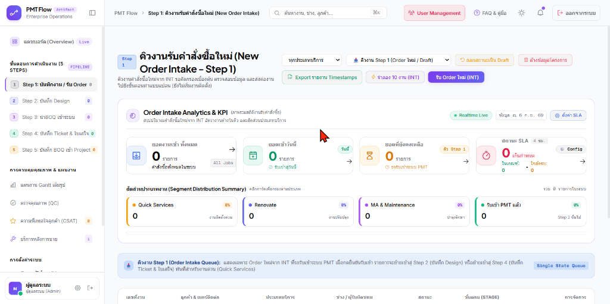
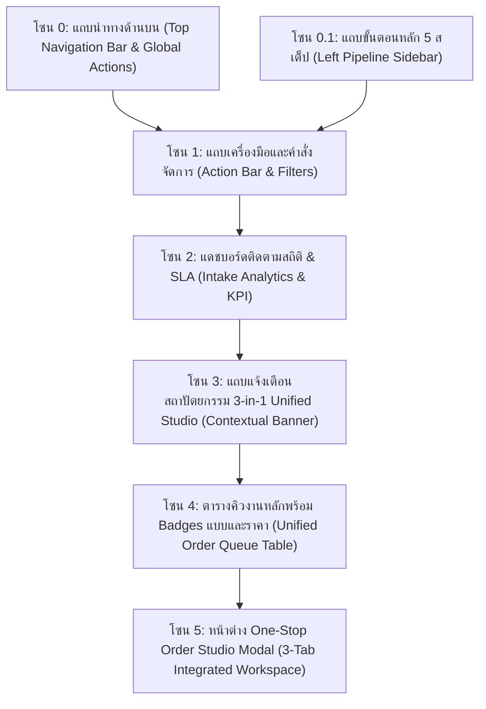
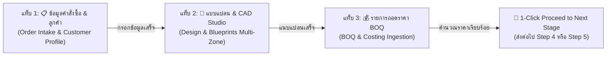

# 🎓 คู่มือฝึกอบรมการใช้งานหน้าจอระบบ PMT Flow
## โมดูลที่ 1: เจาะลึกหน้าจอ Step 1 — รับ Order, Design & BOQ (Unified One-Stop Order Studio)
**รหัสหลักสูตร:** `TRN-PMT-STEP01` | **ระบบ:** PMT Flow (Store Project Management Tool) | **เวอร์ชัน:** 3.0 (Unified Studio Architecture) | **ระดับ:** เจ้าหน้าที่รับงาน (Intake Officer) / PM & SA / หัวหน้างาน / วิทยากรผู้ฝึกอบรม (Trainer)

---

---

## 📌 บทสรุปและวัตถุประสงค์ (Course Overview & Objectives)

หน้าจอ **Step 1: รับ Order, Design & BOQ (Unified One-Stop Order Studio)** คือ **"ศูนย์กลางบริการครบวงจร (One-Stop Proposal Hub)"** ที่ออกแบบจากมุมมองของ **Project Manager (PM)** และ **Solutions Architect (SA)** เพื่อรวมกระบวนการ **รับคำสั่งซื้อ (Intake)**, **แนบแบบแปลน CAD/PDF (Design Studio)** และ **ถอดรายการราคาวัสดุ/ค่าแรง (BOQ & Costing)** ไว้ในจุดเดียวอย่างราบรื่น

ช่วยลดขั้นตอนการเปลี่ยนหน้าจอไปมาระหว่างแผนก ทำให้งานบริการด่วน (Quick Services) สามารถจบแบบแปลนและราคาเพื่อส่งต่อไปเปิด Ticket ใน **Step 4** ได้ทันทีใน 1 คลิก หรือสำหรับงานโครงการปรับปรุง (Renovate / MA) สามารถส่งต่อไปยัง **Step 5 (แปลงเข้า Gantt Timeline)** ได้อย่างรวดเร็ว

### 🎯 วัตถุประสงค์การเรียนรู้สำหรับผู้เข้าอบรม (Learning Objectives):
1. **เข้าใจสถาปัตยกรรม Unified Order Studio:** เข้าใจการทำงานร่วมกันของ 3 แท็บในหน้าต่างเดียว (Tab 1: ข้อมูลคำสั่งซื้อ, Tab 2: แบบแปลน CAD/PDF, Tab 3: รายการถอดราคา BOQ)
2. **อ่านสถานะความพร้อมของแบบและราคาในตาราง Step 1:** ใช้งานคอลัมน์ **"แบบแปลน (Design)"** และ **"ถอดราคา (BOQ)"** พร้อมคลิกป้าย Badge เพื่อเปิด Studio ตรงแท็บที่ต้องการทันที
3. **การนำเข้าและจัดการแบบแปลน CAD/PDF:** รองรับการเลือกโซนงาน (เช่น ห้องครัว, ห้องน้ำ, ห้องนั่งเล่น) และการอัปโหลดไฟล์แปลนติดตั้ง
4. **การถอดราคาและคำนวณ BOQ แบบ Live:** จัดการเพิ่ม/ลบรายการวัสดุ-ค่าแรง และคำนวณยอดรวม Subtotal, ส่วนลด, VAT 7% และ Grand Total อัตโนมัติ
5. **การส่งต่องาน 1-Click Proceed:** สามารถตรวจสอบสถานะความพร้อม (Checklist Validation) และคลิกปุ่มส่งต่องานไปยัง Step 4 (Quick Services) หรือ Step 5 (Renovate Projects) ได้อย่างแม่นยำ 100%

---

## 🧭 กายวิภาคของหน้าจอ Step 1 (Screen Anatomy Breakdown)

โครงสร้างหน้าจอ Step 1 แบ่งออกเป็น **6 โซนสำคัญ** ดังนี้:

---

### 🔹 โซน 0: แถบนำทางด้านบน (Top Navigation Bar & Global Actions)

| องค์ประกอบ | สัญลักษณ์ / สี | หน้าที่การทำงาน | คำแนะนำจาก Trainer |
| :--- | :--- | :--- | :--- |
| **โลโก้ & ชื่อระบบ** | `PMT Flow` | แสดงแบรนด์ระบบและสถานะระบบ Enterprise Operations | คลิกเพื่อกลับสู่หน้าหลัก |
| **Breadcrumb** | `PMT Flow > Step 1: รับ Order, Design & BOQ` | ระบุตำแหน่งหน้าจอที่กำลังใช้งานอยู่แบบ Real-time | ช่วยให้ทราบว่าขณะนี้อยู่ ณ จุดใดของกระบวนการ |
| **ค้นหางานด่วน** | `🔍 ค้นหางาน, ช่าง, ลูกค้า... [⌘K]` | ค้นหาเลขที่งาน (Job ID), ชื่อลูกค้า, เบอร์โทรศัพท์ หรือชื่อช่างผู้รับผิดชอบได้ทันทีทั่วทั้งระบบ | กดคีย์ลัด `Ctrl + K` (หรือ `⌘K`) เพื่อเปิดค้นหาได้รวดเร็ว |
| **User Management** | ปุ่ม `[ 👥 User Management ]` | ทางลัดเข้าสู่ระบบ **จัดการผู้ใช้งาน (User Management)** สำหรับ Admin เพื่อกำหนดสิทธิ์ บทบาท และบัญชีผู้ใช้ | ใช้เมื่อต้องการจัดการช่างหรือพนักงานรับ Order |
| **FAQ & คู่มือ** | ปุ่ม `[ ❓ FAQ & คู่มือ ]` | เปิดหน้าคู่มือขั้นตอนการปฏิบัติงานทั้งระบบ (Workflow Guide & Documentation) | ให้ผู้เรียนกดปุ่มนี้เพื่อเปิดทบทวนขั้นตอนกระบวนการทั้งหมดได้ตลอดเวลา |
| **การแจ้งเตือน** | ไอคอนกระดิ่ง `🔔` พร้อมจุดแจ้งเตือน | แจ้งเตือนคิวงานด่วน งานใกล้ครบกำหนด SLA หรือการแจ้งเตือนสำคัญจากระบบ | ตรวจสอบเมื่อมีจุดสีส้ม/ม่วงปรากฏ |
| **ออกจากระบบ** | ปุ่ม `[ 🚪 ออกจากระบบ ]` | ล้าง Session และออกจากระบบอย่างปลอดภัย (Hard Reload กลับสู่หน้าล็อกอิน) | แนะนำให้กดทุกครั้งหลังเสร็จสิ้นการปฏิบัติงาน |

---

### 🔹 โซน 0.1: แถบขั้นตอนการดำเนินงานหลัก (Left Pipeline Sidebar)

ทางฝั่งซ้ายมือของหน้าจอแสดงกระบวนการทำงานหลัก พร้อมตัวเลขระบุจำนวนงานที่อยู่ในแต่ละขั้นตอน:

1. 🟣 **Step 1: รับ Order, Design & BOQ (หน้าปัจจุบัน - One-Stop Studio):** คิวงานที่รอการคัดกรองเบื้องต้น, ออกแบบแปลน และถอดราคา
2. ⚪ **Step 2: คลังแบบแปลน (Design):** ศูนย์รวมและคลังแบบแปลนติดตั้ง (CAD & PDF) สำหรับเปิดดูย้อนหลังหรือบริหารจัดการแบบแปลนแยกตามโครงการ
3. ⚪ **Step 3: คลังรายการ BOQ:** ศูนย์รวมรายการ BOQ และใบเสนอราคา สำหรับนำเข้า ตรวจสอบต้นทุน และส่งออกรายงาน
4. ⚪ **Step 4: บันทึก Ticket & ใบเสร็จ:** เปิดใบสั่งงาน (Work Ticket) และแนบสลิป/ใบเสร็จรับเงิน
5. ⚪ **Step 5: บันทึก BOQ เข้า Project:** แปลงรายการค่าแรง/บริการเข้าสู่แผนงาน Gantt Timeline

---

### 🔹 โซน 1: แถบเครื่องมือและคำสั่งจัดการ (Action Bar & Filters)

แถบเครื่องมือด้านบนขวาของพื้นที่ทำงาน เป็นศูนย์รวมปุ่มสั่งการและตัวกรองข้อมูล:

| ปุ่ม / ตัวควบคุม | สีและลักษณะ | ความหมายและหน้าที่การทำงาน | คำแนะนำการใช้งานสำหรับห้องอบรม |
| :--- | :--- | :--- | :--- |
| **ตัวกรองบริการ** | Dropdown `ทุกประเภทบริการ` | กรองแสดงงานเฉพาะกลุ่ม เช่น งานติดตั้งแอร์, งานติดตั้งเครื่องทำน้ำอุ่น, งาน Renovate | ใช้เมื่อต้องการมอบหมายงานให้ช่างเฉพาะทาง |
| **ตัวกรองสถานะ** | Dropdown `📥 คิวงาน Step 1 (Order ใหม่ / Draft)` | กำหนดขอบเขตการแสดงผล ค่าเริ่มต้นคือแสดงเฉพาะคิว Step 1 หากเปลี่ยนเป็น `🗂️ ทั้งหมดทุกขั้นตอน` จะเห็นงานทั้งระบบ | ในการทำงานประจำวันให้เปิดไว้ที่ "คิวงาน Step 1" เสมอ |
| **ถอยสถานะเป็น Draft** | ปุ่มขอบส้ม `🔄 ถอยสถานะเป็น Draft` | รีเซ็ตสถานะงานทั้งหมดในระบบให้กลับมาเป็นสถานะเริ่มต้น (Draft 0%) | ใช้วนรอบการฝึกอบรม เพื่อให้ผู้เรียนเริ่มทำซ้ำได้ใหม่ |
| **ล้างข้อมูลโครงการ** | ปุ่มขอบแดง `🗑️ ล้างข้อมูลโครงการ` | ล้างข้อมูลงานทั้งหมดออกจากระบบ (Database Reset) มี Modal ยืนยันความปลอดภัย | ใช้ก่อนเริ่มคลาสเรียน เพื่อเคลียร์ระบบให้สะอาด |
| **Export รายงาน Timestamps** | ปุ่มขอบเขียว `📊 Export รายงาน Timestamps` | ส่งออกไฟล์ `.CSV` บันทึกประวัติเวลา (Timestamps) ครบทุกขั้นตอนของทุกงาน | ใช้ดึงข้อมูลไปวิเคราะห์ SLA ในโปรแกรม Excel |
| **จำลอง 10 งาน (INT)** | ปุ่มขอบม่วง `⚡ จำลอง 10 งาน (INT)` | จำลองการยิงข้อมูล Order ตัวอย่าง 10 รายการจากระบบ INT | ให้ผู้เรียนกดปุ่มนี้ 1 ครั้งเพื่อเริ่มแบบฝึกหัด |
| **รับ Order ใหม่ (INT)** | ปุ่มสีม่วงทึบ `➕ รับ Order ใหม่ (INT)` | เปิดหน้าต่าง One-Stop Order Studio เพื่อบันทึกคำสั่งซื้อใหม่, แนบแบบ และลง BOQ | ใช้บันทึกคำสั่งซื้อทั้งแบบ Manual และจากระบบภายนอก |

---

### 🔹 โซน 2: แดชบอร์ดติดตามสถิติและ SLA (Order Intake Analytics & KPI)

สรุปตัวเลขสถิติแบบ Realtime Live เพื่อให้หัวหน้างานและเจ้าหน้าที่ติดตามสถานะได้ทันที:

1. **Card 1 — ยอดงานเข้า ทั้งหมด (`10 รายการ`):** ปริมาณคำสั่งซื้อสะสมทั้งหมดในระบบ ช่วยประเมินขนาดงานรวม
2. **Card 2 — ยอดเข้าวันนี้ (`10 รายการ`):** จำนวน Order ที่เชื่อมโยงเข้ามาในรอบวันปัจจุบัน
3. **Card 3 — ยอดที่ยังคงเหลือ (`10 รายการ`):** งานที่ยังค้างอยู่ใน Step 1 และยังไม่ได้ส่งต่อเข้าสู่กระบวนการ **เป้าหมายประจำวันคือต้องเคลียร์ตัวเลขนี้ให้เหลือ `0`**
4. **Card 4 — สถานะ SLA 4 ชม. (`0 เกินกำหนด / ในเกณฑ์ 10 / ใกล้ครบ 0`):** แสดงงานที่รอดำเนินการเทียบกับเกณฑ์เวลามาตรฐาน 4 ชั่วโมง

---

### 🔹 โซน 3: แถบแจ้งเตือนสถาปัตยกรรม 3-in-1 Unified Studio (Contextual Banner)

แถบแบนเนอร์สีคราม/ม่วงด้านบนตารางระบุหลักการทำงาน:
> **"💡 3-in-1 Unified Order Studio (Step 1 + Step 2 Design + Step 3 BOQ):** รวมกระบวนการรับ Order, แนบแบบแปลน (Design) และถอดราคา (BOQ) ไว้ในหน้าต่างเดียวแบบ One-Stop Shop สามารถกดปุ่ม **[Studio: จัดการ Order/แบบ/BOQ]** หรือคลิกที่ป้ายแบบแปลน/ราคา เพื่อเปิดหน้าต่าง Studio และส่งต่องานได้ทันที"

---

### 🔹 โซน 4: ตารางคิวงานหลักพร้อม Badges แบบและราคา (Unified Order Queue Table)

ตารางแสดงรายการงานใน Step 1 ประกอบด้วยคอลัมน์สำคัญ:

1. **เลขที่งาน (Job ID):** รหัสอ้างอิงของงาน เช่น `JOB26090900001`, `JOB26090900002`
2. **ลูกค้า & เบอร์ติดต่อ:** ชื่อ-นามสกุลลูกค้า และหมายเลขโทรศัพท์สำหรับติดต่อหน้างาน
3. **ประเภทบริการ:** Badge ระบุประเภท (`QUICK` สีเหลือง / `RENOVATE` สีฟ้า) พร้อมชื่อรายการสินค้า/บริการ
4. **แบบแปลน (Design):** Badge แสดงจำนวนแบบแปลนที่แนบไว้ เช่น `2 แบบ (CAD/PDF)` สีฟ้า หรือ `+ แนบแบบ` สีเทา **(คลิกเพื่อเปิด Studio แท็บที่ 2 ได้ทันที)**
5. **ถอดราคา (BOQ):** Badge แสดงยอดเงินรวมของ BOQ เช่น `฿145,000` สีเขียว หรือ `+ ลง BOQ` สีเทา **(คลิกเพื่อเปิด Studio แท็บที่ 3 ได้ทันที)**
6. **ช่าง / ผู้รับผิดชอบ:** ทีมช่างที่ถูกกำหนดไว้เบื้องต้น เช่น `Team A (สมศักดิ์)`, `Team B (ประเสริฐ)`
7. **ขั้นตอน & เวลา (STAGE):** แถบเปอร์เซ็นต์ `Step 1 (0%)`, สถานะ `รอรับเข้า PMT` และเวลานับถอยหลัง SLA
8. **การจัดการ (Smart Studio & Quick Actions):**
   - **ปุ่มหลัก `[ Studio: จัดการ Order/แบบ/BOQ ]` (สีม่วง):** เปิดหน้าต่าง One-Stop Studio แบบเต็มรูปแบบ
   - **ปุ่ม Fast-track `[ รับเข้า (ไป Step 4) ]` (สีส้ม):** สำหรับงาน Quick Services ที่ต้องการส่งต่อเข้า Step 4 ทันที

---

### 🔹 โซน 5: หน้าต่าง One-Stop Order Studio (3-Tab Integrated Workspace)

เมื่อคลิกปุ่มเปิด Studio หรือคลิกที่ Badge ในตาราง หน้าต่าง Modal ขนาดใหญ่ (`modal-unified-order-studio`) จะเปิดขึ้นมา โดยแบ่งเป็น 3 แท็บการทำงาน:

#### 1. แท็บที่ 1: ข้อมูลคำสั่งซื้อ & ลูกค้า (Order Intake)
- บันทึกรหัสงาน, วันที่ตามมาตรฐาน **`DD/MM/YYYY`** (เช่น `08/09/2026`)
- เลือกประเภทงาน (`Quick Services`, `Renovate`, `MA & Maintenance`)
- บันทึกข้อมูลลูกค้า, เบอร์โทรศัพท์, ที่อยู่หน้างาน, พิกัด GPS
- มอบหมายทีมช่างผู้รับผิดชอบ และกำหนดช่วงเวลาตามรูปแบบ 24 ชั่วโมง (`08:30 - 12:00`, `13:00 - 17:00`)

#### 2. แท็บที่ 2: แบบแปลน & CAD Studio (Design & Blueprints)
- เลือกโซนงาน (Zone/Room): เช่น `ห้องครัว`, `ห้องน้ำ`, `ห้องนั่งเล่น`, `ภายนอกอาคาร`
- อัปโหลดไฟล์แบบแปลน (รองรับ `.dwg`, `.dxf`, `.pdf`, `.png`, `.jpg`) หรือกดปุ่มจำลองแบบแปลนตัวอย่าง
- แสดงรายการแบบแปลนที่แนบในโครงการ พร้อมปุ่มเปิดดู Lightbox Preview และปุ่มลบแบบ

#### 3. แท็บที่ 3: รายการถอดราคา BOQ (BOQ & Costing)
- ตารางบันทึกรายการวัสดุและค่าแรง: รหัสสินค้า, รายการ, หมวดหมู่ (`วัสดุ / อุปกรณ์` หรือ `ค่าแรง / บริการ`), จำนวน, หน่วย, ราคาต่อหน่วย, ยอดรวม
- ปุ่ม `+ เพิ่มรายการใหม่`, `📥 นำเข้าตัวอย่าง BOQ`, `ลบรายการ`
- สรุปยอดเงินอัตโนมัติ: ยอดรวมก่อนภาษี (Subtotal), ส่วนลด (Discount), ภาษีมูลค่าเพิ่ม (VAT 7%) และยอดสุทธิ (Grand Total)

#### 4. แถบสรุปสถานะและความพร้อม (Live Status Bar & 1-Click Proceed)
- ด้านล่างของ Studio มี Status Indicator แบบ Realtime:
  - `📋 ข้อมูลคำสั่งซื้อ: พร้อม ✓`
  - `📐 แบบแปลน: 2 รายการ ✓`
  - `💰 รายการ BOQ: ฿145,000 ✓`
- ปุ่มดำเนินการ:
  - **`💾 บันทึกข้อมูลร่าง (Draft)`:** บันทึกข้อมูลทั้งหมดลงในระบบ
  - **`🚀 ยืนยันข้อมูล & ส่งต่อไปขั้นตอนถัดไป (1-Click Proceed)`:**
    - หากเป็น **Quick Services** ➔ ส่งต่อไปยัง **Step 4 (บันทึก Ticket & ใบเสร็จ)** ทันที
    - หากเป็น **Renovate / MA** ➔ ส่งต่อไปยัง **Step 5 (แปลง BOQ เข้า Gantt Timeline)** ทันที

---

## 🛠️ ขั้นตอนการปฏิบัติงานมาตรฐาน (Trainer Script & SOP)

### 🎙️ บทบรรยายสำหรับวิทยากร (Trainer Script):
> *"สวัสดีครับผู้เข้าอบรมทุกท่าน วันนี้เราขอแนะนำสถาปัตยกรรมใหม่ของระบบ PMT Flow นั่นคือ **Step 1: One-Stop Order Studio**"*
>
> *"จากเดิมที่ท่านต้องเปิดรับงานใน Step 1 แล้วสลับไป Step 2 เพื่อแนบแบบแปลน จากนั้นสลับไป Step 3 เพื่อคีย์ BOQ ตอนนี้ท่านสามารถทำทุกอย่างให้เสร็จสิ้นได้ในหน้าต่างเดียว!"*
>
> *"เมื่อท่านเห็น Order ใหม่เข้ามาในตาราง Step 1 ท่านสามารถดูได้ทันทีว่างานนี้มีแบบแปลนหรือยังจากคอลัมน์ 'แบบแปลน (Design)' และมีราคาหรือยังจากคอลัมน์ 'ถอดราคา (BOQ)' หากต้องการจัดการ ให้คลิกปุ่ม **[Studio: จัดการ Order/แบบ/BOQ]** หน้าต่าง 3 แท็บจะเปิดขึ้นมาให้ท่านบันทึกข้อมูล แนบแปลน และลงราคาจนเสร็จสิ้น จากนั้นกดปุ่ม **[ยืนยันข้อมูล & ส่งต่อไปขั้นตอนถัดไป]** เพียงคลิกเดียว งานจะถูกส่งต่อไปเปิด Ticket หรือแปลงเข้า Gantt Chart ทันทีครับ"*

---

## 🧪 แบบฝึกหัดภาคปฏิบัติในห้องเรียน (Hands-on Class Exercises)

### 🏋️ แบบฝึกหัดที่ 1: การเปิด Studio และแนบแบบแปลน / BOQ
1. คลิกปุ่ม **"⚡ จำลอง 10 งาน (INT)"** เพื่อสร้างข้อมูลทดสอบ
2. ในตาราง Step 1 ค้นหารายการ `JOB26090900002` (Renovate ห้องครัว)
3. คลิกที่ปุ่ม **`[ Studio: จัดการ Order/แบบ/BOQ ]`**
4. สลับไปที่ **แท็บ 2 (แบบแปลน & CAD)** ➔ คลิกปุ่ม **"+ แนบแบบแปลนตัวอย่าง"** สังเกตว่ามีแบบแปลนปรากฏในตาราง 1 รายการ
5. สลับไปที่ **แท็บ 3 (รายการถอดราคา BOQ)** ➔ คลิกปุ่ม **"📥 นำเข้าตัวอย่าง BOQ"** สังเกตว่ามียอดเงินคำนวณรวมอัตโนมัติ
6. คลิกปุ่ม **"💾 บันทึกข้อมูล (Save Studio)"**
7. ตรวจสอบในตาราง Step 1 ภายนอก: ป้ายแบบแปลนจะเปลี่ยนเป็น `1 แบบ (CAD/PDF)` และป้ายราคาจะเปลี่ยนเป็นตัวเลขยอดเงินจริงทันที

### 🏋️ แบบฝึกหัดที่ 2: การใช้งาน 1-Click Proceed ส่งต่องานไปยังขั้นตอนถัดไป
1. เปิด Studio ของงานที่บันทึกข้อมูลครบถ้วนแล้ว
2. ตรวจสอบแถบสถานะด้านล่างว่ามีเครื่องหมายถูกสีเขียวครบทั้ง 3 รายการ
3. คลิกปุ่ม **"🚀 ยืนยันข้อมูล & ส่งต่อไปขั้นตอนถัดไป"**
4. ยืนยันการส่งต่อ: งานจะถูกย้ายไปยัง Step 4 หรือ Step 5 ตามประเภทของงานทันที

---

## ❓ คำถามที่พบบ่อย (FAQ & Best Practices)

### Q1: หากต้องการแนบแบบแปลนเพิ่มเติมในภายหลังหลังจากส่งต่องานไปแล้ว ทำได้หรือไม่?
> **คำตอบ:** ทำได้ตลอดเวลา โดยสามารถเข้าไปที่เมนู **`Step 2: คลังแบบแปลน (Design)`** ซึ่งทำหน้าที่เป็นคลังจัดเก็บและบริหารแบบแปลนกลางของทุกโครงการ

### Q2: เมนู Step 2 และ Step 3 ที่แถบซ้ายมือยังคงใช้งานได้อยู่หรือไม่?
> **คำตอบ:** ใช้งานได้ตามปกติ โดย **Step 2 (คลังแบบแปลน Design)** และ **Step 3 (คลังรายการ BOQ)** จะทำหน้าที่เป็นศูนย์รวบรวมข้อมูลกลาง (Central Repositories) สำหรับการค้นหา ดูย้อนหลัง นำเข้าไฟล์ Excel จำนวนมาก หรือพิมพ์รายงานสรุปภาพรวม

---

> [!TIP]
> **ข้อแนะนำพิเศษ:** ทุกหน้าจอของระบบ PMT Flow ทำงานในรูปแบบ **Light Theme 100%** มีการแสดงผลวันที่แบบ **`DD/MM/YYYY`** และระบบเวลาแบบ **24 ชั่วโมง (`00:00 - 23:59 น.`)** เพื่อความชัดเจน แม่นยำ และเป็นมาตรฐานเดียวกันทั่วทั้งองค์กร
