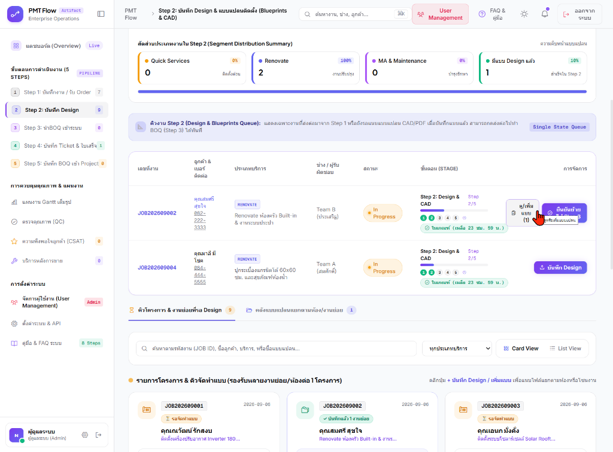
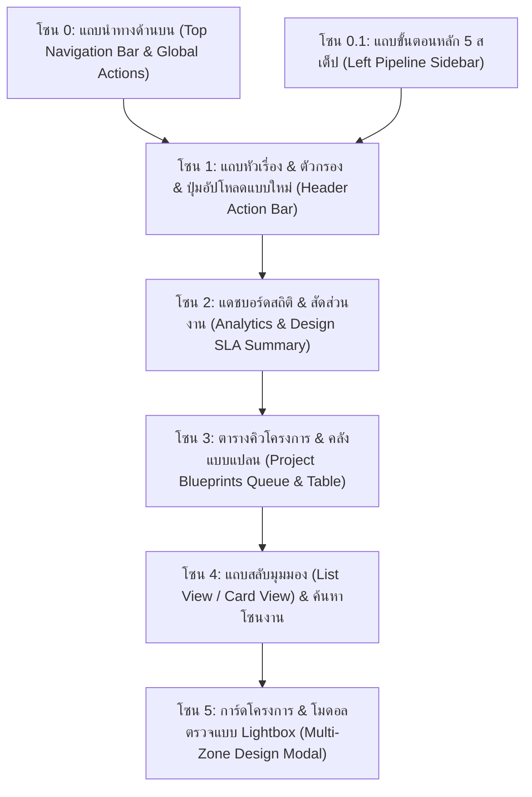
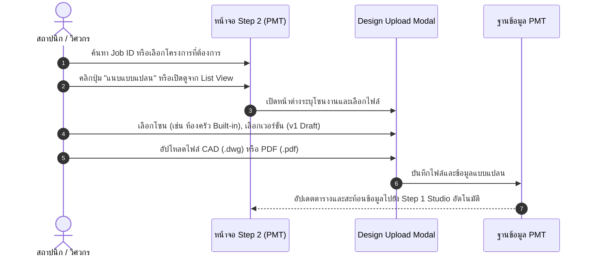

# 🎓 คู่มือฝึกอบรมการใช้งานหน้าจอระบบ PMT Flow
## โมดูลที่ 2: เจาะลึกหน้าจอ Step 2 — คลังแบบแปลนติดตั้ง & Design Studio (Blueprints & CAD Repository Guide)
**รหัสหลักสูตร:** `TRN-PMT-STEP02` | **ระบบ:** PMT Flow (Store Project Management Tool) | **เวอร์ชัน:** 3.0 (Unified Pipeline Architecture) | **กลุ่มเป้าหมาย:** สถาปนิก, มัณฑนากร, วิศวกรโครงการ, เจ้าหน้าที่ถอดแบบ & BOQ, PM & SA, หัวหน้างาน และวิทยากรผู้ฝึกอบรม (Trainer)

---

---

## 📌 บทสรุปและวัตถุประสงค์หลักสูตร (Course Overview & Objectives)

หน้าจอ **Step 2: คลังแบบแปลน (Design & Blueprints Repository)** คือ **"ศูนย์กลางด้านเทคนิคและคลังแบบแปลนวิศวกรรม (Design & Engineering Hub)"** ของระบบ PMT Flow ทำหน้าที่ 2 รูปแบบหลักที่เชื่อมโยงกันอย่างไร้รอยต่อ:

1. **โหมด One-Stop Integrated Studio (ใน Step 1):** ฝ่ายขาย/PM/SA สามารถแนบและตรวจสอบแบบแปลนได้ทันทีตั้งแต่ขั้นตอนเปิด Order ใน **Tab 2 (แบบแปลน & CAD Studio)**
2. **โหมด Dedicated Design Workspace (หน้าจอ Step 2):** ทำหน้าที่เป็นศูนย์กลางคลังแบบแปลนของทุกโครงการ (Multi-Zone Blueprints Repository) สำหรับสถาปนิกและวิศวกรในการจัดการไฟล์แบบแปลน AutoCAD (`.dwg`, `.dxf`), แบบแปลนโครงสร้าง (`.pdf`), ภาพ 3D Perspective, การจัดการเวอร์ชันแบบแปลน (`v1 Draft`, `v2 Approved`, `v3 Final`) และการเปิดดูแบบละเอียดผ่าน Lightbox High-Resolution Viewer

### 🎯 วัตถุประสงค์การเรียนรู้สำหรับผู้เข้าอบรม (Learning Objectives):
1. **เข้าใจการทำงานแบบคู่ขนาน (Dual-Mode Design Workflow):** เข้าใจความเชื่อมโยงระหว่างการแนบแบบใน Step 1 Unified Studio และการบริหารจัดการคลังแบบแปลนรวมในหน้าจอ Step 2
2. **จัดการไฟล์แบบแปลนและระบบหลายโซนงาน (Multi-Zone / Multi-Room Management):** สามารถแยกและแนบแบบแปลนสำหรับโครงการ Renovate ที่มีหลายห้อง (เช่น ห้องครัว, ห้องน้ำ, ห้องนอน) ภายใต้รหัส Job เดียวกันได้อย่างถูกต้อง
3. **ใช้งานระบบ Versioning และ Lightbox ตรวจสอบแบบ:** รู้วิธีเลือก/ระบุเวอร์ชันแบบ และการใช้ฟังก์ชันขยายดูแบบความละเอียดสูง
4. **วิเคราะห์ตัวชี้วัดแดชบอร์ด Analytics, KPI & SLA:** อ่านค่าสถิติยอดงานเข้า, อัตรางานค้าง, สัดส่วนประเภทงาน (Quick Services / Renovate / MA) และติดตามเวลานับถอยหลัง SLA ได้อย่างมีประสิทธิภาพ
5. **ควบคุมการไหลของงาน (Workflow Routing):** สามารถตรวจสอบความพร้อมของแบบแปลน และประสานงานส่งต่อไปยังขั้นตอนถอดราคา BOQ และเปิดใบสั่งงานได้อย่างแม่นยำ

---

## 🧭 กายวิภาคของหน้าจอ Step 2 (Screen Anatomy Breakdown)

โครงสร้างหน้าจอ Step 2 แบ่งออกเป็น **6 โซนสำคัญ** ดังนี้:

---

### 🔹 โซน 0: แถบนำทางด้านบน (Top Navigation Bar & Global Actions)

| องค์ประกอบ | สัญลักษณ์ / สี | หน้าที่การทำงาน | คำแนะนำจาก Trainer |
| :--- | :--- | :--- | :--- |
| **โลโก้ & ชื่อระบบ** | `PMT Flow` | แสดงตราสินค้าและระดับ Enterprise Operations | คลิกเพื่อกลับสู่แดชบอร์ดหน้าหลัก |
| **Breadcrumb** | `PMT Flow > Step 2: คลังแบบแปลน (Design)` | ระบุตำแหน่งกระบวนการปัจจุบัน | ใช้สังเกตว่ากำลังทำงานอยู่ในขั้นตอนที่ 2 |
| **ค้นหางานด่วน** | `🔍 ค้นหางาน, ช่าง, ลูกค้า... [⌘K]` | ค้นหาเลข Job, ชื่อลูกค้า, เบอร์โทร หรือช่างได้ทั่วระบบ | แนะนำให้ใช้คีย์ลัด `Ctrl + K` เพื่อความรวดเร็ว |
| **User Management** | ปุ่ม `[ 👥 User Management ]` | จัดการผู้ใช้งาน กำหนดสิทธิ์ทีมออกแบบ/ช่าง | ใช้ตรวจสอบสิทธิ์ของทีมสถาปนิกและช่าง |
| **FAQ & คู่มือ** | ปุ่ม `[ ❓ FAQ & คู่มือ ]` | เปิดเอกสารระเบียบปฏิบัติและคู่มือระบบ | แนะนำให้ผู้เรียนเปิดทบทวนได้ตลอดเวลา |
| **ออกจากระบบ** | ปุ่ม `[ 🚪 ออกจากระบบ ]` | ปิด Session การใช้งานและ Hard Reload กลับหน้าแรกอย่างปลอดภัย | ให้กดทุกครั้งหลังเสร็จสิ้นการทำงาน |

---

### 🔹 โซน 0.1: แถบกระบวนการทำงานหลัก (Left Pipeline Sidebar)

แถบเมนูด้านซ้ายมือแสดงขั้นตอนการดำเนินงานทั้ง 5 ขั้นตอน พร้อม Badge แสดงจำนวนงานในแต่ละขั้นตอน:

1. ⚪ **Step 1: รับ Order, Design & BOQ:** ศูนย์กลางรับคำสั่งซื้อและ One-Stop Studio
2. 🟣 **Step 2: คลังแบบแปลน (Design - ไฮไลท์สีม่วง):** **หน้าจอปัจจุบัน** คลังแบบแปลนและแบบติดตั้งวิศวกรรม
3. ⚪ **Step 3: คลังรายการ BOQ:** ศูนย์รวมรายการ BOQ และใบเสนอราคา
4. ⚪ **Step 4: บันทึก Ticket & ใบเสร็จ:** เปิดใบสั่งงานและแนบสลิปชำระเงิน
5. ⚪ **Step 5: บันทึก BOQ เข้า Project:** แปลงรายการค่าแรงเข้าสู่แผนงาน Gantt Timeline

---

### 🔹 โซน 1: แถบหัวเรื่องและตัวกรอง (Header Action Bar)

- **ตัวกรองประเภทบริการ:** ดรอปดาวน์เลือกดูเฉพาะกลุ่มงาน เช่น `ติดตั้งเครื่องทำน้ำอุ่น`, `ปั๊มแท็งก์`, `Renovate ครัว`, `สำรวจหน้างาน`
- **ตัวกรองสถานะโครงการ:** คัดกรองระหว่างงานที่กำลังรอแบบแปลน (`Pending Design`) และงานที่มีแบบแปลนครบถ้วนแล้ว (`Design Approved`)
- **ปุ่ม `+ แนบแบบแปลนใหม่`:** เปิดหน้าต่างอัปโหลดแบบแปลน พร้อมระบุโซนงานและเวอร์ชัน

---

### 🔹 โซน 2: แดชบอร์ดสถิติ & SLA (Design Analytics & SLA)

แดชบอร์ดแสดง 4 ตัวชี้วัดสำคัญของงานออกแบบ:
1. **โครงการทั้งหมดในคลังแบบ:** จำนวนงานที่มีการบันทึกแบบแปลนในระบบ
2. **งานที่รอตรวจแบบ:** งานที่เพิ่งอัปโหลดแบบร่าง (Draft) และรอสถาปนิก/หัวหน้างานกด Approve
3. **แบบแปลนรวมในระบบ:** จำนวนไฟล์แบบแปลน (CAD/PDF/Image) ทั้งหมดที่จัดเก็บ
4. **สถานะ SLA งานออกแบบ:** นับถอยหลังตามรอบมาตรฐาน (24 ชม. สำหรับงานจัดทำแบบแปลน)

---

### 🔹 โซน 3 & 4: ตารางและมุมมองคลังแบบแปลน (Repository Views)

- **Default View (List View 100%):** แสดงผลแบบตารางรายการตามมาตรฐาน เพื่อให้ตรวจสอบ Job ID, ชื่อโครงการ, จำนวนแบบแปลน, โซนงาน และสถานะการอนุมัติได้อย่างรวดเร็วในบรรทัดเดียว
- **สลับเป็น Card View (ตามความสมัครใจ):** แสดงเป็นการ์ดโครงการพร้อมภาพพรีวิว Thumbnail สำหรับตรวจดูรายละเอียดทางสายตา

---

## 🛠️ ขั้นตอนการปฏิบัติงานมาตรฐาน (Design SOP)

---

## ❓ คำถามที่พบบ่อย (FAQ & Best Practices)

### Q1: ข้อมูลแบบแปลนที่แนบใน Step 1 Studio กับใน Step 2 เป็นข้อมูลเดียวกันหรือไม่?
> **คำตอบ:** เป็นข้อมูลชุดเดียวกัน 100% (Single Source of Truth) หากเพิ่มแบบใน Step 1 Studio ข้อมูลจะปรากฏใน Step 2 ทันที และหากแก้ไขใน Step 2 ข้อมูลก็จะสะท้อนกลับไปที่ Step 1 โดยอัตโนมัติ

### Q2: รองรับไฟล์นามสกุลใดบ้าง?
> **คำตอบ:** รองรับไฟล์ AutoCAD (`.dwg`, `.dxf`), เอกสารแบบแปลน (`.pdf`) และรูปภาพ Perspective/ภาพถ่ายหน้างาน (`.png`, `.jpg`, `.jpeg`, `.webp`)

---

> [!TIP]
> **มาตรฐานระบบ PMT Flow:** หน้าจอทั้งหมดทำงานในระบบ **Light Theme 100%**, รูปแบบวันที่ **`DD/MM/YYYY`** และรูปแบบเวลา **24 ชั่วโมง (`00:00 - 23:59 น.`)**
