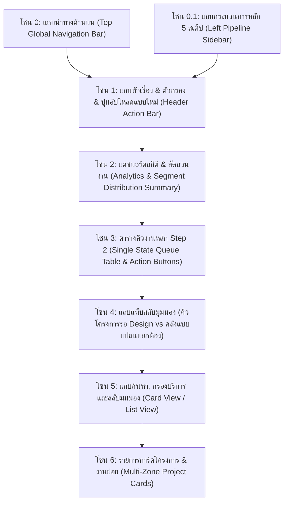
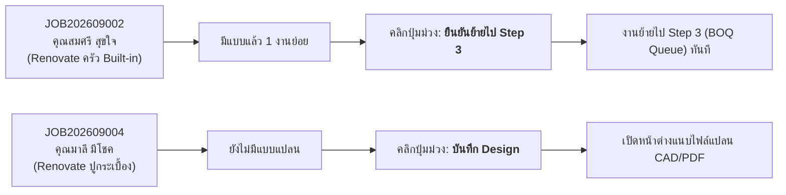

# 🎓 คู่มือฝึกอบรมการใช้งานหน้าจอระบบ PMT Flow
## โมดูลที่ 2: เจาะลึกหน้าจอ Step 2 — บันทึก Design & แบบแปลนติดตั้ง (Blueprints & CAD Training Screen Guide)
**รหัสหลักสูตร:** `TRN-PMT-STEP02` | **ระบบ:** PMT Flow (Store Project Management Tool) | **เวอร์ชัน:** 2.0 (Pipeline Architecture) | **กลุ่มเป้าหมาย:** สถาปนิก, มัณฑนากร, วิศวกรโครงการ, เจ้าหน้าที่ถอดแบบ & BOQ, หัวหน้างาน และวิทยากรผู้ฝึกอบรม (Trainer)

---


---

## 📌 บทสรุปและวัตถุประสงค์หลักสูตร (Course Overview & Objectives)

หน้าจอ **Step 2: บันทึก Design & แบบแปลนติดตั้ง (Blueprints & CAD)** คือ **"ศูนย์กลางด้านเทคนิคและงานดีไซน์ (Design & Engineering Center)"** ของระบบ PMT Flow มีหน้าที่รับช่วงต่องานที่ผ่านการเปิด Order และคัดกรองเบื้องต้นมาจาก **Step 1** เพื่อให้ทีมออกแบบ, สถาปนิก หรือวิศวกรทำการ **จัดทำ, ตรวจสอบ, อัปโหลด และจัดหมวดหมู่แบบแปลนทางเทคนิค** (AutoCAD `.dwg`, `.dxf`, แบบแปลนโครงสร้าง `.pdf`, หรือภาพ 3D Perspective) ให้ครบถ้วนตามมาตรฐาน ก่อนส่งต่องานไปยัง **Step 3 (นำ BOQ เข้าระบบ)** เพื่อถอดปริมาณวัสดุและคิดราคา

### 🎯 วัตถุประสงค์การเรียนรู้สำหรับผู้เข้าอบรม (Learning Objectives):
1. **เข้าใจหลักการทำงานของ Single State Queue ใน Step 2:** เรียนรู้ว่าเหตุใดหน้าจอนี้จึงกรองเฉพาะงานที่ *กำลังรอแบบ* หรือ *พร้อมส่งต่อ* เพื่อให้ทีมงานโฟกัสเฉพาะงานที่ต้องลงมือทำจริง
2. **จัดการไฟล์แบบแปลนและระบบหลายโซนงาน (Multi-Zone / Multi-Room Management):** สามารถแยกและแนบแบบแปลนสำหรับโครงการ Renovate ที่มีหลายห้อง (เช่น ห้องครัว, ห้องน้ำ, ห้องนอน) ภายใต้รหัส Job เดียวกันได้อย่างถูกต้อง
3. **ใช้งานระบบ Versioning และ Lightbox ตรวจสอบแบบ:** รู้วิธีเลือก/ระบุเวอร์ชันแบบ (`v1 Draft`, `v2 Approved`, `v3 Final`) และการใช้ฟังก์ชันขยายดูแบบความละเอียดสูง
4. **วิเคราะห์ตัวชี้วัดแดชบอร์ด Analytics, KPI & SLA:** อ่านค่าสถิติยอดงานเข้า, อัตรางานค้าง, สัดส่วนประเภทงาน (Quick Services / Renovate / MA) และติดตามเวลานับถอยหลัง SLA (24 ชม.) ได้อย่างมีประสิทธิภาพ
5. **ควบคุมการไหลของงาน (Workflow Routing):** สามารถตรวจสอบความพร้อมของแบบแปลน และกดส่งต่องานผ่านปุ่ม **`ยืนยันย้ายไป Step 3`** ได้อย่างถูกต้อง 100%

---

## 🧭 กายวิภาคของหน้าจอ Step 2 (Screen Anatomy Breakdown)

จากภาพหน้าจอระบบจริง โครงสร้างหน้าจอแบ่งออกเป็น **7 โซนสำคัญ** ดังนี้:



---

### 🔹 โซน 0: แถบนำทางด้านบน (Top Global Navigation Bar)

| องค์ประกอบ | สัญลักษณ์ / สี | หน้าที่การทำงาน | คำแนะนำจาก Trainer |
| :--- | :--- | :--- | :--- |
| **โลโก้ & ชื่อระบบ** | `PMT Flow [Artifact]` | แสดงตราสินค้าและระดับ Enterprise Operations | คลิกเพื่อกลับสู่แดชบอร์ดหน้าหลัก |
| **Breadcrumb** | `PMT Flow > Step 2: บันทึก Design...` | ระบุตำแหน่งกระบวนการปัจจุบัน | ใช้สังเกตว่ากำลังทำงานอยู่ในขั้นตอนที่ 2 |
| **ค้นหางานด่วน** | `🔍 ค้นหางาน, ช่าง, ลูกค้า... [⌘K]` | ค้นหาเลข Job, ชื่อลูกค้า, เบอร์โทร หรือช่างได้ทั่วระบบ | แนะนำให้ใช้คีย์ลัด `Ctrl + K` เพื่อความรวดเร็ว |
| **User Management** | ปุ่ม `[ 👥 User Management ]` | จัดการผู้ใช้งาน กำหนดสิทธิ์ทีมออกแบบ/ช่าง | ใช้ตรวจสอบสิทธิ์ของทีมสถาปนิกและช่าง |
| **FAQ & คู่มือ** | ปุ่ม `[ ❓ FAQ & คู่มือ ]` | เปิดเอกสารระเบียบปฏิบัติและคู่มือระบบ | แนะนำให้ผู้เรียนเปิดทบทวนได้ตลอดเวลา |
| **โหมดมืด/สว่าง** | ไอคอน `☀️` / `🌙` | สลับธีมแสดงผล Light / Dark Mode | ช่วยลดความล้าของสายตาเมื่อตรวจแบบแปลนนานๆ |
| **ออกจากระบบ** | ปุ่ม `[ 🚪 ออกจากระบบ ]` | ปิด Session การใช้งานอย่างปลอดภัย | ให้กดทุกครั้งหลังเสร็จสิ้นการทำงาน |

---

### 🔹 โซน 0.1: แถบกระบวนการทำงานหลัก (Left Pipeline Sidebar)

แถบเมนูด้านซ้ายมือแสดงขั้นตอนการดำเนินงานทั้ง 5 ขั้นตอน (5 STEPS PIPELINE) พร้อม Badge แสดงจำนวนงานในแต่ละขั้นตอน:

1. ⚪ **Step 1: บันทึกงาน / รับ Order (`7`):** งานที่เพิ่งเข้ามาใหม่และรอการเปิดรับ Order
2. 🟣 **Step 2: บันทึก Design (`9` - ไฮไลท์สีม่วง):** **หน้าจอปัจจุบัน** มีงานทั้งหมด 9 โครงการที่อยู่ในความดูแลของทีมออกแบบ
3. ⚪ **Step 3: นำ BOQ เข้าระบบ (`0`):** คิวงานที่รอถอดรายการวัสดุและค่าแรง
4. ⚪ **Step 4: บันทึก Ticket & ใบเสร็จ (`1`):** งานที่อยู่ระหว่างชำระเงินและออกใบเสร็จ
5. ⚪ **Step 5: บันทึก BOQ เข้า Project (`0`):** งานที่แปลง BOQ เป็น Task เข้าสู่ Gantt Chart

---

### 🔹 โซน 1: แถบหัวเรื่องและตัวกรอง (Header Action Bar)

อยู่ด้านบนขวาของพื้นที่เนื้อหาหลัก ประกอบด้วย:
- **ตัวกรองประเภทบริการ:** ดรอปดาวน์เลือกดูเฉพาะกลุ่มงาน เช่น `ติดตั้งเครื่องทำน้ำอุ่น`, `ปั้มแท็งก์`, `Renovate ครัว`, `สำรวจหน้างาน`
- **ตัวกรองสถานะคิว:** 
  - `📐 คิวงาน Step 2 (รอทำแบบ Design)` *(ค่าเริ่มต้น)*: แสดงเฉพาะงานที่ต้องจัดทำแบบในสเต็ปนี้
  - `🗂️ ทั้งหมดทุกขั้นตอน (All Work Orders)`: แสดงประวัติงานทุกสเต็ปสำหรับค้นหาย้อนหลัง
  - `รอแนบแบบแปลน (Pending Design)`: กรองเฉพาะงานที่ยังไม่มีไฟล์แบบใดๆ แนบเลย
  - `แนบแบบแปลนแล้ว (Designed)`: กรองเฉพาะงานที่มีแบบแล้วอย่างน้อย 1 ฉบับ
- **ปุ่ม `+ บันทึก / อัปโหลดแบบแปลนใหม่` (สีน้ำเงิน/ม่วง):** คลิกเพื่อเปิดหน้าต่าง Popup แบบฟอร์มอัปโหลดแบบแปลนใหม่แบบกำหนดเอง

---

### 🔹 โซน 2: สัดส่วนประเภทงานใน Step 2 (Segment Distribution Summary)

แถบแดชบอร์ดสรุปสถิติปริมาณงานตามกลุ่มบริการ เพื่อให้หัวหน้าทีมจัดสรรทรัพยากรผู้ออกแบบได้เหมาะสม:

| หมวดหมู่ | ตัวเลข & สัดส่วน | ความหมายเชิงการปฏิบัติงาน |
| :--- | :--- | :--- |
| **Quick Services** | `0` (0%) | งานติดตั้งด่วน เช่น ติดตั้งแอร์ตัวเดียว หรือติดตั้งปั๊มน้ำ (ส่วนใหญ่มีแบบมาตรฐานอยู่แล้ว มักถูก Fast-track ข้ามไป Step 4 หรือ Step 3 ได้ทันที) |
| **Renovate** | `2` (100%) | **งานปรับปรุง/ต่อเติม** เป็นหัวใจหลักของ Step 2 เช่น งานครัว Built-in, งานปูกระเบื้อง, งานระบบประปา ซึ่งต้องอาศัยแบบแปลนเฉพาะเจาะจง |
| **MA & Maintenance** | `0` (0%) | งานสัญญาบำรุงรักษาเชิงป้องกัน (Preventive Maintenance) |
| **มีแบบ Design แล้ว** | `1` (10%) | จำนวนโครงการในระบบที่มีการแนบแบบแปลนครบถ้วนแล้ว พร้อมส่งต่อไปยัง Step 3 |

---

### 🔹 โซน 3: ตารางคิวงานหลัก Step 2 (Design & Blueprints Queue)

ตารางนี้ใช้สถาปัตยกรรม **Single State Queue** เพื่อแสดงเฉพาะงานที่กำลังอยู่ในมือของทีมออกแบบในปัจจุบัน:



#### รายละเอียดแต่ละคอลัมน์ในตาราง:
1. **เลขที่งาน (Job ID):** รหัสอ้างอิงของงาน เช่น `JOB202609002` (คลิกเพื่อเปิดดูรายละเอียดงานเต็มรูปแบบ)
2. **ลูกค้า & เบอร์ติดต่อ:** ชื่อเจ้าของบ้านและเบอร์โทรศัพท์สำหรับติดต่อสอบถามสเปกหน้างาน
3. **ประเภทบริการ:** ป้าย Tag ระบุประเภท เช่น `RENOVATE` พร้อมชื่องานบริการอย่างละเอียด
4. **ช่าง / ผู้รับผิดชอบ:** ทีมช่างหน้างาน เช่น `Team B (ประเสริฐ)` หรือ `Team A (สมศักดิ์)`
5. **สถานะ:** แสดงสถานะวงจรงาน เช่น `In Progress` (กำลังดำเนินการ)
6. **ขั้นตอน (STAGE) & SLA:**
   - แสดงแถบความคืบหน้า 5 ขั้นตอน (ขั้นตอนที่ 2 ไฮไลท์สีเขียว)
   - แถบนับถอยหลัง SLA: `✓ ในเกณฑ์ (เหลือ 23 ชม. 59 น.)` เพื่อควบคุมเวลาการจัดทำแบบไม่ให้เกิน 24 ชั่วโมง
7. **การจัดการ (Action Buttons):**
   - **ปุ่ม `ดู/เพิ่มแบบ (1)`:** ดูรายการไฟล์แบบเดิมที่เคยแนบไว้แล้ว หรือกดเพิ่มห้องใหม่
   - **ปุ่ม `ยืนยันย้ายไป Step 3` (ปุ่มสีม่วงที่เมาส์ชี้):** ใช้เมื่อจัดทำแบบครบถ้วนแล้ว เมื่อคลิกจะย้ายงานนี้ไปยังคิวถอดราคา BOQ ทันที
   - **ปุ่ม `บันทึก Design`:** แสดงสำหรับงานที่ยังไม่มีแบบแปลน คลิกเพื่อเริ่มอัปโหลดแบบฉบับแรก

---

### 🔹 โซน 4, 5 & 6: คิวโครงการ & งานย่อย และคลังแบบแปลน (Multi-Zone Workspace)

ด้านล่างของตารางหลักคือพื้นที่สำหรับบริหารจัดการงานในระดับ **"โครงการและงานย่อย (Multi-Zone / Multi-Room)"**:

#### 1. แถบสลับแท็บ (Tab Switcher):
- **แท็บ 1: คิวโครงการ & งานย่อยที่รอ Design (`9`):** แสดงงานทั้งหมดในระบบเพื่อรองรับการเปิดแนบแบบเพิ่มทีละห้อง/ทีละโซน
- **แท็บ 2: คลังแบบแปลนแยกตามห้อง/งานย่อย (`1`):** จัดเก็บไฟล์ CAD/PDF ทั้งหมดในรูปแบบคลังไฟล์กลาง มีตัวอย่างรูปภาพ (Thumbnail), วันที่บันทึก, ชื่อสถาปนิก และปุ่มดาวน์โหลด

#### 2. แถบค้นหาและสลับมุมมอง (Search & View Mode):
- ค้นหาด้วยรหัสงาน, ชื่อลูกค้า หรือชื่อห้อง/โซน
- ปุ่มสลับ **`Card View`** (การ์ดกล่อง เหมาะสำหรับดูภาพรวม) และ **`List View`** (ตารางรายการ เหมาะสำหรับการจัดการข้อมูลจำนวนมาก)

#### 3. การ์ดโครงการด้านล่าง (Project Cards):
- **JOB202609001 (คุณณวัฒน์ รักสงบ):** งานติดตั้งแอร์ ➔ แสดงสถานะ `⏳ รอจัดทำแบบ`
- **JOB202609002 (คุณสมศรี สุขใจ):** งานครัว Built-in ➔ แสดงป้าย `✓ บันทึกแล้ว 1 งานย่อย` พร้อมปุ่มชอร์ตคัตสำหรับคลิกดูแบบแปลนห้องครัวได้ทันที
- **JOB202609003 (คุณเอนก มั่งคั่ง):** ติดตั้งโซลาร์เซลล์ ➔ แสดงสถานะ `⏳ รอจัดทำแบบ`

---

## 🛠️ ขั้นตอนการปฏิบัติงานมาตรฐาน (SOP: Standard Operating Procedures)

### 📋 ขั้นตอนที่ 1: ตรวจสอบคำสั่งซื้อและข้อมูลสำรวจหน้างาน
1. เข้าสู่เมนู **`Step 2: บันทึก Design`** จากแถบเมนูด้านซ้าย
2. ตรวจสอบตารางคิวงานด้านบน สังเกตงานที่มีสถานะ SLA เร่งด่วน
3. หากต้องการดูภาพถ่ายสำรวจหน้างานที่ช่างถ่ายส่งมา ให้คลิกที่ **เลขที่งาน (Job ID)** เพื่อเปิดดูภาพถ่าย 5 จุดมาตรฐาน (สภาพพื้นที่, แนวท่อ, จุดต่อไฟ ฯลฯ) ก่อนลงมือเขียนแบบ

### 📋 ขั้นตอนที่ 2: บันทึกและแนบแบบแปลนติดตั้ง (Upload Blueprint)
1. ในตารางคิวงาน หรือการ์ดโครงการ ให้คลิกปุ่ม **`บันทึก Design`** หรือ **`+ เพิ่มงานย่อย/ห้อง`**
2. หน้าต่างป๊อปอัป **"บันทึก / แนบแบบแปลนติดตั้ง (Upload Blueprint & CAD)"** จะเปิดขึ้นมา
3. กรอกและตรวจสอบข้อมูล:
   - **รหัสโครงการ (Job ID):** เลือกรหัสงานที่ต้องการ (ระบบจะเลือกให้อัตโนมัติหากกดมาจากแถวงานนั้น)
   - **โซนงาน / งานย่อย (Zone/Room):** ระบุห้อง เช่น `ห้องครัว Built-in`, `ห้องนอนใหญ่ (Master)`, `ห้องน้ำชั้น 2` (สามารถคลิกแท็กด่วนที่ระบบแนะนำได้)
   - **ไฟล์แบบแปลน:** ลากไฟล์ PDF หรือ AutoCAD (`.dwg`, `.dxf`, รูปภาพ) มาวางในช่อง Dropzone หรือคลิกเลือกปุ่มตัวอย่างด่วน (Quick Samples)
   - **เลขเวอร์ชัน (Version):** เช่น `v1 Draft`, `v2 Approved`, `v3 Final`
   - **ผู้ออกแบบ (Designer):** บันทึกชื่อสถาปนิกหรือวิศวกรผู้เขียนแบบ
   - **หมายเหตุทางเทคนิค (Notes):** ระบุจุดสำคัญ เช่น *"แนวท่อน้ำทิ้ง 2 นิ้ว สโลป 1:100"*
4. คลิกปุ่ม **`บันทึกแบบแปลน`** ระบบจะทำการบันทึกและแสดงแถบป้ายงานย่อยทันที

### 📋 ขั้นตอนที่ 3: การเพิ่มงานย่อยสำหรับโครงการขนาดใหญ่ (Multi-Zone Extension)
- สำหรับงาน Renovate ทั้งบ้านที่มีหลายห้อง ให้กดปุ่ม **`+ เพิ่มงานย่อย/ห้อง`** ซ้ำอีกครั้ง
- เปลี่ยนชื่อโซนเป็นห้องถัดไป (เช่น ห้องน้ำ) แล้วแนบไฟล์แปลนของห้องนั้น
- ระบบจะรวมแบบแปลนทุกห้องไว้ภายใต้ Job เดียวกัน ทำให้ทีมทำราคาใน Step 3 สามารถถอดแบบได้ครบถ้วนโดยไม่ตกหล่น

### 📋 ขั้นตอนที่ 4: การตรวจสอบความถูกต้องผ่าน Lightbox
- คลิกที่ชื่อโซนห้อง หรือรูป Thumbnail ของแบบแปลน
- ระบบจะเปิดหน้าต่าง **Lightbox Preview** ขยายภาพแบบขนาดใหญ่ พร้อมรายละเอียดเวอร์ชันและหมายเหตุทางเทคนิค เพื่อตรวจทานความถูกต้อง

### 📋 ขั้นตอนที่ 5: การส่งต่องานไปยัง Step 3 (Hand-off to BOQ)
1. เมื่อแนบแบบแปลนที่จำเป็นครบถ้วนแล้ว ให้คลิกปุ่มสีม่วง **`ยืนยันย้ายไป Step 3`** ที่แถวของงานนั้น
2. ระบบจะเปิดหน้าต่างสรุปยืนยัน **"ยืนยันส่งต่องานเข้าสู่ Step 3: นำ BOQ เข้าระบบ"** ซึ่งจะแสดงรายการแบบแปลนทั้งหมดที่แนบไว้
3. คลิกปุ่ม **`ยืนยันส่งต่อเพื่อสร้าง BOQ ➔`**
4. งานจะถูกย้ายออกจากคิว Step 2 และไปปรากฏในคิวรอถอดราคาของ **Step 3 (นำ BOQ เข้าระบบ)** โดยอัตโนมัติ

---

## 🪟 เจาะลึกหน้าต่างป๊อปอัป (Interactive Modals Deep-Dive)

### 1. หน้าต่างอัปโหลดแบบแปลน (Upload Blueprint Modal)
```
┌─────────────────────────────────────────────────────────────┐
│ 📐 บันทึก / แนบแบบแปลนติดตั้ง (Upload Blueprint & CAD)       │
├─────────────────────────────────────────────────────────────┤
│ โครงการ: [ JOB202609002 - คุณสมศรี สุขใจ (Renovate ครัว) ▼ ] │
│ โซน/งานย่อย: [ ห้องครัว Built-in                         ] │
│ แท็กด่วน: [ห้องรับแขก] [ห้องครัว] [ห้องนอนใหญ่] [ห้องน้ำ]   │
├─────────────────────────────────────────────────────────────┤
│ ┌─────────────────────────────────────────────────────────┐ │
│ │ 📁 ลากไฟล์ CAD (.dwg) หรือ PDF มาวางที่นี่               │ │
│ │ หรือ [เลือกไฟล์จากเครื่อง]                               │ │
│ └─────────────────────────────────────────────────────────┘ │
│ ตัวอย่างด่วน: [แบบแอร์ Master] [แบบครัว Built-in] [แบบโซลาร์] │
├─────────────────────────────────────────────────────────────┤
│ เวอร์ชัน: [ v2 Approved  ]  ผู้ออกแบบ: [ คุณธนกฤต (Designer)]│
│ หมายเหตุ: [ แบบแปลนสุขาภิบาล จุดต่อน้ำดี-น้ำทิ้ง          ] │
├─────────────────────────────────────────────────────────────┤
│                    [ ยกเลิก ]   [ บันทึกแบบแปลน (Save) ]    │
└─────────────────────────────────────────────────────────────┘
```

### 2. หน้าต่างยืนยันย้ายไป Step 3 (Confirm Proceed to BOQ Modal)
- **วัตถุประสงค์:** ป้องกันความผิดพลาดจากการส่งต่องานที่ยังเขียนแบบไม่เสร็จ
- **ส่วนประกอบ:**
  - รหัส Job ID และชื่อลูกค้า
  - จำนวนแบบแปลนทั้งหมดที่แนบไว้ในโครงการนี้
  - รายการแจกแจงแบบแปลนแต่ละห้อง พร้อมเวอร์ชันและชื่อไฟล์
  - หากยังไม่มีแบบแปลนแนบ ระบบจะแสดงกล่องแจ้งเตือนสีเหลืองว่า *"ยังไม่มีแบบแปลนที่แนบสำหรับงานนี้"* เพื่อเตือนสติทีมงาน

---

## 💡 คำแนะนำและเคล็ดลับสำหรับ Trainer (Pro Tips & Best Practices)

> [!TIP]
> **เทคนิคการสาธิตสำหรับห้องอบรม:**
> 1. แนะนำให้ Trainer เริ่มจากการสร้างข้อมูลตัวอย่างใน Step 1 โดยกดปุ่ม **`จำลอง 10 งาน (INT)`** แล้วกดรับงานเข้ามาที่ Step 2
> 2. ใน Step 2 ให้เลือก `JOB202609002` แสดงให้ผู้เรียนเห็นว่าโครงการนี้มีแบบแนบไว้แล้ว 1 โซน จากนั้นสาธิตการคลิกปุ่ม **`ยืนยันย้ายไป Step 3`**
> 3. จากนั้นเลือก `JOB202609004` ซึ่งยังไม่มีแบบ ให้กดปุ่ม **`บันทึก Design`** แล้วคลิกปุ่ม **`[แบบครัว Built-in]`** ในแถบตัวอย่างด่วน เพื่อสาธิตการแนบแบบอย่างรวดเร็วโดยไม่ต้องเสียเวลาหาไฟล์จริงในคอมพิวเตอร์

> [!IMPORTANT]
> **การบริหารจัดการ SLA (24 ชั่วโมง):**
> มาตรฐานการทำงาน (SLA) ของ Step 2 ถูกกำหนดไว้ที่ **24 ชั่วโมงหลังรับงาน** หากนาฬิกานับถอยหลังเปลี่ยนเป็นสีแดง (Overdue) ระบบจะแจ้งเตือนไปยังหัวหน้าทีมออกแบบทันที หากจำเป็นต้องปรับเวลา สามารถกดปุ่ม **`ตั้งค่า SLA`** เพื่อปรับเปลี่ยนเวลาตามประเภทโครงการได้

> [!NOTE]
> **การแก้ไขแบบหลังส่งไป Step 3 แล้ว:**
> แม้ว่าจะกดย้ายงานไป Step 3 แล้ว สถาปนิกยังคงสามารถเข้ามาใน Step 2 เพื่อกด **`+ เพิ่มงานย่อย/ห้อง`** หรืออัปเดตเวอร์ชันแบบแปลนใหม่ (เช่น ปรับเป็น `v3 Final`) ได้ตลอดเวลา ข้อมูลจะซิงค์ไปยังหน้า BOQ และหน้าช่างทันที

---

## ❓ คำถามที่พบบ่อย (FAQ)

**Q: ระบบรองรับไฟล์แบบแปลนประเภทใดบ้าง และขนาดไฟล์สูงสุดเท่าใด?**  
**A:** รองรับไฟล์เอกสาร PDF (`.pdf`), ไฟล์เขียนแบบ AutoCAD (`.dwg`, `.dxf`), ไฟล์ภาพ 3D Perspective/ภาพถ่าย (`.png`, `.jpg`, `.webp`) และไฟล์บีบอัด (`.zip`, `.rar`) โดยระบบมีระบบปรับลดขนาดภาพอัตโนมัติเพื่อป้องกันหน่วยความจำเต็ม

**Q: ปุ่ม "แนบไฟล์ด่วน" บนการ์ดโครงการ ต่างจากปุ่ม "+ บันทึก Design" อย่างไร?**  
**A:** ปุ่ม `+ บันทึก Design` จะเปิด Modal เต็มรูปแบบเพื่อให้ตั้งชื่อห้อง, ระบุเวอร์ชัน และใส่หมายเหตุ ส่วนปุ่ม `แนบไฟล์ด่วน` อนุญาตให้เลือกไฟล์จากเครื่องแล้วบันทึกทันทีโดยใช้ชื่อไฟล์และโซนมาตรฐาน เหมาะสำหรับงานเร่งด่วน

**Q: ช่างที่อยู่หน้างานจะสามารถเปิดดูแบบแปลนเหล่านี้ได้อย่างไร?**  
**A:** แบบแปลนทั้งหมดที่บันทึกใน Step 2 จะเชื่อมโยงเข้าสู่หน้ารายละเอียดงาน (Job Detail) และระบบ Mobile App ของช่างโดยอัตโนมัติ ช่างสามารถแตะที่ชื่อไฟล์เพื่อเปิดดูแบบแปลนขนาดเต็มบนแท็บเล็ตหรือมือถือขณะอยู่หน้างานได้ทันที

---

**จัดทำโดย:** ทีมพัฒนาระบบ PMT Flow (Enterprise Operations)  
**เอกสารประกอบหลักสูตร:** `TRN-PMT-STEP02` v2.0  
**ปรับปรุงล่าสุด:** กันยายน 2026  
**ระบบจริง:** [https://vibepmt.online](https://vibepmt.online)
