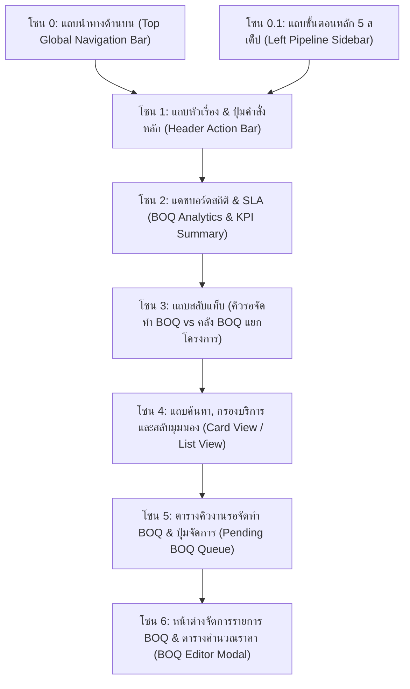
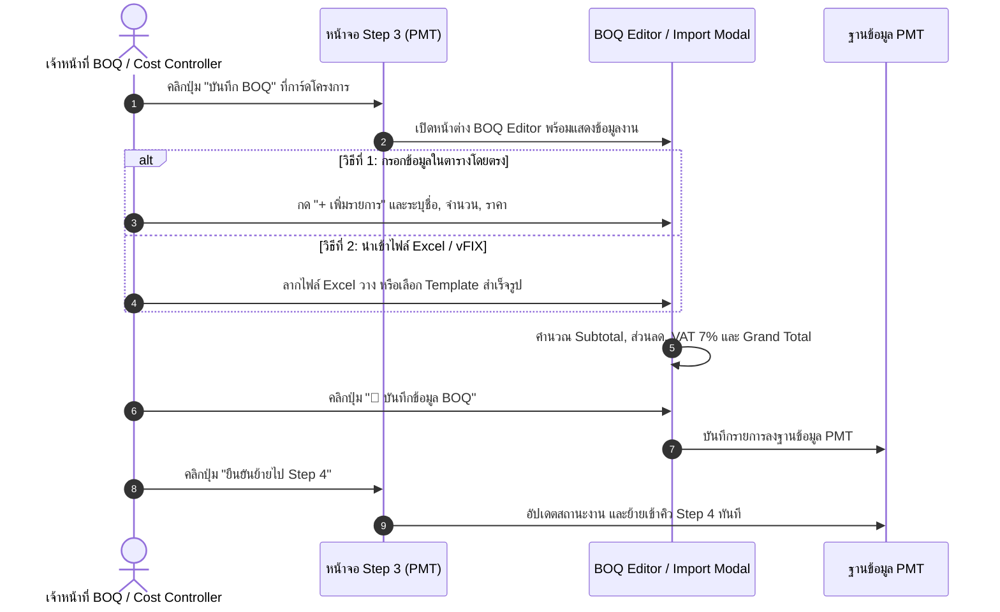

# 🎓 คู่มือฝึกอบรมการใช้งานหน้าจอระบบ PMT Flow
## โมดูลที่ 3: เจาะลึกหน้าจอ Step 3 — นำ BOQ เข้าระบบ & ประมาณการราคา (BOQ Ingestion & Estimation Training Screen Guide)
**รหัสหลักสูตร:** `TRN-PMT-STEP03` | **ระบบ:** PMT Flow (Store Project Management Tool) | **เวอร์ชัน:** 2.0 (Pipeline Architecture) | **กลุ่มเป้าหมาย:** เจ้าหน้าที่ถอดแบบ & BOQ, ฝ่ายประเมินราคา (Cost Controller), เจ้าหน้าที่ประสานงาน PMT, หัวหน้างาน และวิทยากรผู้ฝึกอบรม (Trainer)

---

## 📌 บทสรุปและวัตถุประสงค์หลักสูตร (Course Overview & Objectives)

หน้าจอ **Step 3: นำ BOQ เข้าระบบ & ประมาณการราคา (Bill of Quantities)** คือ **"หัวใจด้านต้นทุนและงบประมาณ (Cost & Budgeting Center)"** ของระบบ PMT Flow ทำหน้าที่รับช่วงต่องานที่ผ่านการจัดทำแบบแปลนติดตั้งจาก **Step 2** เพื่อให้เจ้าหน้าที่ถอดแบบและฝ่ายประเมินราคาทำการ:
1. นำเข้ารายการวัสดุและค่าแรงจากไฟล์ใบเสนอราคา (vFIX / Excel / CSV) หรือเลือกชุดแม่แบบสำเร็จรูป (Templates)
2. บันทึกและปรับปรุงรายการวัสดุ-อุปกรณ์และค่าบริการติดตั้งแบบ Real-time บนระบบ PMT
3. ตรวจสอบการคำนวณยอดเงินรวม (Subtotal), ส่วนลดโครงการ, ภาษีมูลค่าเพิ่ม VAT 7% และยอดสุทธิ (Grand Total)
4. แยกแยะหมวดหมู่ระหว่าง **"ค่าวัสดุ (Materials)"** และ **"ค่าแรง/บริการ (Labor)"** เพื่อเตรียมความพร้อมสำหรับการแปลงเป็น Task ใน **Step 5**
5. ส่งต่องานไปยัง **Step 4 (บันทึก Ticket & ใบเสร็จ)** เพื่อให้ฝ่ายประสานงานเปิดใบสั่งงานและรับชำระเงินจากลูกค้า

### 🎯 วัตถุประสงค์การเรียนรู้สำหรับผู้เข้าอบรม (Learning Objectives):
1. **เข้าใจโครงสร้างคิวงาน 2 มิติ (Dual-Tab Architecture):** แยกความแตกต่างระหว่างแท็บ "คิวรอจัดทำ BOQ (Pending)" และแท็บ "คลัง BOQ ที่บันทึกแล้ว (Library)"
2. **เชี่ยวชาญการนำเข้าข้อมูล BOQ ทั้ง 3 รูปแบบ:** การอัปโหลดไฟล์ Excel (.xlsx/.csv), การเลือก Template สำเร็จรูป 4 กลุ่มงาน และการ Paste ตารางตรงจากคลิปบอร์ด
3. **จัดหมวดหมู่และจัดการตาราง BOQ ได้อย่างแม่นยำ:** เพิ่ม/ลบ/แก้ไขรายการวัสดุ หน่วยนับ ราคาต่อหน่วย และการระบุประเภทค่าแรง
4. **ตรวจสอบความถูกต้องทางบัญชีและภาษี 100%:** เข้าใจสูตรการคำนวณ ส่วนลดโครงการ, ฐานภาษี และ VAT 7% ป้องกันความผิดพลาดก่อนเปิดใบเสร็จ
5. **ควบคุมการไหลของงาน (Workflow Transition):** ส่งงานต่อไปยัง Step 4 หรือใช้ทางลัดแปลงเข้า Project ใน Step 5 ตามประเภทโครงการได้อย่างถูกต้อง

---

## 🧭 กายวิภาคของหน้าจอ Step 3 (Screen Anatomy Breakdown)

โครงสร้างหน้าจอ Step 3 แบ่งออกเป็น **7 โซนหลัก** ดังนี้:

---

### 🔹 โซน 1: แถบหัวเรื่อง & ปุ่มคำสั่งหลัก (Header Action Bar)

| องค์ประกอบ | สัญลักษณ์ / สี | หน้าที่การทำงาน | คำแนะนำจาก Trainer |
| :--- | :--- | :--- | :--- |
| **หัวเรื่องหน้าจอ** | `Step 3: นำBOQ เข้าระบบ` | บ่งบอกขั้นตอนและหน้าที่หลักของหน้าจอ | ใช้เน้นย้ำผู้เรียนว่าอยู่ในขั้นตอนการกำหนดต้นทุน |
| **📥 นำเข้า Excel / vFIX** | ปุ่มสีม่วงสดใส | เปิดหน้าต่างนำเข้าใบเสนอราคาภายนอก | ไฮไลท์หลักในการสอน: รองรับทั้งลากไฟล์วาง และ Paste ตาราง |
| **Template Excel** | ปุ่มขอบเทา-ม่วง | ดาวน์โหลดไฟล์แบบฟอร์มมาตรฐาน (.csv / .xlsx) | ให้ผู้เรียนดาวน์โหลดไปทดลองกรอกข้อมูลจำลอง |
| **⚡ Step 5: เข้า Project** | ปุ่มทางลัดสีส้ม/แอมเบอร์ | กระโดดข้ามไปยังหน้า Step 5 สำหรับงานที่พร้อมวางแผนงาน | ใช้เฉพาะกรณีต้องการวางแผน Gantt โดยยังไม่ต้องการออก Ticket |
| **ตั้งค่า SLA** | ปุ่มไอคอนฟันเฟือง `⚙️` | ปรับแต่งเกณฑ์เวลาเตือน SLA ของคิว BOQ (ค่าเริ่มต้น 24 ชม.) | ใช้สำหรับระดับหัวหน้างานในการปรับ KPI ประจำสาขา |

---

### 🔹 โซน 2: แดชบอร์ดสถิติ & SLA (BOQ Analytics & KPI)

แดชบอร์ดสรุป 4 การ์ดตัวชี้วัดสำคัญ ช่วยให้ผู้ดูแลและทีมถอดแบบเห็นภาพรวมงานแบบ Real-time:

1. **Card 1 — โครงการรอทำ BOQ (Pending Intake):** จำนวนงานที่ผ่าน Step 2 มาแล้วและยังไม่มีการบันทึกรายการ BOQ เป้าหมายประจำวันคือต้องรีบเคลียร์ให้เป็น `0`
2. **Card 2 — บันทึก BOQ แล้ว (Completed BOQ):** จำนวนงานที่กรอกรายการวัสดุและคำนวณยอดเงินเสร็จสิ้น พร้อมส่งต่อ
3. **Card 3 — มูลค่ารวมโครงการ (Total Estimation Value):** ยอดรวมมูลค่างานทั้งหมดที่บันทึกในระบบ ช่วยฝ่ายบัญชีและผู้บริหารดูยอดขายโดยรวม
4. **Card 4 — สถานะ SLA (Time-to-Estimate):** นับถอยหลังตามเกณฑ์ SLA 24 ชั่วโมง โดยแสดงสีเขียว (ในเกณฑ์), สีเหลือง (ใกล้ครบกำหนด < 4 ชม.) และสีแดง (เกินกำหนด)

---

### 🔹 โซน 3 & 4: แถบสลับมุมมองและการค้นหา (Tabs & View Filters)

* **แท็บ "คิวโครงการที่รอจัดทำ BOQ":** แสดงเฉพาะงานที่ต้องดำเนินการถอดราคา (Single State Queue) เพื่อง่ายต่อการโฟกัส
* **แท็บ "คลังรายการ BOQ แยกตามโครงการ":** แสดงงานทั้งหมดที่มีการบันทึก BOQ ไว้แล้ว เพื่อใช้ในการเปิดดูย้อนหลัง, ปรับปรุงราคา หรือ Export ข้อมูล
* **สวิตช์ Card View / List View:** 
  - *Card View:* แสดงเป็นการ์ดโครงการ สรุปรายการสำคัญ รูปแบบอ่านง่าย
  - *List View:* แสดงเป็นตารางแถว เหมาะสำหรับจอคอมพิวเตอร์ที่ต้องการเปรียบเทียบหลายงานพร้อมกัน

---

## 🛠️ ขั้นตอนการปฏิบัติงานมาตรฐาน (Step-by-Step SOP)

---

### วิธีการที่ 1: การนำเข้าใบ BOQ ผ่านไฟล์ภายนอก (Import Excel / CSV / Template)

1. คลิกปุ่มสีม่วง **`📥 นำเข้า Excel / vFIX`**
2. เลือกแถบวิธีนำเข้าที่ต้องการจาก 3 ตัวเลือก:
   - **แถบ 1 — อัปโหลดไฟล์ (File Upload):** ลากไฟล์ `.xlsx` หรือ `.csv` วางลงในกรอบ ระบบจะอ่านหัวคอลัมน์อัตโนมัติ (ลำดับ, รายการ, จำนวน, หน่วย, ราคาต่อหน่วย)
   - **แถบ 2 — เลือก Template สำเร็จรูป (Pre-built Templates):** สำหรับงานบริการมาตรฐาน กดเลือกชุดรายการได้ทันที:
     - *ชุดที่ 1:* งานติดตั้งเครื่องปรับอากาศ 18,000 BTU (แอร์, ขาแขวน, ท่อน้ำยา, สายไฟ, เบรกเกอร์)
     - *ชุดที่ 2:* งานติดตั้งปั๊มน้ำ & แท็งก์น้ำ (ปั๊มน้ำ, ถังเก็บน้ำ, วาล์ว, ข้อต่อ PVC, ฐานราก)
     - *ชุดที่ 3:* งานติดตั้งเครื่องทำน้ำอุ่น (เครื่องทำน้ำอุ่น, สายถัก, วาล์วเปิด-ปิด, สายดิน)
     - *ชุดที่ 4:* งาน Renovate ห้องครัวมาตรฐาน (เคาน์เตอร์, ซิงค์ล้างจาน, ปูกระเบื้อง, งานท่อประปา)
   - **แถบ 3 — วางข้อมูลโดยตรง (Paste Direct):** คัดลอกตารางจาก Excel แล้วกด `Ctrl + V` ลงในช่องข้อความ
3. เลือกโหมดการนำเข้า:
   - **"แทนที่รายการเดิม (Replace)"**: ล้างรายการเก่าออกทั้งหมดแล้วใส่ชุดใหม่
   - **"เพิ่มต่อท้าย (Append)"**: รักษารายการเดิมไว้ แล้วนำรายการใหม่ไปต่อท้าย
4. ตรวจสอบตารางตัวอย่าง (Live Preview) ด้านล่าง
5. คลิกปุ่ม **`ยืนยันนำเข้ารายการ BOQ`** ข้อมูลจะถูกโหลดเข้าสู่ตารางหลักทันที

---

### วิธีการที่ 2: การบันทึกและปรับปรุงตาราง BOQ ด้วยตนเอง (Manual BOQ Entry)

1. ในหน้าต่างตาราง BOQ คลิกปุ่ม **`+ เพิ่มรายการวัสดุ/ค่าแรง`**
2. กรอกรายละเอียดในแต่ละคอลัมน์:
   - **ประเภทรายการ:** เลือกระหว่าง `วัสดุ (Material)` หรือ `ค่าแรง/งานบริการ (Labor)` *(ข้อสำคัญ: มีผลต่อการแปลงเป็น Task ใน Step 5)*
   - **ชื่อรายการ:** กรอกชื่อสินค้าหรือบริการให้ชัดเจน
   - **จำนวน (Qty):** ระบุตัวเลขจำนวน
   - **หน่วย (Unit):** เช่น เครื่อง, จุด, เมตร, ชุด, เหมา
   - **ราคาต่อหน่วย (Unit Price):** ราคาขายตามใบเสนอราคา
3. ตรวจสอบสรุปการเงินด้านล่างตาราง:
   - ยอดรวมก่อนภาษี (Subtotal)
   - ส่วนลด (Discount)
   - ยอดฐานภาษี (Taxable Amount) = Subtotal - Discount
   - ภาษีมูลค่าเพิ่ม VAT 7% = Taxable Amount * 0.07
   - ยอดรวมสุทธิ (Grand Total) = Taxable Amount + VAT 7%
4. คลิกปุ่ม **`💾 บันทึกข้อมูล BOQ`** เพื่อบันทึกข้อมูลเข้าสู่ฐานข้อมูลโครงการ

---

### การส่งต่องานไปยังขั้นตอนถัดไป (Moving to Step 4 / Step 5)

เมื่อบันทึก BOQ เรียบร้อยแล้ว ระบบมี 2 ทางเลือกในการขับเคลื่อนงาน:
1. **เส้นทางมาตรฐาน (Standard Path ➔ Step 4):**
   - คลิกปุ่ม **`ยืนยันย้ายไป Step 4`**
   - ระบบจะย้ายงานไปยังหน้าจอ **Step 4: บันทึก Ticket & ใบเสร็จ** เพื่อให้เจ้าหน้าที่เปิดใบสั่งงานและรับสลิปเงินโอนจากลูกค้า
2. **เส้นทางด่วนสำหรับโครงการ (Fast-Track to Step 5):**
   - ในกรณีที่เป็นงานที่มีสัญญาล่วงหน้าและต้องการจัดตารางช่างทันที สามารถคลิกปุ่ม **`⚡ แปลงเป็น Task แผนงาน (Step 5)`** เพื่อนำเฉพาะรายการค่าแรงไปจัดลง Gantt Timeline ได้ทันที

---

## 💡 แผนการสอนสำหรับ Trainer (Workshop Hands-on Guide)

### 🎯 บททดสอบปฏิบัติการประจำห้องเรียน (30 นาที):
**สถานการณ์สมมติ:** "ลูกค้า คุณวิภาดา สั่งซื้อโครงการ Renovate ครัว (Job ID: `JOB202609003`) ผ่านการออกแบบใน Step 2 เรียบร้อยแล้ว ให้ผู้เรียนดำเนินการจัดทำ BOQ ดังนี้"

1. **โจทย์ข้อที่ 1:** ใช้ฟังก์ชัน Template สำเร็จรูป เลือกชุด "Renovate ห้องครัวมาตรฐาน" เข้าสู่ระบบ
2. **โจทย์ข้อที่ 2:** เพิ่มรายการพิเศษด้วยตนเอง: "ค่าติดตั้งเครื่องดูดควันสแตนเลส (ค่าแรง)" จำนวน 1 จุด ราคา 1,500 บาท
3. **โจทย์ข้อที่ 3:** ระบุส่วนลดพิเศษให้ลูกค้าจำนวน 2,000 บาท
4. **โจทย์ข้อที่ 4:** ตรวจสอบว่ายอด VAT 7% คำนวณหลังหักส่วนลดถูกต้องหรือไม่ แล้วกดบันทึก
5. **โจทย์ข้อที่ 5:** กดย้ายงานเข้าสู่ Step 4 และตรวจเช็กว่าในหน้า Step 4 มีชื่องานนี้ปรากฏในคิวหรือไม่

---

## ❓ คำถามที่พบบ่อยและข้อควรระวัง (FAQ & Best Practices)

> [!IMPORTANT]
> **Q: ทำไมต้องระบุประเภทรายการว่าเป็น "วัสดุ" หรือ "ค่าแรง"?**  
> **A:** ใน Step 5 ระบบมีอัลกอริทึม **Labor-to-Task Rule** ซึ่งจะคัดกรองเฉพาะรายการที่เป็น **"ค่าแรง/งานบริการ"** ไปสร้างเป็น Task งานช่างบน Gantt Chart หากไประบุค่าท่อน้ำหรือสีกระเบื้องเป็นค่าแรง ระบบจะดึงไปสร้างเป็นงานช่าง ทำให้ตาราง Gantt ผิดพลาด

> [!TIP]
> **Q: หากไฟล์ Excel มีหลาย Sheet ระบบจะอ่าน Sheet ไหน?**  
> **A:** ระบบจะอ่าน Sheet แรกเป็นค่าเริ่มต้น แนะนำให้ตรวจสอบว่าข้อมูลตาราง BOQ อยู่ใน Sheet แรก และลบแถวหัวตารางที่ไม่จำเป็นออกก่อน Import

> [!NOTE]
> **Q: สามารถแก้ไข BOQ หลังจากส่งไป Step 4 แล้วได้หรือไม่?**  
> **A:** สามารถคลิกที่แท็บ "คลังรายการ BOQ แยกตามโครงการ" เพื่อเปิดแก้ไขได้ตลอดเวลา ตราบใดที่งานนั้นยังไม่ถูกกด Close Job ปิดบัญชีส่ง BMT ในขั้นตอนสุดท้าย

---

**จัดทำโดย:** ฝ่ายพัฒนาหลักสูตรและฝึกอบรม PMT Flow  
**รหัสเอกสาร:** `TRN-PMT-STEP03-v2.0`  
**สถานะการรับรอง:** Approved Standard (Enterprise Operations)