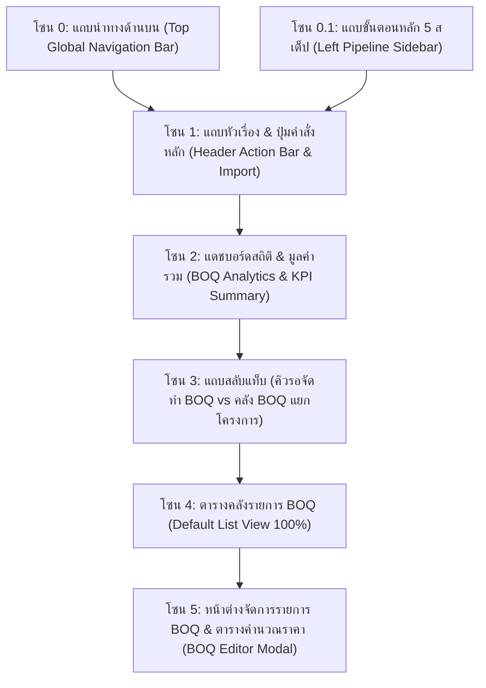
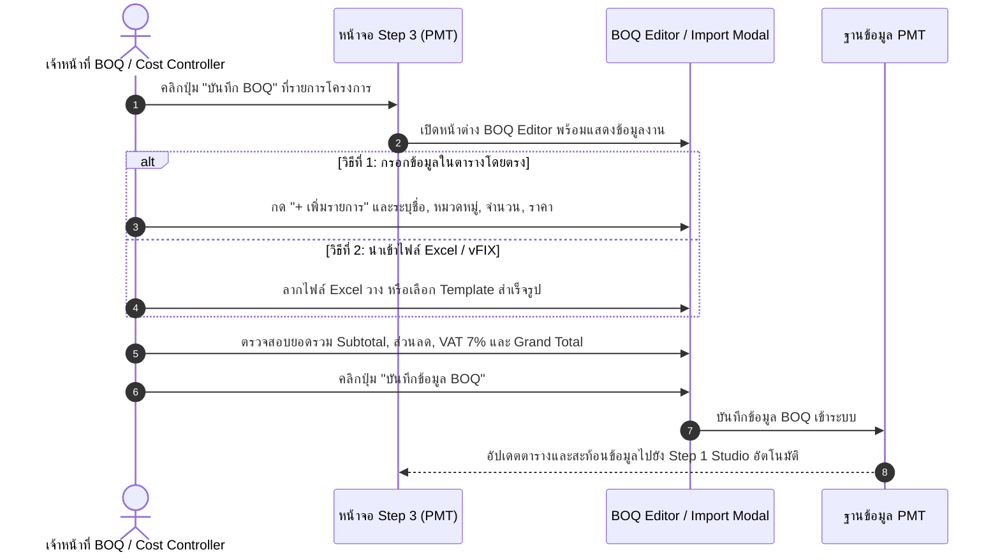

# 🎓 คู่มือฝึกอบรมการใช้งานหน้าจอระบบ PMT Flow
## โมดูลที่ 3: เจาะลึกหน้าจอ Step 3 — คลังรายการ BOQ & ประมาณการราคา (BOQ Repository & Ingestion Guide)
**รหัสหลักสูตร:** `TRN-PMT-STEP03` | **ระบบ:** PMT Flow (Store Project Management Tool) | **เวอร์ชัน:** 3.0 (Unified Pipeline Architecture) | **กลุ่มเป้าหมาย:** เจ้าหน้าที่ถอดแบบ & BOQ, ฝ่ายประเมินราคา (Cost Controller), PM & SA, เจ้าหน้าที่ประสานงาน PMT, หัวหน้างาน และวิทยากรผู้ฝึกอบรม (Trainer)

---

---

## 📌 บทสรุปและวัตถุประสงค์หลักสูตร (Course Overview & Objectives)

หน้าจอ **Step 3: คลังรายการ BOQ (BOQ Repository & Ingestion)** คือ **"ศูนย์กลางการจัดการต้นทุนและงบประมาณ (Cost & Budgeting Hub)"** ของระบบ PMT Flow ทำหน้าที่ 2 รูปแบบหลักที่เชื่อมโยงกันอย่างสมบูรณ์:

1. **โหมด One-Stop Integrated Studio (ใน Step 1):** ฝ่ายขาย/PM/SA สามารถถอดรายการวัสดุ-อุปกรณ์ ค่าแรง และคำนวณราคารวมได้ทันทีใน **Tab 3 (รายการถอดราคา BOQ)** ตั้งแต่ขั้นตอนเปิด Order
2. **โหมด Dedicated BOQ Workspace (หน้าจอ Step 3):** ทำหน้าที่เป็นศูนย์กลางคลังรายการ BOQ ของทุกโครงการ สำหรับฝ่ายประเมินราคาและ Cost Controller ในการ:
   - นำเข้ารายการวัสดุและค่าแรงจากไฟล์ภายนอก (Excel `.xlsx` / `.csv` / vFIX)
   - เลือกชุดแม่แบบสำเร็จรูป (Templates) สำหรับกลุ่มงานมาตรฐาน เช่น แอร์, น้ำอุ่น, ครัว Built-in
   - ตรวจสอบยอดเงินรวม (Subtotal), ส่วนลด, ภาษีมูลค่าเพิ่ม VAT 7% และยอดสุทธิ (Grand Total)
   - แยกแยะหมวดหมู่ระหว่าง **"ค่าวัสดุ (Materials)"** และ **"ค่าแรง/บริการ (Labor)"** เพื่อเตรียมพร้อมส่งต่อไปแปลงเป็น Task บน Gantt Chart ใน **Step 5**

### 🎯 วัตถุประสงค์การเรียนรู้สำหรับผู้เข้าอบรม (Learning Objectives):
1. **เข้าใจการทำงานร่วมกันระหว่าง Step 1 และ Step 3:** บันทึกราคาผ่าน Studio หรือนำเข้าไฟล์ขนาดใหญ่ผ่านหน้าจอ Step 3 โดยข้อมูลจะซิงค์กัน 100%
2. **เชี่ยวชาญการนำเข้าข้อมูล BOQ ทั้ง 3 รูปแบบ:** อัปโหลดไฟล์ Excel (.xlsx/.csv), เลือก Template สำเร็จรูป 4 กลุ่มงาน และการ Paste ตารางตรงจากคลิปบอร์ด
3. **จัดหมวดหมู่และจัดการตาราง BOQ ได้อย่างแม่นยำ:** เพิ่ม/ลบ/แก้ไขรายการวัสดุ หน่วยนับ ราคาต่อหน่วย และการระบุประเภทค่าแรง
4. **ตรวจสอบความถูกต้องทางบัญชีและภาษี 100%:** เข้าใจสูตรการคำนวณ ส่วนลดโครงการ, ฐานภาษี และ VAT 7% ป้องกันความผิดพลาดก่อนเปิดใบเสร็จ
5. **ควบคุมการไหลของงาน (Workflow Transition):** ส่งงานต่อไปยัง Step 4 (เปิด Ticket) หรือใช้ทางลัดแปลงเข้า Project ใน Step 5 ตามประเภทโครงการได้อย่างถูกต้อง

---

## 🧭 กายวิภาคของหน้าจอ Step 3 (Screen Anatomy Breakdown)

โครงสร้างหน้าจอ Step 3 แบ่งออกเป็น **6 โซนสำคัญ** ดังนี้:

---

### 🔹 โซน 0: แถบนำทางด้านบน (Top Navigation Bar & Global Actions)

| องค์ประกอบ | สัญลักษณ์ / สี | หน้าที่การทำงาน | คำแนะนำจาก Trainer |
| :--- | :--- | :--- | :--- |
| **โลโก้ & ชื่อระบบ** | `PMT Flow` | แสดงตราสินค้าและระดับ Enterprise Operations | คลิกเพื่อกลับสู่หน้าหลัก |
| **Breadcrumb** | `PMT Flow > Step 3: คลังรายการ BOQ` | ระบุตำแหน่งกระบวนการปัจจุบัน | ใช้สังเกตว่ากำลังทำงานอยู่ในขั้นตอนที่ 3 |
| **ค้นหางานด่วน** | `🔍 ค้นหางาน, ช่าง, ลูกค้า... [⌘K]` | ค้นหาเลข Job, ชื่อลูกค้า, เบอร์โทร หรือช่างได้ทั่วระบบ | แนะนำให้ใช้คีย์ลัด `Ctrl + K` เพื่อความรวดเร็ว |
| **User Management** | ปุ่ม `[ 👥 User Management ]` | จัดการผู้ใช้งาน กำหนดสิทธิ์ทีมถอดแบบ/การเงิน | ใช้ตรวจสอบสิทธิ์ของทีมงาน |
| **FAQ & คู่มือ** | ปุ่ม `[ ❓ FAQ & คู่มือ ]` | เปิดเอกสารระเบียบปฏิบัติและคู่มือระบบ | แนะนำให้ผู้เรียนเปิดทบทวนได้ตลอดเวลา |
| **ออกจากระบบ** | ปุ่ม `[ 🚪 ออกจากระบบ ]` | ปิด Session การใช้งานและ Hard Reload กลับหน้าแรกอย่างปลอดภัย | ให้กดทุกครั้งหลังเสร็จสิ้นการทำงาน |

---

### 🔹 โซน 0.1: แถบขั้นตอนการดำเนินงานหลัก (Left Pipeline Sidebar)

แถบเมนูด้านซ้ายมือแสดงขั้นตอนการดำเนินงานทั้ง 5 ขั้นตอน พร้อม Badge แสดงจำนวนงานในแต่ละขั้นตอน:

1. ⚪ **Step 1: รับ Order, Design & BOQ:** ศูนย์กลางรับคำสั่งซื้อและ One-Stop Studio
2. ⚪ **Step 2: คลังแบบแปลน (Design):** ศูนย์รวมและคลังแบบแปลนติดตั้ง (CAD & PDF)
3. 🟣 **Step 3: คลังรายการ BOQ (ไฮไลท์สีม่วง):** **หน้าจอปัจจุบัน** คลังรายการถอดราคาและใบเสนอราคา
4. ⚪ **Step 4: บันทึก Ticket & ใบเสร็จ:** เปิดใบสั่งงานและแนบสลิปชำระเงิน
5. ⚪ **Step 5: บันทึก BOQ เข้า Project:** แปลงรายการค่าแรงเข้าสู่แผนงาน Gantt Timeline

---

### 🔹 โซน 1: แถบหัวเรื่อง & ปุ่มคำสั่งหลัก (Header Action Bar)

- **📥 นำเข้า Excel / vFIX:** เปิดหน้าต่างนำเข้าใบเสนอราคาภายนอก (รองรับทั้ง Drag & Drop และ Paste ตาราง)
- **Template Excel:** ดาวน์โหลดไฟล์แบบฟอร์มมาตรฐาน (.csv / .xlsx) สำหรับนำไปกรอกข้อมูล
- **⚡ Step 5: เข้า Project:** ทางลัดกระโดดข้ามไปยังหน้า Step 5 สำหรับงานที่พร้อมวางแผนงาน Gantt ทันที

---

### 🔹 โซน 2: แดชบอร์ดสถิติ & SLA (BOQ Analytics & KPI)

1. **Card 1 — โครงการรอทำ BOQ (Pending Intake):** จำนวนงานที่ยังไม่มีการบันทึก BOQ
2. **Card 2 — บันทึก BOQ แล้ว (Completed BOQ):** จำนวนงานที่กรอกรายการวัสดุและคำนวณยอดเงินเสร็จสิ้น
3. **Card 3 — มูลค่ารวมโครงการ (Total Estimation Value):** ยอดรวมมูลค่างานทั้งหมดที่บันทึกในระบบ
4. **Card 4 — สถานะ SLA (Time-to-Estimate):** นับถอยหลังตามเกณฑ์ SLA 24 ชั่วโมง

---

### 🔹 โซน 3 & 4: ตารางคลังรายการ BOQ (Default List View 100%)

ระบบแสดงผลเริ่มต้นเป็น **แบบตารางรายการ (List View 100%)** เสมอ เพื่อให้เจ้าหน้าที่ตรวจสอบเลขที่ Job, รายการสินค้า, ยอดเงิน Subtotal, ยอดรวมสุทธิ และสถานะความพร้อมได้อย่างรวดเร็ว

---

## 🛠️ ขั้นตอนการปฏิบัติงานมาตรฐาน (BOQ SOP)

---

## ❓ คำถามที่พบบ่อย (FAQ & Best Practices)

### Q1: สามารถแยกหมวดหมู่วัสดุและค่าแรงได้อย่างไร?
> **คำตอบ:** ในแต่ละรายการของตาราง BOQ จะมี Dropdown ให้เลือกหมวดหมู่ระหว่าง **`วัสดุ / อุปกรณ์`** และ **`ค่าแรง / บริการ`** ซึ่งระบบจะนำเฉพาะรายการค่าแรงไปสร้างเป็น Work Tasks บน Gantt Chart ใน Step 5 โดยอัตโนมัติ

### Q2: ข้อมูลที่บันทึกใน Step 1 Studio กับ Step 3 จะตรงกันหรือไม่?
> **คำตอบ:** ตรงกัน 100% (Single Source of Truth) การแก้ไขในหน้าต่างใดจะส่งผลให้อีกหน้าจออัปเดตตรงกันทันที

---

> [!TIP]
> **มาตรฐานระบบ PMT Flow:** หน้าจอทั้งหมดทำงานในระบบ **Light Theme 100%**, รูปแบบวันที่ **`DD/MM/YYYY`** และรูปแบบเวลา **24 ชั่วโมง (`00:00 - 23:59 น.`)**