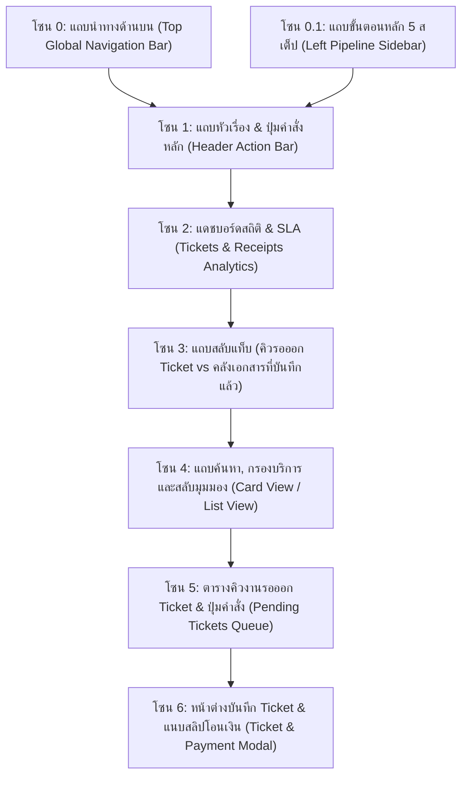
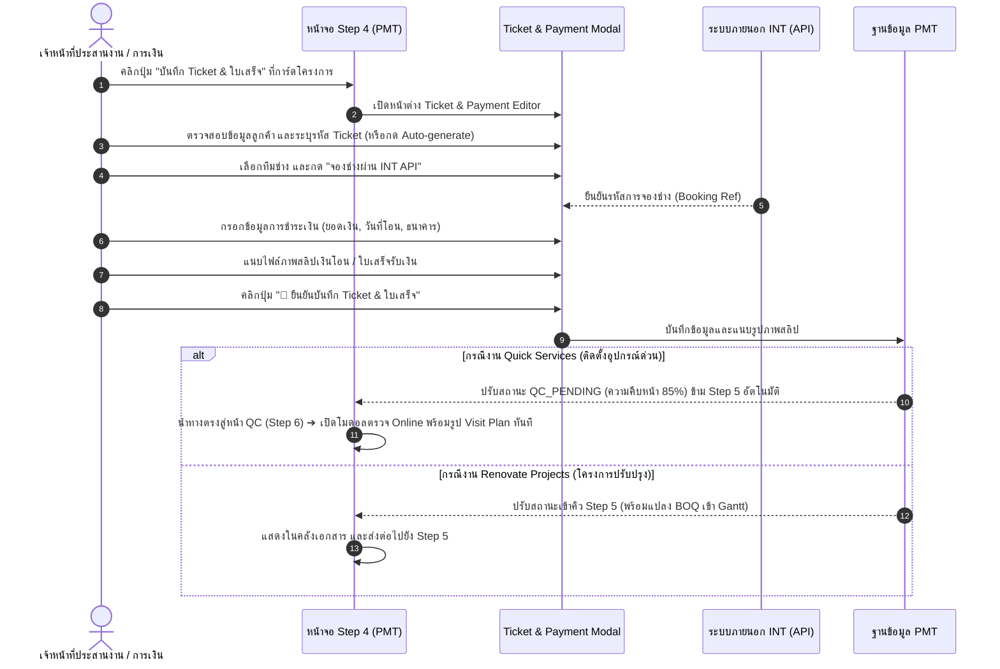

# 🎓 คู่มือฝึกอบรมการใช้งานหน้าจอระบบ PMT Flow
## โมดูลที่ 2: เจาะลึกหน้าจอ Step 2 — บันทึก Ticket & แนบสลิปใบเสร็จ (Tickets & Payment Receipts Training Screen Guide)
**รหัสหลักสูตร:** `TRN-PMT-STEP02` | **ระบบ:** PMT Flow (Store Project Management Tool) | **เวอร์ชัน:** 3.0 (6-Step Pipeline Architecture) | **กลุ่มเป้าหมาย:** เจ้าหน้าที่ประสานงานช่าง (Dispatcher), เจ้าหน้าที่การเงิน/แคชเชียร์, เจ้าหน้าที่รับ Order, หัวหน้างาน และวิทยากรผู้ฝึกอบรม (Trainer)

---

## 📌 บทสรุปและวัตถุประสงค์หลักสูตร (Course Overview & Objectives)

หน้าจอ **Step 2: บันทึก Ticket & แนบใบเสร็จ (Tickets & Receipts Management)** *(เดิมอ้างอิงเป็น Step 4 ในโครงสร้างเก่า)* คือ **"ศูนย์กลางการออกใบสั่งงานและการยืนยันธุรกรรมการเงิน (Work Order & Financial Gatekeeper)"** ของระบบ 6-Step Pipeline ใน PMT Flow ทำหน้าที่รับช่วงต่องานจาก **Step 1 (ศูนย์รับ Order, Design & BOQ Studio)** เพื่อดำเนินกระบวนการสำคัญ 4 ประการ:
1. การเปิดใบสั่งงานช่าง (Work Ticket) กำหนดรหัส Ticket อ้างอิงมาตรฐาน (`TCK-YYYYMM-XXXX`)
2. การส่งคำขอจองคิวช่างไปยังระบบภายนอก (API Booking to INT) และรับการยืนยันทีมช่างกลับมา
3. การตรวจสอบการชำระเงินของลูกค้า และการแนบหลักฐานสลิปโอนเงิน / ใบเสร็จรับเงิน (Payment Slip Attachment)
4. การปล่อยงานเข้าสู่ขั้นตอนถัดไปอย่างถูกต้อง:
   - **งานบริการด่วน (Quick Services):** *หมายเหตุ:* ในระบบปัจจุบัน งาน Quick Services ได้รับการยกระดับ Fast-track ตั้งแต่ Step 1 โดยระบบจะปิด (Disable) แท็บ Design & BOQ, ดึงข้อมูลช่างจาก INT อัตโนมัติ และเมื่อกดบันทึกจะข้าม Step 2 Ticket และวิ่งตรงไปยัง **Step 5: ตรวจรับงาน QC (QC Online)** ทันที (ไม่เข้าคิว Step 2 Ticket อีกต่อไป)
   - **งานโครงการปรับปรุง (Renovate Projects):** บันทึก Ticket & ใบเสร็จ แล้วส่งต่อไปยัง **Step 3: เตรียมแผนงานและทีมช่าง (Project Conversion)** เพื่อแปลง BOQ เป็นแผนงาน Gantt ใน Step 4

### 🎯 วัตถุประสงค์การเรียนรู้สำหรับผู้เข้าอบรม (Learning Objectives):
1. **เข้าใจบทบาททางการเงินและการประสานงาน (Financial & Dispatch Role):** เรียนรู้ว่าทำไมระบบจึงไม่อนุญาตให้เริ่มงานติดตั้งจริงจนกว่าจะมีการยืนยันการชำระเงินและมี Ticket ช่างที่สมบูรณ์ โดยระบบ Step 3 (Convert BOQ to Tasks) จะมี Payment Gatekeeper ตรวจสอบสถานะการจ่ายเงินก่อนอนุญาตให้สร้าง Task เสมอ
2. **จัดการคิวงาน Single State Queue ใน Step 2 ได้อย่างถูกต้อง:** แยกแยะระหว่างงานที่ "รอออก Ticket/แนบสลิป" กับงานที่ "บันทึกเอกสารครบถ้วนแล้ว"
3. **เปิด Ticket และมอบหมายทีมช่างได้แม่นยำ:** สามารถระบุทีมช่าง วัน-เวลาเข้าปฏิบัติงาน (รูปแบบ 24 ชม.) และเชื่อมโยงกับการจองช่างผ่าน API
4. **แนบและตรวจสอบสลิปการโอนเงิน 100%:** บันทึกยอดเงิน วันที่-เวลาโอน เลขที่อ้างอิง และแนบไฟล์รูปภาพสลิปได้อย่างถูกต้อง
5. **การยกเลิกงาน/ปิดการขายไม่ได้ (Close Lost):** หากลูกค้าขอยกเลิกหรือไม่ชำระเงิน สามารถกดบันทึก Close Lost เพื่อเปลี่ยนสถานะเป็น `CANCELLED` และระบุเหตุผลเพื่อปิดจ๊อบและยุติขั้นตอนการทำงานทันที
6. **ควบคุมการแยกสายงาน (Routing Control):** ส่งต่องาน Quick Services เข้า QC Online (Step 5) หรือส่งต่องาน Renovate เข้าสู่ Step 3 อย่างแม่นยำ 100%

---

## 🧭 กายวิภาคของหน้าจอ Step 4 (Screen Anatomy Breakdown)

โครงสร้างหน้าจอ Step 4 ประกอบด้วย **7 โซนหลัก** ดังนี้:

---

### 🔹 โซน 1: แถบหัวเรื่อง & ปุ่มคำสั่งหลัก (Header Action Bar)

| องค์ประกอบ | สัญลักษณ์ / สี | หน้าที่การทำงาน | คำแนะนำจาก Trainer |
| :--- | :--- | :--- | :--- |
| **หัวเรื่องหน้าจอ** | `Step 4: บันทึก Ticket & ใบเสร็จ` | บ่งบอกสถานะการจัดการตั๋วงานและเอกสารการเงิน | อธิบายผู้เรียนว่าขั้นตอนนี้คือจุดเชื่อมโยงระหว่าง "การขาย" และ "การติดตั้ง" |
| **+ บันทึก Ticket & ใบเสร็จใหม่** | ปุ่มสีเขียวมรกตสดใส | เปิดหน้าต่างบันทึกตั๋วงานและแนบสลิปเงินโอน | ปุ่มปฏิบัติการหลักในการฝึกอบรม |
| **ตั้งค่า SLA** | ปุ่มไอคอนฟันเฟือง `⚙️` | ปรับแต่งเกณฑ์เวลาเตือน SLA ของคิว Ticket (ค่าเริ่มต้น 12 ชม.) | แนะนำให้สังเกตสีเตือนเมื่อใกล้ครบกำหนดเวลา |

---

### 🔹 โซน 2: แดชบอร์ดสถิติ & SLA (Tickets & Receipts Analytics)

แดชบอร์ดสรุป 4 การ์ดตัวชี้วัดสำคัญของกระบวนการ Step 4:

1. **Card 1 — โครงการรอออก Ticket & แนบสลิป (Pending Queue):** จำนวนงานที่ผ่านการทำ BOQ (หรือมาจาก Quick Services) ที่รอการยืนยันการชำระเงินและออกตั๋วงาน
2. **Card 2 — บันทึก Ticket & แนบสลิปแล้ว (Completed Receipts):** จำนวนงานที่เอกสารการเงินครบถ้วนและพร้อมดำเนินการ
3. **Card 3 — ยอดเงินชำระรวม (Total Paid Amount):** มูลค่ารวมของเงินที่ลูกค้าชำระและแนบหลักฐานเข้าสู่ระบบแล้ว
4. **Card 4 — สถานะ SLA (Turnaround Time):** นับถอยหลังตามเกณฑ์ SLA 12 ชั่วโมง เพื่อไม่ให้เกิดความล่าช้าในการส่งต่องานให้ทีมช่าง

---

### 🔹 โซน 3 & 4: แถบแท็บสลับมุมมองและตัวกรอง (Tabs & Filters)

* **แท็บ "คิวโครงการที่รอออก Ticket & แนบสลิป":** แสดงเฉพาะงานที่ต้องเปิด Ticket หรือยังขาดหลักฐานการชำระเงิน (Single State Queue) โดยงานที่เข้ามาใหม่จะแสดงป้ายกำกับ `NEW!` พร้อมไอคอนประกายดาว ✨ เพื่อให้ SA ตรวจสอบคิวได้ทันที
* **แท็บ "คลัง Ticket, สลิปโอนเงิน และสัญญาจ้าง":** แสดงงานทั้งหมดที่มีการบันทึก Ticket และแนบเอกสารการเงินเรียบร้อยแล้ว โดยรายการ Ticket ที่เพิ่งบันทึกล่าสุดจะจัดเรียงขึ้นบนสุดและมีป้ายกำกับ `NEW!` พร้อมไฟกะพริบ เพื่อให้ SA และทีมงานสังเกตเห็นงานที่เพิ่งบันทึกได้สะดวก ชัดเจน
* **สวิตช์ Card View / List View และช่องค้นหา (Search):** เลือกระหว่างการดูแบบการ์ดสรุป หรือตารางแถว (List View) สำหรับตรวจสอบข้อมูลหลายรายการ โดยตารางแสดงรหัสงาน (Job ID), เลขที่อ้างอิง (Ref ID), เลขที่ Booking, **เลขที่ Ticket (Ticket No)**, พร้อมคอลัมน์บริการที่แสดง **ป้ายสถานะ Drawing (`X Drawing` / `รอแบบแปลน`)** และ **ป้ายสถานะ BOQ (`Blank BOQ` สีม่วง / `BOQ (X)` สีเขียว)** สำหรับงานโครงการ Renovate ช่วยให้เจ้าหน้าที่สแกนสถานะความพร้อมของเอกสารได้ทันทีในบรรทัดเดียว
* **หน้าต่าง Pop up ดูข้อมูลงานที่เคยบันทึกไว้ (Task Quick View Modal):** เมื่อคลิกที่แถวงานหรือรหัสงานในตาราง ระบบจะเปิดหน้าต่าง Pop up (`modal-job-preview-detail`) ขึ้นมาทันที เพื่อให้เจ้าหน้าที่ตรวจสอบข้อมูลสำคัญครบถ้วนในจุดเดียว:
  1. **การ์ดตัวชี้วัดด่วน 5 จุด (Quick Metrics KPI):** สำหรับงาน Renovate จะแสดงสถานะ SLA, จำนวนแบบแปลน Drawing, สถานะประมาณการราคา (ระบุชัดเจนหากเป็น `Blank BOQ`), สถานะออกตั๋ว Ticket และวันนัดหมาย
  2. **ข้อมูลลูกค้าและหน้างาน:** ข้อมูลลูกค้า, เบอร์โทร (มีปุ่มโทร/คัดลอก), ที่อยู่หน้างาน, วันนัดหมาย, สโคปงาน และข้อกำหนดพิเศษ
  3. **ภาพถ่ายสำรวจหน้างาน (Site Visit Photos):** ภาพถ่ายสำรวจจากระบบ INT พร้อม Lightbox Zoom
  4. **แบบแปลนติดตั้ง & Drawing (Design & Blueprints CAD / 2D / 3D):** แสดงรูปพรีวิวแบบแปลนติดตั้งของโครงการ พร้อมปุ่ม Lightbox ซูมดูภาพขนาดใหญ่ และปุ่มลัด `โหลดแบบแปลนตัวอย่างมาตรฐาน`
  5. **ประมาณการรายการ BOQ & Blank BOQ:** แสดงตารางแจกแจงรายการค่าแรง (LABOR) และค่าวัสดุ (MATERIAL) ครบ 7 คอลัมน์ หากเป็นโครงการที่ยังไม่มีการนำเข้าจะแสดงสถานะ **Blank BOQ (ตารางว่างไม่มีรายการ Dummy ปะปน)** พร้อมปุ่มลัด `นำเข้า Excel/CSV` และปุ่ม `โหลดรายการตัวอย่าง (5 รายการ)`
  6. **การแสดงรูปภาพพรีวิว (Image Preview) สลิปใบเสร็จรับเงินและสัญญาการทำงานอย่างชัดเจน:** พร้อมคลิกขยายใหญ่ (Lightbox Zoom) ทั้งใน Task Quick View Modal และหน้าต่างบันทึก Ticket ใหม่ (`modal-create-ticket`) โดยได้**ตัดส่วนไทม์ไลน์และประวัติการดำเนินงาน (Pipeline Progress History) ออกจาก Pop up** อย่างสมบูรณ์ เพื่อลดความซ้ำซ้อนและกระชับพื้นที่ให้เจ้าหน้าที่ตรวจสอบหลักฐานการเงินได้อย่างรวดเร็ว พร้อมปุ่มลัดส่งต่องานไปยังขั้นตอนถัดไป (Quick ไป QC Online / Renovate ไป Convert เข้า Project) ได้ทันที

---

## 🛠️ ขั้นตอนการปฏิบัติงานมาตรฐาน (Step-by-Step SOP)

---

### ขั้นตอนที่ 1: การเปิด Ticket และมอบหมายทีมช่าง (Work Ticket Issuance)

1. ในหน้าจอ Step 4 ค้นหางานที่ต้องการจากตารางคิวงาน
2. คลิกปุ่ม **`บันทึก Ticket & ใบเสร็จ`** ที่แถวของงานนั้น
3. ในหน้าต่าง Modal ตรวจสอบรายละเอียด:
   - **รหัส Ticket (Ticket ID):** ระบบจะสร้างรหัสมาตรฐานให้อัตโนมัติ เช่น `TCK-202609-001` (สามารถแก้ไขได้ตามเลขที่ใบสั่งงานจริง)
   - **ทีมช่างผู้รับผิดชอบ (Assigned Technician / Crew):** เลือกทีมช่าง (เช่น `Team A - สมศักดิ์`, `Team B - ประเสริฐ`)
   - **วันและเวลาเริ่มงาน (Scheduled Date & Time):** ระบุวันนัดหมายและช่วงเวลาเข้าบริการ
   - **สถานะการจองช่าง INT:** คลิกปุ่ม **`🔗 ซิงค์จองช่าง INT`** เพื่อส่งพารามิเตอร์ไปล็อกคิวช่างในระบบ INT

---

### ขั้นตอนที่ 2: การบันทึกข้อมูลการเงินและแนบสลิป (Payment & Slip Attachment)

1. เลื่อนลงมาที่ส่วน **"ข้อมูลการชำระเงินและหลักฐาน (Payment Verification)"**
2. กรอกรายละเอียดการชำระเงิน:
   - **ช่องทางการชำระเงิน:** เลือก `โอนเงินผ่านธนาคาร (Bank Transfer)`, `บัตรเครดิต (Credit Card)` หรือ `เงินสด (Cash)`
   - **ธนาคารต้นทาง/ปลายทาง:** ระบุชื่อธนาคาร
   - **ยอดเงินที่ชำระ (Paid Amount):** ต้องตรงกับยอด Grand Total จาก BOQ (หรือยอดมัดจำตามงวดงาน)
   - **วัน-เวลาที่โอน:** ระบุตามที่ปรากฏในสลิป
   - **หมายเลขอ้างอิงธุรกรรม (Transaction Ref):** กรอกเลขอ้างอิงจากธนาคาร
3. การแนบหลักฐาน:
   - คลิกที่กรอบ **"แนบภาพสลิป / ใบเสร็จ"** หรือลากไฟล์ภาพ (`.png`, `.jpg`, `.pdf`) มาวาง
   - ระบบจะแสดง **ภาพตัวอย่างสลิป (Slip Preview)** ในกรอบทันที พร้อมปุ่มเปิดดูขนาดเต็ม
4. คลิกปุ่ม **`💾 บันทึก Ticket & สลิปการเงิน`**

---

### ขั้นตอนที่ 3: การส่งต่องานอัตโนมัติตามประเภทงาน (Post-Payment Automated Routing)

เมื่อข้อมูล Ticket และหลักฐานการเงินได้รับการบันทึกเรียบร้อยแล้ว ระบบจะแยกการทำงานตามประเภทงานทันที:

1. **กรณีเป็นงานด่วน (Quick Services เช่น แอร์, น้ำอุ่น, โซลาร์, ปั๊มน้ำ, Digital Door Lock):**
   - ⚡ **ข้าม Step 5 ทันที:** งานด่วนไม่มีการแปลง BOQ เป็น Task ใน Gantt ระบบจึงข้ามขั้นตอน Step 5 โดยอัตโนมัติ
   - 🔄 **ปรับสถานะเป็น `QC_PENDING` (85%):** ระบุประเภทการตรวจเป็น `qc_inspection_type: 'ONLINE'`
   - 📷 **ดึงภาพถ่าย Visit Plan อัตโนมัติ:** โหลดรูปถ่ายหน้างาน 5 หมวดหมู่เข้าสู่ QC Subtasks ทันที
   - 🚀 **นำทางตรงสู่ State QC (Step 6):** สลับหน้าจอไปยัง **หน้าตรวจคุณภาพ (QC) ➔ เซกเมนต์ Quick Services** พร้อมเปิดโมดอลแบบฟอร์มตรวจรับรอง QC Online ให้อนุมัติงานได้ทันที

2. **กรณีเป็นงานโครงการปรับปรุง (Renovate Projects):**
   - 🔨 **ส่งต่อไปยัง Step 5:** ย้ายงานเข้าสู่คิวรอแปลงโครงการ (Step 5: บันทึก BOQ เข้า Project & แผนงาน Gantt) เพื่อให้ทีมวิศวกร/หัวหน้างานคัดกรองค่าแรงและวางแผนงาน Gantt ต่อไป

---

## 💡 แผนการสอนสำหรับ Trainer (Workshop Hands-on Guide)

### 🎯 บททดสอบปฏิบัติการประจำห้องเรียน (25 นาที):
**สถานการณ์สมมติ:** "มีงานรับเข้า 2 งานใน Step 4 ได้แก่ งานด่วนติดตั้งแอร์ (Quick Service: `JOB26090900001`) และงาน Renovate ครัว (`JOB26090900003`) ให้ผู้เรียนดำเนินการดังนี้"

1. **โจทย์ข้อที่ 1:** เปิดหน้าต่างบันทึก Ticket ของงานด่วน `JOB26090900001` กำหนดรหัส Ticket เป็น `TCK-AIR-001` และเลือกช่าง `Team A`
2. **โจทย์ข้อที่ 2:** ทำการบันทึกการชำระเงินยอด 3,500 บาท โดยเลือกโอนเงินผ่านธนาคารกสิกรไทย และจำลองการแนบสลิป
3. **โจทย์ข้อที่ 3:** กดบันทึกข้อมูล และสังเกตพฤติกรรมของระบบว่า **ระบบจะข้าม Step 5 และสลับพาผู้ใช้ไปยังหน้าตรวจ QC Online พร้อมเปิดโมดอลแบบฟอร์มตรวจงานด่วนทันทีหรือไม่**
4. **โจทย์ข้อที่ 4:** กลับมาที่งาน Renovate `JOB26090900003` บันทึก Ticket และสังเกตว่างาย้ายเข้าสู่ Step 5 เพื่อเตรียมแปลงค่าแรงเข้าแผนงาน Gantt

---

## ❓ คำถามที่พบบ่อยและข้อควรระวัง (FAQ & Best Practices)

> [!IMPORTANT]
> **Q: หากลูกค้าชำระเงินแบบแบ่งจ่ายเป็นงวด (Milestone Payment) สามารถแนบสลิปเพิ่มภายหลังได้หรือไม่?**  
> **A:** สามารถทำได้ โดยเข้าไปที่แท็บ "คลัง Ticket, สลิปโอนเงิน และสัญญาจ้าง" ค้นหารหัสงาน แล้วกดปุ่ม "แก้ไข / แนบเอกสารเพิ่มเติม" เพื่อแนบสลิปงวดที่ 2 หรือ 3 ได้ตลอดเวลา

> [!WARNING]
> **Q: สามารถปล่อยงานไป Step 5 โดยไม่มีการแนบสลิปได้หรือไม่?**  
> **A:** ตามมาตรฐานความปลอดภัยทางการเงิน ระบบจะแสดงข้อความแจ้งเตือนสีส้ม หากไม่มีการแนบหลักฐานการเงิน การจะข้ามขั้นตอนนี้ต้องได้รับอนุมัติเป็นกรณีพิเศษจากระดับผู้จัดการฝ่าย (PM Overrule) เท่านั้น

---

**จัดทำโดย:** ฝ่ายพัฒนาหลักสูตรและฝึกอบรม PMT Flow  
**รหัสเอกสาร:** `TRN-PMT-STEP04-v2.0`  
**สถานะการรับรอง:** Approved Standard (Enterprise Operations)