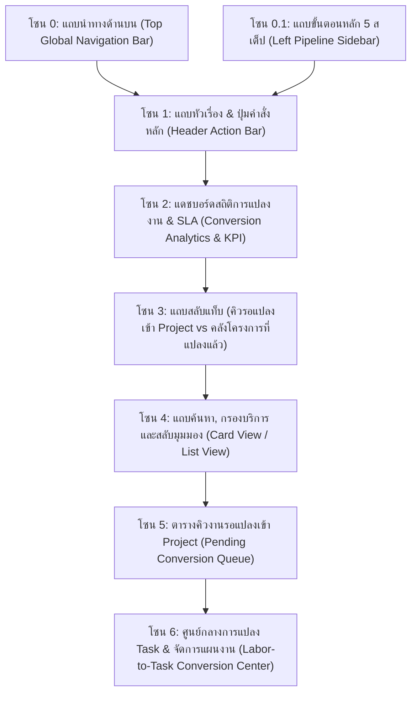
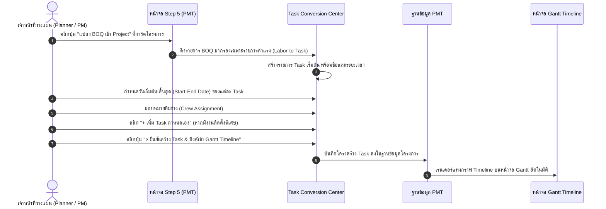

# 🎓 คู่มือฝึกอบรมการใช้งานหน้าจอระบบ PMT Flow
## โมดูลที่ 3: เจาะลึกหน้าจอ Step 3 — เตรียมแผนงานและทีมช่าง (Labor-to-Task & Work Preparation Training Screen Guide)
**รหัสหลักสูตร:** `TRN-PMT-STEP03` | **ระบบ:** PMT Flow (Store Project Management Tool) | **เวอร์ชัน:** 3.0 (6-Step Pipeline Architecture) | **กลุ่มเป้าหมาย:** เจ้าหน้าที่วางแผนโครงการ (Project Planner), วิศวกรโครงการ, หัวหน้าทีมช่าง, ผู้จัดการโครงการ (PM) และวิทยากรผู้ฝึกอบรม (Trainer)

---

## 📌 บทสรุปและวัตถุประสงค์หลักสูตร (Course Overview & Objectives)

หน้าจอ **Step 3: เตรียมแผนงานและทีมช่าง (Project Conversion: Labor-to-Task & Assign Tech)** *(เดิมอ้างอิงเป็น Step 5 ในโครงสร้างเก่า)* คือ **"ศูนย์บัญชาการแผนงานปฏิบัติการและการควบคุมเวลา (Operations & Scheduling Engine)"** ของระบบ 6-Step Pipeline ใน PMT Flow ทำหน้าที่เปลี่ยนรายการค่าใช้จ่ายจากเอกสาร BOQ ใน Step 1 และใบสั่งงาน Ticket ใน Step 2 ให้กลายเป็น **"แผนปฏิบัติงานจริง (Project Tasks)"** ที่แสดงผลบนแผนภูมิแท่ง Gantt Timeline เต็มรูปแบบใน Step 4 โดยมีแกนหลัก 4 ประการ:
1. การคัดกรองเฉพาะรายการ **"ค่าแรง/งานบริการ" (Labor Items Only)** มาสร้างเป็น Task งานช่าง และตัดรายการวัสดุออกโดยอัตโนมัติ (Labor-to-Task Rule)
2. การกำหนดช่วงเวลาปฏิบัติงานจริง (Start Date - End Date รูปแบบเวลา 24 ชม.) และการคำนวณจำนวนวันทำงาน (Duration) อัตโนมัติ
3. การจัดสรรกำลังคนและมอบหมายทีมช่าง (Crew & Multi-Technician Assignment)
4. การบันทึกโครงสร้างแผนงานลงสู่ระบบ PMT และส่งต่อเข้าสู่ **Step 4: แผนงาน Gantt และบันทึกช่างประจำวัน**

> [!IMPORTANT]
> **ขอบเขตและเงื่อนไขการเข้าสู่ Step 3 (Applicable Scope & Prerequisites):**  
> 1. **ต้องบันทึกการชำระเงิน/ออกใบเสร็จเรียบร้อยแล้วเท่านั้น (Payment Verified Gatekeeper):** โครงการจะสามารถแปลง BOQ เป็น Task ใน Gantt ได้ก็ต่อเมื่อได้รับการยืนยันการชำระเงิน (มี Ticket/ใบเสร็จรับเงิน หรือ `is_paid = true`) ใน Step 2/Step 4 เรียบร้อยแล้วเท่านั้น หากยังไม่ได้ชำระเงิน ระบบจะแสดงป้ายเตือนสีแดงกะพริบและมีปุ่มลัด `[💳 ไปบันทึกจ่ายเงิน (Step 4) ➔]` เพื่อป้องกันการเปิดแผนงานช่างก่อนได้รับเงินมัดจำ/ชำระเงิน
> 2. **ต้องมีรายการ BOQ ใน Step 1 เรียบร้อยแล้วเท่านั้น:** โครงการที่จะส่งต่อหรือแปลงเข้าสู่ Step 3 ได้ ต้องมีรายการวัสดุ/ค่าแรงใน BOQ อย่างน้อย 1 รายการ หากยังไม่มีข้อมูล BOQ ปุ่มย้ายไป Step 3 ทั้งในหน้า One-Stop Studio และระบบคิวงานจะถูกล็อกสถานะ (`disabled = true`) ไม่สามารถคลิกข้ามขั้นตอนได้เด็ดขาด
> 3. **การบันทึกยกเลิกงาน/ปิดการขายไม่ได้ (Close Lost & Cancellation):** หากลูกค้าปฏิเสธใบเสนอราคา ยกเลิกความต้องการ หรือเปลี่ยนใจ เจ้าหน้าที่สามารถกดปุ่ม `[🚫 Close Lost]` ในหน้า Studio หรือ `[🚫 บันทึก Close Lost (ยกเลิกงาน)]` ในหน้าต่างแปลง BOQ เพื่อระบุเหตุผลและเปลี่ยนสถานะโครงการเป็น `CANCELLED` ได้ทันที ระบบจะยุติกระบวนการและไม่ส่งต่อไปยังขั้นตอนถัดไป
> 4. **เฉพาะงานโครงการปรับปรุง (Renovate Projects):** หน้าจอ Step 3 นี้ถูกออกแบบมาสำหรับงานโครงการปรับปรุง/ต่อเติมที่มีรายการ BOQ ที่ต้องแปลงเป็นแผนงานช่างใน Gantt Chart  
> 5. **งานบริการติดตั้งด่วน (Quick Services):** ระบบจะ **ข้าม Step 3 และ Step 4 โดยอัตโนมัติ** ทันทีที่บันทึกชำระเงินและ Ticket ใน Step 2 เรียบร้อย โดยจะส่งตรงไปยัง **Step 5: ตรวจรับรองคุณภาพ (QC Online)** ทันที เพื่อความรวดเร็วในการส่งมอบงาน

### 🎯 วัตถุประสงค์การเรียนรู้สำหรับผู้เข้าอบรม (Learning Objectives):
1. **เข้าใจหลักการ Labor-to-Task Conversion:** เรียนรู้เหตุผลและอัลกอริทึมในการแยกแยะวัสดุออกจากงานบริการ เพื่อสร้าง Task งานช่างได้อย่างถูกต้อง
2. **ใช้งานตัวแก้ไข Task Editor ได้อย่างชำนาญ:** สามารถปรับแต่งชื่องาน วันเริ่มต้น วันสิ้นสุด (ระบบ 24 ชม.) และคำนวณระยะเวลา (Duration) ได้อย่างแม่นยำ
3. **จัดสรรทีมช่างแบบเดี่ยวและแบบทีม (Single & Multi-Crew Assignment):** รู้วิธีมอบหมายช่างหลักและช่างร่วมในแต่ละ Task
4. **เชื่อมโยงข้อมูลสู่ Step 4 (Gantt Timeline & Daily Work Logs):** เข้าใจความสัมพันธ์ระหว่าง Task แผนงาน และแถบสีความคืบหน้าบนหน้าจอ Gantt Chart
5. **ควบคุมการไหลของงานเข้าสู่ระยะติดตั้งจริง:** รู้วิธียืนยันสร้าง Project และส่งต่องานไปยังขั้นตอนการเข้าหน้างานและการตรวจ QC

---

## 🧭 กายวิภาคของหน้าจอ Step 5 (Screen Anatomy Breakdown)

โครงสร้างหน้าจอ Step 5 ประกอบด้วย **7 โซนสำคัญ** ดังนี้:

---

### 🔹 โซน 1: แถบหัวเรื่อง & ปุ่มคำสั่งหลัก (Header Action Bar)

| องค์ประกอบ | สัญลักษณ์ / สี | หน้าที่การทำงาน | คำแนะนำจาก Trainer |
| :--- | :--- | :--- | :--- |
| **หัวเรื่องหน้าจอ** | `Step 2 (Task ย่อย): Convert เข้า Project` | บ่งบอกขั้นตอนย่อยในการแปลงรายการค่าแรง BOQ เข้าสู่แผนงานโครงการ | ดีไซน์แบบ Clean & Minimal ช่วยให้อ่านข้อมูลและจัดการคิวงานได้สะดวก รวดเร็ว |
| **🧾 บันทึก Ticket & ใบเสร็จ** | ปุ่มสีเขียวมรกต ขอบเขียวอ่อน | ลิงก์ย้อนกลับไปยังหน้าจอ Step 2 (บันทึก Ticket & ใบเสร็จ) | ใช้สลับกลับไปตรวจสอบใบเสร็จหรือออก Ticket เพิ่มเติม |
| **⚡ บันทึก BOQ เข้า Project** | ปุ่มสีส้ม-ม่วง ที่แต่ละแถวในตารางคิวงาน | เปิดหน้าต่างแปลงรายการค่าแรง BOQ เป็น Task แผนงาน Gantt สำหรับ Job นั้นๆ | กดดำเนินการรายโครงการได้ทันทีจากตารางคิวงานหลัก |
| **ตั้งค่า SLA** | ปุ่มไอคอนฟันเฟือง `⚙️` ในแถบสถิติ | ปรับแต่งเกณฑ์เวลาเตือน SLA ของคิวงาน (ค่าเริ่มต้น 12 ชม.) | สังเกตงานที่ใกล้เกินกำหนดเวลา |

---

### 🔹 โซน 2: แดชบอร์ดสถิติ & KPI (Project Conversion Analytics)

1. **Card 1 — โครงการรอแปลงเข้า Project (Pending Queue):** งานที่มี BOQ และ Ticket ครบแล้วแต่ยังไม่ได้สร้างตาราง Task
2. **Card 2 — โครงการที่แปลงเข้า Gantt แล้ว (Active Projects):** งานที่มีแผนงานปฏิบัติการชัดเจน และกำลังอยู่ระหว่างการทำงาน
3. **Card 3 — จำนวน Task ทั้งหมดในระบบ (Total Scheduled Tasks):** ปริมาณงานย่อยที่ทีมช่างต้องปฏิบัติงาน
4. **Card 4 — สถานะ SLA (Time-to-Schedule):** นับถอยหลังตามเกณฑ์เวลามาตรฐาน เพื่อให้มั่นใจว่าลูกค้าจะได้รับตารางงานตรงเวลา

---

## 🛠️ ขั้นตอนการปฏิบัติงานมาตรฐาน (Step-by-Step SOP)

---

### ขั้นตอนที่ 1: การเปิดศูนย์กลางการแปลง Task (Opening Conversion Center)

1. ในหน้าจอ Step 5 เลือกงานจากแท็บ **"รายการโครงการที่พร้อมแปลง BOQ เข้าแผนงาน"**
2. คลิกปุ่มสีส้ม **`แปลง BOQ เป็น Task ใน Gantt`** หรือคลิกที่ปุ่มจัดการในการ์ดโครงการ
3. หน้าต่าง **"ศูนย์กลางการบันทึก BOQ เข้าแผนงานโครงการ"** จะเปิดขึ้น พร้อมแสดงข้อมูลสรุปโครงการ (รหัส Job, ชื่อลูกค้า, ที่อยู่, ทีมช่าง)

---

### ขั้นตอนที่ 2: การตรวจสอบและปรับแต่ง Task งานช่าง (Task Scheduling)

1. ระบบจะดึงรายการที่เป็นหมวดหมู่ **"ค่าแรง/งานบริการ"** จาก BOQ มาแสดงเป็นแถวรายการ Task โดยอัตโนมัติ
2. ในแต่ละรายการ Task ให้ปรับแต่งข้อมูล:
   - **ชื่องาน (Task Name):** สามารถปรับแก้ไขให้อ่านเข้าใจง่ายสำหรับทีมช่าง เช่น `รื้อถอนเคาน์เตอร์เดิม`, `เดินท่อประปาและจุดต่อซิงค์`, `ติดตั้งตู้แขวนครัว`
   - **วันที่เริ่มต้น (Start Date):** เลือกวันนัดเริ่มปฏิบัติงานของ Task นั้น
   - **วันที่สิ้นสุด (End Date):** เลือกวันแล้วเสร็จของ Task
   - **ระยะเวลา (Duration):** ระบบจะคำนวณจำนวนวันทำงานให้อัตโนมัติ (เช่น 1 วัน, 3 วัน)
   - **ทีมช่างผู้รับผิดชอบ (Key ชื่อช่าง / เลือกช่างจาก INT):**
     - **การพิมพ์ Key ระบุชื่อช่างได้อย่างอิสระ:** ช่องกรอกชื่อช่างเป็น Text Input ผู้ใช้สามารถพิมพ์ (Key in) ระบุชื่อช่างหรือทีมช่างคนใดก็ได้ตามต้องการ (เช่น นาย ศุภรัตน์ เป๋า, ช่างวิชัย, ทีมช่าง BMT)
     - **ปุ่ม "เลือกช่างจาก INT" (ทำไว้รอเชื่อมต่อ API):** แต่ละแถวมีปุ่ม `[เลือกช่างจาก INT]` เมื่อคลิกจะเปิดหน้าต่างแสดงรายชื่อช่างจริงจากระบบ INT พร้อมคะแนนรีวิว เช่น *สมชาย ใจดี (★ 4.9)*, *อนุรักษ์ มีสุข (★ 4.8)*, *กมลวรรณ วงศ์วิบูลย์ (★ 4.7)* พร้อมปุ่ม `[ยืนยันเลือกช่าง (Confirm)]` เพื่อนำชื่อช่างมาใส่ในช่อง Key ทันที
     - **ปุ่ม "เลือกช่างจาก INT ทั้งหมด" (Batch Selection):** ที่แถบเครื่องมือด้านบน สามารถกดปุ่มเพื่อจัดสรรคิวเลือกช่างจาก INT ให้ครบทุกงานในคลิกเดียว
     - **ดีไซน์กระชับ สะอาดตา (Minimal & Focused):** คอลัมน์ผู้รับผิดชอบคงไว้เฉพาะช่อง Key ชื่อช่างและปุ่มเลือกช่างจาก INT เท่านั้น ไม่มีปุ่มลัดเสริมที่ซ้ำซ้อน เพื่อความรวดเร็วและอ่านง่ายสูงสุด
3. **การเพิ่ม Task เพิ่มเติม:** หากมีงานเก็บรายละเอียดที่ไม่ได้อยู่ใน BOQ ให้กดปุ่ม **`+ แทรกงานใหม่`**
4. **การรีเซ็ต:** หากต้องการกลับไปใช้ค่าเริ่มต้นจาก BOQ ให้กดปุ่ม **`🔄 รีเซ็ตจาก BOQ`**

---

### ขั้นตอนที่ 3: การยืนยันและซิงค์ข้อมูลเข้าสู่ Gantt Timeline

1. ตรวจสอบความต่อเนื่องของตารางงาน (Task Dependencies & Sequence) ให้แน่ใจว่างานที่ต้องทำก่อน-หลังเรียงลำดับอย่างถูกต้อง
2. คลิกปุ่มสีส้ม **`⚡ ยืนยันสร้าง Task & ซิงค์เข้า Gantt Timeline`**
3. ระบบจะบันทึก Task ทั้งหมดเข้าสู่โครงการ และเปลี่ยนสถานะงานเป็น **`IN_PROGRESS (60%)`**
4. สามารถคลิกปุ่ม **`ดูหน้า Gantt เต็มรูป`** เพื่อตรวจสอบการแสดงผลแท่งสี Timeline ทันที

---

## 📊 การอ่านและใช้งานแผนงาน Gantt Timeline เต็มรูปแบบ (`page-gantt`)

เมื่อโครงการถูกบันทึก Task แล้ว ข้อมูลจะปรากฏบนหน้าจอ **แผนงาน Gantt เต็มรูป (Gantt Timeline)**:

1. **แกนเวลาและการสลับมุมมอง รายวัน / รายสัปดาห์ / รายเดือน (Multi-Scale Time Axis: Day / Week / Month):**
   - **ปุ่มสลับมุมมองสเกลเวลา (Time Scale Switcher):** ผู้ใช้สามารถกดสลับมุมมองได้ทันทีที่แถบเครื่องมือด้านบน:
     - 📅 **รายวัน (Day View):** แสดงคอลัมน์ปฏิทินรายวันอย่างละเอียด เหมาะสำหรับช่างหน้างานและ QC ตรวจสอบสถานะการอัปเดตงานแบบวันต่อวัน
     - 🗓️ **รายสัปดาห์ (Week View):** จัดกลุ่มแกนเวลาเป็นสัปดาห์ละ 7 วัน (`สัปดาห์ที่ 1`, `สัปดาห์ที่ 2` พร้อมช่วงวันที่) เหมาะสำหรับ AE / PM ติดตามความคืบหน้าระดับโครงการขนาดกลาง ไม่ต้องเลื่อนจอยาวเกินไป
     - 📆 **รายเดือน (Month View):** แสดงแกนเวลาเป็นรายเดือน (เช่น `กันยายน 2569`, `ตุลาคม 2569`) เหมาะสำหรับผู้บริหารตรวจสอบภาพรวมโครงการระยะยาวและ Milestone สำคัญ
   - **การระบุตำแหน่ง "วันนี้ / สัปดาห์นี้ / เดือนนี้" (Realtime Indicator):**
     - มี **ป้ายกำกับสีแดง `[ วันนี้ / สัปดาห์นี้ / เดือนนี้ ]`** บนส่วนหัวคอลัมน์ปัจจุบัน พร้อม **เส้นประสีแดงแนวตั้ง (Vertical Red Dashed Line)** และจุดมาร์กเกอร์สีแดงลากผ่านทุกแถวงาน
   - **แถบจำลองวัน (Simulation Toolbar):** มีปุ่มลัด `14 ก.ย.`, `15 ก.ย.`, `16 ก.ย.`, `17 ก.ย.`, `วันจริง` เพื่อให้ผู้ตรวจสอบและเจ้าหน้าที่ทดสอบสถานะแบบ Real-time ได้
2. **การจัดกลุ่มตามทีมช่าง (Grouping by Technician):**
   - แถวของ `Team A (สมศักดิ์)` แสดงรายการงานทั้งหมดที่สมศักดิ์รับผิดชอบ
   - แถวของ `Team B (ประเสริฐ)` แสดงรายการงานของประเสริฐ ช่วยป้องกันการจัดตารางงานชนกัน (Overbooking)
3. **ความหมายของสีแท่งงาน Real-time (Status Color Coding):**
   - 🟩 **สีเขียว (`✓ เสร็จสิ้น`):** งานที่ช่างหรือ QC บันทึกผลเสร็จสมบูรณ์ 100% แล้ว
   - 🟥 **สีแดง (`ยังไม่อัปเดต / เลยกำหนด`):** งานที่ยังไม่ได้ลงบันทึก หรือเกินกำหนดระยะเวลาแล้ว
   - 🟪 **สีม่วง (`X วัน` / `Xd`):** ช่วงเวลาที่ยังมาไม่ถึงตามแผนงาน หรืออยู่ระหว่างดำเนินการ
4. **นโยบายการอัปเดตงานย้อนหลัง (3-Day Retroactive Policy):**
   - **อัปเดตย้อนหลังได้ไม่เกิน 3 วัน:** ช่างหรือ QC สามารถคลิกที่แท่งสีแดงบน Gantt หรือคลิกเลือกวันที่ในแถบความคืบหน้าของโมดอล เพื่อเปิดฟอร์มลงบันทึกงานย้อนหลังได้ไม่เกิน 3 วัน
   - **ระบบล็อกเมื่อเกิน 3 วัน:** หากเลยกำหนดเกิน 3 วัน ระบบจะปรับเป็นสถานะ `เกิน 3 วัน (ล็อค)` และปฏิเสธการบันทึกย้อนหลังทันทีเพื่อความโปร่งใสและถูกต้องของข้อมูล
5. **แถบเลื่อนและปุ่มสลับมุมมอง:** สามารถกดสลับดูแบบ `Card View`, `List View` หรือ `Gantt Chart` ได้ตามความถนัด (ค่าเริ่มต้นของระบบเป็น List View ตามมาตรฐาน)
6. **การจัดการงานย่อย (Subtasks Breakdown Management):**
   - **ปุ่ม `+ Subtask` และปุ่ม `จัดการ`:** ในแต่ละแถวของ Task บนตารางแถบงาน Timeline (ทุก Scale: Day/Week/Month) จะมีปุ่ม `[+ Subtask]` เพื่อเพิ่มงานย่อยด่วน และปุ่ม `[จัดการ]` เพื่อเปิดหน้าต่างโมดอลจัดการงานย่อยฉบับสมบูรณ์
   - **การแบ่งงานย่อยอัตโนมัติ (⚡ Auto-Split):** กดปุ่ม `⚡ แบ่งย่อยอัตโนมัติ` เพื่อให้ระบบคำนวณระยะเวลา (Duration) และแบ่งเฟสงานย่อยตามประเภทงาน (เตรียมฐานราก, โครงสร้างหลัก, ติดตั้งอุปกรณ์, ทดสอบระบบ/ส่งมอบ) โดยมีช่วงวันที่ต่อเนื่องกันอย่างแม่นยำ
   - **การแสดงผลแถบสี Subtask บน Timeline:** แถวของ Subtask จะแสดงใต้ Task หลักพร้อมสัญลักษณ์ `└─` และแถบสีความคืบหน้ารายวัน (สีเขียว DONE, สีส้ม IN_PROGRESS, สีม่วง TODO)
   - **เชื่อมโยงกับ Daily Work Log:** คลิกที่แถบสี Subtask หรือปุ่ม `[บันทึกช่าง]` เพื่อเปิดบันทึกงานช่างประจำวันและแนบรูปถ่าย 5 รูปสำหรับงานย่อยนั้นๆ
   - **การคำนวณความคืบหน้ารวม:** เมื่อ Subtask มีการปรับสถานะหรือ progress % ระบบจะคำนวณและซิงค์ % ความคืบหน้าของ Task หลัก และบันทึกผ่าน REST API สู่เซิร์ฟเวอร์แบบ Real-time

7. **มาตรฐานการบันทึกงานช่างประจำวัน และการส่งมอบงานเข้าสู่ QC (Daily Work Log & QC Handover):**
   - **ระบบเวลา 24 ชั่วโมงบริสุทธิ์ (00:00 - 23:59 น.):** ทุกแบบฟอร์มบันทึกเวลาใช้ Custom Dropdown 24 ชั่วโมง ปลอดสัญลักษณ์หรือปุ่ม AM/PM 100% พร้อมคำนวณชั่วโมงการทำงานอัตโนมัติ (เช่น 08:30 - 17:00 น. รวม 8 ชม. 30 นาที) และรองรับกะข้ามคืน
   - **มาตรฐานวันที่ DD/MM/YYYY:** ทุกหน้าจอแสดงผลวันที่ในรูปแบบ `DD/MM/YYYY` (เช่น 24/09/2026) ป้องกันความคลาดเคลื่อนจาก OS Locale
   - **ภาพถ่ายหน้างาน 5 สเตจ:** บังคับจัดเก็บภาพ 5 จุดมาตรฐาน ได้แก่ ก่อนเริ่มงาน (Before), ระหว่างทำ 1 (During 1), ระหว่างทำ 2 (During 2), ความปลอดภัย & ทดสอบระบบ (Testing), และงานเสร็จสมบูรณ์ (After) พร้อมป๊อปอัป Lightbox Modal Preview
   - **การคำนวณความคืบหน้าระหว่างวัน (Progressive Calculation):** ในรอบวันระหว่างทาง ความคืบหน้าจะคำนวณตามสัดส่วนจริง (เช่น 33%, 67%) โดยมี In-Progress Guard ป้องกันไม่ให้กระโดดเป็น DONE หรือ 100% ก่อนเสร็จสิ้นจริง
   - **การส่งมอบงานเข้าสู่ QC (QC Handover):** เมื่องานครบกำหนดตามแผน หรือผู้ใช้กดยืนยันเสร็จสมบูรณ์ 100% (User ยืนยัน) Task จะเปลี่ยนเป็น `DONE` (100%) และ Job จะเปลี่ยนเป็น `QC_PENDING` (85%) พร้อมบันทึก `step_timestamps.qc_pending_at` และยืนยันคิวตรวจ QC (`core_qc_bookings.status = 'CONFIRMED'`) ทันที
   - **การย้อนกลับสถานะอัตโนมัติ (Auto-Rollback Integrity):** หากมีการลบรายการบันทึกงานประจำวันของ Task ที่เสร็จสิ้นไปแล้ว ระบบจะย้อนสถานะ Task และ Job กลับเป็น `IN_PROGRESS` (Progress 70%) ลบค่า `qc_pending_at` และคืนสถานะคิวตรวจ QC เป็น `PENDING_CONFIRM` ทั้งในหน่วยความจำและ PostgreSQL แบบ Real-time ทันที

---

## 💡 แผนการสอนสำหรับ Trainer (Workshop Hands-on Guide)

### 🎯 บททดสอบปฏิบัติการประจำห้องเรียน (30 นาที):
**สถานการณ์สมมติ:** "โครงการ Renovate ครัวของลูกค้า คุณวิภาดา (`JOB26090900003`) มีรายการค่าแรงใน BOQ 3 รายการ ให้ผู้เรียนดำเนินการแปลงเข้าแผนงานดังนี้"

1. **โจทย์ข้อที่ 1:** เปิดหน้าต่างแปลง Task และตรวจเช็กว่ามีรายการค่าแรง 3 รายการขึ้นมาถูกต้องหรือไม่
2. **โจทย์ข้อที่ 2:** ปรับวันเวลาของ Task ที่ 1 (งานรื้อถอน) ให้เริ่มวันที่ 10 ก.ย. และจบวันที่ 11 ก.ย. (Duration = 2 วัน)
3. **โจทย์ข้อที่ 3:** ปรับวันเวลาของ Task ที่ 2 (งานประปา) ให้เริ่มวันที่ 12 ก.ย. และจบวันที่ 14 ก.ย. (Duration = 3 วัน)
4. **โจทย์ข้อที่ 4:** มอบหมายให้ `Team A` รับผิดชอบ Task ที่ 1 และมอบหมายให้ `Team B` รับผิดชอบ Task ที่ 2
5. **โจทย์ข้อที่ 5:** กดยืนยันสร้าง Task แล้วเปิดหน้าจอ **แผนงาน Gantt เต็มรูป** เพื่อดูการแสดงผลของทั้งสองทีมช่าง

---

## ❓ คำถามที่พบบ่อยและข้อควรระวัง (FAQ & Best Practices)

> [!IMPORTANT]
> **Q: ทำไมรายการวัสดุใน BOQ เช่น กระเบื้อง, ปูน, ก๊อกน้ำ ไม่ขึ้นมาให้สร้าง Task?**  
> **A:** เพราะระบบทำงานตาม **Labor-to-Task Rule** ซึ่งออกแบบมาให้จัดการเฉพาะ "เวลาและแรงงานช่าง" วัสดุอุปกรณ์จัดเป็นหมวดต้นทุน ไม่ใช่งานที่ต้องลงเวลาในปฏิทินช่าง

> [!WARNING]
> **กฎเกณฑ์สำคัญ (Gantt & BOQ Strict Business Rule):**  
> 1. **โครงการที่ยังไม่มีการบันทึก BOQ จะไม่ปรากฏในหน้าจอแผนงาน Gantt เต็มรูป (`page-gantt`) และไม่สามารถข้ามมาจัดตาราง Gantt ได้** จนกว่าจะผ่านขั้นตอน Step 3: นำ BOQ เข้าระบบ หรือ Step 5: บันทึก BOQ เข้า Project เรียบร้อยแล้ว  
> 2. **ในหน้าจอแผนงาน Gantt เต็มรูป จะไม่มีปุ่มนำเข้าไฟล์ BOQ โดยเด็ดขาด** เพื่อรักษาความถูกต้องของ Pipeline และป้องกันความสับสน โดยกระบวนการนำเข้า/แก้ไข BOQ ต้องดำเนินการผ่าน Step 3 หรือ Step 5 เท่านั้น

> [!TIP]
> **Q: หากต้องการเลื่อนวันนัดหมายของช่าง สามารถเลื่อนบน Gantt ได้เลยหรือไม่?**  
> **A:** สามารถเข้าไปแก้ไขที่ Task ใน Step 5 หรือคลิกที่แท่งงานในหน้า Gantt เพื่อปรับปรุงวันเริ่มต้น-สิ้นสุดใหม่ ระบบจะคำนวณและปรับตารางงานให้ทันที

> [!TIP]
> **Q: ไฟล์ Excel BOQ ที่นำเข้าถูกจัดเก็บไว้ตรงไหน และสามารถดาวน์โหลดดูไฟล์ย้อนหลังได้จากที่ใด?**  
> **A:** ไฟล์ Excel/CSV ต้นฉบับที่ผู้ใช้นำเข้า จะถูกอัปโหลดจัดเก็บบนเซิร์ฟเวอร์อย่างปลอดภัยที่ `data/boq_files/<jobId>/<timestamp>_<filename>` พร้อมบันทึก metadata ไว้ในฐานข้อมูลโครงการ (`job.boq_original_file`)  
> โดยในหน้าต่าง **"⚡ นำเข้า BOQ สู่ Project Tasks & แผนงาน Gantt"** จะมีแถบการ์ดสีเขียวแสดงชื่อไฟล์ ขนาด วันเวลาที่นำเข้า พร้อมปุ่ม **"📥 ดาวน์โหลดไฟล์"** ให้กดดาวน์โหลดไฟล์ต้นฉบับได้ทันที และหากมีการกดปุ่ม `[นำเข้าไฟล์ BOQ (.csv/.xlsx)]` เพื่อนำเข้าไฟล์ใหม่ ระบบจะทำการอัปโหลดบันทึกไฟล์นั้นขึ้นเซิร์ฟเวอร์ให้อัตโนมัติทันที นอกจากนี้ยังสามารถดาวน์โหลดไฟล์ต้นฉบับได้จากหน้า Unified Studio (Step 1/Step 3), หน้ารายการคำสั่งซื้อ (Job List) และหน้าต่าง Preview BOQ อีกด้วย

> [!IMPORTANT]
> **Q: การแก้ไขวันเริ่ม-สิ้นสุด, ทีมช่าง, การเพิ่มงานย่อย (Subtasks) และการแทรก Task บน Gantt ถูกบันทึกลงฐานข้อมูล Database หรือไม่?**  
> **A:** บันทึกลงฐานข้อมูลจริงใน PostgreSQL (`core_jobs.tasks` และ `core_qc_bookings`) แบบ Realtime ทันที 100%:  
> 1. เมื่อแก้ไขวันเริ่ม-สิ้นสุด หรือทีมช่าง ระบบจะยิง `PUT /api/v1/jobs/:id/tasks/:taskId` ไปบันทึกลง Database พร้อมอัปเดตวันจองตรวจ QC ล่วงหน้า 5 วัน  
> 2. การเพิ่ม/แก้ไขงานย่อย (Subtasks) จะถูกซิงค์โครงสร้าง Array เข้าฟิลด์ `tasks` ใน Database อัตโนมัติ  
> 3. การกดปุ่ม `[+ แทรก Task งาน]` จะสร้าง Task พร้อมบันทึก `POST /api/v1/jobs/:id/tasks` ลง Database ทันที  
> 4. มีระบบ Fallback ID Matching & Auto-Upsert เพื่อป้องกันปัญหา Task ID Mismatch ทำให้ข้อมูลไม่สูญหายและตรงกันทุกเบราว์เซอร์

---

**จัดทำโดย:** ฝ่ายพัฒนาหลักสูตรและฝึกอบรม PMT Flow  
**รหัสเอกสาร:** `TRN-PMT-STEP05-v2.0`  
**สถานะการรับรอง:** Approved Standard (Enterprise Operations)