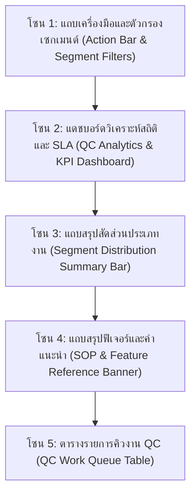
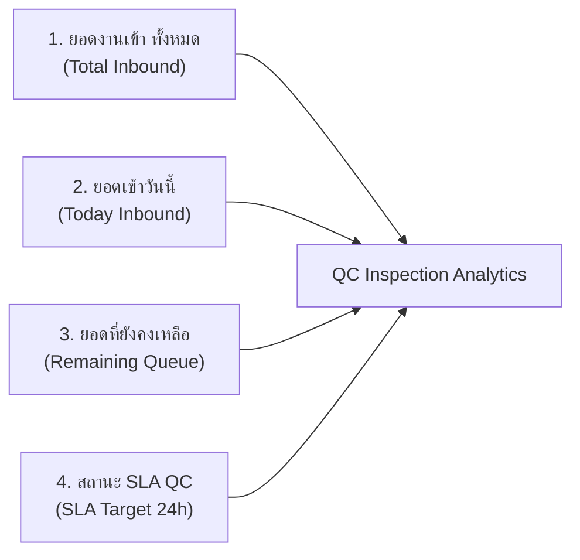
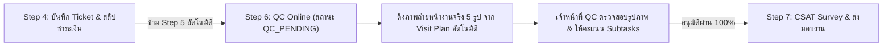
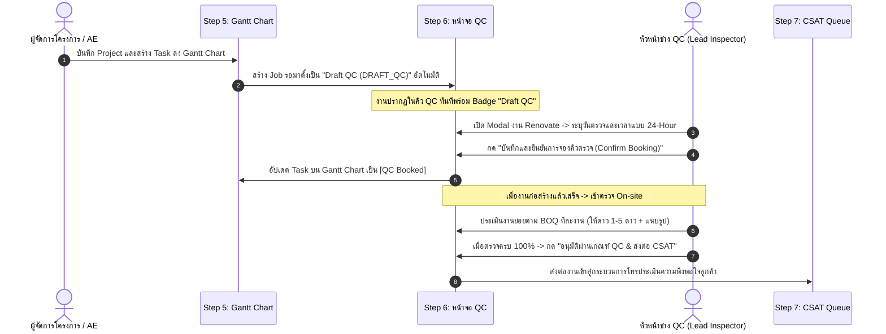

# 🎓 คู่มือฝึกอบรมการใช้งานหน้าจอระบบ PMT Flow
## โมดูลที่ 6: เจาะลึกหน้าจอการควบคุมคุณภาพ การจองช่าง QC ล่วงหน้า และการประเมินงานย่อยตาม BOQ
**รหัสหลักสูตร:** `TRN-PMT-QC01` | **เวอร์ชัน:** 3.0 (Advance Booking & Sub-Task Scoring Standard) | **ระบบ:** PMT Flow (Store Project Management Tool)  
**กลุ่มเป้าหมาย:** เจ้าหน้าที่ควบคุมคุณภาพ (QC Inspector), หัวหน้าช่าง QC (Lead QC Engineer), ผู้จัดการโครงการ (PM), ทีมผู้รับเหมา (Technicians), เจ้าหน้าที่ Contact Center (CSAT)

---

## 📌 บทสรุปและวัตถุประสงค์หลักสูตร (Course Overview & Objectives)

หน้าจอ **ตรวจคุณภาพ (QC - Quality Control Inspection)** คือ **"ประตูตรวจรับรองมาตรฐานวิศวกรรมและความปลอดภัย (Engineering Quality & Safety Gatekeeper)"** ของระบบ PMT Flow มีหน้าที่รับช่วงต่องานเพื่อทำการตรวจสอบ ประเมินมาตรฐานแบบ **Zero-Defect Standard** ก่อนส่งมอบพื้นที่ให้ลูกค้าและเข้าสู่ขั้นตอนประเมินความพึงพอใจ (CSAT)

ในเวอร์ชันปัจจุบัน ระบบได้ยกระดับความสามารถและแยกสายการทำงานออกเป็น **2 รูปแบบอย่างชัดเจน**:
1. **งานบริการด่วน (Quick Services):** ตรวจสอบผลงานผ่านรูปถ่ายหน้างาน (Photo Audit Online) เปรียบเทียบก่อน-หลัง พร้อมตรวจสอบมาตรฐานความปลอดภัย 4 ด้าน (4-Point Safety Checklist)
2. **งานโครงการปรับปรุง (Renovate Projects):** มีความพิเศษและแตกต่างจากทุกส่วนงานในระบบ โดยทันทีที่บันทึกโครงการเข้าสู่ Gantt Chart (Step 5) ระบบจะสร้าง Job รอตั้งเป็น **`Draft QC` (`DRAFT_QC`)** ล่วงหน้า เพื่อทำการจองคิวหัวหน้าช่าง QC (Advance QC Lead Inspector Booking) และเมื่อตรวจรับงานจะต้องทำการ **ประเมินและให้คะแนนแยกตามงานย่อย (BOQ Sub-Tasks Evaluation)** แบบ 1–5 ดาว พร้อมแนบรูปถ่ายหลักฐานเฉพาะแต่ละงาน และต้องตรวจครบ 100% จึงจะปลดล็อกการส่งต่อไปยัง CSAT

### 🎯 วัตถุประสงค์การเรียนรู้ (Learning Objectives):
1. **เข้าใจแดชบอร์ด UX/UI สไตล์ Step 1:** อ่านค่าตัวชี้วัด KPI 4 ใบ (ยอดเข้าทั้งหมด, เข้าวันนี้, ยอดคงเหลือ, สถานะ SLA) และวิเคราะห์สัดส่วนประเภทงาน Quick / Renovate ผ่าน Distribution Summary Bar
2. **เข้าใจวงจรชีวิตงาน Renovate (Draft QC & Advance Booking):** ทราบเหตุผลและขั้นตอนการสร้าง Draft QC อัตโนมัติเมื่อมี Project ใน Gantt Chart รู้วิธีจองคิวช่าง QC ล่วงหน้าด้วยระบบเวลา 24 ชั่วโมง และการกดยืนยันนัดหมาย (Confirm Booking)
3. **ใช้งานการประเมินงานย่อย BOQ (Sub-Task Evaluation):** สามารถให้คะแนน 1-5 ดาว (⭐), ระบุสถานะ ผ่าน (PASS) / มีข้อบกพร่อง (DEFECT), แนบรูปถ่ายหลักฐานเฉพาะงานย่อย และเปิดดูรูปด้วย Lightbox Preview
4. **ปฏิบัติตามเกณฑ์ Gating ส่งต่อ CSAT 100%:** เข้าใจเงื่อนไขความสมบูรณ์ในการตรวจรับรองผลงานก่อนส่งต่อไปยังฝ่าย Contact Center (Step 7: CSAT & After-Sales Service)
5. **เข้าถึงคู่มือและการอบรมในระบบ:** สามารถเปิดคู่มือและ Feature Reference ได้โดยตรงจากหน้าจอ QC หรือผ่านหน้าศูนย์รวมคู่มือฝึกอบรม

---

## 🧭 กายวิภาคของหน้าจอตรวจคุณภาพ QC (Screen Anatomy Breakdown)

โครงสร้างหน้าจอ QC ได้รับการออกแบบตามมาตรฐานเดียวกับหน้าจอรับคำสั่งซื้อ (Step 1) ประกอบด้วย **5 โซนหลัก** ดังนี้:

---

### 🔹 โซน 1: แถบเครื่องมือและตัวกรองเซกเมนต์ (Action Bar & Segment Filters)

| องค์ประกอบ | สัญลักษณ์ / สี | หน้าที่การทำงาน | คำแนะนำสำหรับผู้ใช้งาน |
| :--- | :--- | :--- | :--- |
| **ปุ่มสลับ Segment (Segment Switcher)** | `ทั้งหมด` / `งานด่วน (Quick)` / `งานปรับปรุง (Renovate)` | กรองแสดงเฉพาะกลุ่มงานด่วนหรืองานรีโนเวท พร้อมแสดงตัวเลขจำนวนงานในแต่ละกลุ่ม | ใช้สำหรับสลับดูเฉพาะงาน Renovate ที่ต้องจองคิวช่าง หรือดูงานด่วนที่รอตรวจรูป |
| **ตัวกรองประเภทบริการ (Service Filter)** | Dropdown Menu | กรองเจาะจงประเภทบริการ เช่น EV Charger, ทำน้ำอุ่น, ปั๊มน้ำ, รีโนเวทห้องน้ำ, Renovate ครัว | กรองเพื่องานที่ตรงกับความเชี่ยวชาญของผู้ตรวจ |
| **คู่มือ & Feature การทำงาน Step 6** | ปุ่มไอคอนหนังสือสีแบรนด์ `[📖 คู่มือ & Feature การทำงาน Step 6 (QC)]` | เปิดหน้าต่างคู่มือการปฏิบัติงานฉบับเต็มขึ้นมาบนหน้าจอทันที | กดเพื่อตรวจสอบขั้นตอนปฏิบัติหรือทบทวนข้อกำหนดได้ตลอดเวลา |
| **Export รายงาน QC** | ปุ่มไอคอน CSV สีเขียว | ดาวน์โหลดไฟล์รายงานผลการตรวจ QC ในรูปแบบ Spreadsheet CSV | ใช้สำหรับสรุปรายงานประจำสัปดาห์หรือส่งต่อฝ่ายบริหาร |
| **จำลองงานเข้า QC** | ปุ่มไอคอนสายฟ้าสีม่วง `[⚡ จำลองงานเข้า QC]` | สร้างชุดข้อมูลตัวอย่าง Quick และ Renovate เข้าสู่คิวเพื่อใช้ทดสอบ | ใช้ในขั้นตอนการเรียนรู้หรือฝึกอบรม (Training Workshop) |

---

### 🔹 โซน 2 & 3: แดชบอร์ดสถิติ 4 KPI & แถบสัดส่วนงาน (KPI Cards & Segment Bar)

หน้าจอ QC ใช้โครงสร้างการวัดผลเช่นเดียวกับ Step 1 เพื่อให้ผู้จัดการโครงการและหัวหน้างานควบคุมคิวงานได้อย่างแม่นยำ:

1. **ยอดงานเข้า ทั้งหมด (Card 1 - สีฟ้า):** แสดงจำนวนโครงการทั้งหมดที่เข้ามาสู่กระบวนการตรวจรับรองคุณภาพ QC คลิกเพื่อแสดงงานทั้งหมด
2. **ยอดเข้าวันนี้ (Card 2 - สีเขียว):** จำนวนงานที่ถูกส่งเข้าคิว QC ในรอบวันปัจจุบัน ช่วยให้ประเมิน Load งานใหม่ที่เพิ่มขึ้นในแต่ละวัน
3. **ยอดที่ยังคงเหลือ (Card 3 - สีส้ม):** จำนวนงานที่ยังค้างอยู่ในสถานะรอตรวจและรอการรับรอง (Active Queue) ต้องเร่งบริหารจัดการไม่ให้คั่งค้าง
4. **สถานะ SLA QC (Card 4 - สีแดง/ชมพู):** จำนวนงานที่เกินเกณฑ์กำหนดเวลา (Default: 24 ชั่วโมง) หากตัวเลขนี้มากกว่า 0 ต้องเร่งดำเนินการเป็นลำดับแรก
5. **แถบกระจายสัดส่วนงาน (Segment Distribution Summary Bar):** แสดงอัตราส่วนเปรียบเทียบระหว่างงาน **Quick Services (สีส้ม)** และงาน **Renovate Projects (สีม่วงคราม)** พร้อมแสดงเปอร์เซ็นต์งานที่ตรวจผ่านแล้ว (Passed) และงานที่ต้องส่งกลับไปแก้ไข (Defect/Rework)

---

### 🔹 โซน 5: ตารางรายการคิวงาน QC (QC Work Queue Table)

- **การเรียงลำดับงานใหม่ (Latest on Top):** งานที่เข้ามาใหม่ล่าสุดจะถูกจัดลำดับให้อยู่ **แถวบนสุดเสมอ**
- **สัญลักษณ์ `NEW!`:** งานที่รับเข้าในวันปัจจุบันจะมีป้าย Badge `NEW!` สีเขียว/ส้มเด่นชัด เพื่อให้ผู้ตรวจเห็นงานเข้าใหม่ได้ทันที
- **คอลัมน์ขั้นตอนและแถบสถานะ (Progress & Stage):**
  - แสดงสถานะการจองคิวช่าง: `Draft QC (รอจองคิว)`, `จองคิวแล้ว (รอตรวจ)`, `ผ่านการตรวจรับรอง`
  - สำหรับงาน Renovate: แสดงความคืบหน้าการตรวจงานย่อย เช่น `2/4 งาน (50%)`
- **ปุ่ม Action:**
  - **[ตรวจและให้คะแนน (QC Detail)]**: คลิกเพื่อเปิด Modal ดูรายละเอียดโครงการ ตรวจรูปภาพ และให้คะแนนงานย่อย
  - **[จองคิวช่าง QC]**: สำหรับงาน Renovate ที่ยังอยู่ในสถานะ Draft สามารถคลิกเพื่อเข้าสู่ส่วนจองคิวช่างได้ทันที

---

## ⚡ กระบวนการตรวจ QC Online สำหรับงานบริการด่วน (Quick Services Online QC Workflow)

งานบริการด่วน (Quick Services เช่น งานติดตั้งเครื่องทำน้ำอุ่น, เครื่องปรับอากาศ, ปั๊มน้ำ, โซลาร์เซลล์, Digital Door Lock) มีกระบวนการส่งมอบงานที่กระชับและรวดเร็วเป็นพิเศษ โดยมีข้อกำหนดการทำงานดังนี้:

### 1. การข้ามขั้นตอน Step 5 (Fast-track Direct Transition)
- ทันทีที่เจ้าหน้าที่บันทึกการชำระเงินและ Ticket ใน Step 4 สำหรับงาน Quick Services:
  - ระบบจะ **ข้าม Step 5 (Project Conversion & Gantt)** โดยอัตโนมัติ เนื่องจากงานด่วนไม่มีความจำเป็นต้องแตกเป็น Gantt Timeline หลายสัปดาห์
  - ปรับสถานะงานเป็น **`QC_PENDING` (รอตรวจ Online)** ความคืบหน้า 85%
  - ระบบจะสลับหน้าจอมาที่ **หน้า QC (Step 6) ➔ เซกเมนต์ Quick Services** และเปิดแบบฟอร์มตรวจรับรอง Online ให้ทันที

### 2. แบนเนอร์แจ้งเตือนและการซ่อนการจองคิว On-site
- ภายในหน้าต่างตรวจรับรองงาน (QC Detail Modal) ระบบจะแสดงแบนเนอร์สีฟ้า:  
  `⚡ การตรวจรับรองคุณภาพงานด่วน (Quick Services — ตรวจสอบภาพถ่ายแบบ Online)`
- ระบบจะ **ซ่อนการ์ดจองคิวช่าง On-site** ออกไปโดยอัตโนมัติ เนื่องจากงานด่วนใช้การตรวจแบบ Online เท่านั้น ไม่ต้องจัดส่งทีมช่าง QC ลงพื้นที่ซ้ำซ้อน

### 3. การดึงภาพถ่ายจาก Visit Plan อัตโนมัติ (Visit Plan Photo Integration)
- ระบบจะนำเข้าภาพถ่ายที่ช่างหน้างานบันทึกไว้ในขั้นตอน Check-in / Visit Plan ทั้ง **5 หมวดหมู่** (เช่น สภาพหน้างานก่อนติดตั้ง, จุดยึดอุปกรณ์, การเดินระบบไฟ/น้ำ, ระบบสายดิน ELCB/เบรกเกอร์ และผลการทดสอบการทำงาน)
- รูปภาพจะถูกจัดสรรเข้าสู่ Subtasks ของงานด่วนโดยอัตโนมัติ ให้ผู้ตรวจสามารถคลิกขยายดูรูปขนาดใหญ่ (Lightbox Preview) และตรวจสอบความเรียบร้อยได้ทันที

### 4. การประเมินและอนุมัติผ่านเกณฑ์
- ผู้ตรวจให้คะแนน 1-5 ดาว และเลือกสถานะ `ผ่าน (PASS)` ในทุกหมวดงานย่อย
- บันทึกข้อเสนอแนะภาพรวม และกดปุ่ม **"✓ อนุมัติผ่านเกณฑ์ QC & ส่งต่อ CSAT (Step 7)"** เพื่อส่งงานต่อไปยังทีม Contact Center ทันที

---

## 🏗️ ความต่างเฉพาะของงาน Renovate (Renovate Advance Booking & Draft QC Lifecycle)

> [!IMPORTANT]
> **ทำไมงาน Renovate จึงต่างจากส่วนงานอื่นในระบบ PMT Flow?**  
> งาน Renovate เป็นโครงการขนาดใหญ่ที่มีความซับซ้อน มูลค่าสูง และใช้ระยะเวลาติดตั้งหลายวัน ช่าง QC จึงจำเป็นต้องวางแผนเพื่อเดินทางไปตรวจรับรอง ณ สถานที่จริง (On-site Inspection) ไม่สามารถประเมินผ่านรูปถ่าย Online เพียงอย่างเดียวได้

### 1. กลไกการสร้าง Draft QC อัตโนมัติ (Auto-Creation of Draft QC)
- เมื่อผู้ใช้ทำการแปลง BOQ เข้าสู่แผนงานโครงการใน **Step 5 (Project & Gantt Chart)** และมีการบันทึก Task งาน
- ระบบจะเรียกฟังก์ชัน `ensureQCDraftForRenovate(jobId)` เพื่อนำงานดังกล่าวมาตั้งรอในหน้าจอ QC โดยอัตโนมัติในสถานะ **`DRAFT_QC` (รอจองคิวช่าง)**
- วัตถุประสงค์คือให้หัวหน้าทีม QC ทราบกำหนดการล่วงหน้าและสามารถล็อกคิวผู้ตรวจได้ทันที โดยไม่ต้องรอให้ช่างติดตั้งเสร็จในวันสุดท้าย

### 2. การจองคิวและการยืนยันนัดหมาย (Advance QC Booking SOP)
ในหน้าต่างรายละเอียดงาน (QC Modal) สำหรับงานประเภท Renovate จะมีการ์ด **"📅 กำหนดการจองคิวช่าง QC ล่วงหน้า (Advance QC Inspector Booking)"**:
1. **เลือกหัวหน้าช่าง QC ผู้ตรวจ (QC Lead Inspector):** เลือกระบุรายชื่อวิศวกรหรือหัวหน้าช่างที่จะเข้าตรวจ เช่น `สมศักดิ์ สุขใจ (Lead QC 01)`, `มานพ ขยันตรวจ (Senior QC 02)`
2. **เลือกวันตรวจรับงาน (Target Inspection Date):**
   - รูปแบบวันที่แสดงผลต้องเป็น **`DD/MM/YYYY`** เสมอ (เช่น `12/09/2026`)
   - มีปุ่มลัดคำนวณวันเสร็จล่วงหน้า: **`+3 วัน`** และ **`+5 วัน`** เพื่อความสะดวก
3. **กำหนดเวลาตรวจนัดหมายด้วยระบบ 24 ชั่วโมง (24-Hour Clock Standard):**
   - **กฎเหล็ก:** ใช้ระบบเวลา **`00:00 - 23:59 น.` (HH:mm)** โดยเด็ดขาด ห้ามแสดงผลหรือมีปุ่ม AM / PM
   - มีปุ่มเลือกช่วงเวลาด่วน (Quick Presets):
     - `08:30 น.` (รอบเช้า 1)
     - `10:00 น.` (รอบสาย)
     - `13:00 น.` (รอบบ่าย 1)
     - `15:00 น.` (รอบบ่าย 2)
4. **ยืนยันการจองคิว (Confirm QC Booking):**
   - เมื่อตรวจสอบข้อมูลเรียบร้อยแล้ว ให้กดปุ่ม **"✓ ยืนยันการจองคิวตรวจ (Confirm Booking)"**
   - สถานะการจองจะเปลี่ยนเป็น **`CONFIRMED` (ยืนยันคิวแล้ว)** และแสดงสัญลักษณ์พร้อมวันเวลานัดหมายสีเขียว
   - หากต้องการเปลี่ยนแปลง สามารถกดยกเลิกการยืนยันเพื่อแก้ไขวันเวลาใหม่ได้

### 3. การเชื่อมโยง 2 ทางกับ Gantt Timeline (Two-Way Gantt Sync)
- บนแถบ Task ของ Gantt Chart ในหน้า Step 5 จะมีป้ายสถานะ QC ปรากฏอยู่
- ผู้ใช้งานสามารถคลิกที่ป้าย QC บน Gantt Chart ระบบจะทำการเปลี่ยนหน้าจอมายัง Step 6 และเปิด Modal รายละเอียดการจองช่างของงานนั้นขึ้นมาให้โดยอัตโนมัติ

---

## ⭐ 5 ข้อคำถามมาตรฐานการประเมินคุณภาพ QC (Isara Chootip Standard Checklist)

ระบบ PMT Flow กำหนดมาตรฐานแบบฟอร์มการตรวจประเมินคุณภาพ QC (Step 6) ให้เป็นมาตรฐานเดียวกันทั้ง Quick Services และ Renovate Projects โดยใช้ **5 ข้อคำถามมาตรฐาน** และระบบคำตอบ **Yes / No (คะแนน Yes = 5, No = 1)**:

### รายละเอียดองค์ประกอบการประเมินในแต่ละข้อ:
1. **การเลือกผลการประเมิน Yes / No (Yes = 5 คะแนน, No = 1 คะแนน):**
   - **`✓ Yes — ผ่านเกณฑ์ (5 คะแนน)`**: งานถูกต้อง เรียบร้อย ได้มาตรฐานตามข้อกำหนด (สถานะ `PASSED`)
   - **`✕ No — ข้อบกพร่อง (1 คะแนน)`**: งานไม่ผ่านเกณฑ์ หรือพบจุดบกพร่องที่ต้องสั่งแก้ไข (สถานะ `DEFECT`)
   - **ปุ่มลัด `[ ✓ เลือก Yes ทั้งหมด (5.0 ⭐) ]`**: ช่วยให้เจ้าหน้าที่ QC ตอบรับรองทุกข้อได้ในคลิกเดียวเมื่อตรวจสอบแล้วผ่านเกณฑ์ทั้งหมด
2. **การคำนวณคะแนนเฉลี่ยรวม (Overall QC Score):**
   - คำนวณจากคะแนนรวมของข้อที่ตอบ / 5 ข้อ เช่น ตอบ Yes ทั้ง 5 ข้อ = 5.0 ⭐ / 5.0 ⭐
3. **การแนบรูปถ่ายหลักฐานเฉพาะแต่ละข้อ (Dedicated Photo Evidence):**
   - แต่ละข้อมีพื้นที่อัปโหลดรูปภาพเฉพาะของตนเอง
   - เมื่อคลิกที่ภาพ จะเปิด **Lightbox Preview** ขนาดใหญ่เพื่อตรวจสอบรายละเอียด
4. **บันทึกหมายเหตุของผู้ตรวจ (Inspector Remarks):**
   - บันทึกคำแนะนำ ข้อสังเกต หรือข้อสั่งการเฉพาะสำหรับข้อนั้นๆ

---

## 🔒 กฎเหล็กการส่งต่อสู่ระบบ CSAT (Strict 100% Completion Gating Rule)

เพื่อรักษามาตรฐานคุณภาพงานและความพึงพอใจสูงสุดของลูกค้า ระบบ PMT Flow จึงกำหนดเงื่อนไขการส่งต่องานอย่างเคร่งครัด:

> [!CAUTION]
> **เงื่อนไขบังคับในการส่งต่อ CSAT (Gating Rule):**  
> เจ้าหน้าที่ QC **ต้องทำการประเมินและตอบ Yes/No ให้ครบทั้ง 5 ข้อคำถาม (100% Completion) และต้องไม่มีข้อบกพร่อง (Defect)** ระบบจึงจะยอมให้กดอนุมัติส่งต่อโครงการได้

### ลักษณะการทำงานของระบบ Gating:
1. **การ์ดแสดงความคืบหน้า (Evaluation Progress Bar):**
   - ด้านบนของรายการจะมีการ์ดระบุสัดส่วนการตรวจ เช่น `ประเมินแล้ว 3 จาก 5 ข้อคำถาม (60%)` พร้อมแถบสถานะสีเขียว-ทอง
2. **ปุ่มอนุมัติถูกล็อก (Disabled State):**
   - ตราบใดที่ยังตรวจไม่ครบ 5 ข้อ หรือมีข้อที่ตอบ No (ข้อบกพร่อง) ปุ่ม **"✓ อนุมัติผ่านเกณฑ์ QC & ส่งต่อ CSAT (Step 7)"** จะอยู่ในสถานะปิดการใช้งาน และแสดงข้อความเตือนให้แก้ไขงานหรือสั่ง Rework
3. **การปลดล็อกปุ่มอนุมัติ (Active State):**
   - เมื่อประเมินครบ 5 ข้อคำถาม และได้ผล Yes ทั้งหมด แถบสถานะจะเปลี่ยนเป็น `ประเมินครบ 5 ข้อ (ผ่านเกณฑ์ 100%)` และปุ่มอนุมัติจะเปลี่ยนเป็นสีเขียวสว่างสดใสพร้อมให้กดส่งต่อไปยัง CSAT (Step 7) ทันที
4. **ผลลัพธ์หลังการอนุมัติ:**
   - สถานะโครงการจะเปลี่ยนเป็น **`QC_PASSED`** (100% Completion)
   - โครงการจะถูกย้ายเข้าสู่คิวของ **Step 7 (CSAT & MA Contracts)** อัตโนมัติ เพื่อให้เจ้าหน้าที่ Contact Center ดำเนินการโทรสอบถามความพึงพอใจของลูกค้าต่อไป

---

## 💡 วิธีการเข้าถึงคู่มือและการฝึกอบรมในระบบ (In-App Guides & Access)

ผู้ใช้งานระบบสามารถเข้าถึงและศึกษาคู่มือการทำงานของ Step 6 ได้จาก **3 จุดหลัก** ภายในโปรแกรม:

1. **ปุ่มบนแถบเครื่องมือด้านบนของหน้าจอ QC:**
   - คลิกปุ่ม `[📖 คู่มือ & Feature การทำงาน Step 6 (QC)]` ระบบจะเปิดหน้าต่างเอกสารหลักสูตรฉบับสมบูรณ์ขึ้นมาทันที
2. **การ์ดคู่มือและสรุปฟีเจอร์สำคัญ (Feature Guide Accordion):**
   - บริเวณด้านบนของตารางคิวงาน จะมีการ์ดสรุปฟีเจอร์แบบย่อ สามารถคลิกเพื่อกางดูสรุปกฎเกณฑ์และขั้นตอนได้ตลอดเวลา
3. **ศูนย์รวมคู่มือฝึกอบรมในหน้า FAQ & Help (Module 6):**
   - เมนูนำทางด้านข้างคลิกที่ `FAQ & คู่มือ` -> เลือกแท็บ `ศูนย์รวมคู่มือฝึกอบรม` -> การ์ด `Module 6: การตรวจรับรองคุณภาพ QC`

---

## ❓ คำถามที่พบบ่อยและแนวปฏิบัติที่ดี (FAQ & Best Practices)

> [!TIP]
> **Q: ทำไมงาน Renovate จึงเข้ามาปรากฏในหน้า QC ทั้งๆ ที่ช่างยังติดตั้งไม่เสร็จ?**  
> **A:** เพราะเป็นไปตามฟีเจอร์ **Draft QC** ที่สร้างขึ้นล่วงหน้าทันทีที่โครงการเข้าสู่ Gantt Chart เพื่อให้ทีมบริหารโครงการสามารถวางแผนและล็อกคิวหัวหน้าช่าง QC (Lead Inspector) ไว้ล่วงหน้า ไม่ให้เกิดความล่าช้าหลังติดตั้งเสร็จ

> [!TIP]
> **Q: หากมีงานย่อย 1 รายการเป็น DEFECT จะสามารถส่งต่อ CSAT ได้หรือไม่?**  
> **A:** หากมีงานย่อยที่ติดสถานะ DEFECT แสดงว่าโครงการยังมีข้อบกพร่องที่ต้องแก้ไข ผู้ตรวจควรกดปุ่ม **"ไม่อนุมัติ / สั่งแก้ไขงาน (FAIL & Rework)"** เพื่อส่งเรื่องกลับให้หัวหน้าช่างเข้าแก้ไขหน้างานก่อน เมื่อแก้ไขเสร็จแล้วจึงกลับมาตรวจซ้ำและอนุมัติส่งต่อ CSAT

> [!IMPORTANT]
> **Q: การระบุเวลานัดหมาย ทำไมห้ามใช้ระบบ AM / PM?**  
> **A:** ตามมาตรฐานความปลอดภัยและการสื่อสารข้อตกลงงานช่างของระบบ PMT Flow เพื่อป้องกันความสับสนระหว่างเวลากลางวันและกลางคืน ระบบจึงบังคับใช้มาตรฐาน **24-Hour Clock (00:00 - 23:59 น.)** เท่านั้น

---

**จัดทำโดย:** ทีมสถาปัตยกรรมระบบและฝ่ายฝึกอบรม PMT Flow (SA & Lead Trainer)  
**รหัสเอกสาร:** `TRN-PMT-QC01-v3.0`  
**สถานะการรับรอง:** Approved Production Standard (vibepmt.online)