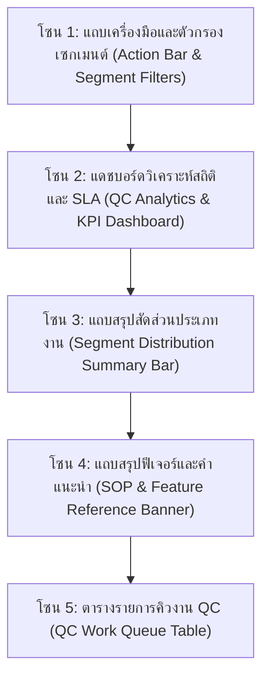
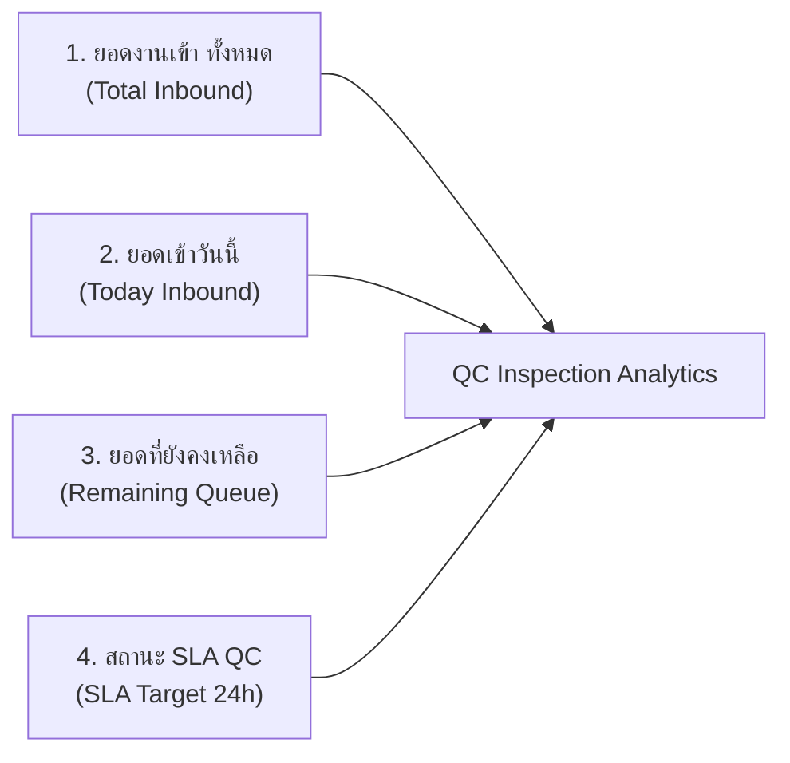
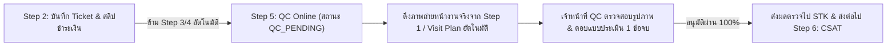
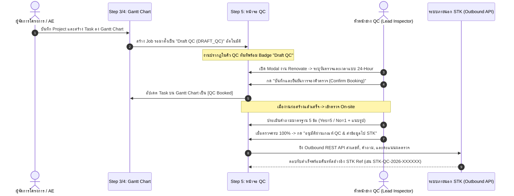
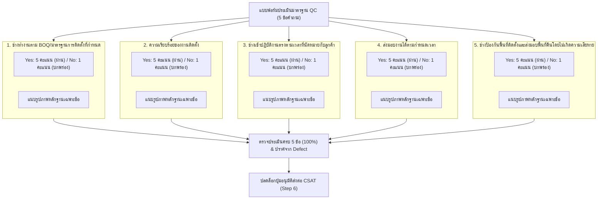

# 🎓 คู่มือฝึกอบรมการใช้งานหน้าจอระบบ PMT Flow
## โมดูลที่ 5: เจาะลึกหน้าจอการควบคุมคุณภาพ การจองช่าง QC ล่วงหน้า และการประเมินงานย่อยตาม BOQ (Step 5: QC)
**รหัสหลักสูตร:** `TRN-PMT-QC01` | **เวอร์ชัน:** 3.0 (Advance Booking & Sub-Task Scoring Standard) | **ระบบ:** PMT Flow (Store Project Management Tool)  
**กลุ่มเป้าหมาย:** เจ้าหน้าที่ควบคุมคุณภาพ (QC Inspector), หัวหน้าช่าง QC (Lead QC Engineer), ผู้จัดการโครงการ (PM), ทีมผู้รับเหมา (Technicians), เจ้าหน้าที่ Contact Center (CSAT)

---

## 📌 บทสรุปและวัตถุประสงค์หลักสูตร (Course Overview & Objectives)

หน้าจอ **ตรวจคุณภาพ (Step 5: QC - Quality Control Inspection)** คือ **"ประตูตรวจรับรองมาตรฐานวิศวกรรมและความปลอดภัย (Engineering Quality & Safety Gatekeeper)"** ของระบบ PMT Flow มีหน้าที่รับช่วงต่องานเพื่อทำการตรวจสอบ ประเมินมาตรฐานแบบ **Zero-Defect Standard** ก่อนส่งมอบพื้นที่ให้ลูกค้าและเข้าสู่ขั้นตอนประเมินความพึงพอใจ (CSAT Step 6)

ในเวอร์ชันปัจจุบัน ระบบได้ยกระดับความสามารถและแยกสายการทำงานออกเป็น **2 รูปแบบอย่างชัดเจน**:
1. **งานบริการด่วน (Quick Services):** ตรวจสอบผลงานผ่านรูปถ่ายหน้างาน (Photo Audit Online) เปรียบเทียบก่อน-หลัง พร้อมตรวจสอบมาตรฐานความปลอดภัย
2. **งานโครงการปรับปรุง (Renovate Projects):** มีความพิเศษและแตกต่างจากทุกส่วนงานในระบบ โดยทันทีที่บันทึกโครงการเข้าสู่แผนงาน (Step 3/4) ระบบจะสร้าง Job รอตั้งเป็น **`Draft QC` (`DRAFT_QC`)** ล่วงหน้า เพื่อทำการจองคิวหัวหน้าช่าง QC (Advance QC Lead Inspector Booking) และเมื่อตรวจรับงานจะต้องทำการ **ประเมินและให้คะแนนตามคำถามมาตรฐาน 5 ข้อ (Yes=5 / No=1)** พร้อมแนบรูปถ่ายหลักฐานเฉพาะแต่ละข้อ และต้องตรวจครบ 100% จึงจะปลดล็อกการส่งต่อไปยัง CSAT (Step 6)

### 🎯 วัตถุประสงค์การเรียนรู้ (Learning Objectives):
1. **เข้าใจแดชบอร์ด UX/UI สไตล์ Step 1:** อ่านค่าตัวชี้วัด KPI 4 ใบ (ยอดเข้าทั้งหมด, เข้าวันนี้, ยอดคงเหลือ, สถานะ SLA) และวิเคราะห์สัดส่วนประเภทงาน Quick / Renovate ผ่าน Distribution Summary Bar
2. **เข้าใจวงจรชีวิตงาน Renovate (Draft QC & Advance Booking):** ทราบเหตุผลและขั้นตอนการสร้าง Draft QC อัตโนมัติเมื่อมี Project ใน Gantt Chart รู้วิธีจองคิวช่าง QC ล่วงหน้าด้วยระบบเวลา 24 ชั่วโมง และการกดยืนยันนัดหมาย (Confirm Booking)
3. **ใช้งานการประเมินคำถามมาตรฐาน (QC Evaluation):** ใช้ระบบคะแนน Yes = 5 คะแนน / No = 1 คะแนน (ผ่าน/มีข้อบกพร่อง โดยไม่มีให้คะแนนตามดาว), แนบรูปถ่ายหลักฐานเฉพาะข้อ และเปิดดูรูปด้วย Lightbox Preview
4. **ปฏิบัติตามเกณฑ์ Gating ส่งข้อมูลไป STK 100%:** เข้าใจเงื่อนไขความสมบูรณ์ในการตรวจรับรองผลงานก่อนยิง REST API ส่งข้อมูลผลตรวจ (เลขที่, คำถาม, คะแนน) ไปยังระบบภายนอก STK
5. **เข้าถึงคู่มือและการอบรมในระบบ:** สามารถเปิดคู่มือและ Feature Reference ได้โดยตรงจากหน้าจอ QC หรือผ่านหน้าศูนย์รวมคู่มือฝึกอบรม

---

## 🧭 กายวิภาคของหน้าจอตรวจคุณภาพ QC (Screen Anatomy Breakdown)

โครงสร้างหน้าจอ QC ได้รับการออกแบบตามมาตรฐานเดียวกับหน้าจอรับคำสั่งซื้อ (Step 1) ประกอบด้วย **5 โซนหลัก** ดังนี้:



---

### 🔹 โซน 1: แถบเครื่องมือและตัวกรองเซกเมนต์ (Action Bar & Segment Filters)

| องค์ประกอบ | สัญลักษณ์ / สี | หน้าที่การทำงาน | คำแนะนำสำหรับผู้ใช้งาน |
| :--- | :--- | :--- | :--- |
| **ปุ่มสลับ Segment (Segment Switcher)** | `ทั้งหมด` / `งานด่วน (Quick)` / `งานปรับปรุง (Renovate)` | กรองแสดงเฉพาะกลุ่มงานด่วนหรืองานรีโนเวท พร้อมแสดงตัวเลขจำนวนงานในแต่ละกลุ่ม | ใช้สำหรับสลับดูเฉพาะงาน Renovate ที่ต้องจองคิวช่าง หรือดูงานด่วนที่รอตรวจรูป |
| **ตัวกรองประเภทบริการ (Service Filter)** | Dropdown Menu | กรองเจาะจงประเภทบริการ เช่น EV Charger, ทำน้ำอุ่น, ปั๊มน้ำ, รีโนเวทห้องน้ำ, Renovate ครัว | กรองเพื่องานที่ตรงกับความเชี่ยวชาญของผู้ตรวจ |
| **คู่มือ & Feature การทำงาน Step 5** | ปุ่มไอคอนหนังสือสีแบรนด์ `[📖 คู่มือ & Feature การทำงาน Step 5 (QC)]` | เปิดหน้าต่างคู่มือการปฏิบัติงานฉบับเต็มขึ้นมาบนหน้าจอทันที | กดเพื่อตรวจสอบขั้นตอนปฏิบัติหรือทบทวนข้อกำหนดได้ตลอดเวลา |
| **Export รายงาน QC** | ปุ่มไอคอน CSV สีเขียว | ดาวน์โหลดไฟล์รายงานผลการตรวจ QC ในรูปแบบ Spreadsheet CSV | ใช้สำหรับสรุปรายงานประจำสัปดาห์หรือส่งต่อฝ่ายบริหาร |
| **จำลองงานเข้า QC** | ปุ่มไอคอนสายฟ้าสีม่วง `[⚡ จำลองงานเข้า QC]` | สร้างชุดข้อมูลตัวอย่าง Quick และ Renovate เข้าสู่คิวเพื่อใช้ทดสอบ | ใช้ในขั้นตอนการเรียนรู้หรือฝึกอบรม (Training Workshop) |

---

### 🔹 โซน 2 & 3: แดชบอร์ดสถิติ 4 KPI & แถบสัดส่วนงาน (KPI Cards & Segment Bar)

หน้าจอ QC ใช้โครงสร้างการวัดผลเช่นเดียวกับ Step 1 เพื่อให้ผู้จัดการโครงการและหัวหน้างานควบคุมคิวงานได้อย่างแม่นยำ:



1. **ยอดงานเข้า ทั้งหมด (Card 1 - สีฟ้า):** แสดงจำนวนโครงการทั้งหมดที่เข้ามาสู่กระบวนการตรวจรับรองคุณภาพ QC คลิกเพื่อแสดงงานทั้งหมด
2. **ยอดเข้าวันนี้ (Card 2 - สีเขียว):** จำนวนงานที่ถูกส่งเข้าคิว QC ในรอบวันปัจจุบัน ช่วยให้ประเมิน Load งานใหม่ที่เพิ่มขึ้นในแต่ละวัน
3. **ยอดที่ยังคงเหลือ (Card 3 - สีส้ม):** จำนวนงานที่ยังค้างอยู่ในสถานะรอตรวจและรอการรับรอง (Active Queue) ต้องเร่งบริหารจัดการไม่ให้คั่งค้าง
4. **สถานะ SLA QC (Card 4 - สีแดง/ชมพู):** จำนวนงานที่เกินเกณฑ์กำหนดเวลา (Default: 24 ชั่วโมง) หากตัวเลขนี้มากกว่า 0 ต้องเร่งดำเนินการเป็นลำดับแรก
5. **แถบกระจายสัดส่วนงาน (Segment Distribution Summary Bar):** แสดงอัตราส่วนเปรียบเทียบระหว่างงาน **Quick Services (สีส้ม)** และงาน **Renovate Projects (สีม่วงคราม)** พร้อมแสดงเปอร์เซ็นต์งานที่ตรวจผ่านแล้ว (Passed) และงานที่ต้องส่งกลับไปแก้ไข (Defect/Rework)

---

### 🔹 โซน 5: ตารางรายการคิวงาน QC (QC Work Queue Table)

- **แถบค้นหาและตัวกรองข้อมูลหลายมิติ (QC Search & Multi-Field Filter Toolbar):**
  - **ช่องค้นหาคำสำคัญอเนกประสงค์ (Global Keyword Search):** ค้นหาแบบ Real-time โดยรองรับการพิมพ์ทั้ง `เลขที่งาน (Job ID)`, `Ref ID / STK Ref`, `เลขที่ Booking`, `เลขที่ Ticket`, `ชื่อลูกค้า`, `เบอร์โทรศัพท์ (พิมพ์เฉพาะเลข 3-4 ตัวท้ายก็ค้นหาได้)`, `ชื่อช่าง / ผู้รับผิดชอบ / หัวหน้าช่าง QC`, `ประเภทบริการ`, `สาขา / ที่อยู่หน้างาน`, และ `หมายเหตุส่งแก้ไข`
  - **ปุ่มล้างคำค้นหา `[X]` (Instant Clear):** ปรากฏขึ้นอัตโนมัติเมื่อมีการพิมพ์คำค้น สามารถกดเพื่อล้างข้อความได้ทันที
  - **ตัวกรองสถานะ QC (QC Status Filter):** เลือกระหว่าง `สถานะ QC: ทั้งหมด`, `รอตรวจ (Pending / Draft)`, `ผ่านเกณฑ์แล้ว (Passed)`, และ `ส่งแก้ไข (Rework / Defect)`
  - **ตัวกรองรอบการตรวจ (Inspection Round Filter):** เลือกระหว่าง `รอบการตรวจ: ทั้งหมด`, `ตรวจรอบแรก (Round 1 - First-time Pass)`, และ `ตรวจรอบแก้ไข (Round 2+ ถูกล็อก 1.0 คะแนนอัตโนมัติ)`
  - **ตัวกรองช่วงวันที่ (Date Range Filter - DD/MM/YYYY):** คัดกรองงานตามช่วงวันนัดหมายผ่าน Flatpickr ปฏิทินแบบกำหนดช่วง `DD/MM/YYYY` พร้อมปุ่มล้างวันที่
  - **ป้ายแสดงผลการค้นหา (Result Counter Badge):** แสดงจำนวนงานที่ตรงตามเงื่อนไข เช่น `พบ 3 รายการ`
  - **ปุ่มรีเซ็ตทั้งหมด (Reset All Filters):** คลิกเดียวเพื่อล้างคำค้นหา ตัวกรองสถานะ ตัวกรองรอบตรวจ และช่วงวันที่ทั้งหมดพร้อมกัน
- **การเรียงลำดับงานใหม่ (Latest on Top):** งานที่เข้ามาใหม่ล่าสุดจะถูกจัดลำดับให้อยู่ **แถวบนสุดเสมอ**
- **สัญลักษณ์ `NEW!`:** งานที่รับเข้าในวันปัจจุบันจะมีป้าย Badge `NEW!` สีเขียว/ส้มเด่นชัด เพื่อให้ผู้ตรวจเห็นงานเข้าใหม่ได้ทันที
- **คอลัมน์ขั้นตอนและแถบสถานะ (Progress & Stage):**
  - แสดงสถานะการจองคิวช่าง: `Draft QC (รอจองคิว)`, `จองคิวแล้ว (รอตรวจ)`, `ผ่านการตรวจรับรอง`
  - สำหรับงาน Renovate: แสดงความคืบหน้าการตรวจงานย่อย เช่น `2/4 งาน (50%)`
- **ปุ่ม Action:**
  - **[ตรวจและให้คะแนน (QC Detail)]**: คลิกเพื่อเปิด Modal ดูรายละเอียดโครงการ ตรวจรูปภาพ และให้คะแนนงานย่อย
  - **[จองคิวช่าง QC]**: สำหรับงาน Renovate ที่ยังอยู่ในสถานะ Draft สามารถคลิกเพื่อเข้าสู่ส่วนจองคิวช่างได้ทันที
- **มาตรฐานการแสดงผลหัวแบบฟอร์มตรวจ (High-Contrast Header Display):**
  - **เลขที่ Order:** แสดงด้วยตัวอักษรสีดำเข้มชัดเจน ตัวใหญ่ชัดเจน (`เลขที่ Order: JOB...`) พร้อมปุ่มคัดลอก
  - **เลขที่ Booking:** แสดงเลขที่การจองอย่างเด่นชัด (`เลขที่ Booking: VFIX-...` หรือ `BKG-...`)
  - **ชื่อลูกค้า:** แสดงด้วยตัวอักษรสีดำเข้ม ขนาดใหญ่เด่นชัด (High-Contrast Black Font) พร้อมเบอร์โทรและช่างหน้างาน เพื่อป้องกันการสับสนและตรวจสอบคิวงานได้ทันที

---

## ⚡ กระบวนการตรวจ QC Online สำหรับงานบริการด่วน (Quick Services Online QC Workflow)

งานบริการด่วน (Quick Services เช่น งานติดตั้งเครื่องทำน้ำอุ่น, เครื่องปรับอากาศ, ปั๊มน้ำ, โซลาร์เซลล์, Digital Door Lock) มีกระบวนการส่งมอบงานที่กระชับและรวดเร็วเป็นพิเศษ โดยมีข้อกำหนดการทำงานดังนี้:



### 1. การข้ามขั้นตอน Step 3 & 4 (Fast-track Direct Transition)
- ทันทีที่เจ้าหน้าที่บันทึกการชำระเงินและ Ticket ใน Step 2 สำหรับงาน Quick Services:
  - ระบบจะ **ข้าม Step 3 (เตรียมแผนงานและทีมช่าง) และ Step 4 (Gantt & Daily Logs)** โดยอัตโนมัติ เนื่องจากงานด่วนไม่มีความจำเป็นต้องแตกเป็น Gantt Timeline หลายสัปดาห์
  - ปรับสถานะงานเป็น **`QC_PENDING` (รอตรวจ Online)** ความคืบหน้า 85%
  - ระบบจะสลับหน้าจอมาที่ **หน้า QC (Step 5) ➔ เซกเมนต์ Quick Services** และเปิดแบบฟอร์มตรวจรับรอง Online ให้ทันที

### 2. ตอบ 1 ข้อคำถามเดียวจบกระบวนการ (Single-Question Streamline)
- **การตัดแถบปุ่มเหมา 5 ข้อ:** สำหรับงาน Quick Service หน้าต่างตรวจ QC จะถูกปรับปรุงให้ประเมินเพียง **1 ข้อคำถามเดียวจบ** คือ:
  > *"ช่างทำงานได้ตามมาตรฐานการทำงานที่กำหนด"* (หมวด: มาตรฐานการทำงาน Quick Service)
- ตัดแถบปุ่มเหมา 5 ข้อของ Renovate ออก เพื่อตัดความซ้ำซ้อนและช่วยให้เจ้าหน้าที่ประเมินและปิดงานได้ทันที
- มีปุ่มเลือกผลการตรวจ 2 ฝั่งชัดเจน:
  - **✓ Yes — ผ่านเกณฑ์:**
    - **รอบแรก (ตรวจครั้งที่ 1):** ได้รับคะแนนเต็ม **5.0 คะแนน**
    - **รอบแก้ไข (ตรวจครั้งที่ 2, 3, 4...):** ถูกบังคับล็อกคะแนน **1.0 คะแนนอัตโนมัติ**
  - **✕ No — ต้องแก้ไข (Rework):** ได้รับคะแนน **1.0 คะแนน** และจะบันทึกสถานะโครงการเป็น `QC_REWORK` เพื่อส่งกลับให้ช่างแก้ไข

### 3. ระบบบันทึกประวัติการตรวจ & ส่งแก้ไขงาน (Inspection & Rework History Timeline)
- ทุกครั้งที่เจ้าหน้าที่กดแจ้งส่งช่างแก้ไขงาน (Rework) หรือกดอนุมัติผ่านเกณฑ์ QC ระบบจะทำการบันทึกประวัติการตรวจลงใน `job.qc_history` โดยอัตโนมัติ:
  - **รอบการตรวจ (Round):** ครั้งที่ 1, ครั้งที่ 2, ครั้งที่ 3, ครั้งที่ 4...
  - **วันและเวลาตรวจ (Timestamp):** แสดงผลในรูปแบบวันที่ `DD/MM/YYYY` และเวลาแบบ 24 ชั่วโมง (`HH:mm น.`)
  - **ผู้ตรวจรับรอง (Inspector):** ระบุชื่อเจ้าหน้าที่ QC ที่ทำการตรวจ
  - **ผลการตรวจ (Result / Action):** ผ่านเกณฑ์ (PASSED) หรือ ส่งกลับแก้ไขงาน (REWORK)
  - **คะแนนที่ได้ (Score):** 5.0 คะแนน (ผ่านรอบแรก) หรือ 1.0 คะแนน (รอบแก้ไข)
  - **หมายเหตุและข้อสั่งการ (Remarks):** บันทึกเหตุผลที่สั่งแก้ไข หรือรายละเอียดข้อบกพร่อง
- หน้าต่าง QC จะแสดงกล่อง **ประวัติการตรวจรับรอง & ส่งแก้ไขงาน (Inspection & Rework History)** เป็น Timeline อย่างโปร่งใสและตรวจสอบย้อนหลังได้ 100%

### 4. 🚨 กฎเหล็กคะแนนรอบแก้ไข (Strict 1.0 Score Penalty for Round >= 2)
- เพื่อรักษามาตรฐานคุณภาพงาน (First-time Pass Quality Principle):
  - โครงการที่เคยถูกส่งกลับแก้ไขงาน (Rework) เมื่อเข้ามาตรวจใน **ครั้งที่ 2, ครั้งที่ 3, ครั้งที่ 4...**
  - **แม้เจ้าหน้าที่ QC จะกดให้ "ผ่านเกณฑ์ (Yes)" ระบบจะบังคับล็อกผลคะแนนเป็น 1.0 คะแนนอัตโนมัติเสมอ**
  - คะแนน 1.0 นี้จะถูกนำไปคำนวณคะแนนเฉลี่ยรวม, แสดงผลบน UI, และส่งออก REST API ไปยังระบบ STK โดยอัตโนมัติ

### 5. แบนเนอร์แจ้งเตือนและการดึงรูปถ่ายหน้างาน (Photo Evidence)
- ระบบจะแสดงแบนเนอร์สีฟ้า: `⚡ การตรวจรับรองคุณภาพงานด่วน (Quick Services — ตรวจสอบภาพถ่ายแบบ Online)`
- ระบบจะซ่อนการ์ดจองคิว On-site ของ Renovate ออกโดยอัตโนมัติ
- ดึงรูปถ่ายหน้างานก่อนเริ่มงานจาก Step 1 / INT / Visit Plan มาแสดงในกล่อง **ภาพหน้างานก่อนเริ่มงาน (ดึงจาก Step 1 / INT)** เพื่อให้ผู้ตรวจเปิดดูผ่าน Lightbox ได้ทันทีก่อนตัดสินใจประเมิน

---

## 🏗️ ความต่างเฉพาะของงาน Renovate (Renovate Advance Booking & Draft QC Lifecycle)

> [!IMPORTANT]
> **ทำไมงาน Renovate จึงต่างจากส่วนงานอื่นในระบบ PMT Flow?**  
> งาน Renovate เป็นโครงการขนาดใหญ่ที่มีความซับซ้อน มูลค่าสูง และใช้ระยะเวลาติดตั้งหลายวัน ช่าง QC จึงจำเป็นต้องวางแผนเพื่อเดินทางไปตรวจรับรอง ณ สถานที่จริง (On-site Inspection) ไม่สามารถประเมินผ่านรูปถ่าย Online เพียงอย่างเดียวได้



### 1. กลไกการสร้าง Draft QC อัตโนมัติ (Auto-Creation of Draft QC)
- เมื่อผู้ใช้ทำการแปลง BOQ เข้าสู่แผนงานโครงการใน **Step 3 (เตรียมแผนงาน) และ Step 4 (Gantt Chart)** และมีการบันทึก Task งาน
- ระบบจะเรียกฟังก์ชัน `ensureQCDraftForRenovate(jobId)` เพื่อนำงานดังกล่าวมาตั้งรอในหน้าจอ QC โดยอัตโนมัติในสถานะ **`DRAFT_QC` (รอจองคิวช่าง)**
- วัตถุประสงค์คือให้หัวหน้าทีม QC ทราบกำหนดการล่วงหน้าและสามารถล็อกคิวผู้ตรวจได้ทันที โดยไม่ต้องรอให้ช่างติดตั้งเสร็จในวันสุดท้าย

### 2. การจองคิวและการยืนยันนัดหมาย (Advance QC Booking SOP)
ในหน้าต่างรายละเอียดงาน (QC Modal) สำหรับงานประเภท Renovate จะมีการ์ด **"📅 กำหนดการจองคิวช่าง QC ล่วงหน้า (Advance QC Inspector Booking)"**:
1. **เลือกหัวหน้าช่าง QC ผู้ตรวจ (QC Lead Inspector):** เลือกระบุรายชื่อวิศวกรหรือหัวหน้าช่างที่จะเข้าตรวจ เช่น `สมศักดิ์ สุขใจ (Lead QC 01)`, `มานพ ขยันตรวจ (Senior QC 02)`
2. **เลือกวันตรวจรับงาน (Target Inspection Date):**
   - รูปแบบวันที่แสดงผลต้องเป็น **`DD/MM/YYYY`** เสมอ (เช่น `12/09/2026`)
   - มีปุ่มลัดคำนวณวันเสร็จล่วงหน้า: **`+3 วัน`** และ **`+5 วัน`** เพื่อความสะดวก
3. **กำหนดเวลาตรวจนัดหมายด้วยระบบ 24 ชั่วโมง (24-Hour Clock Standard):**
   - **กฎเหล็ก:** ใช้ระบบเวลา **`00:00 - 23:59 น.` (HH:mm)** โดยเด็ดขาด ห้ามแสดงผลหรือมีปุ่ม AM / PM
   - มีปุ่มเลือกช่วงเวลาด่วน (Quick Presets):
     - `08:30 น.` (รอบเช้า 1)
     - `10:00 น.` (รอบสาย)
     - `13:00 น.` (รอบบ่าย 1)
     - `15:00 น.` (รอบบ่าย 2)
4. **ยืนยันการจองคิว (Confirm QC Booking):**
   - เมื่อตรวจสอบข้อมูลเรียบร้อยแล้ว ให้กดปุ่ม **"✓ ยืนยันการจองคิวตรวจ (Confirm Booking)"**
   - สถานะการจองจะเปลี่ยนเป็น **`CONFIRMED` (ยืนยันคิวแล้ว)** และแสดงสัญลักษณ์พร้อมวันเวลานัดหมายสีเขียว
   - หากต้องการเปลี่ยนแปลง สามารถกดยกเลิกการยืนยันเพื่อแก้ไขวันเวลาใหม่ได้

### 3. การเชื่อมโยง 2 ทางกับ Gantt Timeline (Two-Way Gantt Sync)
- บนแถบ Task ของ Gantt Chart ในหน้า Step 4 จะมีป้ายสถานะ QC ปรากฏอยู่
- ผู้ใช้งานสามารถคลิกที่ป้าย QC บน Gantt Chart ระบบจะทำการเปลี่ยนหน้าจอมายัง Step 5 และเปิด Modal รายละเอียดการจองช่างของงานนั้นขึ้นมาให้โดยอัตโนมัติ

---

## ⭐ 5 ข้อคำถามมาตรฐานการประเมินคุณภาพ QC (Isara Chootip Standard Checklist)

ระบบ PMT Flow กำหนดมาตรฐานแบบฟอร์มการตรวจประเมินคุณภาพ QC (Step 5) ให้เป็นมาตรฐานเดียวกันทั้ง Quick Services และ Renovate Projects โดยใช้ **5 ข้อคำถามมาตรฐาน** และระบบคำตอบ **Yes / No (คะแนน Yes = 5, No = 1)**:



### รายละเอียดองค์ประกอบการประเมินในแต่ละข้อ:
1. **การเลือกผลการประเมิน Yes / No (Yes = 5 คะแนน [รอบแก้ได้ 1 คะแนน], No = 1 คะแนน):**
   - **`✓ Yes — ผ่านเกณฑ์ (5 คะแนน)`**: งานถูกต้อง เรียบร้อย ได้มาตรฐานตามข้อกำหนดในรอบแรก (สถานะ `PASSED`, ได้ 5 คะแนน)
   - **`✓ Yes — ผ่านเกณฑ์รอบแก้ (1 คะแนน)`**: งานที่เคยตรวจไม่ผ่าน (เคยตอบ No หรือสั่ง Rework) เมื่อช่างแก้ไขงานแล้วตรวจให้ผ่านในรอบถัดไป จะได้รับ **1 คะแนน** (สถานะ `PASSED`, ป้ายสีเหลืองอำพัน-ส้ม) เพื่อสะท้อนประวัติข้อบกพร่องตามจริง
   - **`✕ No — ข้อบกพร่อง (1 คะแนน)`**: งานไม่ผ่านเกณฑ์ หรือพบจุดบกพร่องที่ต้องสั่งแก้ไข (สถานะ `DEFECT`, ได้ 1 คะแนน)
   - **ปุ่มลัด `[ ✓ เลือก Yes ทั้งหมด ]`**: ช่วยให้เจ้าหน้าที่ QC ตอบรับรองทุกข้อได้ในคลิกเดียว โดยระบบจะคงคะแนน 1 คะแนนสำหรับข้อที่ผ่านรอบแก้ และ 5 คะแนนสำหรับข้อที่ผ่านรอบแรก
2. **การคำนวณคะแนนเฉลี่ยรวม (Overall QC Score):**
   - คำนวณจากคะแนนรวมของข้อที่ตอบ / จำนวนข้อ เช่น:
     - งาน Quick Service (1 ข้อ) ผ่านรอบแรก = **5.0 / 5.0 คะแนน**
     - งาน Quick Service (1 ข้อ) ผ่านรอบแก้ไข (Rework Pass) = **1.0 / 5.0 คะแนน**
     - งาน Renovate (5 ข้อ) หากผ่านรอบแรก 4 ข้อ (4 x 5 = 20) และผ่านรอบแก้ 1 ข้อ (1 x 1 = 1) = **4.2 / 5.0 คะแนน**
3. **การแนบรูปถ่ายหลักฐานเฉพาะแต่ละข้อ (Dedicated Photo Evidence):**
   - แต่ละข้อมีพื้นที่อัปโหลดรูปภาพเฉพาะของตนเอง
   - เมื่อคลิกที่ภาพ จะเปิด **Lightbox Preview** ขนาดใหญ่เพื่อตรวจสอบรายละเอียด
4. **บันทึกหมายเหตุของผู้ตรวจ (Inspector Remarks):**
   - บันทึกคำแนะนำ ข้อสังเกต หรือข้อสั่งการเฉพาะสำหรับข้อนั้นๆ

---

## 🔒 กฎเหล็กการล็อกผลตรวจเมื่อผ่านเกณฑ์ & การส่งข้อมูลผลตรวจสู่ระบบ STK (Strict QC Pass Lock & STK Integration API)

เพื่อรักษาความถูกต้องของข้อมูลตามมาตรฐานระดับสากล และป้องกันการแก้ไขหรือบันทึกผลตรวจทับซ้อน ระบบ PMT Flow ได้บังคับใช้ **กฎเหล็กการล็อกผลตรวจ (Zero Re-submission Rule)** ควบคู่กับ **ชุดข้อมูล 8 ฟิลด์หลักที่ส่งออกไปยังระบบ STK**:

> [!CAUTION]
> **🚨 กฎเหล็กเมื่อผ่านเกณฑ์ QC แล้ว (Zero Re-submission / Immutable QC Record):**  
> เมื่อโครงการได้รับการอนุมัติ **ผ่านเกณฑ์ QC (`QC_PASSED`)** เรียบร้อยแล้ว **ระบบจะทำการล็อกผลตรวจถาวร 100% ทันที**  
> 1. **ห้ามทำการบันทึกผลตรวจใหม่หรือกดอนุมัติซ้ำเด็ดขาด** ทั้งบนหน้าจอ UI และ API หลังบ้าน (API จะตอบกลับ `409 Conflict: Job has already passed QC`)  
> 2. ปุ่ม **"บันทึกแบบร่าง"** และปุ่ม **"แจ้งส่งกลับแก้ไขงาน (Rework)"** จะถูก **ซ่อนโดยอัตโนมัติ**  
> 3. ปุ่ม **"อนุมัติส่ง STK"** จะถูกปิดการใช้งาน (Disabled) และแสดงข้อความ `✓ ผ่านเกณฑ์ QC แล้ว (ปิดงาน & ส่งข้อมูล STK สำเร็จ)`  
> 4. คำตอบ Yes / No รายข้อ, ปุ่มอัปโหลดรูปภาพ, ปุ่มลบรูปภาพ, ช่องระบุช่างผู้ตรวจ, วันที่ตรวจ, และหมายเหตุ จะถูกล็อกเป็น **Read-Only (อ่านอย่างเดียว)**  
> 5. ปรากฏแบนเนอร์สีเขียวเด่นชัดด้านบนสุด: **`✓ งานนี้ผ่านเกณฑ์การตรวจรับรองคุณภาพ QC เรียบร้อยแล้ว (ปิดงานสมบูรณ์) — ระบบล็อกสถานะถาวร ห้ามแก้ไขหรือบันทึกผลตรวจซ้ำ`** พร้อมแสดงหมายเลขอ้างอิง `STK Ref` และปุ่ม **`[ดูข้อมูล STK API / คัดลอก]`**

---

### 📦 8 ฟิลด์ข้อมูลสำคัญที่ส่งไปบอกระบบ STK (STK Direct Payload Fields)

เมื่อเจ้าหน้าที่กดอนุมัติผ่านเกณฑ์ QC ระบบ PMT Flow จะสร้างและส่ง Outbound REST API ไปยังระบบ STK โดยบรรจุชุดข้อมูลสำคัญ **8 ฟิลด์หลัก** ดังต่อไปนี้:

| ลำดับ | ฟิลด์ข้อมูล (Field Name) | ตัวอย่างข้อมูล (Example Value) | คำอธิบายรายละเอียด |
| :---: | :--- | :--- | :--- |
| **1** | **เลขที่ Ref (`ref_no`)** | `STK-QC-2026-894120` หรือ External Ref | หมายเลขอ้างอิงเอกสารตรวจรับรองคุณภาพ สำหรับใช้สอบยันระหว่าง PMT Flow และระบบ STK |
| **2** | **ticket (`ticket`)** | `TCK-202609-0881` หรือ `JOB26092116464` | เลขที่ Ticket หรือเลขที่ใบงานของโครงการ |
| **3** | **booking_no (`booking_no`)** | `VFIX-BKG-202609-0941` | เลขที่การจองคิวงานบริการ / การนัดหมายของลูกค้า |
| **4** | **วันที่ บันทึก Qc (`qc_date`)** | `21/09/2026 23:45:10 น.` | วันที่และเวลาที่บันทึกผลตรวจ QC ผ่าน โดยแสดงผลตามมาตรฐาน **DD/MM/YYYY ในระบบ 24 ชั่วโมง (Strictly 24-hr format)** พร้อมฟิลด์ `qc_recorded_at` ในรูปแบบ ISO-8601 |
| **5** | **ชื่อลูกค้า นามสกุล (`customer_name`)** | `คุณสมชาย ใจดี` | ชื่อ-นามสกุลของลูกค้าเจ้าของโครงการ |
| **6** | **เบอร์โทร (`customer_phone`)** | `081-234-5678` | หมายเลขโทรศัพท์ติดต่อของลูกค้า |
| **7** | **ผลการทดสอบ QC ครั้งที่ x (`qc_round` & `qc_result`)** | `qc_round: 1`<br/>`qc_round_text: "ตรวจครั้งที่ 1 (ผ่านเกณฑ์รอบแรก)"`<br/>`qc_result: "PASSED"` | แสดงรอบการตรวจที่ได้ผลผ่านเกณฑ์จริง เช่น ครั้งที่ 1, 2, 3 พร้อมข้อความระบุและสถานะผลลัพธ์ `PASSED` |
| **8** | **คะแนน ประเมิน (`qc_score`)** | `qc_score: 5.0`<br/>`qc_score_text: "5.0 / 5.0 (ผ่านเกณฑ์รอบแรก)"` | คะแนนประเมินที่บันทึก (รอบแรกผ่านได้ 5.0 คะแนน, หากเป็นรอบแก้ไข Round >= 2 จะถูกล็อกที่ 1.0 คะแนนอัตโนมัติตามมาตรฐาน First-time Pass Penalty) |

#### ตัวอย่างโครงสร้าง Outbound JSON Payload ส่งไป STK:
```json
{
  "ref_no": "STK-QC-2026-894120",
  "ticket": "TCK-202609-0881",
  "booking_no": "VFIX-BKG-202609-0941",
  "qc_date": "21/09/2026 23:45:10 น.",
  "qc_recorded_at": "2026-09-21T16:45:10.000Z",
  "customer_name": "คุณสมชาย ใจดี",
  "customer_phone": "081-234-5678",
  "qc_round": 1,
  "qc_round_text": "ตรวจครั้งที่ 1 (ผ่านเกณฑ์รอบแรก)",
  "qc_result": "PASSED",
  "qc_score": 5.0,
  "qc_score_text": "5.0 / 5.0 (ผ่านเกณฑ์รอบแรก)",
  "job_no": "JOB26092116464",
  "job_id": "JOB26092116464",
  "stk_ref": "STK-QC-2026-894120",
  "rework_count": 0,
  "service": "ติดตั้งเครื่องปรับอากาศ Inverter 18,000 BTU",
  "tech_team": "ทีมช่างวีระชัย (ช่างแอร์ 1)",
  "qc_inspector": "วิชัย ตรวจดี (ช่าง QC Lead)",
  "total_score_obtained": 5,
  "max_possible_score": 5,
  "total_questions": 1,
  "passed_questions": 1,
  "qc_history": [
    {
      "round": 1,
      "round_label": "ตรวจครั้งที่ 1 (ผ่านเกณฑ์รอบแรก)",
      "action": "PASSED",
      "result": "PASSED",
      "score": 5.0,
      "inspector": "วิชัย ตรวจดี (ช่าง QC Lead)",
      "timestamp": "2026-09-21T16:45:10.000Z",
      "date_display": "21/09/2026 23:45:10 น.",
      "remarks": "งานติดตั้งเรียบร้อยตามมาตรฐาน"
    }
  ],
  "qc_remarks": "งานติดตั้งเรียบร้อยตามมาตรฐาน"
}
```

---

### 🔌 ช่องทางเชื่อมต่อ API สำหรับระบบ STK (STK Endpoints):
1. **Outbound Push Notification (Webhook):**  
   - เมื่อกดอนุมัติ ระบบ PMT Flow จะยิงคำขอ `POST /api/v1/jobs/{job_no}/export-stk` หรือส่งต่อไปยัง Webhook URL ของระบบ STK ทันที
2. **Inbound Query API (ดึงข้อมูลย้อนหลังตามต้องการ):**  
   - ระบบ STK สามารถส่งคำขอสอบถามข้อมูลผลตรวจของใบงานได้ตลอดเวลาผ่าน:  
     `GET /api/v1/jobs/{ticket_or_booking_or_ref}/stk-payload`  
     (รองรับการส่ง `job_no`, `ticket`, `booking_no`, หรือ `stk_ref` เป็นพารามิเตอร์)
3. **การเปิดดูและคัดลอก JSON ในโปรแกรม (Modal STK View):**  
   - ผู้ใช้งานสามารถคลิกปุ่ม **`[ดูข้อมูล STK API / คัดลอก]`** บนแบนเนอร์ หรือปุ่ม **`[STK API]`** ในตารางคิวงาน เพื่อเปิดหน้าต่างสรุป 8 ฟิลด์และกดปุ่ม **"คัดลอก JSON"** นำไปใช้งานได้ทันที

---

### ลักษณะการทำงานของระบบ Gating:
1. **การ์ดแสดงความคืบหน้า (Evaluation Progress Bar):**
   - ด้านบนของรายการจะมีการ์ดระบุสัดส่วนการตรวจ เช่น `ประเมินแล้ว 3 จาก 5 ข้อคำถาม (60%)` พร้อมแถบสถานะสีเขียว-ทอง
2. **ปุ่มอนุมัติถูกล็อก (Disabled State):**
   - ตราบใดที่ยังตรวจไม่ครบ หรือมีข้อที่ตอบ No (ข้อบกพร่อง) ปุ่ม **"✓ อนุมัติผ่านเกณฑ์ QC & ส่งข้อมูลไป STK"** จะอยู่ในสถานะปิดการใช้งาน และแสดงข้อความเตือนให้แก้ไขงานหรือสั่ง Rework
3. **การปลดล็อกปุ่มอนุมัติ (Active State):**
   - เมื่อประเมินครบทุกข้อคำถาม และได้ผล Yes ทั้งหมด แถบสถานะจะเปลี่ยนเป็น `ประเมินครบทุกข้อ (ผ่านเกณฑ์ 100%)` และปุ่มอนุมัติจะเปลี่ยนเป็นสีเขียวสว่างสดใสพร้อมให้กดส่งข้อมูลไปยังระบบ STK ทันที
4. **ผลลัพธ์หลังการอนุมัติ:**
   - สถานะโครงการจะเปลี่ยนเป็น **`QC_PASSED`** (100% Completion)
   - ระบบยิง Outbound REST API ไปยัง `/api/v1/jobs/{id}/export-stk` เพื่อส่งมอบข้อมูลผลตรวจไปยังระบบ STK
   - ได้รับหมายเลขอ้างอิงธุรกรรม **`STK Ref`** (เช่น `STK-QC-2026-XXXXXX`) และแสดง Badge สถานะ `STK ส่งแล้ว` บนตารางคิวงานทันที
   - ระบบเข้าสู่สถานะ **ล็อกผลตรวจถาวร (Read-only)** ทันที เพื่อป้องกันการบันทึกซ้ำตามกฎเหล็ก Zero Re-submission

---

## 💡 วิธีการเข้าถึงคู่มือและการฝึกอบรมในระบบ (In-App Guides & Access)

ผู้ใช้งานระบบสามารถเข้าถึงและศึกษาคู่มือการทำงานของ Step 5 ได้จาก **3 จุดหลัก** ภายในโปรแกรม:

1. **ปุ่มบนแถบเครื่องมือด้านบนของหน้าจอ QC:**
   - คลิกปุ่ม `[📖 คู่มือ & Feature การทำงาน Step 5 (QC)]` ระบบจะเปิดหน้าต่างเอกสารหลักสูตรฉบับสมบูรณ์ขึ้นมาทันที
2. **การ์ดคู่มือและสรุปฟีเจอร์สำคัญ (Feature Guide Accordion):**
   - บริเวณด้านบนของตารางคิวงาน จะมีการ์ดสรุปฟีเจอร์แบบย่อ สามารถคลิกเพื่อกางดูสรุปกฎเกณฑ์และขั้นตอนได้ตลอดเวลา
3. **ศูนย์รวมคู่มือฝึกอบรมในหน้า FAQ & Help (Module 5):**
   - เมนูนำทางด้านข้างคลิกที่ `FAQ & คู่มือ` -> เลือกแท็บ `ศูนย์รวมคู่มือฝึกอบรม` -> การ์ด `Module 5: การตรวจรับรองคุณภาพ QC`

---

## ❓ คำถามที่พบบ่อยและแนวปฏิบัติที่ดี (FAQ & Best Practices)

> [!TIP]
> **Q: ทำไมงาน Renovate จึงเข้ามาปรากฏในหน้า QC ทั้งๆ ที่ช่างยังติดตั้งไม่เสร็จ?**  
> **A:** เพราะเป็นไปตามฟีเจอร์ **Draft QC** ที่สร้างขึ้นล่วงหน้าทันทีที่โครงการเข้าสู่ Gantt Chart เพื่อให้ทีมบริหารโครงการสามารถวางแผนและล็อกคิวหัวหน้าช่าง QC (Lead Inspector) ไว้ล่วงหน้า ไม่ให้เกิดความล่าช้าหลังติดตั้งเสร็จ

> [!TIP]
> **Q: หากมีงานย่อย 1 รายการเป็น DEFECT จะสามารถส่งข้อมูลไป STK ได้หรือไม่?**  
> **A:** หากมีงานย่อยที่ติดสถานะ DEFECT แสดงว่าโครงการยังมีข้อบกพร่องที่ต้องแก้ไข ผู้ตรวจควรกดปุ่ม **"❌ แจ้งช่างแก้ไขงาน (Rework)"** เพื่อส่งเรื่องกลับให้หัวหน้าช่างเข้าแก้ไขหน้างานก่อน เมื่อแก้ไขเสร็จแล้วจึงกลับมาตรวจซ้ำและอนุมัติส่งข้อมูลไป STK

> [!IMPORTANT]
> **Q: การระบุเวลานัดหมาย ทำไมห้ามใช้ระบบ AM / PM?**  
> **A:** ตามมาตรฐานความปลอดภัยและการสื่อสารข้อตกลงงานช่างของระบบ PMT Flow เพื่อป้องกันความสับสนระหว่างเวลากลางวันและกลางคืน ระบบจึงบังคับใช้มาตรฐาน **24-Hour Clock (00:00 - 23:59 น.)** เท่านั้น

---

**จัดทำโดย:** ทีมสถาปัตยกรรมระบบและฝ่ายฝึกอบรม PMT Flow (SA & Lead Trainer)  
**รหัสเอกสาร:** `TRN-PMT-QC01-v3.0`  
**สถานะการรับรอง:** Approved Production Standard (vibepmt.online)