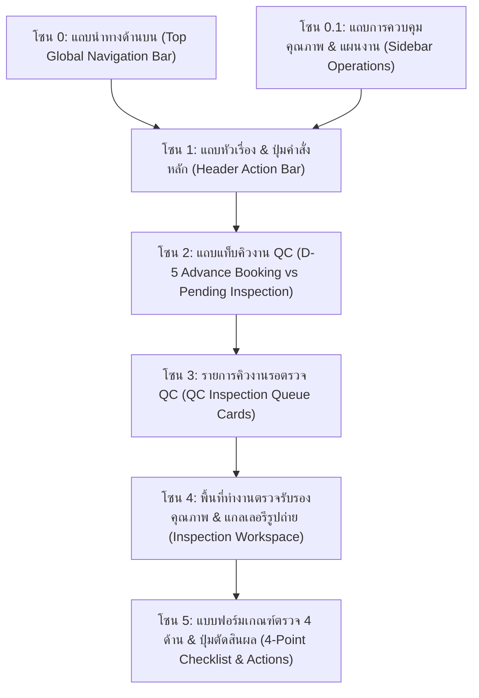
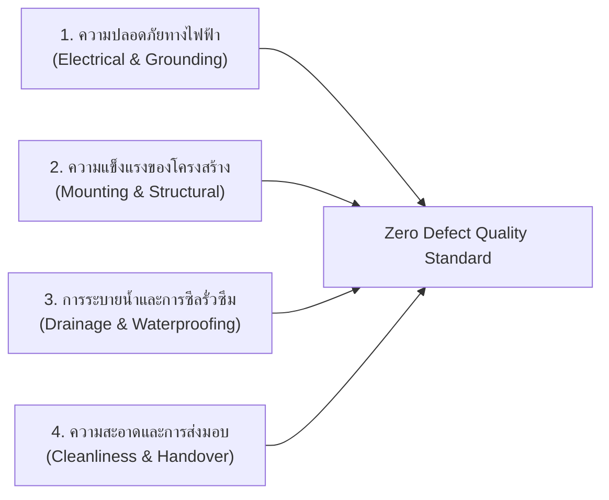
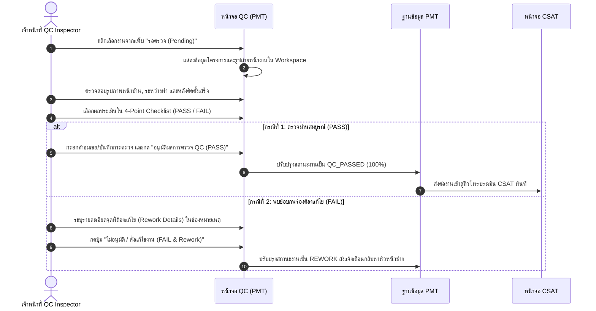

# 🎓 คู่มือฝึกอบรมการใช้งานหน้าจอระบบ PMT Flow
## โมดูลที่ 6: เจาะลึกหน้าจอการควบคุมคุณภาพงานติดตั้ง (QC Inspection & Zero-Defect Checklist Training Screen Guide)
**รหัสหลักสูตร:** `TRN-PMT-QC01` | **ระบบ:** PMT Flow (Store Project Management Tool) | **เวอร์ชัน:** 2.0 (Pipeline Architecture) | **กลุ่มเป้าหมาย:** เจ้าหน้าที่ควบคุมคุณภาพ (QC Inspector), หัวหน้างานช่าง (Lead Technician), ผู้จัดการโครงการ (PM) และวิทยากรผู้ฝึกอบรม (Trainer)

---

## 📌 บทสรุปและวัตถุประสงค์หลักสูตร (Course Overview & Objectives)

หน้าจอ **ตรวจคุณภาพ (QC - Quality Control Inspection)** คือ **"ประตูตรวจรับรองมาตรฐานวิศวกรรมและความปลอดภัย (Engineering Quality & Safety Gatekeeper)"** ของระบบ PMT Flow มีหน้าที่รับช่วงต่องานที่ทีมช่างปฏิบัติงานติดตั้งเสร็จสิ้น เพื่อทำการประเมินและอนุมัติผลงานตามเกณฑ์มาตรฐานแบบ **Zero-Defect Standard** ก่อนส่งมอบพื้นที่ให้ลูกค้าและปิดโครงการ โดยมีแกนหลัก 4 ประการ:
1. การบริหารจัดการคิวตรวจงาน 2 รูปแบบ: **คิวจองช่าง QC ล่วงหน้า 5 วัน (D-5 Booking)** และ **คิวรอตรวจจริงหลังติดตั้งเสร็จ (Pending Inspection)**
2. การตรวจสอบหลักฐานรูปถ่ายหน้างานเปรียบเทียบ ก่อนติดตั้ง, ระหว่างทำ และหลังติดตั้งเสร็จสมบูรณ์
3. การประเมินผ่านเกณฑ์มาตรฐานความปลอดภัย 4 ด้าน (4-Point Safety & Quality Standard Checklist)
4. การตัดสินผลการตรวจ: การอนุมัติผลงาน (**PASS**) ส่งต่อไปยังขั้นตอนประเมินความพึงพอใจลูกค้า (CSAT) หรือการสั่งแก้ไขงาน (**FAIL / Rework**) ส่งกลับให้ทีมช่างปรับปรุง

### 🎯 วัตถุประสงค์การเรียนรู้สำหรับผู้เข้าอบรม (Learning Objectives):
1. **เข้าใจกระบวนการแจ้งเตือนล่วงหน้า 5 วัน (D-5 Booking QC):** รู้จักวิธีติดตาม Task งานที่ใกล้แล้วเสร็จ เพื่อวางแผนส่งผู้ตรวจ QC เข้าหน้างานตรงเวลา
2. **ตรวจสอบหลักฐานภาพถ่ายเชิงลึกได้อย่างมืออาชีพ:** สามารถซูมดูภาพและตรวจสอบจุดเสี่ยง เช่น รอยต่อท่อน้ำ, สายดิน, การยึดขายึดคอมเพรสเซอร์
3. **ประเมินแบบฟอร์ม 4-Point Safety Checklist ได้ครบ 100%:** เข้าใจเกณฑ์การให้คะแนน PASS, FAIL หรือ N/A ในแต่ละหัวข้ออย่างถูกต้องตามหลักวิศวกรรม
4. **บันทึกรายงานผลการตรวจและคำสั่งแก้ไข (Rework Orders):** รู้วิธีเขียนข้อสั่งการแก้ไขอย่างละเอียดเมื่อผลตรวจไม่ผ่าน
5. **ควบคุมการส่งต่องานสู่ Contact Center (CSAT):** ทราบกระบวนการและเงื่อนไขที่ทำให้งานเปลี่ยนสถานะเป็น `QC_PASSED` เพื่อส่งต่อให้ทีม CSAT โทรสอบถามลูกค้า

---

## 🧭 กายวิภาคของหน้าจอตรวจคุณภาพ QC (Screen Anatomy Breakdown)

โครงสร้างหน้าจอ QC ประกอบด้วย **6 โซนหลัก** ดังนี้:

---

### 🔹 โซน 1 & 2: แถบหัวเรื่องและแท็บคิวงาน QC (Action Bar & Tabs)

| องค์ประกอบ | สัญลักษณ์ / สี | หน้าที่การทำงาน | คำแนะนำจาก Trainer |
| :--- | :--- | :--- | :--- |
| **หัวเรื่องหน้าจอ** | `การตรวจคุณภาพงาน (QC Inspection)` | ศูนย์กลางการตรวจรับรองคุณภาพงานช่าง | ชี้แจงบทบาทความเป็นกลางของ QC ไม่ขึ้นกับทีมขาย |
| **แผนงาน (Gantt Timeline)** | ปุ่มสีกรมท่า/เทา | ลิงก์ด่วนเพื่อเปิดดูตารางเวลาและวันเสร็จของงานช่าง | ใช้สำหรับเช็กว่า Task ใดใกล้ครบกำหนด |
| **ซิงค์งานจาก Gantt** | ปุ่มขอบม่วง | ดึงข้อมูลงานที่เสร็จสิ้นจาก Gantt เข้ามาอัปเดตในคิว QC | ให้กดปุ่มนี้เป็นอันดับแรกเมื่อเริ่มกะทำงาน |
| **แท็บ "จองช่าง QC (D-5)"** | Badge ตัวเลขสีส้ม | แสดงรายการงานที่ใกล้จะเสร็จภายใน 5 วัน เพื่อล็อกคิวตรวจล่วงหน้า | ช่วยลดปัญหางานค้างรอตรวจ |
| **แท็บ "รอตรวจ (Pending)"** | Badge ตัวเลขสีม่วง | แสดงรายการงานที่ช่างติดตั้งเสร็จแล้ว และส่งเรื่องขอตรวจรับรอง | เป็นคิวงานที่ต้องเข้าตรวจสอบทันที |

---

## 📋 เกณฑ์มาตรฐานความปลอดภัย 4 ด้าน (4-Point Safety & Quality Checklist)

ในการตรวจประเมิน เจ้าหน้าที่ QC ต้องตรวจสอบและให้ผลประเมินในแบบฟอร์ม 4 หัวข้อหลัก:

1. **จุดที่ 1 — ความปลอดภัยทางไฟฟ้า (Electrical & Earthing Safety):**
   - ตรวจสอบขนาดสายไฟและสายดิน (Earth Grounding) ตามมาตรฐาน มอก.
   - ตรวจสอบขนาดเบรกเกอร์ (Circuit Breaker) ให้เหมาะสมกับขนาดกำลังวัตต์ของอุปกรณ์
   - ทดสอบการตัดไฟเมื่อเกิดไฟฟ้ารั่ว (RCBO / ELCB Test)
2. **จุดที่ 2 — ความแข็งแรงของโครงสร้างและการยึดเกาะ (Mounting & Structural Integrity):**
   - ตรวจสอบความแน่นหนาของพุกและพุกยึดผนัง/คาน
   - ตรวจสอบขายึดคอยล์ร้อนคอมเพรสเซอร์แอร์ หรือฐานรากแท็งก์น้ำ ต้องได้ระดับน้ำ ไม่เอียงหรือสั่นสะเทือน
3. **จุดที่ 3 — การระบายน้ำและการซีลกันรั่วซึม (Drainage & Waterproof Sealing):**
   - ทดสอบเทน้ำลงถาดน้ำทิ้ง ตรวจสอบความลาดเอียงของท่อน้ำทิ้ง ไม่มีการขังหรือหยดรั่วซึม
   - ตรวจสอบการยิงซิลิโคนกันน้ำรอบท่อที่เจาะทะลุผนังภายนอก เพื่อป้องกันน้ำฝนซึมเข้าตัวบ้าน
4. **จุดที่ 4 — ความสะอาดพื้นที่และการส่งมอบงาน (Site Cleanliness & Handover):**
   - ทีมช่างเก็บกวาดเศษฝุ่น เศษท่อ และทำความสะอาดพื้นที่หน้างานเรียบร้อย
   - ตรวจสอบว่าได้ส่งมอบคู่มือการใช้งานและใบรับประกันสินค้าให้แก่ลูกค้าครบถ้วน

---

## 🛠️ ขั้นตอนการปฏิบัติงานมาตรฐาน (Step-by-Step SOP)

---

### ขั้นตอนการตรวจรับรองและบันทึกผล (Pass / Fail Execution)

1. คลิกเลือกชื่องานจากรายการคิวทางฝั่งซ้าย (เช่น `JOB202609001 - ติดตั้งแอร์ Inverter`)
2. ตรวจสอบข้อมูลในพื้นที่ทำงานทางฝั่งขวา:
   - ตรวจดูรูปถ่ายหน้างานที่ทีมช่างอัปโหลดไว้ คลิกที่รูปเพื่อดูภาพขนาดใหญ่ความละเอียดสูง
3. ทำการประเมินในหัวข้อ 4-Point Safety Checklist:
   - ติ๊กเลือก `PASS` หากได้มาตรฐาน
   - ติ๊กเลือก `FAIL` หากพบข้อบกพร่อง
   - ติ๊กเลือก `N/A` หากหัวข้อนั้นไม่เกี่ยวข้องกับประเภทงาน (เช่น งานปั๊มน้ำไม่มีระบบน้ำยาแอร์)
4. การตัดสินผลการตรวจ:
   - **กรณีผ่านการตรวจ:** คลิกปุ่มสีเขียว **`อนุมัติผลการตรวจ QC (PASS)`** สถานะจะเปลี่ยนเป็น **`QC_PASSED`** ทันที และย้ายงานเข้าสู่ระบบ CSAT
   - **กรณีไม่ผ่านการตรวจ:** พิมพ์ข้อบกพร่องลงในช่อง **"บันทึกสั่งการแก้ไข (Rework Instructions)"** เช่น *"ให้ช่างเข้ามายิงซิลิโคนซ้ำบริเวณรอยต่อท่อด้านนอก และเก็บเศษสายไฟ"* แล้วคลิกปุ่มสีแดง **`ไม่อนุมัติ / สั่งแก้ไขงาน (FAIL)`**

---

## 💡 แผนการสอนสำหรับ Trainer (Workshop Hands-on Guide)

### 🎯 บททดสอบปฏิบัติการประจำห้องเรียน (20 นาที):
**สถานการณ์สมมติ:** "ทีมช่าง Team A รายงานติดตั้งปั๊มน้ำเสร็จสิ้นในงาน `JOB202609002` และส่งเรื่องเข้าคิวรอตรวจ QC ให้ผู้เรียนสวมบทบาทเป็น QC Inspector ปฏิบัติการดังนี้"

1. **โจทย์ข้อที่ 1:** คลิกเลือกงาน `JOB202609002` จากคิวรอตรวจ
2. **โจทย์ข้อที่ 2:** เปิดดูรูปภาพหน้างาน และตรวจเช็กหัวข้อความปลอดภัยด้านไฟฟ้าและการต่อสายดิน
3. **โจทย์ข้อที่ 3:** สมมติว่าทุกข้อผ่านเกณฑ์มาตรฐาน ให้เลือก `PASS` ในทุกหัวข้อของ Checklist
4. **โจทย์ข้อที่ 4:** บันทึกข้อความ "ติดตั้งได้มาตรฐาน โครงสร้างแข็งแรง ไม่พบน้ำรั่วซึม"
5. **โจทย์ข้อที่ 5:** กดปุ่ม **`อนุมัติผลการตรวจ QC (PASS)`** แล้วตรวจสอบในเมนู **ความพึงพอใจลูกค้า (CSAT)** ว่ามีงานนี้ปรากฏขึ้นหรือไม่

---

## ❓ คำถามที่พบบ่อยและข้อควรระวัง (FAQ & Best Practices)

> [!IMPORTANT]
> **Q: หากหัวข้อใดหัวข้อหนึ่งใน Checklist เป็น FAIL สามารถกดอนุมัติ PASS ได้หรือไม่?**  
> **A:** ไม่ได้! ระบบ PMT Flow ยึดหลัก **Zero-Defect Quality** หากมีข้อใดข้อหนึ่งเป็น FAIL ปุ่มอนุมัติ PASS จะถูกปิดการทำงานอัตโนมัติ เพื่อป้องกันการส่งมอบงานที่ไม่ปลอดภัยให้แก่ลูกค้า

> [!TIP]
> **Q: งานที่สั่งแก้ Rework แล้ว เมื่อช่างแก้ไขเสร็จจะกลับมาที่ไหน?**  
> **A:** เมื่อช่างแก้ไขงานและถ่ายรูปยืนยันใหม่ งานจะกลับเข้ามาในแท็บ "รอตรวจ (Pending)" ของหน้าจอ QC อีกครั้ง พร้อมประวัติบันทึกว่าเป็นการตรวจรอบที่ 2 (Re-inspection)

---

**จัดทำโดย:** ฝ่ายพัฒนาหลักสูตรและฝึกอบรม PMT Flow  
**รหัสเอกสาร:** `TRN-PMT-QC01-v2.0`  
**สถานะการรับรอง:** Approved Standard (Enterprise Operations)