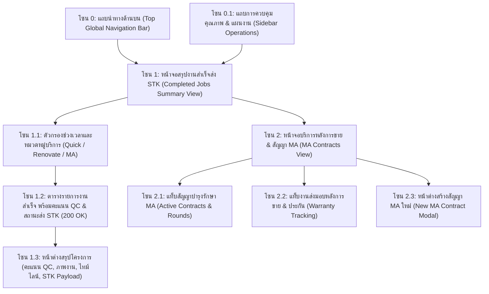
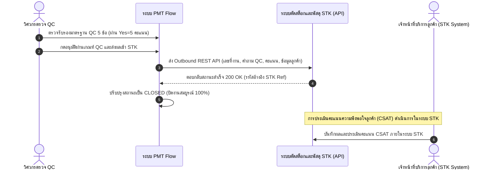

# 🎓 คู่มือฝึกอบรมการใช้งานหน้าจอระบบ PMT Flow
## โมดูลที่ 6: เจาะลึกหน้าจอสรุปงานที่สำเร็จแล้ว & ส่ง API ระบบ STK (Completed Jobs Summary & STK API Sync Hub)
**รหัสหลักสูตร:** `TRN-PMT-CSAT01` | **ระบบ:** PMT Flow (Store Project Management Tool) | **เวอร์ชัน:** 3.1 (Completed Jobs & STK Outbound Integration) | **กลุ่มเป้าหมาย:** เจ้าหน้าที่ศูนย์บริการลูกค้า (Contact Center), ฝ่ายคลังพัสดุและสินค้า (STK System), แผนกบัญชีและการเงิน, ผู้จัดการโครงการ (PM) และผู้ดูแลระบบ (Admin)

---

## 📌 บทสรุปและวัตถุประสงค์หลักสูตร (Course Overview & Objectives)

หน้าจอ **สรุปงานที่สำเร็จแล้ว (ส่ง API ระบบ STK) / Completed Jobs Summary** คือศูนย์กลางรวบรวมข้อมูลโครงการและคำสั่งซื้อทั้งหมดที่ดำเนินการสำเร็จครบถ้วนทุกขั้นตอน 100% และผ่านการส่งถ่ายข้อมูลปิดงานผ่าน REST API เข้าสู่ **ระบบตัดสต็อกและพัสดุ STK (Stock Integration)** เรียบร้อยแล้ว (สถานะ `CLOSED`, HTTP 200 OK):
1. **แสดงเฉพาะงานที่สำเร็จและส่ง API ไปยังระบบ STK เท่านั้น:** กรองเฉพาะงานที่มีรหัสอ้างอิง `STK Ref` และบันทึกเวลาส่งสำเร็จ (ไม่แสดงงานค้างหรือยังไม่ปิดงาน)
2. **สืบค้นได้ครบทุกมิติ (Omnichannel Search & Filter):** ค้นหาได้ทั้งรหัสงาน, รหัสอ้างอิง STK, เลข Ticket, ชื่อลูกค้า, เบอร์โทร, สาขา, ที่อยู่, ชื่องานบริการ, ช่างผู้รับผิดชอบ, และผู้ตรวจ QC
3. **ตรวจสอบโครงสร้างข้อมูล STK Outbound Payload JSON:** สามารถเปิดดูและคัดลอก JSON Payload ขาออกที่ส่งเข้าสู่ REST API ของระบบ STK
4. **พิมพ์ใบรับรองการปิดงานและส่งมอบระบบ STK:** สามารถพิมพ์เอกสารใบรับรองปิดงาน (Job Closeout Certificate) พร้อมลายเซ็น 3 ฝ่าย (ช่าง, QC, Admin STK)
5. **วิเคราะห์สถิติ KPI และสัดส่วนกลุ่มงาน:** แสดงการกระจายตัวของงานด่วน (Quick Services), งานปรับปรุง (Renovate Projects), และงานบำรุงรักษา (MA & Maintenance) พร้อมส่งออก Excel / CSV ภาษาไทยสมบูรณ์แบบ

*(หมายเหตุ: ระบบเก็บประวัติย้อนหลังครอบคลุม 6 เดือนตามเกณฑ์มาตรฐานความปลอดภัยและการตรวจสอบบัญชี)*

### 🎯 วัตถุประสงค์การเรียนรู้สำหรับผู้เข้าอบรม (Learning Objectives):
1. **เข้าใจการทำงานของหน้าสรุปงานส่ง STK:** สามารถตรวจสอบสถิติ KPI ยอดงานสำเร็จ, ยอดตัดสต็อกวันนี้, มูลค่ารวม, และคะแนนตรวจ QC เฉลี่ย
2. **การใช้งานตัวกรองและช่องค้นหาด่วน:** สามารถค้นหาและกรองตามช่วงเวลา (วันนี้, 7 วัน, 30 วัน, 60 วัน, 90 วัน, 180 วัน), กลุ่มงานบริการ, สาขา, และระดับคะแนน QC
3. **การเปิดดูข้อมูลเชิงลึก 4 แท็บใน Modal:** ดูสรุปผลการตรวจรับรอง QC (การประเมิน CSAT ดำเนินการในระบบ STK), คลังรูปถ่ายหน้างาน 5 ขั้นตอน, ไทม์ไลน์ 8 ขั้นตอน, และข้อมูล STK Integration Payload JSON
4. **การส่งออกรายงานและพิมพ์ใบรับรอง:** สามารถส่งออกไฟล์ Excel/CSV และพิมพ์เอกสารปิดงาน STK ได้อย่างถูกต้องตามระเบียบบริษัท

---

## 🧭 กายวิภาคของหน้าจอสรุปงานสำเร็จ & บริการหลังการขาย (Screen Anatomy Breakdown)

---

## 🛠️ ขั้นตอนการปฏิบัติงานมาตรฐาน (Step-by-Step SOP)

---

### ขั้นตอนที่ 1: การตรวจสอบผลงานที่สำเร็จและส่งถ่ายข้อมูลเข้าระบบ STK

1. คลิกเมนู **`สรุปงานที่สำเร็จแล้ว (ส่ง API ระบบ STK)`** ที่แถบเมนูด้านซ้าย
2. ตรวจสอบรายการงานที่ปิดสมบูรณ์:
   - ตรวจสอบคะแนนการตรวจรับรองมาตรฐาน QC (ผ่านเกณฑ์ 5.0 คะแนน)
   - สถานะการส่งข้อมูลระบบ STK แสดงป้ายสีเขียว **`200 OK (STK Synced)`**
   - **หมายเหตุสำคัญ:** ในระบบ PMT Flow จะไม่มีการบันทึกคะแนนความพึงพอใจลูกค้า (CSAT) เนื่องจากกระบวนการโทรสำรวจและประเมินผล CSAT ถูกย้ายไปดำเนินการใน **ระบบ STK** โดยตรง
3. คลิกปุ่ม **`ดูรายละเอียด`** ที่แถวรายการงาน เพื่อเปิด Modal รายละเอียด:
   - **แท็บ 1 สรุปผลการตรวจรับรอง QC:** แสดงคะแนน QC ของวิศวกรผู้ตรวจ และสถานะการส่งต่อข้อมูลไปยังระบบ STK เพื่อดำเนินการ CSAT ต่อไป
   - **แท็บ 2 ภาพถ่ายหน้างาน & แบบแปลน:** ตรวจสอบรูปถ่าย 5 ขั้นตอนมาตรฐาน
   - **แท็บ 3 ประวัติ & ไทม์ไลน์งาน (History):** ตรวจสอบประวัติ 8 ขั้นตอนตั้งแต่รับ Order จนถึงส่งมอบงาน
   - **แท็บ 4 ข้อมูลส่ง API ระบบ STK (Payload):** ตรวจสอบ JSON Payload ขาออกที่ส่งเข้าสู่ระบบ STK
4. หากต้องการเอกสารปิดงาน ให้คลิกปุ่ม **`พิมพ์ใบปิดงาน STK`** หรือส่งออกไฟล์ **`Export Excel / CSV`** ตามต้องการ

---

### ขั้นตอนที่ 2: การสร้างสัญญาบำรุงรักษา MA (Preventive Maintenance)

สำหรับงานติดตั้งที่มีบริการต่อเนื่อง เช่น เครื่องปรับอากาศ หรือปั๊มน้ำ:
1. คลิกปุ่ม **`ไปยังบริการหลังการขาย ➔`** หรือคลิกเมนู **`บริการหลังการขาย`** ที่แถบเมนูด้านซ้าย
2. คลิกปุ่ม **`+ สร้างสัญญา MA ใหม่`**
3. ระบบจะดึงข้อมูลลูกค้าและประเภทบริการเดิมมาใส่ในฟอร์มอัตโนมัติ:
   - **ชื่อสัญญา:** เช่น `สัญญาบำรุงรักษาเครื่องปรับอากาศรายปี - คุณวิภาดา`
   - **รอบการเข้าบริการ:** เลือกระหว่าง `3 รอบ/ปี (ทุก 4 เดือน)` หรือ `4 รอบ/ปี (ทุก 3 เดือน)`
   - **วันเริ่มต้น - สิ้นสุดสัญญา:** กำหนดระยะเวลาคุ้มครอง 1 ปี
   - **Checklist อุปกรณ์:** ระบุจำนวนเครื่องและตำแหน่งที่ต้องเข้าบริการ
4. คลิกปุ่ม **`บันทึกสร้างสัญญา MA`**
   - ระบบจะสร้างรอบงานบำรุงรักษาลงในตาราง และแจ้งเตือนเมื่อถึงกำหนดรอบล้างแอร์ในแต่ละงวด

---

### ขั้นตอนที่ 3: การปิดงานสมบูรณ์และซิงค์ข้อมูลส่ง BMT (Close Job & BMT Sync)

เมื่อกระบวนการประเมินเสร็จสิ้น และไม่มีงานค้างใดๆ:
1. ในหน้าจอ CSAT หรือหน้าจอรายละเอียดงาน ให้ตรวจสอบยอดสรุปการเงิน
2. คลิกปุ่มสีเขียว **`Close & ส่ง BMT`**
3. ระบบจะแสดงหน้าต่างยืนยันการปิดงาน (Confirmation Dialog):
   - แสดงยอดเงินรวมสุทธิที่จะส่งไประบบบัญชี BMT
   - แจ้งเตือนว่าเมื่อปิดงานแล้ว ข้อมูล BOQ และการเงินจะไม่สามารถแก้ไขได้
4. คลิก **`ยืนยันปิดงานและส่งข้อมูล`**
   - ระบบจะยิง API เชื่อมต่อกับระบบ BMT ทันที
   - สถานะงานจะเปลี่ยนเป็น **`CLOSED`** (แถบสีเขียวสมบูรณ์) พร้อมแสดงตราประทับส่งมอบงาน

---

## 💡 แผนการสอนสำหรับ Trainer (Workshop Hands-on Guide)

### 🎯 บททดสอบปฏิบัติการประจำห้องเรียน (20 นาที):
**สถานการณ์สมมติ:** "งาน `JOB26090900001` (ติดตั้งแอร์ คุณสมชาย) ผ่าน QC เรียบร้อยแล้ว ให้ผู้เรียนสวมบทบาทเป็น Contact Center และเจ้าหน้าที่บริการหลังการขาย ปฏิบัติการดังนี้"

1. **โจทย์ข้อที่ 1:** เปิดเมนู CSAT เลือกงาน `JOB26090900001`
2. **โจทย์ข้อที่ 2:** บันทึกคะแนนความพึงพอใจ 5 ดาว พร้อมข้อความติชม: "ลูกค้าประทับใจช่างมาก ทำงานสะอาดและสุภาพ"
3. **โจทย์ข้อที่ 3:** กดบันทึกผลการประเมิน และสังเกตสถานะงานที่เปลี่ยนเป็น `AFTER_SALE`
4. **โจทย์ข้อที่ 4:** คลิกปุ่ม "ไปยังบริการหลังการขาย" และสร้างสัญญา MA ล้างแอร์ 3 รอบ/ปี
5. **โจทย์ข้อที่ 5:** กลับมากดปุ่ม **`Close & ส่ง BMT`** และตรวจเช็กว่าสถานะสุดท้ายเปลี่ยนเป็น `CLOSED` สมบูรณ์

---

## ❓ คำถามที่พบบ่อยและข้อควรระวัง (FAQ & Best Practices)

> [!IMPORTANT]
> **Q: หลังจากบันทึกผลการประเมิน CSAT แล้ว สามารถกลับมาแก้ไขคะแนนดาวได้หรือไม่?**  
> **A:** **ไม่สามารถแก้ไขคะแนนได้** เพื่อรักษาความโปร่งใสและถูกต้องของข้อมูลตามมาตรฐานการตรวจสอบ (Audit Trail Integrity) โดยระบบจะเปลี่ยนเป็น **"โหมดดูข้อมูลเท่านั้น (Read-Only Mode)"** ล็อกระดับคะแนนดาว ข้อคิดเห็น และรูปภาพประกอบ แต่เจ้าหน้าที่สามารถกดปุ่ม **`👁️ ดูผลประเมิน`** เพื่อเปิดดูข้อมูลและประวัติย้อนหลังได้ตลอดเวลา

> [!IMPORTANT]
> **Q: หากกดยืนยัน Close Job ส่ง BMT ไปแล้ว แต่พบว่ายอดเงินใน BOQ ผิดพลาด จะแก้ไขอย่างไร?**  
> **A:** เมื่องานอยู่ในสถานะ `CLOSED` ระบบ PMT จะล็อกการแก้ไขข้อมูลเพื่อป้องกันข้อขัดแย้งกับระบบบัญชี BMT หากจำเป็นต้องแก้ไข จะต้องทำเอกสารขออนุมัติปรับปรุงยอดเงินผ่านแผนกบัญชีเพื่อปรับปรุงในระบบ BMT โดยตรง

> [!NOTE]
> **Q: หากลูกค้าให้คะแนน CSAT ต่ำกว่า 3 ดาว ต้องทำอย่างไร?**  
> **A:** ระบบจะแสดงไฮไลท์สีส้ม/แดงในรายงานแดชบอร์ด และให้เจ้าหน้าที่ Contact Center กรอกสาเหตุของความไม่พึงพอใจลงในช่องบันทึก เพื่อส่งเรื่องให้ฝ่ายบริหารคุณภาพและหัวหน้าช่างเข้าพบลูกค้าเพื่อแก้ไขข้อกังวลทันที

---

**จัดทำโดย:** ฝ่ายพัฒนาหลักสูตรและฝึกอบรม PMT Flow  
**รหัสเอกสาร:** `TRN-PMT-CSAT01-v2.0`  
**สถานะการรับรอง:** Approved Standard (Enterprise Operations)