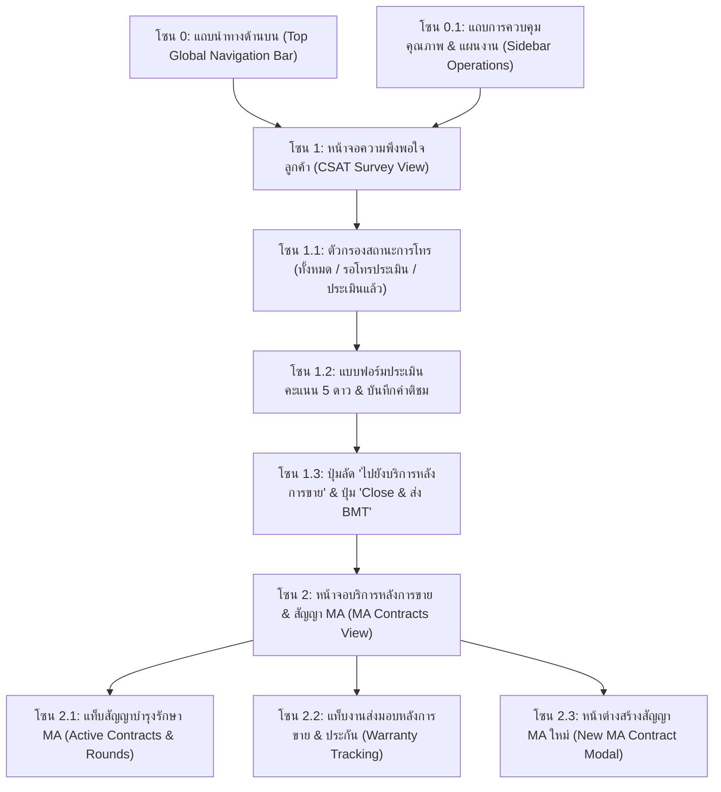
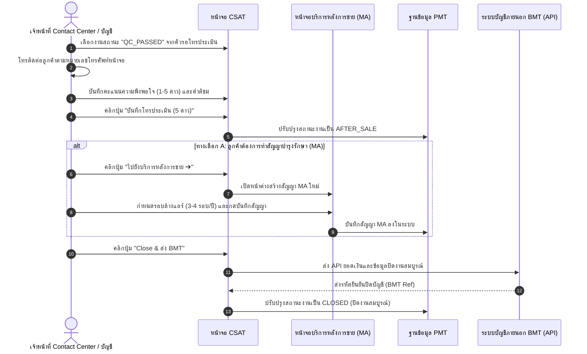

# 🎓 คู่มือฝึกอบรมการใช้งานหน้าจอระบบ PMT Flow
## โมดูลที่ 7: เจาะลึกหน้าจอความพึงพอใจลูกค้า & บริการหลังการขาย & ปิดงานส่ง BMT (CSAT, MA Contracts & BMT Sync Training Screen Guide)
**รหัสหลักสูตร:** `TRN-PMT-CSAT01` | **ระบบ:** PMT Flow (Store Project Management Tool) | **เวอร์ชัน:** 2.0 (Pipeline Architecture) | **กลุ่มเป้าหมาย:** เจ้าหน้าที่ศูนย์บริการลูกค้า (Contact Center), ฝ่ายบริการหลังการขาย, แผนกบัญชีและการเงิน, ผู้จัดการโครงการ (PM) และวิทยากรผู้ฝึกอบรม (Trainer)

---

## 📌 บทสรุปและวัตถุประสงค์หลักสูตร (Course Overview & Objectives)

หน้าจอ **ความพึงพอใจลูกค้า (CSAT)** และ **บริการหลังการขาย & สัญญา MA (After-Sales & MA Contracts)** คือ **"ขั้นตอนปิดท้ายกระบวนการส่งมอบและสร้างความสัมพันธ์ระยะยาว (Final Handover & Revenue Retention Gate)"** ของระบบ PMT Flow ทำหน้าที่รับช่วงต่องานที่ผ่านการรับรองคุณภาพมาตรฐานจาก **QC (สถานะ `QC_PASSED`)** เพื่อดำเนินงานสำคัญ 3 ประการ:
1. การโทรสอบถามและประเมินผลความพึงพอใจของลูกค้า (Customer Satisfaction Score: ⭐ 1 ถึง 5 ดาว) พร้อมบันทึกคำติชม
2. การสร้างและบริหารจัดการสัญญาบริการบำรุงรักษาเชิงป้องกัน (Preventive Maintenance MA Contracts) เช่น การจัดรอบล้างเครื่องปรับอากาศประจำปี (3-4 รอบ/ปี) และการติดตามการรับประกันงานติดตั้ง
3. การปิดงานอย่างสมบูรณ์ (Close Job) และการส่งถ่ายข้อมูลทางการเงินและโครงการผ่านระบบบูรณาการ (Auto-Sync API) ไปยัง **ระบบบัญชีและการเงิน BMT** โดยไม่ต้องคีย์ข้อมูลซ้ำ

### 🎯 วัตถุประสงค์การเรียนรู้สำหรับผู้เข้าอบรม (Learning Objectives):
1. **เข้าใจขั้นตอนการทำงานของ Contact Center:** สามารถค้นหางานในคิว `รอโทรประเมิน` และบันทึกคะแนนดาวและข้อเสนอแนะได้อย่างถูกต้อง
2. **เปลี่ยนสถานะงานสู่ AFTER_SALE:** รู้จักเงื่อนไขที่ทำให้งานเปลี่ยนสถานะ และการเชื่อมโยงไปยังหน้าบริการหลังการขาย
3. **สร้างสัญญาบำรุงรักษา MA ใหม่:** สามารถดึงข้อมูลโครงการเดิมมากำหนดรอบการให้บริการ (Maintenance Cycles), จำนวนครั้งต่อปี และกำหนดตารางแจ้งเตือนล่วงหน้า
4. **บริหารจัดการงานรับประกัน (Warranty Tracking):** ตรวจสอบระยะเวลารับประกันงานติดตั้งและอะไหล่ได้อย่างแม่นยำ
5. **สั่งปิดงานส่ง BMT (Close Job & Financial Sync):** ปฏิบัติการส่งข้อมูลปิดงานเข้าสู่ระบบ BMT และเข้าใจข้อควรระวังเรื่องการล็อกยอดเงินหลังปิดงาน

---

## 🧭 กายวิภาคของหน้าจอ CSAT & บริการหลังการขาย (Screen Anatomy Breakdown)

---

## 🛠️ ขั้นตอนการปฏิบัติงานมาตรฐาน (Step-by-Step SOP)

---

### ขั้นตอนที่ 1: การโทรประเมินความพึงพอใจลูกค้า (CSAT Execution)

1. คลิกเมนู **`ความพึงพอใจลูกค้า (CSAT)`** ที่แถบเมนูด้านซ้าย
2. ในแท็บ **"รอโทรประเมิน"** คลิกเลือกรายการงานที่ต้องการ
3. ตรวจสอบชื่อลูกค้า, เบอร์โทร และรายละเอียดงานติดตั้ง
4. ทำการโทรติดต่อลูกค้าตามสคริปต์มาตรฐาน:
   - กล่าวทักทายและแจ้งชื่อเจ้าหน้าที่จากศูนย์บริการ PMT
   - สอบถามความเรียบร้อยของการติดตั้งและการให้บริการของทีมช่าง
   - ขอคะแนนความพึงพอใจระดับ 1 ถึง 5 ดาว
5. ในหน้าจอ PMT ให้คลิกเลือกดาว:
   - ⭐⭐⭐⭐⭐ (5 ดาว - ดีเยี่ยม)
   - ⭐⭐⭐⭐ (4 ดาว - ดี)
   - ⭐⭐⭐ (3 ดาว - ปานกลาง)
   - ⭐⭐ (2 ดาว - ต้องปรับปรุง) / ⭐ (1 ดาว - ไม่พอใจมาก)
6. พิมพ์ข้อคิดเห็นหรือคำติชมของลูกค้าลงในช่องบันทึก
7. คลิกปุ่มสีม่วง **`บันทึกโทรประเมิน (5 ดาว)`**
   - สถานะงานจะเปลี่ยนเป็น **`AFTER_SALE`**

---

### ขั้นตอนที่ 2: การสร้างสัญญาบำรุงรักษา MA (Preventive Maintenance)

สำหรับงานติดตั้งที่มีบริการต่อเนื่อง เช่น เครื่องปรับอากาศ หรือปั๊มน้ำ:
1. คลิกปุ่ม **`ไปยังบริการหลังการขาย ➔`** หรือคลิกเมนู **`บริการหลังการขาย`** ที่แถบเมนูด้านซ้าย
2. คลิกปุ่ม **`+ สร้างสัญญา MA ใหม่`**
3. ระบบจะดึงข้อมูลลูกค้าและประเภทบริการเดิมมาใส่ในฟอร์มอัตโนมัติ:
   - **ชื่อสัญญา:** เช่น `สัญญาบำรุงรักษาเครื่องปรับอากาศรายปี - คุณวิภาดา`
   - **รอบการเข้าบริการ:** เลือกระหว่าง `3 รอบ/ปี (ทุก 4 เดือน)` หรือ `4 รอบ/ปี (ทุก 3 เดือน)`
   - **วันเริ่มต้น - สิ้นสุดสัญญา:** กำหนดระยะเวลาคุ้มครอง 1 ปี
   - **Checklist อุปกรณ์:** ระบุจำนวนเครื่องและตำแหน่งที่ต้องเข้าบริการ
4. คลิกปุ่ม **`บันทึกสร้างสัญญา MA`**
   - ระบบจะสร้างรอบงานบำรุงรักษาลงในตาราง และแจ้งเตือนเมื่อถึงกำหนดรอบล้างแอร์ในแต่ละงวด

---

### ขั้นตอนที่ 3: การปิดงานสมบูรณ์และซิงค์ข้อมูลส่ง BMT (Close Job & BMT Sync)

เมื่อกระบวนการประเมินเสร็จสิ้น และไม่มีงานค้างใดๆ:
1. ในหน้าจอ CSAT หรือหน้าจอรายละเอียดงาน ให้ตรวจสอบยอดสรุปการเงิน
2. คลิกปุ่มสีเขียว **`Close & ส่ง BMT`**
3. ระบบจะแสดงหน้าต่างยืนยันการปิดงาน (Confirmation Dialog):
   - แสดงยอดเงินรวมสุทธิที่จะส่งไประบบบัญชี BMT
   - แจ้งเตือนว่าเมื่อปิดงานแล้ว ข้อมูล BOQ และการเงินจะไม่สามารถแก้ไขได้
4. คลิก **`ยืนยันปิดงานและส่งข้อมูล`**
   - ระบบจะยิง API เชื่อมต่อกับระบบ BMT ทันที
   - สถานะงานจะเปลี่ยนเป็น **`CLOSED`** (แถบสีเขียวสมบูรณ์) พร้อมแสดงตราประทับส่งมอบงาน

---

## 💡 แผนการสอนสำหรับ Trainer (Workshop Hands-on Guide)

### 🎯 บททดสอบปฏิบัติการประจำห้องเรียน (20 นาที):
**สถานการณ์สมมติ:** "งาน `JOB202609001` (ติดตั้งแอร์ คุณสมชาย) ผ่าน QC เรียบร้อยแล้ว ให้ผู้เรียนสวมบทบาทเป็น Contact Center และเจ้าหน้าที่บริการหลังการขาย ปฏิบัติการดังนี้"

1. **โจทย์ข้อที่ 1:** เปิดเมนู CSAT เลือกงาน `JOB202609001`
2. **โจทย์ข้อที่ 2:** บันทึกคะแนนความพึงพอใจ 5 ดาว พร้อมข้อความติชม: "ลูกค้าประทับใจช่างมาก ทำงานสะอาดและสุภาพ"
3. **โจทย์ข้อที่ 3:** กดบันทึกผลการประเมิน และสังเกตสถานะงานที่เปลี่ยนเป็น `AFTER_SALE`
4. **โจทย์ข้อที่ 4:** คลิกปุ่ม "ไปยังบริการหลังการขาย" และสร้างสัญญา MA ล้างแอร์ 3 รอบ/ปี
5. **โจทย์ข้อที่ 5:** กลับมากดปุ่ม **`Close & ส่ง BMT`** และตรวจเช็กว่าสถานะสุดท้ายเปลี่ยนเป็น `CLOSED` สมบูรณ์

---

## ❓ คำถามที่พบบ่อยและข้อควรระวัง (FAQ & Best Practices)

> [!IMPORTANT]
> **Q: หากกดยืนยัน Close Job ส่ง BMT ไปแล้ว แต่พบว่ายอดเงินใน BOQ ผิดพลาด จะแก้ไขอย่างไร?**  
> **A:** เมื่องานอยู่ในสถานะ `CLOSED` ระบบ PMT จะล็อกการแก้ไขข้อมูลเพื่อป้องกันข้อขัดแย้งกับระบบบัญชี BMT หากจำเป็นต้องแก้ไข จะต้องทำเอกสารขออนุมัติปรับปรุงยอดเงินผ่านแผนกบัญชีเพื่อปรับปรุงในระบบ BMT โดยตรง

> [!NOTE]
> **Q: หากลูกค้าให้คะแนน CSAT ต่ำกว่า 3 ดาว ต้องทำอย่างไร?**  
> **A:** ระบบจะแสดงไฮไลท์สีส้ม/แดงในรายงานแดชบอร์ด และให้เจ้าหน้าที่ Contact Center กรอกสาเหตุของความไม่พึงพอใจลงในช่องบันทึก เพื่อส่งเรื่องให้ฝ่ายบริหารคุณภาพและหัวหน้าช่างเข้าพบลูกค้าเพื่อแก้ไขข้อกังวลทันที

---

**จัดทำโดย:** ฝ่ายพัฒนาหลักสูตรและฝึกอบรม PMT Flow  
**รหัสเอกสาร:** `TRN-PMT-CSAT01-v2.0`  
**สถานะการรับรอง:** Approved Standard (Enterprise Operations)