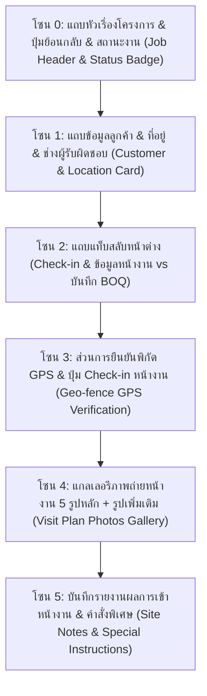
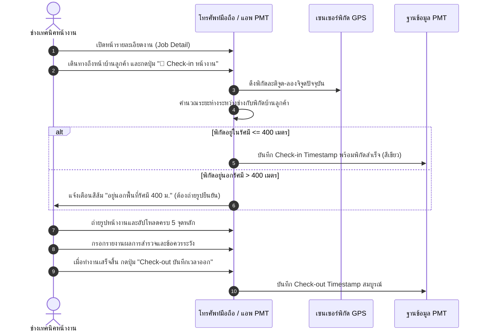

# 🎓 คู่มือฝึกอบรมการใช้งานหน้าจอระบบ PMT Flow
## โมดูลที่ 9: เจาะลึกหน้ารายละเอียดงาน & การ Check-in พิกัด GPS และบันทึกรูปหน้างาน (Job Detail, Site Check-in & Photo Audit Training Screen Guide)
**รหัสหลักสูตร:** `TRN-PMT-SITE01` | **ระบบ:** PMT Flow (Store Project Management Tool) | **เวอร์ชัน:** 2.0 (Pipeline Architecture) | **กลุ่มเป้าหมาย:** ทีมช่างเทคนิคหน้างาน (Field Technician), เจ้าหน้าที่สำรวจหน้างาน (Site Survey AE), เจ้าหน้าที่ควบคุมคุณภาพ (QC), หัวหน้าช่าง และวิทยากรผู้ฝึกอบรม (Trainer)

---

## 📌 บทสรุปและวัตถุประสงค์หลักสูตร (Course Overview & Objectives)

หน้าจอ **รายละเอียดงาน & การ Check-in หน้างาน (Job Detail & Site Visit Screen - `page-job-detail`)** คือ **"สมุดพกประจำตัวของทีมช่างและศูนย์รวมข้อมูลปฏิบัติการหน้างานจริง (Field Operations Portal)"** ของระบบ PMT Flow ทำหน้าที่รองรับการทำงานของช่างเมื่อเดินทางเข้าสู่บ้านลูกค้าจริง เพื่อบันทึกพิกัด ยืนยันเวลา และเก็บหลักฐานเชิงประจักษ์ก่อนลงมือทำงาน โดยมีแกนหลัก 4 ประการ:
1. การตรวจสอบและยืนยันพิกัดสถานที่ด้วย **Geo-fence GPS (ต้องอยู่ภายในรัศมีไม่เกิน 400 เมตรจากบ้านลูกค้า)**
2. การบันทึกเวลาเข้าพื้นที่หน้างานจริง (**Check-in Timestamp**) และเวลาทำงานแล้วเสร็จ (**Check-out Timestamp**)
3. การปฏิบัติตามมาตรฐานการบันทึกภาพถ่ายหน้างานอย่างน้อย 5 จุดสำคัญ (**Visit Plan 5 Essential Photos**)
4. การบันทึกรายงานสรุปผลการเข้าพบลูกค้าและคำสั่งพิเศษหน้างาน (Site Survey Notes & Customer Requirements)

### 🎯 วัตถุประสงค์การเรียนรู้สำหรับผู้เข้าอบรม (Learning Objectives):
1. **เข้าใจกลไกการทำงานของ Geo-fence GPS 400 เมตร:** รู้วิธีเปิด Location Services บนสมาร์ทโฟน และเข้าใจเกณฑ์การคำนวณระยะห่างเพื่อป้องกันปัญหา Check-in ไม่ผ่าน
2. **ปฏิบัติตามมาตรฐานภาพถ่าย 5 จุดสำคัญได้ครบถ้วน 100%:** รู้ว่าภาพถ่าย 5 จุดมีอะไรบ้าง และถ่ายอย่างไรให้ผ่านเกณฑ์การตรวจของ QC
3. **บันทึก Check-in และ Check-out ได้ถูกต้องตามเวลาจริง:** เข้าใจความสำคัญของ Timestamp ต่อการคำนวณค่าแรงและรายงาน SLA
4. **บันทึกคำสั่งพิเศษและข้อควรระวังหน้างาน:** สามารถกรอกข้อมูลรายงานผลการสำรวจและจุดเสี่ยงให้สถาปนิกและทีมติดตั้งทราบล่วงหน้า
5. **แก้ปัญหาเฉพาะหน้ากรณีสัญญาณ GPS คลาดเคลื่อน:** รู้วิธีประสานงานกับ QC หรือ PM เพื่อขออนุมัติกรณีพิเศษเมื่ออยู่นอกพื้นที่สัญญาณ

---

## 🧭 กายวิภาคของหน้ารายละเอียดงาน & Check-in (`page-job-detail`)

---

## 📸 มาตรฐานภาพถ่ายหน้างาน 5 จุดสำคัญ (5 Essential Site Photos)

ทีมช่างต้องทำการถ่ายภาพและอัปโหลดเข้าสู่ระบบให้ครบทั้ง 5 จุดหลัก:

| จุดที่ | ชื่อภาพถ่าย | รายละเอียดและมุมมองที่ต้องถ่าย | วัตถุประสงค์ในการตรวจสอบ |
| :---: | :--- | :--- | :--- |
| **1** | **ภาพหน้าบ้านและป้ายบ้านเลขที่** | ถ่ายภาพรวมหน้าบ้านลูกค้าให้เห็นป้ายบ้านเลขที่ชัดเจน | ยืนยันว่าช่างเข้าทำงานถูกบ้าน ถูกสถานที่จริง 100% |
| **2** | **ภาพพื้นที่ทำงานก่อนติดตั้ง** | ถ่ายจุดที่จะทำการติดตั้ง (เช่น ผนังห้อง, พื้นที่วางถังน้ำ) | เป็นหลักฐานสภาพเดิมก่อนเริ่มงาน ป้องกันการเรียกร้องความเสียหาย |
| **3** | **ภาพระหว่างการติดตั้ง** | ถ่ายขั้นตอนการทำงานสำคัญ เช่น การเดินสายดิน, รอยเชื่อม | เพื่อให้ QC ตรวจสอบมาตรฐานงานช่างที่ไม่สามารถมองเห็นได้ภายหลัง |
| **4** | **ภาพอุปกรณ์และวัสดุที่ใช้จริง** | ถ่ายป้าย Model เครื่อง, ฉลาก มอก., ยี่ห้อท่อ/สายไฟ | ยืนยันว่าใช้วัสดุและอุปกรณ์ตรงตามใบ BOQ ที่ตกลงกับลูกค้า |
| **5** | **ภาพงานติดตั้งเสร็จสมบูรณ์** | ถ่ายภาพผลงานสำเร็จในมุมกว้าง พร้อมพื้นที่สะอาดเรียบร้อย | ใช้ส่งมอบงานให้ลูกค้า และแนบในรายงานส่งตรวจ QC |

---

## 🛠️ ขั้นตอนการปฏิบัติงานมาตรฐาน (Step-by-Step SOP)

---

### ขั้นตอนที่ 1: การกด Check-in ยืนยันพิกัด GPS

1. เมื่อช่างเดินทางถึงบริเวณหน้าบ้านลูกค้า ให้เปิดหน้ารายละเอียดงานนั้นบนระบบ PMT
2. ตรวจสอบว่าเปิด **GPS / Location Services** บนอุปกรณ์เรียบร้อยแล้ว
3. คลิกปุ่มสีม่วง **`📍 Check-in หน้างาน`**
4. ระบบจะแสดงการคำนวณระยะห่าง:
   - หากขึ้นว่า **`✓ อยู่ในพื้นที่ (ห่าง 45 เมตร)`** เป็นแถบสีเขียว แสดงว่าผ่านเกณฑ์ Geo-fence
   - ระบบจะบันทึกเวลา Check-in ปัจจุบันลงในฐานข้อมูลทันที

---

### ขั้นตอนที่ 2: การถ่ายรูปและอัปโหลดภาพถ่าย 5 จุด

1. ในส่วนแกลเลอรีภาพถ่าย จะมีกรอบอัปโหลดเรียงตามหมายเลข 1 ถึง 5
2. คลิกที่กรอบภาพแต่ละจุด:
   - เลือกถ่ายรูปสดจากกล้อง หรือเลือกจากอัลบั้มภาพ
   - ถ่ายภาพให้ชัดเจน ไม่เบลอ และมีแสงสว่างเพียงพอ
3. ตรวจสอบว่าภาพทั้ง 5 รูปถูกอัปโหลดขึ้นระบบครบถ้วน (ตัวนับจะแสดง `5/5 รูป`)
4. หากมีจุดพิเศษเพิ่มเติม สามารถกด **`+ แนบภาพเพิ่มเติม`** ได้

---

### ขั้นตอนที่ 3: การบันทึกคำสั่งพิเศษและการ Check-out

1. เลื่อนลงมาที่ส่วน **"บันทึกผลการเข้าหน้างาน & คำสั่งพิเศษ"**
2. พิมพ์สรุปข้อมูลที่พบหน้างาน เช่น:
   - *"หน้างานต้องใช้นั่งร้าน 2 ชั้นเนื่องจากเพดานสูง 4 เมตร"*
   - *"ลูกค้าขอให้ย้ายตำแหน่งคอยล์ร้อนไปไว้หลังบ้าน"*
3. เมื่อเสร็จสิ้นภารกิจประจำวัน ให้คลิกปุ่ม **`บันทึก Check-out`**
   - ระบบจะประทับเวลาสิ้นสุดงานเพื่อใช้สรุปชั่วโมงทำงานและส่งต่อข้อมูลให้ QC

---

## 💡 แผนการสอนสำหรับ Trainer (Workshop Hands-on Guide)

### 🎯 บททดสอบปฏิบัติการประจำห้องเรียน (20 นาที):
**สถานการณ์สมมติ:** "ทีมช่างเข้าพื้นที่บ้านคุณสมชาย (`JOB202609001`) เพื่อเริ่มงานติดตั้ง ให้ผู้เรียนฝึกปฏิบัติตามขั้นตอนดังนี้"

1. **โจทย์ข้อที่ 1:** เปิดหน้ารายละเอียดงาน `JOB202609001`
2. **โจทย์ข้อที่ 2:** ทำการกดปุ่ม Check-in หน้างาน และสังเกตการขึ้นเวลา Timestamp
3. **โจทย์ข้อที่ 3:** ทำการอัปโหลดภาพจำลองให้ครบทั้ง 5 จุดหลัก
4. **โจทย์ข้อที่ 4:** บันทึกข้อความ "สำรวจพื้นที่เรียบร้อย ผนังรับน้ำหนักได้ดี พร้อมเริ่มติดตั้ง"
5. **โจทย์ข้อที่ 5:** กดปุ่ม Check-out และตรวจเช็กว่าสถานะภาพรวมและประวัติเวลาอัปเดตเรียบร้อย

---

## ❓ คำถามที่พบบ่อยและข้อควรระวัง (FAQ & Best Practices)

> [!IMPORTANT]
> **Q: หากโทรศัพท์ขึ้นแจ้งเตือนว่าอยู่นอกรัศมี 400 เมตร ทั้งที่อยู่หน้าบ้านลูกค้าจริง เกิดจากอะไรและแก้อย่างไร?**  
> **A:** มักเกิดจากสัญญาณ GPS ในพื้นที่อับสัญญาณหรือระบบ Location Services ค้าง ให้ช่างปิด-เปิดสัญญาณ Location ใหม่ หากยังไม่หาย ให้ถ่ายภาพหน้าบ้านที่มีป้ายบ้านเลขที่และป้ายชื่อซอยชัดเจน แล้วแจ้งหัวหน้างานเพื่อกดยืนยันพิกัดแบบ Manual Approval

> [!TIP]
> **Q: สามารถอัปโหลดรูปภาพเกิน 5 รูปได้หรือไม่?**  
> **A:** ได้อย่างไม่จำกัด โดย 5 รูปแรกคือเกณฑ์บังคับขั้นต่ำ ส่วนรูปที่ 6 เป็นต้นไปสามารถแนบเพิ่มเติมเพื่อบันทึกจุดที่มีปัญหาหรือรอยตำหนิเดิมของบ้านลูกค้าได้

---

**จัดทำโดย:** ฝ่ายพัฒนาหลักสูตรและฝึกอบรม PMT Flow  
**รหัสเอกสาร:** `TRN-PMT-SITE01-v2.0`  
**สถานะการรับรอง:** Approved Standard (Enterprise Operations)