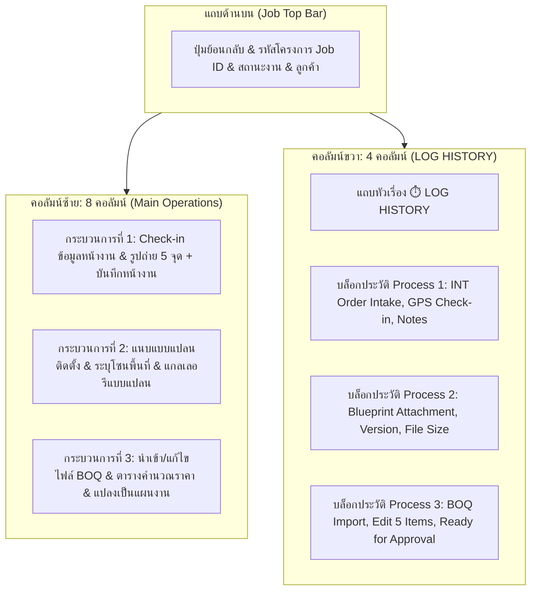

# 🎓 คู่มือฝึกอบรมการใช้งานหน้าจอระบบ PMT Flow
## โมดูลที่ 8: เจาะลึกหน้ารายละเอียดงาน 3-in-1 แบบ 2 คอลัมน์ & บันทึกประวัติ LOG HISTORY แยกตาม Process
**รหัสหลักสูตร:** `TRN-PMT-SITE01` | **ระบบ:** PMT Flow (Store Project Management Tool) | **เวอร์ชัน:** 2.5 (Unified 2-Column Pipeline Layout) | **กลุ่มเป้าหมาย:** ทีมช่างเทคนิคหน้างาน (Field Technician), เจ้าหน้าที่สำรวจหน้างาน (Site Survey AE), เจ้าหน้าที่สถาปัตย์ (Architect), เจ้าหน้าที่ควบคุมคุณภาพ (QC), หัวหน้าช่าง และวิทยากรผู้ฝึกอบรม (Trainer)

---

## 📌 บทสรุปและวัตถุประสงค์หลักสูตร (Course Overview & Objectives)

หน้าจอ **รายละเอียดงานแบบรวมศูนย์ 3 ขั้นตอน (Unified 3-in-1 Job Detail Screen - `page-job-detail`)** ได้รับการออกแบบใหม่ด้วยสถาปัตยกรรม **2 คอลัมน์ (Two-Column Layout)** เพื่อลดความซ้ำซ้อนในการสลับหน้าจอ และรวบรวม 3 ขั้นตอนสำคัญในการปฏิบัติงานจริงไว้ในหน้าเดียวอย่างเป็นเอกภาพ พร้อมคอลัมน์ประวัติการบันทึก **"LOG HISTORY"** ทางด้านขวาที่ติดตามและจัดกลุ่มการแก้ไขแยกตามแต่ละกระบวนการแบบ Realtime:

1. **ฝั่งซ้าย (Main Operations - 8 ส่วน):**
   - **กระบวนการที่ 1 (Process 1): Check-in ข้อมูลหน้างานและรูปถ่าย** — ตรวจสอบ Geo-fence GPS 400 ม., บันทึกเวลาเข้า-ออก 24-Hr, แกลเลอรีภาพถ่ายสำคัญ 5 จุด และบันทึกข้อความสรุปหน้างาน
   - **กระบวนการที่ 2 (Process 2): แนบแบบแปลนติดตั้ง** — ลากวางไฟล์แบบแปลน (Blueprint / Floor Plan / DWG / PDF / Image), กำหนดโซนพื้นที่ (เช่น โซนห้องนั่งเล่น, โซนครัว), และพรีวิวภาพขนาดย่อ (Thumbnail)
   - **กระบวนการที่ 3 (Process 3): นำเข้าและแก้ไขไฟล์ BOQ** — อัปโหลดไฟล์ BOQ, ตารางพรีวิวและแก้ไขรายการวัสดุ/ค่าแรงแบบอินเทอร์แอคทีฟ (Interactive Editable Table), เพิ่ม/ลบรายการ, คำนวณยอดรวมและ VAT 7% สด, พร้อมปุ่มบันทึกและแปลงเป็นแผนงาน
2. **ฝั่งขวา (LOG HISTORY - 4 ส่วน):**
   - แถบหัวข้อสีแดงเอกลักษณ์ **`⏱️ LOG HISTORY`**
   - การ์ดประวัติแยกตาม Process อย่างชัดเจน (Process 1: ข้อมูลหน้างาน & GPS, Process 2: แบบแปลน, Process 3: รายการ BOQ)
   - ข้อมูลบันทึกประกอบด้วย เวลามาตรฐาน 24 ชั่วโมง (`DD/MM/YYYY HH:mm น.`), ผู้ดำเนินการ (เช่น `Kong`), ป้ายสถานะระบุประเภทการกระทำ และภาพตัวอย่างเอกสาร/แบบแปลน
   - อัปเดตข้อมูลแบบสด (Realtime Reactive) ทันทีที่มีการกดบันทึกหรือแก้ไขในแต่ละ Process โดยไม่รีโหลดหน้าจอและไม่หลุดโฟกัส

---

## 🧭 โครงสร้างผังหน้าจอแบบ 2 คอลัมน์ (2-Column Architecture Anatomy)

---

## 📸 กระบวนการที่ 1: Check-in ข้อมูลหน้างานและรูปถ่าย (Process 1)

### 1.1 การยืนยันพิกัด Geo-fence GPS & เวลา 24 ชั่วโมง
- ช่างเดินทางถึงหน้างาน กดปุ่ม **`📍 Check-in หน้างาน`**
- ระบบคำนวณระยะห่างระหว่างอุปกรณ์กับพิกัดบ้านลูกค้า หากอยู่ในรัศมี **ไม่เกิน 400 เมตร** แถบสถานะจะแสดงสีเขียว `✓ อยู่ในพื้นที่`
- เวลา Check-in และ Check-out จะแสดงในรูปแบบ **24-Hour Format (`HH:mm น.`)** เช่น `08:30 น.`, `17:00 น.` อย่างเคร่งครัดตามระเบียบระบบ

### 1.2 แกลเลอรีภาพถ่ายหน้างาน 5 จุดสำคัญ
| จุดที่ | ชื่อภาพถ่าย | วัตถุประสงค์ในการตรวจสอบ |
| :---: | :--- | :--- |
| **1** | **ภาพหน้าบ้านและป้ายบ้านเลขที่** | ยืนยันว่าเข้าปฏิบัติงานถูกบ้าน ถูกสถานที่จริง 100% |
| **2** | **ภาพพื้นที่ทำงานก่อนติดตั้ง** | หลักฐานสภาพพื้นที่เดิม ป้องกันข้อพิพาทความเสียหาย |
| **3** | **ภาพระหว่างการติดตั้ง** | ตรวจสอบงานระบบซ่อนสายดิน รอยเชื่อม และมาตรฐานช่าง |
| **4** | **ภาพอุปกรณ์และวัสดุที่ใช้จริง** | ยืนยันสเปก ยี่ห้อ และรุ่นสินค้าให้ตรงตาม BOQ |
| **5** | **ภาพงานติดตั้งเสร็จสมบูรณ์** | บันทึกความเรียบร้อยก่อนส่งมอบงานให้ลูกค้าและ QC |

### 1.3 บันทึกผลการสำรวจและข้อควรระวังหน้างาน
- ช่องบันทึกข้อความหน้างานพร้อมปุ่ม **`บันทึกโน้ต`**
- เมื่อกดบันทึก ข้อมูลจะถูกบันทึกลงระบบทันที และสร้าง Log บันทึกเข้าคอลัมน์ LOG HISTORY (Process 1) โดยอัตโนมัติ

---

## 📐 กระบวนการที่ 2: แนบแบบแปลนติดตั้ง (Process 2)

### 2.1 การอัปโหลดแบบแปลนและระบุโซน
- พื้นที่ลากและวางไฟล์ (Drag & Drop Zone) รองรับทั้งไฟล์ `.pdf`, `.dwg`, `.dxf`, `.png`, `.jpg`
- กล่องเลือกโซนห้องหรือตำแหน่งติดตั้ง เช่น **"ห้องนั่งเล่น"**, **"ห้องนอนใหญ่"**, **"โถงทางเข้า"**
- ปุ่ม **`+ บันทึกแบบแปลนเข้า Job`** และปุ่มช่วยโหลดตัวอย่างแบบแปลนทดสอบ **`โหลดแบบแปลนตัวอย่าง`**

### 2.2 แกลเลอรีแบบแปลนและพรีวิว
- แสดงภาพตัวอย่างขนาดเล็ก (Thumbnail Preview) ชื่อไฟล์ ขนาดไฟล์ และโซนติดตั้ง
- สามารถกดดูภาพขยาย (Lightbox) หรือลบแบบแปลนที่แนบผิดได้ทันที
- ทุกการแนบหรือลบแบบแปลน ระบบจะส่งประวัติไปแสดงใน LOG HISTORY (Process 2) พร้อมภาพ Thumbnail และขนาดไฟล์ (เช่น `2.5 MB`)

---

## 📊 กระบวนการที่ 3: นำเข้าและแก้ไขไฟล์ BOQ (Process 3)

### 3.1 การนำเข้าไฟล์ BOQ (Import & Template)
- รองรับการลากวางไฟล์ Excel / CSV หรือกดเลือกไฟล์
- มีปุ่ม **`ดาวน์โหลดเทมเพลต BOQ`** และ **`โหลดข้อมูลตัวอย่าง`** เพื่อความสะดวกและรวดเร็ว

### 3.2 ตารางรายการ BOQ แบบอินเทอร์แอคทีฟ (Interactive BOQ Table)
- แสดงแถวรายการวัสดุและค่าแรง โดยสามารถแก้ไข **ชื่อรายการ**, **จำนวน (Qty)**, **หน่วย (Unit)**, และ **ราคาต่อหน่วย (Unit Price)** ได้สดในตาราง
- คำนวณราคารวมแต่ละบรรทัด (Line Total) สดแบบ Realtime
- ปุ่ม **`+ เพิ่มแถวรายการ`** เพื่อแทรกรายการวัสดุหรือค่าแรงหน้างาน
- ปุ่ม **`ลบ` (ไอคอนถังขยะ)** ท้ายแถวรายการ
- สรุปยอดรวม (Subtotal), ส่วนลด (Discount), ภาษีมูลค่าเพิ่ม 7% (VAT 7%), และยอดรวมสุทธิ (Grand Total)

### 3.3 ปุ่มการดำเนินการสำคัญ
- **`💾 บันทึกเฉพาะ BOQ`**: บันทึกการแก้ไข BOQ ลงระบบ PMT ทันที พร้อมส่ง Activity Log เข้า Process 3 ในแถบด้านขวา
- **`⚡ กำหนดวันเวลา & ช่าง (แปลงเป็น Project)`**: เปิดหน้าต่างแปลงรายการค่าแรงเป็น Tasks ใน Gantt Chart
- **`🗑️ ล้าง BOQ ทั้งหมด`**: เคลียร์ข้อมูล BOQ เพื่อนำเข้าใหม่

---

## ⏱️ คอลัมน์ขวา: บันทึกประวัติ LOG HISTORY แบบแยก Process

### 4.1 คุณลักษณะเด่นของแถบ LOG HISTORY
1. **หัวข้อสีแดงสะดุดตา:** ป้ายหัวข้อสีแดงสดใส `⏱️ LOG HISTORY` บ่งบอกสถานะความเคลื่อนไหวตลอดวงจรชีวิตของ Job
2. **การจัดกลุ่มแยกตาม 3 Process:**
   - **Process 1:** บันทึกประวัติการรับออเดอร์จากระบบ INT, การ Check-in พิกัด GPS, การอัปโหลดรูปภาพ 5 จุด และการบันทึกข้อความหน้างาน
   - **Process 2:** บันทึกประวัติการแนบแบบแปลน ชื่อไฟล์ (เช่น `interior_ref.jpg`), ขนาดไฟล์ (เช่น `2.5 MB`), โซนติดตั้ง และภาพ Thumbnail ขนาดเล็ก
   - **Process 3:** บันทึกประวัติการนำเข้า BOQ, การแก้ไขรายการ, การคำนวณภาษี และการกดยืนยันส่งต่อหรือแปลงเป็นแผนงาน
3. **มาตรฐานเวลา 24 ชั่วโมง:** ทุกรายการบันทึกระบุวันที่และเวลาเป็น `DD/MM/YYYY HH:mm น.` เสมอ เช่น `10/09/2026 09:15 น.`
4. **ระบุชื่อผู้ดำเนินการชัดเจน:** แสดงชื่อผู้กระทำ เช่น `Kong`, `AE สมชาย`, หรือ `System INT`
5. **Realtime Reactive UI:** ทุกการกระทำบนฝั่งซ้ายจะถูกบันทึกลงฐานข้อมูลและเรนเดอร์อัปเดตแถบประวัติทางขวาทันที โดยที่หน้าจอไม่กระพริบและไม่สูญเสียตำแหน่ง Scroll

---

---

## 📋 การบันทึกงานช่างประจำวัน (Daily Technician Work Log via Gantt Timeline)

การบันทึกงานช่างประจำวันถูกรวมศูนย์ไว้ที่จุดเดียว (**Single-Entry Modal**) ผ่านหน้าจอแผนงานโครงการ **Gantt Timeline (`page-gantt`)** เพื่อตัดความซ้ำซ้อนและให้ช่างหรือหัวหน้างานทำงานได้สะดวกรวดเร็ว:
1. **การเข้าถึงจากแถบงานใน Gantt Timeline:**
   - ช่างหรือผู้ควบคุมงานเข้าที่เมนู **"แผนงาน Gantt เต็มรูป"**
   - คลิกปุ่ม **"บันทึกช่าง"** (`app.openDailyWorkLogModal(taskId)`) ที่แถวงาน (Task Row) ที่ต้องการลงบันทึก
   - ป๊อปอัปโมดอลบันทึกงานช่างประจำวัน (`modal-daily-work-log`) จะเปิดขึ้นมาพร้อมข้อมูลโครงการ, ชื่องาน, รอบวันทำงาน (Day #), เวลาเข้า-ออก, ความคืบหน้าสะสม, และช่องแนบภาพถ่าย 5 ช่อง
2. **ระบบ Auto-Redirect:**
   - หากมีการเข้าใช้งานลิงก์เก่า (`app.navigate('daily-logs')`) ระบบจะทำการเปลี่ยนเส้นทางอัตโนมัติ (Clean Redirect) ไปยังหน้าจอ Gantt Timeline ทันที ป้องกันปัญหา Broken Link
3. **การประมวลผลความคืบหน้ารายวันและขั้นตอนปิดงาน:**
   - เมื่อบันทึกความคืบหน้ารายวัน (`💾 บันทึกความคืบหน้ารายวัน`) ระบบจะคำนวณและอัปเดตแถบความคืบหน้าของ Task และภาพรวมโครงการใน Gantt Chart ให้ทันทีแบบเรียลไทม์
   - โมดอลบันทึกงานช่างถูกปรับให้ **"เหลือแค่บันทึกรายวัน"** เท่านั้น โดยตัดปุ่มลัดเวลา, ตัวเลื่อนเปอร์เซ็นต์แบบ Manual, และปุ่มจบงานออก เพื่อให้ช่างโฟกัสกับการลงเวลาและแนบรูปผลงานจริง
   - เมื่อช่างลงบันทึกความคืบหน้าครบถ้วนและต้องการปิดงาน สามารถคลิกปุ่มลิงก์ **"ไปยังหน้าถัดไป (Step 5: ตรวจ QC & บันทึกปิดงาน)"** ที่ท้ายฟอร์มได้ทันที

---

## 🔒 ข้อกำหนดมาตรฐานการตัดจบงานและบันทึกปิดงาน (Job Closeout via Step 5 QC)

1. **การย้ายขั้นตอน "บันทึกปิดงาน" ไปยัง Step 5 (การตรวจรับรองคุณภาพ QC):**
   - ขั้นตอนการบันทึกปิดงานโครงการ (Job Closeout) และการตรวจรับมอบความเรียบร้อย 100% ถูกย้ายไปรวมอยู่ที่ **Step 5: การตรวจรับรองคุณภาพ QC (`modal-qc-job-detail`)**
   - เจ้าหน้าที่ QC หรือหัวหน้าทีมจะทำการประเมินหัวข้อคุณภาพตามมาตรฐาน และเมื่อผ่านเกณฑ์ครบถ้วนจะทำการกดปุ่ม **"✓ บันทึกปิดงาน & อนุมัติผ่านเกณฑ์ QC & ส่งข้อมูลไป STK"**
2. **ระบบคืนสถานะอัตโนมัติเมื่อลบบันทึก (Auto Rollback on Delete):**
   - หากผู้ใช้บันทึกงานผิดวัน แล้วกดไอคอน 🗑️ (ถังขยะ) เพื่อลบรายการนั้นออก
   - ระบบจะตรวจสอบบันทึกที่เหลืออยู่ และ **คำนวณเปอร์เซ็นต์ความคืบหน้าตามจำนวนวันที่เหลืออยู่จริง** อัตโนมัติ ป้องกันข้อมูลค้างหรือผิดพลาด

---

## ☀️ มาตรฐานความเข้ากันได้ของระบบ (System Standards Compliance)

- **Pure Light Theme 100%:** ทุกพื้นผิว ป้ายสถานะ และตัวอักษรออกแบบสำหรับธีมสว่าง คมชัดสูง ปราศจากการใช้งาน Dark Mode
- **Default View Standard: Strictly List View:** แถบคิวงานเริ่มต้นแสดงผลเป็นตารางรายการ (List View) 100% เสมอ
- **Date Format Standard:** วันที่ทุกจุดใช้รูปแบบ `DD/MM/YYYY` (เช่น `10/09/2026`)
- **24-Hour Time Format:** รูปแบบเวลา `00:00 - 23:59 น.` ห้ามมี AM/PM เด็ดขาด
- **Dev-First Deployment:** โค้ดที่ผ่านการทดสอบและ Build จะถูก Commit และ Push ไปยัง Branch `main` (Dev Server: `vibepmt.online`) เพื่อให้ทีมตรวจสอบความถูกต้องก่อนเสนอขออนุมัติขึ้น Production โดยผู้ดูแลระบบ

---

**จัดทำโดย:** ฝ่ายพัฒนาและควบคุมมาตรฐานระบบ PMT Flow  
**รหัสเอกสาร:** `TRN-PMT-SITE01-v2.5`  
**สถานะการรับรอง:** Approved Standard (Enterprise Operations)