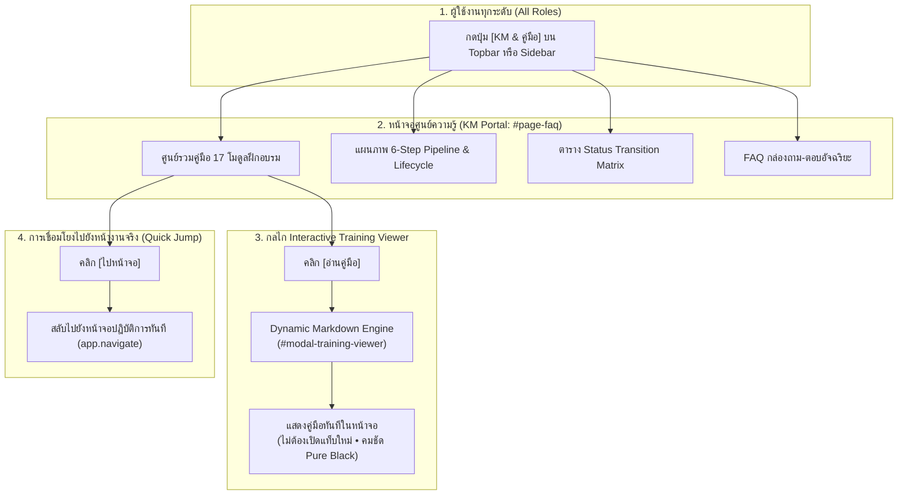
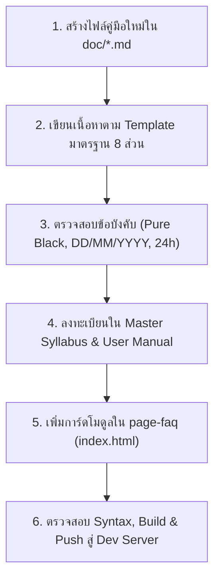

# 📘 คู่มือการใช้งาน: ศูนย์จัดการองค์ความรู้ และคู่มือการจัดทำ KM (KM Portal & Training Architecture)
### สถาปัตยกรรมการจัดการความรู้ระดับองค์กร และคู่มือมาตรฐานปฏิบัติการจัดทำ KM (Standard Operating Procedure for Knowledge Management)
**รหัสหลักสูตร:** `TRN-PMT-KM01` | **ระบบ:** PMT Flow (Store Project Management Tool) | **เวอร์ชัน:** 3.0 (Enterprise Standard)

---

## 📑 สารบัญ (Table of Contents)
1. [ภาพรวมและปรัชญาการออกแบบระบบ KM (Overview & KM Philosophy)](#1-ภาพรวมและปรัชญาการออกแบบระบบ-km-overview--km-philosophy)
2. [สิทธิ์การเข้าถึงและการกำหนดบทบาท (RBAC & Target Roles)](#2-สิทธิ์การเข้าถึงและการกำหนดบทบาท-rbac--target-roles)
3. [สถาปัตยกรรมการทำงานของหน้าจอ KM (`#page-faq`)](#3-สถาปัตยกรรมการทำงานของหน้าจอ-km-page-faq)
   - [3.1 แถบส่วนหัวและการเข้าถึงหน้าจอ (Header & Navigation Access)](#31-แถบส่วนหัวและการเข้าถึงหน้าจอ-header--navigation-access)
   - [3.2 ศูนย์รวมคู่มือฝึกอบรมรายหน้าจอ (Screen-by-Screen Training Guides Cards)](#32-ศูนย์รวมคู่มือฝึกอบรมรายหน้าจอ-screen-by-screen-training-guides-cards)
   - [3.3 แผนภาพกระบวนการทำงาน 6 ขั้นตอน (End-to-End 6-Step Pipeline)](#33-แผนภาพกระบวนการทำงาน-6-ขั้นตอน-end-to-end-6-step-pipeline)
   - [3.4 ตารางสรุปสถานะของระบบ (Status Transition Reference Table)](#34-ตารางสรุปสถานะของระบบ-status-transition-reference-table)
   - [3.5 กระดานคำถามที่พบบ่อย (Interactive FAQ Accordion)](#35-กระดานคำถามที่พบบ่อย-interactive-faq-accordion)
4. [กลไกเบื้องหลังของ Interactive Training Viewer (`window.openTrainingDoc`)](#4-กลไกเบื้องหลังของ-interactive-training-viewer-windowopentrainingdoc)
5. [คู่มือขั้นตอนการจัดทำและปรับปรุง KM (SOP: How to Author & Maintain KM)](#5-คู่มือขั้นตอนการจัดทำและปรับปรุง-km-sop-how-to-author--maintain-km)
   - [5.1 กฎเหล็กความสอดคล้อง 100% (Mandatory 100% Code & Documentation Sync)](#51-กฎเหล็กความสอดคล้อง-100-mandatory-100-code--documentation-sync)
   - [5.2 โครงสร้างและ Template มาตรฐานของเอกสารคู่มือ (.md)](#52-โครงสร้างและ-template-มาตรฐานของเอกสารคู่มือ-md)
   - [5.3 กฎเกณฑ์การแสดงผลและข้อมูลสำคัญ (UI, Date & Time Standards)](#53-กฎเกณฑ์การแสดงผลและข้อมูลสำคัญ-ui-date--time-standards)
   - [5.4 ขั้นตอนการนำคู่มือใหม่ขึ้นระบบ (6-Step Registration Workflow)](#54-ขั้นตอนการนำคู่มือใหม่ขึ้นระบบ-6-step-registration-workflow)
6. [แนวทางแก้ไขปัญหาและข้อควรระวัง (Troubleshooting & Best Practices)](#6-แนวทางแก้ไขปัญหาและข้อควรระวัง-troubleshooting--best-practices)

---

## 1. ภาพรวมและปรัชญาการออกแบบระบบ KM (Overview & KM Philosophy)

ในระบบบริหารจัดการโครงการระดับองค์กรที่มีความซับซ้อน เช่น **PMT Flow** ซึ่งมีผู้ใช้งานหลากหลายฝ่าย (Intake, AE, Planner, ช่างเทคนิค, เจ้าหน้าที่ QC, Contact Center, ผู้บริหาร และทีมผู้ตรวจสอบ) ความเข้าใจในขั้นตอนการทำงานที่ถูกต้อง ตรงกัน และเป็นปัจจุบัน 100% ถือเป็นหัวใจสำคัญสูงสุดในการลดข้อผิดพลาดหน้างานและยกระดับมาตรฐานการบริการ

ระบบ **KM Portal (Knowledge Management System)** บน PMT Flow จึงได้รับการออกแบบภายใต้ปรัชญา **"Live Interactive Knowledge Hub"** โดยไม่ได้เป็นเพียงคลังเอกสาร PDF ที่อยู่นิ่ง แต่เป็นระบบองค์ความรู้ที่มีชีวิต เชื่อมโยงกับโค้ดและหน้าจอจริงของระบบ:



### วัตถุประสงค์หลัก (Core Objectives):
1. **Single Source of Truth:** รวมศูนย์หลักสูตรฝึกอบรม, ขั้นตอนปฏิบัติการมาตรฐาน (SOP), และคู่มือรายหน้าจอไว้ที่จุดเดียวในระบบ
2. **Contextual & In-App Learning:** ผู้ใช้งานสามารถเปิดอ่านคู่มือได้ทันทีขณะกำลังปฏิบัติงานจริงผ่าน In-App Modal โดยไม่ต้องสลับไปเปิดแอปพลิเคชันภายนอก
3. **Seamless 100% Code & Documentation Sync:** เอกสารคู่มือถูกจัดเก็บบน Repository ควบคู่กับ Source Code ทำให้เมื่อใดที่มีการอัปเดตฟังก์ชันหรือกฎทางธุรกิจ คู่มือจะได้รับการปรับปรุงตามทันที

---

## 2. สิทธิ์การเข้าถึงและการกำหนดบทบาท (RBAC & Target Roles)

| บทบาท (Role) | สิทธิ์ในการใช้งานหน้าจอ KM | หน้าที่และความรับผิดชอบในกระบวนการ KM |
| :--- | :--- | :--- |
| **ADMIN (ผู้ดูแลระบบ)** | ดูคู่มือทุกโมดูล, จัดการโครงสร้าง KM, เพิ่มและอัปเดตเอกสารคู่มือใหม่ | ควบคุมคุณภาพเอกสารคู่มือ (Documentation Governance), อัปเดตคู่มือเมื่อมีการเปลี่ยน Workflow, ดูแลความถูกต้อง 100% Sync |
| **AE (Account Executive / ช่างเทคนิค)** | ดูคู่มือโมดูล Step 1 (Studio), Step 2 (Tickets), Step 3 (Convert), และ Step 4 (Gantt) | ศึกษาขั้นตอนการรับ Order, แนบแบบแปลน CAD, นำเข้า BOQ, และการแปลงงานเข้าสู่ Gantt |
| **QC (เจ้าหน้าที่ตรวจสอบคุณภาพ)** | ดูคู่มือโมดูล Step 5 (QC Online & On-site), Job 360° Retrospective Audit | ศึกษาเกณฑ์การตรวจรับรอง 5 ข้อมาตรฐาน, การตรวจผ่านภาพ Visit Plan และขั้นตอนปฏิเสธงาน/สั่งแก้ไข (Rework) |
| **CONTACT_CENTER (ลูกค้าสัมพันธ์)** | ดูคู่มือโมดูล Step 6 (CSAT), สัญญา MA, และสรุปคำสั่งซื้อทั้งหมด | ศึกษาขั้นตอนการโทรประเมิน CSAT 5 ดาว, การส่งข้อมูลปิดงานเข้าสู่ระบบ BMT/STK, และการบริหารสัญญา MA |
| **วิทยากร / ผู้ฝึกอบรม (Lead Trainer)** | เข้าถึงหลักสูตรแม่บท (Master Training Curriculum), ดาวน์โหลดเอกสารประกอบการสอน | ใช้วางแผนการจัดอบรมพนักงานใหม่ (Onboarding) และประเมินผลการสอบวัดระดับ (Certification) |

---

## 3. สถาปัตยกรรมการทำงานของหน้าจอ KM (`#page-faq`)

หน้าจอศูนย์จัดการความรู้ KM Portal ถูกจัดวางไว้ภายใต้คอนเทนเนอร์ `id="page-faq"` ภายในโครงสร้าง `index.html` โดยทำงานร่วมกับ Single Page Application Router (`app.navigate('faq')`):

### 3.1 แถบส่วนหัวและการเข้าถึงหน้าจอ (Header & Navigation Access)
- **จุดเข้าถึง (Entry Points):**
  1. **แถบเมนูหลักด้านซ้าย (Sidebar Navigation):** เมนู `คลังความรู้ & คู่มือ (KM)` (ไอคอนสมุดสีม่วง `ph ph-book-open`, รหัส `#nav-faq`)
  2. **แถบเครื่องมือด้านบน (Topbar Header):** ปุ่มลัด `KM & คู่มือ` (ไอคอน `ph ph-book-bookmark`)
- **การแสดงผล Header Banner:**
  - หัวข้อแสดง: *คลังความรู้ & คู่มือระบบ (KM - Knowledge Management Portal)*
  - ป้ายกำกับสถานะ `KM System`
  - ปุ่ม Action ด่วน: `[กลับแดชบอร์ด]` และ `[ดูแผนงาน Gantt]` เพื่อความสะดวกในการสลับกลับไปทำงาน

### 3.2 ศูนย์รวมคู่มือฝึกอบรมรายหน้าจอ (Screen-by-Screen Training Guides Cards)
แผงตารางแสดงการ์ดโมดูลฝึกอบรมทั้งหมดของระบบ PMT Flow จัดแบ่งเป็นหมวดหมู่อย่างเป็นระบบ แต่ละการ์ดบรรจุข้อมูลสำคัญ:
- **รหัสหลักสูตรกำกับ (Course Code Badge):** เช่น `TRN-PMT-STEP01`, `TRN-PMT-ORD01`, `TRN-PMT-KM01`
- **ชื่อโมดูลและคำอธิบายกระบวนการ:** สรุปหน้าที่สำคัญใน 2-3 บรรทัด
- **ปุ่ม Action คู่ (Dual Quick Actions):**
  - **ปุ่ม [ไปหน้าจอ]:** สั่งการ `app.navigate('<view>')` นำผู้ใช้กระโดดตรงไปยังหน้าจอทำงานจริงทันที
  - **ปุ่ม [อ่านคู่มือ]:** เรียกคำสั่ง `window.openTrainingDoc('<file>.md', '<title>')` เพื่อเปิดหน้าต่าง Interactive Modal อ่านเนื้อหาฉบับสมบูรณ์

#### ตารางสารบัญโมดูลฝึกอบรมทั้ง 17 โมดูลในระบบ:

| โมดูล | รหัสหลักสูตร | ชื่อโมดูลฝึกอบรม | ไฟล์คู่มืออ้างอิง (`doc/`) |
| :---: | :--- | :--- | :--- |
| **01** | `TRN-PMT-STEP01` | Step 1: ศูนย์รับ Order, Design & BOQ Studio | `คู่มือการใช้งาน_Step1_คิวงานรับคำสั่งซื้อใหม่.md` |
| **02** | `TRN-PMT-STEP02` | Step 2: บันทึก Ticket & ใบเสร็จ (Tickets & Receipts) | `คู่มือการใช้งาน_Step4_บันทึกTicketและใบเสร็จ.md` |
| **03** | `TRN-PMT-STEP03` | Step 3: เตรียมแผนงานและทีมช่าง (Project Conversion) | `คู่มือการใช้งาน_Step5_บันทึกBOQเข้าProjectและGantt.md` |
| **04** | `TRN-PMT-STEP04` | Step 4: แผนงาน Gantt & บันทึกช่างประจำวัน 24 ชม. | `คู่มือการใช้งาน_การเข้าหน้างานและCheckIn.md` |
| **05** | `TRN-PMT-STEP05` | Step 5: ตรวจรับรองคุณภาพ (QC Online & On-site) | `คู่มือการใช้งาน_Step6_ตรวจรับรองคุณภาพQC.md` |
| **06** | `TRN-PMT-STK01` | สรุปงานที่สำเร็จแล้ว (ส่ง API ระบบ STK) | `คู่มือการใช้งาน_Step7_CSATและบริการหลังการขาย.md` |
| **07** | `TRN-PMT-CAD01` | คลังแบบแปลนกลาง (CAD Library & Blueprints) | `คู่มือการใช้งาน_Step2_บันทึกแบบแปลนติดตั้ง.md` |
| **08** | `TRN-PMT-BOQ01` | คลังรายการ BOQ กลาง (Master Cost & Materials) | `คู่มือการใช้งาน_Step3_นำBOQเข้าระบบ.md` |
| **09** | `TRN-PMT-MA01` | สัญญาบริการ MA หลังการขาย (Preventive Maintenance) | `คู่มือการใช้งาน_Step7_CSATและบริการหลังการขาย.md` |
| **10** | `TRN-PMT-LOG01` | หน้ารายละเอียดงาน 3-in-1 & การ Check-in พิกัด GPS | `คู่มือการใช้งาน_การเข้าหน้างานและCheckIn.md` |
| **11** | `TRN-PMT-SYS01` | แดชบอร์ดภาพรวม & การจัดการผู้ใช้งาน (RBAC 4 Roles) | `คู่มือการใช้งาน_แดชบอร์ดและจัดการผู้ใช้งาน.md` |
| **12** | `TRN-PMT-REP01` | ศูนย์รายงานผลการดำเนินงาน & รายงาน Audit Timestamps | `คู่มือการใช้งาน_รายงานAudit_Timestamps.md` |
| **13** | `TRN-PMT-PRC01` | ราคาโครงการ: งานที่ปิดแล้ว (แยกราคาทุน vs ราคาขาย No VAT) | `คู่มือการใช้งาน_บันทึกราคาโครงการ_แยกทุนและราคาขาย.md` |
| **14** | `TRN-PMT-RENOVATE01` | คู่มือการดำเนินงานโครงการ Renovate (Master SOP) | `คู่มือการดำเนินงาน_โครงการRenovate.md` |
| **15** | `TRN-PMT-MON01` | การ Monitor ระบบ & ตรวจสอบ Inbound API Traffic | `คู่มือการMonitorระบบ_และตรวจสอบAPITraffic.md` |
| **16** | `TRN-PMT-ORD01` | สรุปคำสั่งซื้อทั้งหมด & Job 360° Retrospective Audit Hub | `คู่มือการใช้งาน_สรุปคำสั่งซื้อทั้งหมด_Job360Audit.md` |
| **17** | `TRN-PMT-KM01` | ศูนย์จัดการองค์ความรู้ และคู่มือการจัดทำ KM | `คู่มือการใช้งาน_ระบบคลังความรู้KM.md` |

### 3.3 แผนภาพกระบวนการทำงาน 6 ขั้นตอน (End-to-End 6-Step Pipeline)
นำเสนอผัง Lifecycle ทั้ง 6 สเต็ปหลักของการดำเนินงาน พร้อมแสดงสถานะ Progress %, ผู้รับผิดชอบหลัก และเป้าหมายของแต่ละสเต็ป เพื่อให้พนักงานใหม่มองเห็นภาพรวมการไหลของข้อมูลตั้งแต่ต้นจนจบ

### 3.4 ตารางสรุปสถานะของระบบ (Status Transition Reference Table)
ตารางแจกแจง Status Transition Matrix สำหรับฝ่ายวิเคราะห์ระบบและโปรแกรมเมอร์ แสดงความหมายของสถานะ DRAFT, SURVEYED, IN_PROGRESS, QC_PENDING, QC_PASSED, AFTER_SALE, CLOSED ตลอดจนเงื่อนไขในการเปลี่ยนผ่านไปยังสถานะถัดไป

### 3.5 กระดานคำถามที่พบบ่อย (Interactive FAQ Accordion)
รวมคำถาม-คำตอบยอดฮิตที่เกี่ยวข้องกับกฎเกณฑ์ทางธุรกิจ (Business Rules) เช่น:
- ทำไมรายการวัสดุถึงไม่ถูกแปลงเป็น Task ใน Gantt (Labor-Only Rule)
- เงื่อนไขการ Check-in หน้างาน (รัศมี 400 เมตร และรูปถ่าย 5 ใบ)
- การนำเข้าไฟล์ Excel ผ่าน SheetJS และการอ่าน Sheet หน้าแรกเสมอ
- การถอยสถานะหรือ Rollback ข้อมูลในระบบ

---

## 4. กลไกเบื้องหลังของ Interactive Training Viewer (`window.openTrainingDoc`)

ฟังก์ชัน `window.openTrainingDoc(fileName, title)` ถูกพัฒนาไว้ใน `public/js/app.hooks.js` เพื่อทำหน้าที่เป็น **In-App Client-Side Document Renderer**:

```javascript
// ตัวอย่างการทำงานภายใน window.openTrainingDoc
window.openTrainingDoc = async function(fileName, title) {
    // 1. ตรวจสอบหรือสร้าง Modal Container ใน DOM หากยังไม่มี
    let modal = document.getElementById('modal-training-viewer');
    if (!modal) {
        // สร้าง Dynamic Modal พร้อม z-index สูงสุด (z-[9990])
    }
    
    // 2. ตั้งค่าชื่อเรื่องและลิงก์เปิดไฟล์ Raw ต้นฉบับ
    document.getElementById('manual-modal-title').innerText = title || fileName;
    const docUrl = '/doc/' + encodeURIComponent(fileName);
    document.getElementById('manual-modal-raw-link').href = docUrl;

    // 3. ทำการ Fetch เอกสาร Markdown จากเซิร์ฟเวอร์
    try {
        const response = await fetch(docUrl);
        const markdownText = await response.text();

        // 4. แปลง Markdown เป็น HTML ด้วย Custom High-Legibility Typography
        // รองรับ: Headings, Code Blocks, Tables, Task Checkboxes, Mermaid & Alerts
        const parsedHtml = renderMarkdownToHtml(markdownText);
        document.getElementById('manual-modal-body').innerHTML = parsedHtml;
    } catch (err) {
        // Fallback แจ้งเตือนข้อผิดพลาด
    }
};
```

### จุดเด่นทางเทคนิคของ Viewer:
1. **Zero External Dependency:** ไม่ต้องติดตั้ง Library Markdown ภายนอกขนาดใหญ่ ทำงานได้รวดเร็วทันใจ
2. **Strict Light Theme & Pure Black Text:** ฟอนต์ทุกหัวข้อและเนื้อหาถูกกำกับด้วยสีดำสนิท `#000000` ตามมาตรฐาน `GEMINI.md` ทำให้อ่านสบายตาบนจอคอมพิวเตอร์และแท็บเล็ต
3. **Responsive Modal Layout:** ตัวหน้าต่างรองรับการเลื่อนอ่าน (Scrollable Content) สูงสุด 90vh พร้อมปุ่มคลิกภายนอกเพื่อปิด (Backdrop Dismiss)
4. **Direct Raw Fallback:** มีปุ่ม `[เปิดไฟล์เต็ม]` มุมขวาบน เพื่อเปิดดูไฟล์ Markdown ดั้งเดิมใน Browser Tab แยกต่างหากกรณีต้องการคัดลอกข้อความยาว

---

## 5. คู่มือขั้นตอนการจัดทำและปรับปรุง KM (SOP: How to Author & Maintain KM)

เมื่อมีการปรับปรุง เปลี่ยนแปลง หรือเพิ่มฟังก์ชัน/กระบวนการทำงานใหม่ในระบบ PMT Flow ทีมพัฒนาและฝ่ายเอกสารจะต้องปฏิบัติตาม **มาตรฐานการจัดทำ KM (KM Documentation SOP)** อย่างเคร่งครัด:



### 5.1 กฎเหล็กความสอดคล้อง 100% (Mandatory 100% Code & Documentation Sync)
- **ห้ามปล่อยให้ระบบทำงานไม่ตรงกับคู่มือเด็ดขาด:** หากมีการแก้โค้ด Business Logic ใดๆ (เช่น เปลี่ยนสเต็ป, เปลี่ยนหน้าตา UI, เพิ่มปุ่มทางลัด) จะต้องอัปเดตคู่มือ `.md` และการ์ดใน `page-faq` ควบคู่กันไปในชุดการ Commit เดียวกันเสมอ
- **ความถูกต้องของรหัสหลักสูตร:** รหัสหลักสูตรจะต้องขึ้นต้นด้วย `TRN-PMT-` ตามด้วยรหัสโมดูล เช่น `TRN-PMT-STEP01`, `TRN-PMT-KM01`

### 5.2 โครงสร้างและ Template มาตรฐานของเอกสารคู่มือ (.md)
เอกสารคู่มือมาตรฐานฉบับสมบูรณ์จะต้องประกอบด้วย **8 หัวข้อหลัก** ดังต่อไปนี้:

1. **Header Block:**
   ```markdown
   # 📘 คู่มือการใช้งาน: [ชื่อเรื่องภาษาไทย] ([ชื่อภาษาอังกฤษ])
   ### [คำอธิบายฟังก์ชันงานระดับองค์กร]
   **รหัสหลักสูตร:** `TRN-PMT-XXXX` | **ระบบ:** PMT Flow | **เวอร์ชัน:** 3.0 (Enterprise Standard)
   ```
2. **📑 สารบัญ (Table of Contents):** แสดงลิงก์ Anchor ไปยังทุกหัวข้อย่อย
3. **1. ภาพรวมและแนวคิดของระบบ (Overview & Core Philosophy):** อธิบายที่มา, วัตถุประสงค์ และแนบผัง `mermaid` ประกอบเสมอ
4. **2. สิทธิ์การเข้าถึงและการกำหนดหน้าที่ (RBAC & Target Roles):** ตารางแจกแจงสิทธิ์ Admin, AE, QC, Contact Center
5. **3. ขั้นตอนการใช้งานหน้าจออย่างละเอียด (Step-by-Step Operations):** อธิบายปุ่ม, ฟอร์ม, ฟิลด์ข้อมูล และผลลัพธ์
6. **4. กฎทางธุรกิจและจุดควบคุม (Business Rules & Validation Logic):** เช่น รัศมี GPS, การตรวจสอบสลิป, สูตรคำนวณราคา
7. **5. แนวทางแก้ไขปัญหาและข้อผิดพลาดที่พบบ่อย (Troubleshooting Guide):** อาการที่พบและวิธีแก้
8. **6. เช็คลิสต์การกำกับดูแลมาตรฐาน (Standards & Governance Checklist):** ตารางสรุปการตรวจรับ

### 5.3 กฎเกณฑ์การแสดงผลและข้อมูลสำคัญ (UI, Date & Time Standards)
- **🖤 ข้อความสีดำสนิท 100% (Pure Black Text):** ทุกฟอนต์ต้องอ่านง่าย ชัดเจน หลีกเลี่ยงตัวหนังสือสีเทาจาง
- **☀️ Pure Light Theme 100%:** เอกสารและหน้าจอต้องสนับสนุนธีมสว่าง คมชัดสูง ปราศจากการสลับธีมมืด
- **📅 รูปแบบวันที่มาตรฐาน:** ใช้ **`DD/MM/YYYY`** เท่านั้น (เช่น `23/09/2026`) ห้ามใช้ `MM/DD/YYYY` หรือ `YYYY-MM-DD` ในเนื้อหาคู่มือ
- **⏰ รูปแบบเวลา 24 ชั่วโมง:** ใช้ระบบ **`00:00 - 23:59 น.`** (เช่น `08:30 น.`, `13:00 น.`, `17:45 น.`) ห้ามใช้ระบบ `AM/PM` เด็ดขาด

### 5.4 ขั้นตอนการนำคู่มือใหม่ขึ้นระบบ (6-Step Registration Workflow)
เมื่อเขียนไฟล์คู่มือ Markdown เรียบร้อยแล้ว ให้นำเข้าสู่ระบบตาม 6 ขั้นตอนนี้:

#### ขั้นที่ 1: บันทึกไฟล์ในโฟลเดอร์ `doc/`
บันทึกไฟล์คู่มือไว้ที่พาธ `doc/คู่มือการใช้งาน_<ชื่อเรื่อง>.md` (ใช้ภาษาไทยที่กระชับ สื่อความหมายชัดเจน)

#### ขั้นที่ 2: อัปเดตหลักสูตรฝึกอบรมแม่บท (`doc/PMT_Training_Curriculum_Master.md`)
เพิ่มแถวในตาราง `📑 สารบัญหลักสูตรและดัชนีคู่มือรายหน้าจอ (Curriculum Index)`:
```markdown
| **17** | `TRN-PMT-KM01` | **ศูนย์จัดการองค์ความรู้ และคู่มือการจัดทำ KM** | ผู้บริหาร, Admin, Lead Trainer, ทีมพัฒนา | [คู่มือการใช้งานระบบ KM](คู่มือการใช้งาน_ระบบคลังความรู้KM.md) |
```

#### ขั้นที่ 3: อัปเดตคู่มือฝึกอบรมผู้ใช้งาน (`doc/PMT_Flow_User_Training_Manual.md`)
เพิ่มหัวข้อย่อยในหมวดหมู่ที่เกี่ยวข้อง เช่น ในหมวดที่ 4 คลังข้อมูลกลาง

#### ขั้นที่ 4: เพิ่มการ์ดโมดูลใน `index.html` (หน้าจอ `#page-faq`)
เพิ่มการ์ด HTML ใหม่ในส่วน `<div class="grid grid-cols-1 md:grid-cols-2 lg:grid-cols-3 gap-3.5">` ภายใน `index.html`:
```html
<!-- Module 17: KM Portal & Training Architecture -->
<div class="artifact-card p-4 rounded-2xl border border-border hover:border-purple-500/40 transition-all space-y-3 flex flex-col justify-between group">
    <div class="space-y-2">
        <div class="flex items-center justify-between">
            <span class="px-2 py-0.5 rounded bg-purple-500/15 text-purple-700 font-mono text-[10px] font-bold border border-purple-500/20">TRN-PMT-KM01</span>
            <span class="text-[10px] text-muted-foreground font-mono">ศูนย์จัดการความรู้</span>
        </div>
        <h4 class="font-display font-bold text-xs text-foreground group-hover:text-purple-600 transition">ศูนย์จัดการองค์ความรู้ & คู่มือจัดทำ KM</h4>
        <p class="text-[11px] text-muted-foreground leading-relaxed">สถาปัตยกรรมระบบคลังความรู้ KM, กลไก Interactive Training Viewer และมาตรฐานปฏิบัติการจัดทำ/อัปเดตคู่มือ 100% Code Sync</p>
    </div>
    <div class="pt-2 border-t border-border flex items-center gap-2">
        <button onclick="app.navigate('faq')" class="flex-1 py-1.5 px-2.5 rounded-lg bg-muted hover:bg-muted/80 text-[11px] font-medium text-foreground flex items-center justify-center gap-1 cursor-pointer transition">
            <i class="ph ph-arrow-square-out"></i> ไปหน้าจอ
        </button>
        <button onclick="window.openTrainingDoc('คู่มือการใช้งาน_ระบบคลังความรู้KM.md', 'โมดูล 17: ศูนย์จัดการองค์ความรู้ KM Portal และคู่มือการจัดทำ KM')" class="flex-1 py-1.5 px-2.5 rounded-lg bg-purple-500/10 hover:bg-purple-500/20 text-[11px] font-semibold text-purple-600 flex items-center justify-center gap-1 cursor-pointer transition">
            <i class="ph ph-book-open"></i> อ่านคู่มือ
        </button>
    </div>
</div>
```

#### ขั้นที่ 5: ผูกปุ่มช่วยเหลือในหน้าจอปฏิบัติการจริง (Operational View Help Buttons)
หากเป็นคู่มือสำหรับหน้าจอเฉพาะ ให้เพิ่มปุ่มเรียก `window.openTrainingDoc('<file>.md', '<title>')` ในส่วนหัวของหน้าจอนั้นๆ เช่น Topbar หรือ Section Action Bar เพื่อให้ผู้ใช้กดเปิดคู่มือช่วยเหลือได้ทันทีขณะทำงาน

#### ขั้นที่ 6: ตรวจสอบ Syntax, ทดสอบ Build และ Deploy
รันคำสั่งตรวจสอบ:
```bash
npm run build
```
เมื่อผ่านการตรวจสอบเรียบร้อยแล้ว ให้ทำ Git Commit และ Push สู่ Dev Server (`origin main`):
```bash
git add .
git commit -m "docs: add manual for KM portal and training architecture"
git push origin main
```

---

## 6. แนวทางแก้ไขปัญหาและข้อควรระวัง (Troubleshooting & Best Practices)

| ปัญหาที่อาจพบ | สาเหตุที่เป็นไปได้ | แนวทางแก้ไขที่ถูกต้อง |
| :--- | :--- | :--- |
| **กดปุ่ม [อ่านคู่มือ] แล้ว Modal ขึ้นว่าไม่พบไฟล์ (404 Not Found)** | ตั้งชื่อไฟล์ไม่ตรงกับที่ระบุในคำสั่ง `window.openTrainingDoc` หรือลืมระบุ `.md` | ตรวจสอบชื่อไฟล์ในโฟลเดอร์ `doc/` ให้ตรงกันทั้งตัวสะกดและนามสกุลไฟล์ |
| **ตัวหนังสือใน Modal จางหรือกลืนกับพื้นหลัง** | มีการใช้ Class สีเทาอ่อน เช่น `text-gray-400` หรือ CSS Theme ขัดแย้ง | ตรวจสอบว่าระบบรันใน Pure Light Theme และใช้คลาสสีดำบริสุทธิ์ (`#000000` / `text-foreground`) |
| **Diagram Mermaid ไม่แสดงผลใน Modal** | รูปแบบโค้ด Mermaid ผิดไวยากรณ์ หรือใช้อักขระพิเศษใน Label โดยไม่ใส่เครื่องหมายคำพูด | ตรวจสอบการครอบ `id["ข้อความ"]` และทดสอบความถูกต้องของ Mermaid syntax |
| **ผู้ใช้งานบ่นว่าข้อมูลในคู่มือไม่ตรงกับหน้าจอจริง** | มีการแก้ไขโค้ดแต่ไม่ได้อัปเดตเอกสารคู่มือควบคู่กัน (ละเมิดกฎ Sync) | ดำเนินการอัปเดตไฟล์คู่มือใน `doc/` ให้ตรงกับพฤติกรรมของระบบปัจจุบัน และ Push ขึ้น Dev ทันที |

---

**จัดทำและอนุมัติโดย:**  
- **Lead Enterprise Architect & Trainer:** ฝ่ายสถาปัตยกรรมระบบและฝึกอบรมองค์กร  
- **Project Manager (PM):** คณะทำงานบริหารโครงการ PMT Flow  
- **สถานะ:** Approved Enterprise Standard v3.0 (Active Live)
