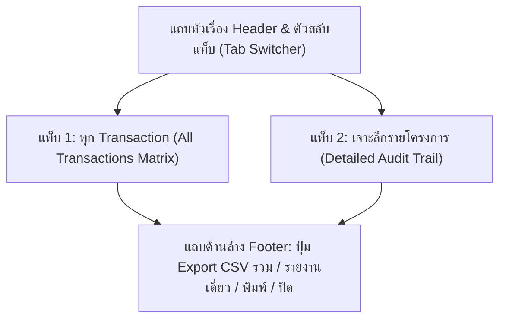

# 🎓 คู่มือฝึกอบรมการใช้งานหน้าจอระบบ PMT Flow
## โมดูลที่ 12: รายงานบันทึกเวลาตามขั้นตอนปฏิบัติงานและการตรวจสอบ Audit ทุก Transaction (Workflow Step Timestamps Audit Trail Manual)
**รหัสหลักสูตร:** `TRN-PMT-AUD01` | **ระบบ:** PMT Flow (Store Project Management Tool) | **เวอร์ชัน:** 2.0 (Pipeline Architecture) | **กลุ่มเป้าหมาย:** ผู้บริหาร (Executive), ผู้ตรวจสอบคุณภาพ (Auditor), ผู้จัดการโครงการ (PM/AE), หัวหน้าช่าง และเจ้าหน้าที่ปฏิบัติการ

---

## 📌 วัตถุประสงค์ของระบบ Audit Trail (Overview & Objectives)

หน้าต่าง **รายงานบันทึกเวลาตามขั้นตอนปฏิบัติงาน (Workflow Step Timestamps Audit)** ถูกพัฒนาขึ้นเพื่อทำหน้าที่เป็น **ศูนย์กลางการตรวจสอบย้อนหลัง (Audit Trail & Traceability)** ของโครงการและคำสั่งซื้อทั้งหมดในระบบ PMT Flow โดยรองรับการตรวจสอบทั้งในรูปแบบ **ตารางภาพรวมทุก Transaction** และ **การเจาะลึกรายโครงการ (Single Project Deep Dive)**:

1. **บันทึกเวลาประทับ (Timestamps) ครบถ้วนทั้ง 6 ขั้นตอน:**
   - **Step 1:** ศูนย์รับ Order, Design & BOQ Studio (`Step1_At`)
   - **Step 2:** บันทึก Ticket และแปลง BOQ เข้า Project (`Ticket_At`)
   - **Step 3:** เตรียมแผนงานและทีมช่าง (`Prep_At`)
   - **Step 4:** แผนงานติดตั้ง Gantt & บันทึกช่างประจำวัน (`Gantt_At`)
   - **Step 5:** ตรวจรับรองคุณภาพ QC Inspection (`QC_At`)
   - **Step 6:** ประเมินความพึงพอใจลูกค้า CSAT & ปิดงานคำสั่งซื้อ (`CSAT_At`)
2. **การวิเคราะห์ระยะเวลาห่าง (Lead Time Analysis):** ติดตามระยะเวลาที่ใช้ระหว่างแต่ละขั้นตอนเพื่อชี้วัดคอขวด (Bottleneck) และประเมินมาตรฐาน SLA
3. **การตรวจสอบครอบคลุมทุก Transaction:** ผู้ใช้สามารถสแกนดูทุกงานในระบบผ่านตารางรวม ค้นหาด้วยรหัสคำสั่งซื้อ ชื่อลูกค้า หรือทีมช่าง พร้อมสลับเจาะลึกดูรายละเอียดได้ทันที
4. **การส่งออกข้อมูลมาตรฐาน (Export Capabilities):** รองรับทั้งการ Export CSV รวมทุก Transaction และการ Export CSV เฉพาะโครงการที่กำลังตรวจสอบ รวมถึงการสั่งพิมพ์รายงาน (Print)

---

## 🧭 กายวิภาคของหน้าจอ Audit Report

### 🔹 แท็บที่ 1: ตารางรวมทุก Transaction (All Transactions Matrix)
- **การ์ดสรุปสถิติรวดเร็ว (4 KPI Cards):**
  1. โครงการทั้งหมดในระบบ (Total Transactions)
  2. โครงการที่เสร็จสิ้นสมบูรณ์ครบ 6 ขั้นตอน (100% Completed)
  3. โครงการที่อยู่ระหว่างดำเนินการ (In-Progress)
  4. โครงการรอดำเนินการเริ่มต้น (Pending)
- **แถบค้นหาอัจฉริยะ (Live Search):** สามารถพิมพ์รหัส Job ID, เลขที่อ้างอิง INT, ชื่อลูกค้า, เบอร์โทรศัพท์, ประเภทบริการ หรือชื่อทีมช่าง เพื่อกรองข้อมูลได้ทันทีแบบ Real-time
- **ตารางสรุปข้อมูลโครงการ:** แสดงลำดับ, รหัสโครงการ, ข้อมูลลูกค้า, งานบริการ, หลอดความคืบหน้า 6 ขั้นตอน (พร้อมเปอร์เซ็นต์), สถานะปัจจุบัน, วัน-เวลาที่เริ่มงาน และปุ่ม **"เจาะลึก Audit"**

### 🔹 แท็บที่ 2: เจาะลึกรายโครงการ (Detailed Audit Trail)
- **แถบเลือกและสลับ Transaction (Job Selector Bar):**
  - **Dropdown Selector:** เลือกรหัสโครงการและชื่อลูกค้าเพื่อสลับดูข้อมูลได้ทันที
  - **ปุ่ม "ก่อนหน้า" และ "ถัดไป":** กดเลื่อนดูโครงการตามลำดับได้อย่างต่อเนื่อง
  - **ตัวนับลำดับ:** แสดงตำแหน่งโครงการปัจจุบัน เช่น `รายการที่ 1 จาก 20`
  - **ปุ่ม "ตารางรวม":** สลับกลับไปยังแท็บตารางรวมทุก Transaction ได้ในคลิกเดียว
- **แถบข้อมูลโครงการ (Project Info Banner):** แสดง Job ID, ชื่อลูกค้า, เลขที่อ้างอิง INT, เบอร์โทรศัพท์, ประเภทงานบริการ, ทีมช่างผู้รับผิดชอบ และเปอร์เซ็นต์ความคืบหน้ารวม
- **ตารางไทม์ไลน์ 6 ขั้นตอน (6-Step Timeline Table):**
  - หมายเลขขั้นตอนและชื่อ Workflow Step
  - สถานะ (บันทึกแล้ว / รอดำเนินการ)
  - วันและเวลาที่บันทึก (รูปแบบมาตรฐาน `DD/MM/YYYY HH:mm:ss น.` ระบบ 24 ชั่วโมง)
  - ระยะเวลาห่าง (Lead Time)
  - ข้อมูลอ้างอิงและรายละเอียด (Audit Note)
- **การ์ดสรุป SLA & ความสมบูรณ์ของข้อมูล:**
  - จุดเริ่มต้นกระบวนการ (Step 1)
  - จุดสิ้นสุดกระบวนการ (Step 6)
  - ระดับความสมบูรณ์ของข้อมูล Audit (0 - 100%)

---

## 💾 การส่งออกและพิมพ์รายงาน (Export & Print)

1. **ปุ่ม "Export CSV ทุก Transaction":**
   - รวบรวมข้อมูลทุกโครงการในระบบออกมาเป็นไฟล์ CSV
   - ประกอบด้วยคอลัมน์ Job ID, เลขที่ INT, ชื่อลูกค้า, เบอร์โทร, งานบริการ, ทีมช่าง, สถานะปัจจุบัน, วัน-เวลาของทั้ง 6 ขั้นตอน และจำนวนขั้นตอนที่เสร็จสิ้น
   - เข้ารหัสแบบ UTF-8 with BOM รองรับการเปิดด้วย Microsoft Excel โดยตัวอักษรภาษาไทยไม่เพี้ยน
2. **ปุ่ม "Export CSV เฉพาะรายการนี้":**
   - ส่งออกข้อมูลไทม์ไลน์ 6 ขั้นตอนพร้อม Lead Time และ Audit Notes ของโครงการที่กำลังเปิดดูอยู่
3. **ปุ่ม "พิมพ์รายงาน (Print)":**
   - สั่งพิมพ์เอกสารรายงาน Audit ผ่านเครื่องพิมพ์ หรือบันทึกเป็นไฟล์ PDF ตามมาตรฐานการตรวจสอบคุณภาพ
