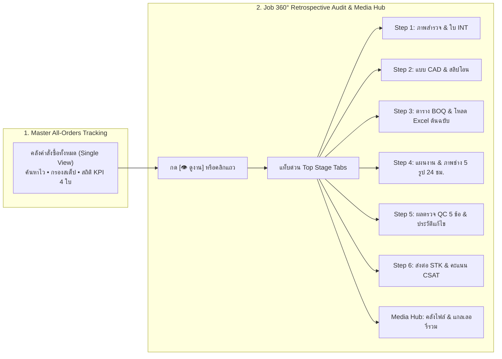

# 📘 คู่มือการใช้งาน: สรุปคำสั่งซื้อทั้งหมดในระบบ และการตรวจสอบหลักฐานย้อนหลังครบวงจร (Job 360° Retrospective Audit & Media Hub)
### ศูนย์รวมติดตามสถานะคำสั่งซื้อทั้งหมดแบบบูรณาการ และการตรวจสอบเอกสาร/หลักฐานภาพถ่ายทุกขั้นตอนย้อนหลัง 100%
**รหัสหลักสูตร:** `TRN-PMT-ORD01` | **ระบบ:** PMT Flow (Store Project Management Tool) | **เวอร์ชัน:** 3.0 (Enterprise Standard)

---

## 📑 สารบัญ (Table of Contents)
1. [ภาพรวมและแนวคิดของระบบ (Overview & Core Philosophy)](#1-ภาพรวมและแนวคิดของระบบ-overview--core-philosophy)
2. [สิทธิ์การเข้าถึงและการกำหนดหน้าที่ (RBAC & Target Roles)](#2-สิทธิ์การเข้าถึงและการกำหนดหน้าที่-rbac--target-roles)
3. [การใช้งานหน้าจอสรุปคำสั่งซื้อทั้งหมด (Master All-Orders Tracking)](#3-การใช้งานหน้าจอสรุปคำสั่งซื้อทั้งหมด-master-all-orders-tracking)
   - [3.1 การเข้าสู่หน้าจอและแผงสถิติภาพรวม 4 KPI Cards](#31-การเข้าสู่หน้าจอและแผงสถิติภาพรวม-4-kpi-cards)
   - [3.2 แถบค้นหาอัจฉริยะ (Omnibox Search)](#32-แถบค้นหาอัจฉริยะ-omnibox-search)
   - [3.3 แถบตัวกรองคู่ (Step Filter & Service Segment Filter)](#33-แถบตัวกรองคู่-step-filter--service-segment-filter)
   - [3.4 ตารางรายการแบบ List View และการแบ่งหน้า (Pagination)](#34-ตารางรายการแบบ-list-view-และการแบ่งหน้า-pagination)
4. [วิธีการเปิดหน้าต่างตรวจสอบย้อนหลัง 360° (Opening Job 360° Audit Modal)](#4-วิธีการเปิดหน้าต่างตรวจสอบย้อนหลัง-360-opening-job-360-audit-modal)
5. [แถบสลับหมวดด่วน (Top Stage Tabs Navigation)](#5-แถบสลับหมวดด่วน-top-stage-tabs-navigation)
6. [ข้อมูล รูปภาพ และไฟล์ที่เรียกดูย้อนหลังได้ในแต่ละขั้นตอน (Step-by-Step Evidence & Media Breakdown)](#6-ข้อมูล-รูปภาพ-และไฟล์ที่เรียกดูย้อนหลังได้ในแต่ละขั้นตอน)
   - [Step 1: ศูนย์รับ Order & ภาพสำรวจหน้างาน (INT Intake & Survey Photos)](#step-1-ศูนย์รับ-order--ภาพสำรวจหน้างาน-int-intake--survey-photos)
   - [Step 2: แบบแปลนติดตั้ง & สลิปเงินโอน (Blueprints & Payment Slips)](#step-2-แบบแปลนติดตั้ง--สลิปเงินโอน-blueprints--payment-slips)
   - [Step 3: ประมาณการราคา & ไฟล์ BOQ ต้นฉบับ (BOQ Items & Original Excel Download)](#step-3-ประมาณการราคา--ไฟล์-boq-ต้นฉบับ-boq-items--original-excel-download)
   - [Step 4: แผนงาน & บันทึกงานช่างประจำวัน (Tasks, Daily Logs & 5 Standard Photos)](#step-4-แผนงาน--บันทึกงานช่างประจำวัน-tasks-daily-logs--5-standard-photos)
   - [Step 5: ตรวจรับรองคุณภาพ QC & ประวัติแก้ไข (QC Inspection, 5 Rules & Rework Log)](#step-5-ตรวจรับรองคุณภาพ-qc--ประวัติแก้ไข-qc-inspection-5-rules--rework-log)
   - [Step 6: การปิดงาน & ส่งมอบ STK / CSAT (STK API Export & CSAT Handover)](#step-6-การปิดงาน--ส่งมอบ-stk--csat-stk-api-export--csat-handover)
   - [ศูนย์รวมไฟล์ & รูปภาพโครงการทั้งหมด (Central Media & Files Hub)](#ศูนย์รวมไฟล์--รูปภาพโครงการทั้งหมด-central-media--files-hub)
7. [ปุ่มคำสั่งเปลี่ยนผ่านขั้นตอนถัดไปอัตโนมัติ (Dynamic Step Transition Action)](#7-ปุ่มคำสั่งเปลี่ยนผ่านขั้นตอนถัดไปอัตโนมัติ-dynamic-step-transition-action)
8. [มาตรฐานระบบและจุดควบคุมความโปร่งใส (Standards & Governance Checklist)](#8-มาตรฐานระบบและจุดควบคุมความโปร่งใส-standards--governance-checklist)

---

## 1. ภาพรวมและแนวคิดของระบบ (Overview & Core Philosophy)

ในกระบวนการทำงานติดตั้งและปรับปรุงต่อเติม (Renovate & Quick Services) การมีศูนย์กลางในการสืบค้น ติดตาม และตรวจสอบประวัติการทำงานย้อนหลังอย่างโปร่งใส 100% ถือเป็นหัวใจสำคัญสูงสุด ระบบ **PMT Flow** จึงได้พัฒนา 2 นวัตกรรมหลักขึ้นมาทำงานประสานกัน:



### วัตถุประสงค์หลัก (Core Objectives):
1. **Single View of Truth:** รวบรวมคำสั่งซื้อทุกโครงการตั้งแต่เริ่มรับเรื่อง (Step 1) ไปจนถึงปิดงานส่งมอบ (Step 6/7) ไว้ในตารางเดียว ไม่ต้องสลับหน้าจอไปมา
2. **360° Transparency & Auditability:** เจ้าหน้าที่, ผู้ตรวจ QC, ผู้ตรวจสอบบัญชี (Auditor) และผู้บริหาร สามารถเปิดดูข้อมูลเชิงลึก หลักฐานภาพถ่ายหน้างานจริง และไฟล์ต้นฉบับได้ครบทุกขั้นตอนย้อนหลัง
3. **Data Immutability & Original File Preservation:** จัดเก็บไฟล์ BOQ ต้นฉบับ (.xlsx / .csv), เอกสารสำรวจ INT, สัญญา และสลิปการเงินไว้บนเซิร์ฟเวอร์ พร้อมปุ่มคลิกดาวน์โหลดไฟล์ต้นฉบับกลับมาเปิดดูในเครื่องคอมพิวเตอร์ได้ตลอดเวลา

---

## 2. สิทธิ์การเข้าถึงและการกำหนดหน้าที่ (RBAC & Target Roles)

| บทบาท (Role) | สิทธิ์ในการใช้งาน Master Tracking | การใช้งาน Job 360° Audit & Media Hub |
| :--- | :--- | :--- |
| **ADMIN (ผู้ดูแลระบบ / ผู้บริหาร)** | ดูรายการคำสั่งซื้อทั้งหมด, กรองข้อมูลทุกประเภท, ส่งออกข้อมูล, เข้าถึงปุ่ม Action ทุกขั้นตอน | ตรวจสอบข้อมูลย้อนหลังทุกมิติ, ตรวจสอบ Audit Log, ดาวน์โหลดไฟล์ BOQ และเอกสารสัญญา |
| **AE (Account Executive / ช่างเทคนิค)** | ค้นหาและติดตามสถานะงานโครงการของตนเอง, ดูวันนัดหมายและพิกัดลูกค้า | ตรวจสอบแบบแปลน CAD, ตรวจสอบไฟล์ BOQ, ดูบันทึกงานช่าง 5 รูป และดูสลิปเงินโอน |
| **QC (ผู้ตรวจสอบคุณภาพงาน)** | ตรวจสอบสถานะงานที่ส่งเข้าตรวจ QC และงานที่ปิดแล้ว | ตรวจสอบภาพถ่ายหน้างานตั้งแต่ Step 1 ถึง Step 4 เพื่อเทียบกับผลตรวจรับรองคุณภาพ Step 5 |
| **CONTACT_CENTER (ลูกค้าสัมพันธ์ / แอดมิน)** | ค้นหาข้อมูลตามชื่อลูกค้า เบอร์โทร หรือเลข Booking/Ticket เพื่อตอบคำถามลูกค้า | ดูสถานะงานปัจจุบัน, วันนัดหมาย, เลขที่ส่งออก STK, และเปิดดูผลคะแนน CSAT |

---

## 3. การใช้งานหน้าจอสรุปคำสั่งซื้อทั้งหมด (Master All-Orders Tracking)

### 3.1 การเข้าสู่หน้าจอและแผงสถิติภาพรวม 4 KPI Cards
ผู้ใช้งานสามารถเข้าสู่หน้าจอได้ 2 ช่องทาง:
1. คลิกที่แถบเมนูด้านข้าง (Sidebar) ในหมวด **Report & ข้อมูลสถิติ** เลือก **"สรุปคำสั่งซื้อทั้งหมด"** (`#page-master-orders`)
2. คลิกปุ่มทางลัด **"สรุปคำสั่งซื้อทั้งหมด (Master All-Orders Tracking)"** บนหน้าศูนย์รายงานภาพรวม (Report Dashboard)

#### ด้านบนของหน้าจอจะแสดง **4 บัตรสรุปสถิติ (KPI Summary Cards)** อัปเดตแบบ Realtime:
* **กล่องที่ 1 (สีคราม): คำสั่งซื้อทั้งหมด (Total Orders)** — จำนวนโครงการทั้งหมดในระบบ
* **กล่องที่ 2 (สีส้ม): Step 1: รอรับเรื่อง/ทำแบบ** — จำนวนงานที่อยู่ในสถานะ DRAFT / SURVEYED ที่กำลังจัดทำแบบแปลนและประมาณการราคา
* **กล่องที่ 3 (สีน้ำเงิน): Step 2-4: กำลังดำเนินงาน** — จำนวนงานที่ออก Ticket, แนบสลิป, แปลงเข้าแผนงาน และช่างกำลังลงมือติดตั้งหน้างาน
* **กล่องที่ 4 (สีเขียว): Step 5-6: QC & ปิดงาน** — จำนวนงานที่อยู่ระหว่างตรวจรับรองคุณภาพ QC, ผ่าน QC แล้ว, ส่งต่อ STK และบันทึก CSAT สำเร็จ

---

### 3.2 แถบค้นหาอัจฉริยะ (Omnibox Search)
กล่องค้นหาอัจฉริยะรองรับการค้นหาแบบครอบจักรวาล (Universal Keyword Search) โดยจะกรองข้อมูลทันทีที่พิมพ์ (Instant Filtering):
* **Job ID / Order No:** เช่น `ORD-2026-001`, `1001`
* **External Ref ID:** เลขที่อ้างอิงจากระบบภายนอก เช่น `REF-INT-9921`
* **Booking No / Ticket No:** เช่น `BKG-7712`, `TKT-8841`
* **ชื่อลูกค้า:** เช่น `คุณสมชาย`, `วิภาวดี`
* **เบอร์โทรศัพท์ลูกค้า:** เช่น `081-234-5678`, `0812345678`

> 💡 **เทคนิค:** สามารถกดปุ่ม **`[ล้างคำค้นหา (✕)]`** เพื่อยกเลิกคำค้นหา หรือกดปุ่ม **`[รีเซ็ต]`** เพื่อล้างตัวกรองทั้งหมดกลับสู่ค่าเริ่มต้น

---

### 3.3 แถบตัวกรองคู่ (Step Filter & Service Segment Filter)
ระบบมีตัวเลือก Dropdown สำหรับคัดกรองงานให้ตรงกับเป้าหมายอย่างแม่นยำ:

1. **ตัวกรองขั้นตอน (Step Filter):**
   * *ทุกขั้นตอน (All Steps)* — แสดงคำสั่งซื้อทั้งหมด
   * *Step 1: รับ Order & แบบ/BOQ* — คัดเฉพาะงานรอรับเรื่องและทำแบบ
   * *Step 2: บันทึก Ticket & แปลง Project* — คัดเฉพาะงานออก Ticket และรอแปลงเข้าแผน
   * *Step 4: แผนงาน Gantt & ติดตั้ง* — คัดเฉพาะงานที่อยู่ระหว่างช่างเข้าติดตั้ง
   * *Step 5: ตรวจรับรองคุณภาพ (QC)* — คัดเฉพาะงานรอตรวจ QC ทั้ง Online และ On-site
   * *Step 6: ส่งต่อ STK (ปิดงาน)* — คัดเฉพาะงานส่งมอบและตัดสต็อก STK
   * *Step 7: บริการหลังการขาย & MA* — คัดเฉพาะงานที่มีสัญญาบริการต่อเนื่อง

2. **ตัวกรองกลุ่มบริการ (Service Segment Filter):**
   * *ทุกกลุ่มบริการ*
   * *Quick Services (ติดตั้งด่วน)* — งานติดตั้งมาตรฐาน จบเร็วในวันเดียว
   * *Renovate (ปรับปรุงต่อเติม)* — งานสเกลใหญ่ มีแบบแปลนหลายโซน และตาราง Gantt
   * *MA & Maintenance* — งานสัญญาบำรุงรักษาประจำปี

---

### 3.4 ตารางรายการแบบ List View และการแบ่งหน้า (Pagination)
ตามมาตรฐาน **Strict Default List View Standard** ตารางจะแสดงผลในรูปแบบตารางบรรทัดเดี่ยวเสมอ เพื่อให้อ่านข้อมูลสำคัญได้อย่างรวดเร็ว:

| คอลัมน์ | รายละเอียดที่แสดงผล |
| :--- | :--- |
| **เลขที่งาน** | รหัส Job/Order ตัวหนาคมชัด พร้อมไอคอนลิงก์ |
| **เลขที่อ้างอิง (Ref ID)** | ป้ายรหัสภายนอก `external_ref_id` |
| **Booking / Ticket** | เลขที่ Booking จาก INT และเลขที่ Ticket สลิป |
| **กำหนดวันนัด** | วันที่นัดหมายติดตั้งตามมาตรฐาน `DD/MM/YYYY` พร้อมไอคอนปฏิทิน |
| **ลูกค้า & เบอร์ติดต่อ** | ชื่อลูกค้าตัวหนา พร้อมเบอร์โทรศัพท์ |
| **ประเภทบริการ** | ป้ายกำกับกลุ่มบริการ `[QUICK]` สีส้ม หรือ `[RENOVATE]` สีคราม พร้อมชื่อบริการ |
| **ขั้นตอนปัจจุบัน** | ป้ายสถานะสีประจำขั้นตอน เช่น `Step 1: รับเรื่อง`, `Step 4: ติดตั้ง`, `Step 5: QC` |
| **วันที่รับ Order** | วันที่และเวลา 24 ชั่วโมงที่รับงานเข้าสู่ระบบ (`DD/MM/YYYY HH:mm น.`) |
| **การจัดการ** | ปุ่มสีขาว-เทา **`[ 👁️ ดูงาน ]`** สำหรับเปิดหน้าต่าง 360° Audit |

แถบแบ่งหน้า (Pagination) ด้านล่างสุดจะระบุจำนวนแถวที่กำลังแสดงผล (เช่น *แสดง 1 - 50 จากทั้งหมด 3,726 รายการ*) พร้อมปุ่มเปิดดู « แรกสุด, ‹ ก่อนหน้า, ถัดไป ›, และ ท้ายสุด »

---

## 4. วิธีการเปิดหน้าต่างตรวจสอบย้อนหลัง 360° (Opening Job 360° Audit Modal)

ผู้ใช้งานสามารถเปิดหน้าต่าง **"รายละเอียดโครงการและหลักฐานย้อนหลังครบวงจร (Job 360° Retrospective Audit & Media Hub)"** ได้ 2 วิธีที่สะดวกและรวดเร็ว:

```
วิธีที่ 1: คลิกที่ปุ่ม [ 👁️ ดูงาน ] ในคอลัมน์ขวาสุดของรายการ
วิธีที่ 2: คลิกที่แถวรายการงานใดๆ บนตารางโดยตรง (รองรับ Row-click ทันที)
```

### ข้อมูลบนแถบหัวหน้าต่าง (Order Header Bar):
เมื่อหน้าต่างเปิดขึ้น ส่วนหัวจะแสดงข้อมูลสรุปของคำสั่งซื้อไว้อย่างครบถ้วน:
* **เลขที่ Order:** แสดงรหัสพร้อมปุ่มคลิกคัดลอก (Copy) ลง Clipboard
* **เลขที่ Booking & Ref ID & Ticket:** แสดงเลขที่เอกสารเชื่อมโยงครบชุด
* **กำหนดวันนัด (Plan Date):** วันที่ช่างมีกำหนดเข้าบริการ
* **ป้ายประเภทงาน:** `QUICK SERVICE` หรือ `RENOVATE`
* **ป้ายสถานะระบบ:** ป้ายสีบอกสถานะความคืบหน้าของโครงการ
* **แถบข้อมูลลูกค้าและสถานที่:** ชื่อลูกค้า, เบอร์โทร (พร้อมปุ่มโทรออก `tel:`), ชื่อช่างหน้างาน, สาขาที่รับงาน และปุ่มปิดหน้าต่าง `[✕]` (หรือกดปุ่ม `Esc` บนคีย์บอร์ด)

---

## 5. แถบสลับหมวดด่วน (Top Stage Tabs Navigation)

ด้านบนสุดของเนื้อหาในหน้าต่างจะมี **แถบสลับหมวดด่วน (Top Stage Tabs)** ช่วยให้ผู้ใช้สามารถคลิกกระโดดไปดูเฉพาะขั้นตอนที่ต้องการได้ทันที โดยไม่ต้องเลื่อนหน้าจอหา:

```
[🔘 ทั้งหมด (All Steps)] 
[1. รับเรื่อง & สำรวจ] 
[2. แปลน & Ticket] 
[3. BOQ & ไฟล์ต้นฉบับ] 
[4. งานช่าง & ภาพประจำวัน] 
[5. ตรวจรับรอง QC] 
[6. ปิดงาน & ส่งต่อ STK] 
[📁 รวมคลังไฟล์ทั้งหมด (Media Hub)]
```

* เมื่อคลิกแท็บใด ระบบจะกรองและแสดงผลเฉพาะส่วนของขั้นตอนนี้ให้เห็นชัดเจน
* หากเลือกแท็บ **"🔘 ทั้งหมด (All Steps)"** ระบบจะคลี่แสดงทุกขั้นตอนเรียงจากบนลงล่างแบบสมบูรณ์
* หากเลือกแท็บ **"📁 รวมคลังไฟล์ทั้งหมด (Media Hub)"** ระบบจะพาไปยังส่วนแกลเลอรี่รวมไฟล์และรูปภาพทั้งหมดของโครงการที่ส่วนล่างสุดทันที

---

## 6. ข้อมูล รูปภาพ และไฟล์ที่เรียกดูย้อนหลังได้ในแต่ละขั้นตอน

### Step 1: ศูนย์รับ Order & ภาพสำรวจหน้างาน (INT Intake & Survey Photos)
หมวดนี้รวบรวมหลักฐานตั้งแต่วันแรกที่รับคำสั่งซื้อเข้ามาในระบบ:
1. **ข้อมูลลูกค้าและสถานที่หน้างาน:** ชื่อลูกค้า, ที่อยู่ติดตั้ง, สาขาที่รับงาน, ประเภทที่พักอาศัย
2. **พิกัด GPS:** พิกัดละติจูด/ลองจิจูดจริง พร้อมปุ่ม **`[Copy GPS]`** สำหรับนำไปเปิดใน Google Maps
3. **สโคปงานและข้อกำหนดพิเศษ:** รายการบริการที่ลูกค้าสั่งซื้อ, ข้อกำหนดพิเศษ (Special Instructions) และบันทึกเพิ่มเติม (Additional Notes)
4. **รายละเอียดงานและผลสำรวจจาก INT:** ข้อมูลทางเทคนิคจากระบบสำรวจ INT
5. **เอกสารใบสำรวจหน้างาน INT (`file_int_image`):** แบบฟอร์มสำรวจตัวจริงที่แนบมาจากระบบ INT
6. **แกลเลอรี่รูปถ่ายสำรวจหน้างานจริง:** รูปภาพสภาพพื้นที่หน้างานจริงก่อนเริ่มงาน พร้อม **ระบบ Lightbox HD Preview** คลิกที่รูปเพื่อซูมดูภาพขนาดใหญ่ คมชัด และดาวน์โหลดภาพต้นฉบับได้

---

### Step 2: แบบแปลนติดตั้ง & สลิปเงินโอน (Blueprints & Payment Slips)
หมวดนี้รวบหลังฐานด้านงานออกแบบและการเงินของโครงการ:
1. **คลังแบบแปลนติดตั้ง (Blueprints Drawing):**
   * แสดงแบบแปลน CAD/DWG/PDF ครบทุกโซน (เช่น ห้องน้ำ, ห้องครัว, หลังคา, ระบบไฟฟ้า)
   * แสดงชื่อไฟล์, ขนาดไฟล์, โซนพื้นที่ และรูปภาพตัวอย่างแบบแปลน (Blueprint Thumbnail)
   * สามารถคลิกที่รูปเพื่อเปิดดูแบบแปลนขนาดใหญ่ระดับ HD
2. **สัญญาจ้างงาน (`contract_url`):** เอกสารสัญญาจ้างงานที่คู่สัญญาลงนาม ระบุเลขที่สัญญาและวันเวลา
3. **สลิปการโอนเงิน / ใบเสร็จรับเงิน (`slip_url`):** แสดงรูปภาพสลิปการโอนเงินผ่านธนาคาร, เลขที่ใบเสร็จรับเงิน, ยอดเงินชำระ (บาท) และวันที่ชำระเงิน

---

### Step 3: ประมาณการราคา & ไฟล์ BOQ ต้นฉบับ (BOQ Items & Original Excel Download)
หมวดนี้แสดงรายละเอียดต้นทุนและประมาณการราคาทั้งโครงการ:
1. **ตารางแจกแจงรายการงานช่าง-วัสดุ (BOQ Table):**
   * แจกแจงรายการค่าแรง (Labor) และค่าวัสดุ (Material) พร้อมหน่วยนับ ปริมาณ และราคาต่อหน่วย
   * สรุปรวมยอดค่าวัสดุ, ค่าแรง, ส่วนลด (Discount) และยอดรวมสุทธิ (Grand Total / No VAT)
   * รองรับกรณีงานที่ไม่ต้องมี BOQ ย่อย จะแสดงป้ายกำกับชัดเจนเป็น **`[Blank BOQ]`**
2. **การ์ดไฟล์ BOQ ต้นฉบับ (.xlsx / .csv):**
   * จัดแสดงการ์ดไฟล์ BOQ ต้นฉบับสีม่วงที่นำเข้าจาก Excel / vFIX
   * ระบุชื่อไฟล์ต้นฉบับ, ขนาดไฟล์, และจำนวนรายการ
3. **ปุ่มสีเขียว `[ 📥 ดาวน์โหลดไฟล์ BOQ ต้นฉบับ ]`:**
   * **จุดเด่นสำคัญ:** ผู้ใช้งานสามารถคลิกปุ่มนี้เพื่อดาวน์โหลดไฟล์ Spreadsheet (.xlsx หรือ .csv) ต้นฉบับกลับมาเปิดดู ตรวจสอบสูตร หรือพิมพ์เป็นเอกสารในเครื่องคอมพิวเตอร์ได้ตลอดเวลา

---

### Step 4: แผนงาน & บันทึกงานช่างประจำวัน (Tasks, Daily Logs & 5 Standard Photos)
หมวดนี้บันทึกความคืบหน้าการลงมือทำงานจริงของทีมช่างหน้างาน:
1. **ตารางแผนงาน Tasks:** แสดงรายการงานย่อย, วันที่เริ่ม-สิ้นสุด, และช่างหลักที่รับผิดชอบ
2. **ประวัติการลงบันทึกงานช่างประจำวัน (Daily Work Log):**
   * แสดงรายการบันทึกของช่างในแต่ละรอบ/แต่ละวัน (รอบที่ 1, รอบที่ 2 ฯลฯ)
   * ระบุชื่อช่างผู้บันทึก และวันเวลาที่ลงบันทึกตามมาตรฐาน **24 ชั่วโมง (`00:00 - 23:59 น.`)**
3. **แผงรูปภาพหน้างาน 5 จุดมาตรฐาน (5 Standard Milestone Photos):**
   ทุกรอบการบันทึกของช่าง จะแสดงแผงรูปถ่ายครบทั้ง 5 ช่องขั้นตอนงาน:
   * **รูปที่ 1:** สภาพพื้นที่ก่อนเริ่มปฏิบัติงาน (Before Work)
   * **รูปที่ 2:** ระหว่างปฏิบัติงาน - จุดที่ 1 (In Progress 1)
   * **รูปที่ 3:** ระหว่างปฏิบัติงาน - จุดที่ 2 (In Progress 2)
   * **รูปที่ 4:** การทดสอบระบบและการทำงาน (Testing & Commissioning)
   * **รูปที่ 5:** สภาพพื้นที่หลังงานแล้วเสร็จและทำความสะอาด (Work Completed)
   * ทุกล็อตสามารถคลิกดูภาพขยายผ่าน Lightbox ได้ทันที

---

### Step 5: ตรวจรับรองคุณภาพ QC & ประวัติแก้ไข (QC Inspection, 5 Rules & Rework Log)
หมวดนี้บันทึกผลการตรวจสอบรับรองคุณภาพงานตามมาตรฐาน Isara Chootip Standard:
1. **ผลคะแนนตรวจ QC รวม:** แสดงคะแนนเต็ม **5.0 / 5.0 คะแนน** หรือ **1.0 คะแนน** ตามกฎการล็อกคะแนนรอบแก้ไข (Rework Pass Rule)
2. **เกณฑ์การตรวจ 5 ข้อคำถามมาตรฐาน (Yes/No):**
   * ข้อ 1: ช่างทำงานตาม BOQ / มาตรฐานการติดตั้งที่กำหนด
   * ข้อ 2: ความเรียบร้อยของงานติดตั้ง
   * ข้อ 3: ช่างเข้าปฏิบัติงานตรงตามเวลาที่นัดหมายกับลูกค้า
   * ข้อ 4: ส่งมอบงานได้ตามกำหนดเวลา
   * ข้อ 5: ช่างป้องกันพื้นที่ติดตั้งและส่งมอบพื้นที่คืนโดยไม่เกิดความเสียหาย
   *(หมายเหตุ: งาน Quick Services จะตรวจ QC Online ผ่านรูป Visit Plan โดยใช้เกณฑ์มาตรฐาน 1 ข้อ)*
3. **บันทึกข้อเสนอแนะและข้อบกพร่อง (Inspector Feedback):** รายละเอียดที่เจ้าหน้าที่ QC บันทึกถึงทีมช่าง
4. **รูปถ่ายหลักฐาน QC:** รูปภาพที่ผู้ตรวจ QC แนบยืนยันความเรียบร้อย
5. **ตารางประวัติการตรวจย้อนหลังทุกรอบ (Audit History Table):** บันทึกประวัติการตรวจรอบที่ 1, รอบที่ 2 (รอบแก้งาน Rework) ระบุวันเวลาและผู้ตรวจอย่างละเอียด

---

### Step 6: การปิดงาน & ส่งมอบ STK / CSAT (STK API Export & CSAT Handover)
หมวดนี้บันทึกการส่งต่องานไปยังระบบภายนอกและการสำรวจความพึงพอใจลูกค้า:
1. **สถานะการส่ง API ไปยังระบบตัดสต็อก STK:**
   * แสดงป้ายสถานะความสำเร็จ เช่น `STK_SYNCED` หรือ `SUCCESS`
   * เลขที่อ้างอิงการส่งออก (STK Ref ID) เช่น `STK-2026-9812` หรือ `STK-200-OK`
   * วันที่และเวลาที่ระบบยิง API ไปตัดสต็อก
2. **คะแนนความพึงพอใจลูกค้า (CSAT Score):**
   * แสดงผลคะแนนดาวความพึงพอใจของลูกค้า (1 ถึง 5 ดาว)
   * ชื่อผู้โทรสัมภาษณ์ประเมินผล (Surveyor)
   * วันที่และเวลาที่สัมภาษณ์ประเมิน
3. **ข้อคิดเห็นและคำติชมของลูกค้า (Customer Feedback):** ข้อความแสดงความพึงพอใจหรือข้อเสนอแนะจริงจากลูกค้า
4. **รูปถ่ายส่งมอบงาน (Handover Photos):** รูปภาพการส่งมอบพื้นที่และป้ายตรวจรับงานแก่ลูกค้า

---

### ศูนย์รวมไฟล์ & รูปภาพโครงการทั้งหมด (Central Media & Files Hub)
อยู่บริเวณ **ส่วนล่างสุดของหน้าต่าง 360° Audit** ทำหน้าที่เป็นคลังหลักฐานกลางที่รวมไฟล์และรูปภาพทุกอย่างของโครงการไว้ในจุดเดียว:

```
[ปุ่มกรองหมวดหมู่] 
🔘 ทั้งหมด | 📷 ภาพสำรวจหน้างาน | 📄 เอกสาร INT | 📐 แบบแปลน CAD | 
🧾 สลิป & สัญญา | 📊 ไฟล์ BOQ | 🔧 ภาพช่างประจำวัน | 🛡️ ภาพตรวจ QC | ⭐ ภาพส่งมอบ CSAT
```

#### คุณสมบัติเด่นของ Central Media Hub:
* **การ์ดแสดงผล (Media Cards):** แต่ละการ์ดระบุชื่อไฟล์, หมวดหมู่, ขั้นตอน (Step 1-6), วันที่บันทึก และป้ายสถานะสีชัดเจน
* **การดูรูปภาพ (Lightbox HD Preview):** คลิกที่การ์ดรูปภาพใดๆ หน้าจอจะเปิดหน้าต่าง Lightbox แสดงภาพความละเอียดสูง สามารถซูมดูรายละเอียดจุดเชื่อมต่อ งานสี หรือรอยต่อท่อได้อย่างคมชัด
* **การดาวน์โหลดไฟล์ (Instant Download):** มีปุ่มคลิกบันทึกไฟล์ (ภาพถ่าย, ไฟล์ BOQ Excel, ไฟล์แบบ CAD) ลงเครื่องได้ทันที

---

## 7. ปุ่มคำสั่งเปลี่ยนผ่านขั้นตอนถัดไปอัตโนมัติ (Dynamic Step Transition Action)

ที่มุมขวาล่างของส่วนท้ายหน้าต่าง (Modal Footer) จะมี **ปุ่มแอ็กชันนำทางขั้นตอนถัดไป (Dynamic Step Transition Button)** ซึ่งจะเปลี่ยนชื่อและหน้าที่ไปตามขั้นตอนปัจจุบันของคำสั่งซื้อโดยอัตโนมัติ:

| สถานะของงานในปัจจุบัน | ปุ่มแอ็กชันที่ปรากฏ | ผลลัพธ์เมื่อคลิก |
| :--- | :--- | :--- |
| **งาน Quick Services (รอตรวจ)** | `[ ไปตรวจ QC Online ➔ ]` | นำทางไปยังหน้าต่าง QC Online ทันที |
| **Step 1 (เพิ่งรับเรื่องเข้าสู่ PMT)** | `[ รับเข้าสู่ Step 2 (Design & Ticket) ➔ ]` | อนุมัติ Order เข้าสู่ขั้นตอนเปิด Ticket |
| **Step 2 (ยังไม่ได้ออก Ticket/สลิป)** | `[ + บันทึก Ticket & สลิป ➔ ]` | เปิดโมดอลบันทึกข้อมูลการเงินและสลิป |
| **Step 3 (พร้อมแปลงแผนงาน)** | `[ Convert เข้า Project (Step 4) ➔ ]` | แปลงค่าแรงจาก BOQ เข้าสู่แผนงานช่าง |
| **Step 4 (ช่างกำลังติดตั้ง)** | `[ เปิดแผนงาน Gantt & บันทึกช่าง ➔ ]` | นำทางไปยังหน้าผัง Gantt Timeline |
| **Step 5 (รอตรวจรับรองคุณภาพ)** | `[ เปิดหน้าตรวจรับรองคุณภาพ QC ➔ ]` | นำทางไปยังหน้าตรวจสอบคุณภาพ Step 5 |
| **Step 6 / ปิดงานสำเร็จสมบูรณ์** | `[ ปิดงานสำเร็จแล้ว (STK-200-OK) ]` | แสดงป้ายรับรองความสำเร็จ ไม่ต้องกดซ้ำ |

---

## 8. มาตรฐานระบบและจุดควบคุมความโปร่งใส (Standards & Governance Checklist)

การใช้งานหน้าจอสรุปคำสั่งซื้อและการตรวจสอบ 360° ต้องเป็นไปตามมาตรฐานสูงสุดของระบบ PMT Flow ดังนี้:

* [x] **Pure Light Theme 100%:** ทุกหน้าจอ ทุกตาราง และทุกการ์ดแสดงผลในธีมสว่าง คมชัดสูง ตัดปัญหาหน้าจอค้างหรือสีกลืนกับพื้นหลัง
* [x] **Strict Pure Black Text (`#000000`):** ตัวหนังสือ ตัวเลข Job ID, ชื่อลูกค้า, วันที่ และข้อมูลตารางแสดงผลเป็นสีดำคมชัด 100%
* [x] **มาตรฐานวันที่ `DD/MM/YYYY`:** วันที่ทุกจุด (วันรับเรื่อง, วันนัดหมาย, วันที่ชำระเงิน, วันตรวจ QC) ต้องมีเลข 0 นำหน้าเสมอ เช่น `23/09/2026`
* [x] **มาตรฐานเวลา 24 ชั่วโมง (`00:00 - 23:59 น.`):** ห้ามมี AM/PM บนหน้าจอเด็ดขาด
* [x] **Preservation of Original BOQ File:** ไฟล์ Excel/CSV ต้นฉบับที่ผู้ใช้แนบใน Step 1 หรือ Step 3 จะถูกจัดเก็บไว้บน Storage อย่างถาวร และเปิดให้ดาวน์โหลดคืนได้ตลอดเวลา
* [x] **Audit Trail Immutability:** ข้อมูลประวัติการตรวจ QC, สลิปโอนเงิน, และคะแนน CSAT ที่บันทึกสำเร็จแล้ว จะถูกล็อกให้อ่านได้อย่างเดียว (Read-Only) เพื่อความโปร่งใสและป้องกันการแก้ไขย้อนหลัง
* [x] **100% Sync Documentation:** คู่มือฉบับนี้เปิดอ่านได้จริงจากหน้าจอ Master All-Orders, หน้าต่าง Job 360° Audit และระบบ KM Portal (`page-faq`) เสมอ

---

**จัดทำและควบคุมคุณภาพโดย:** คณะทำงานระบบ PMT Flow  
**อ้างอิงเอกสารระบบ:** [PMT_Flow_User_Training_Manual.md](PMT_Flow_User_Training_Manual.md) | [PMT_Training_Curriculum_Master.md](PMT_Training_Curriculum_Master.md)
