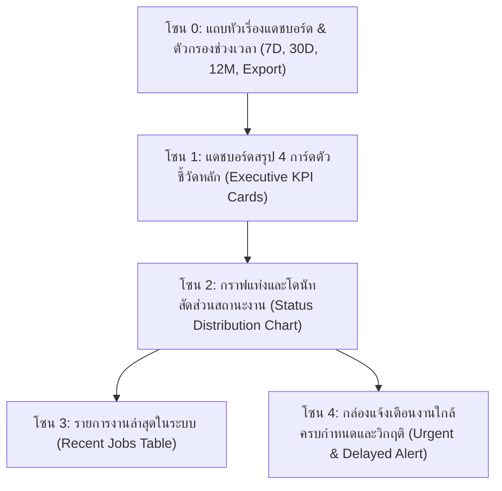
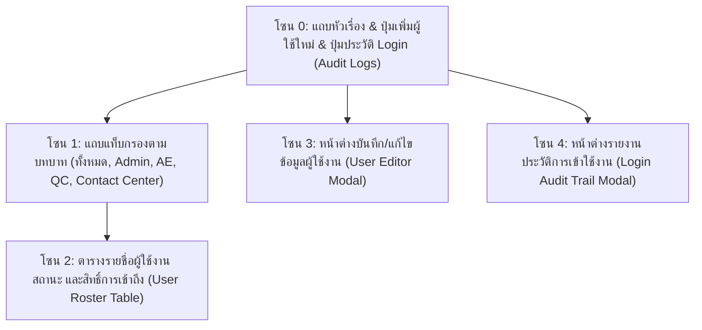

# 🎓 คู่มือฝึกอบรมการใช้งานหน้าจอระบบ PMT Flow
## โมดูลที่ 8: เจาะลึกหน้าจอแดชบอร์ดบริหารภาพรวม & การจัดการผู้ใช้งานและสิทธิ์ (Executive Dashboard & User Management Training Screen Guide)
**รหัสหลักสูตร:** `TRN-PMT-SYS01` | **ระบบ:** PMT Flow (Store Project Management Tool) | **เวอร์ชัน:** 2.0 (Pipeline Architecture) | **กลุ่มเป้าหมาย:** ผู้บริหารระดับสูง (Executive), ผู้จัดการโครงการ (PM), ผู้ดูแลระบบ (System Admin), หัวหน้าฝ่ายปฏิบัติการ และวิทยากรผู้ฝึกอบรม (Trainer)

---

## 📌 บทสรุปและวัตถุประสงค์หลักสูตร (Course Overview & Objectives)

คู่มือโมดูลนี้ครอบคลุม 2 หน้าจอสำคัญระดับบริหารและการจัดการระบบของ PMT Flow ได้แก่:
1. **แดชบอร์ดภาพรวม (Store & Operations Overview - `page-dashboard`):** ศูนย์รวมตัวชี้วัดประสิทธิภาพองค์กร (Executive KPI), การกระจายตัวของสถานะโครงการแบบ Real-time, กราฟแนวโน้มปริมาณงาน และการเตือนภัยงานวิกฤติ/งานใกล้หลุด SLA
2. **การจัดการผู้ใช้งานและกำหนดสิทธิ์ (User Management & RBAC - `page-users`):** ระบบควบคุมการเข้าถึงตามบทบาท (Role-Based Access Control), การสร้าง/แก้ไขบัญชีผู้ใช้งาน, การกำหนดสถานะการทำงาน และการตรวจสอบประวัติการใช้งานระบบ (Audit Trail Logs)

### 🎯 วัตถุประสงค์การเรียนรู้สำหรับผู้เข้าอบรม (Learning Objectives):
1. **อ่านและวิเคราะห์ตัวชี้วัดบน Executive Dashboard ได้อย่างแม่นยำ:** เข้าใจความหมายของ Total Revenue, Active Jobs, QC Pass Rate และ SLA Compliance Rate
2. **ใช้งานตัวกรองช่วงเวลาและการ Export ข้อมูล:** สามารถเลือกดูข้อมูลย้อนหลัง 7 วัน (7D), 30 วัน (30D), 12 เดือน (12M) และส่งออกรายงานสรุป
3. **จัดการงานวิกฤติและงานเร่งด่วน (Urgent & Delayed Jobs Alert):** ตรวจสอบรายการงานที่ต้องแก้ไขทันทีจากกล่องแจ้งเตือนบนแดชบอร์ด
4. **สร้างและบริหารบัญชีผู้ใช้งานตามบทบาท (Role Assignment):** เข้าใจความแตกต่างของสิทธิ์ทั้ง 6 ระดับ (Admin, PM, Engineer, Technician, QC Inspector, Contact Center)
5. **ตรวจสอบความปลอดภัยและ Audit Logs:** รู้วิธีเปิดดูบันทึกประวัติการ Login และประวัติการเปลี่ยนแปลงสถานะงานในระบบ

---

## 🧭 กายวิภาคของหน้าจอแดชบอร์ดภาพรวม (`page-dashboard`)

### 🔹 การ์ดตัวชี้วัดหลัก 4 ใบ (Executive KPI Cards):
1. **มูลค่ารวมโครงการ (Total Project Revenue):** ยอดรวมมูลค่างานทั้งหมดที่บันทึกและผ่านการอนุมัติในระบบ พร้อมเปอร์เซ็นต์การเติบโต
2. **งานที่กำลังดำเนินการ (Active Projects In-Progress):** จำนวนงานที่กำลังอยู่ระหว่างการออกแบบ, ทำ BOQ, หรือติดตั้งจริงในหน้างาน
3. **อัตราการผ่านการตรวจ QC (First-time QC Pass Rate):** สัดส่วนงานที่ตรวจผ่านเกณฑ์มาตรฐานความปลอดภัยในครั้งแรก (เป้าหมายองค์กร > 95%)
4. **อัตราการปฏิบัติตามเกณฑ์เวลา (SLA Compliance Rate):** สัดส่วนงานที่ดำเนินงานเสร็จสิ้นตามกำหนดเวลา SLA ในแต่ละขั้นตอน

---

## 🧭 กายวิภาคของหน้าจอจัดการผู้ใช้งาน (`page-users`)

### 🔹 เมทริกซ์การกำหนดสิทธิ์ตามบทบาท (Role-Based Access Matrix):

| บทบาท (Role) | หน้าจอที่เข้าถึงได้ | สิทธิ์การแก้ไข/บันทึก | การอนุมัติขั้นสุดท้าย |
| :--- | :--- | :--- | :--- |
| **System Admin** | ทุกหน้าจอ (100%) | สร้าง/ลบผู้ใช้, ปรับปรุง SLA, รีเซ็ตข้อมูล | มีสิทธิ์สมบูรณ์ |
| **Project Manager (PM)** | Dashboard, Jobs, Blueprints, BOQ, Gantt, QC | รับงานเข้า PMT, ปรับตาราง Gantt, Override SLA | อนุมัติย้ายสเต็ป |
| **AE / Intake Officer** | Step 1 (Jobs), Step 4 (Tickets) | คัดกรองงาน, แนบสลิป, บันทึกข้อมูลลูกค้า | ส่งต่อ Step 2 หรือ 4 |
| **Designer / Engineer** | Step 2 (Blueprints), Step 3 (BOQ) | อัปโหลดแบบ CAD/PDF, กรอก/นำเข้าตาราง BOQ | ส่งต่อ Step 3 หรือ 4 |
| **QC Inspector** | QC, Gantt | ตรวจสอบรูปถ่าย, บันทึก Checklist, ตัดสิน PASS/FAIL | อนุมัติ QC Pass |
| **Contact Center** | CSAT, After-Sales (MA) | บันทึกคะแนน 5 ดาว, เปิดสัญญา MA, Close Job | ปิดงานส่ง BMT |
| **Technician (ช่าง)** | Job Detail (Check-in), Gantt | เช็กอิน GPS 400m, อัปโหลดรูปหน้างาน 5 รูป | ยื่นขอตรวจ QC |

---

## 🛠️ ขั้นตอนการปฏิบัติงานมาตรฐาน (Step-by-Step SOP)

### วิธีการที่ 1: การเพิ่มผู้ใช้งานใหม่เข้าสู่ระบบ (User Onboarding)

1. คลิกเมนู **`จัดการผู้ใช้งาน (User Management)`** ที่แถบเมนูด้านซ้าย (หรือคลิกปุ่มสีแดง `[ 👥 User Management ]` ที่ด้านบน)
2. คลิกปุ่มสีม่วง **`+ เพิ่มผู้ใช้ใหม่`**
3. กรอกข้อมูลในแบบฟอร์ม:
   - **ชื่อ-นามสกุล:** กรอกชื่อจริงและนามสกุล
   - **ชื่อผู้ใช้งาน (Username):** ตั้งชื่อบัญชีสำหรับใช้เข้าสู่ระบบ (เช่น `somchai.t`)
   - **รหัสผ่าน (Password):** กำหนดรหัสผ่านเริ่มต้น (แนะนำอย่างน้อย 8 ตัวอักษร)
   - **บทบาทในระบบ (Role):** เลือกบทบาทที่ตรงกับตำแหน่งงาน (เช่น `QC Inspector`)
   - **เบอร์โทรศัพท์ / LINE ID:** เพื่อใช้ประสานงานด่วน
   - **สถานะการทำงาน:** เลือก `ใช้งานปกติ (Active)` หรือ `ระงับชั่วคราว (Suspended)`
4. คลิกปุ่ม **`💾 บันทึกข้อมูลผู้ใช้งาน`**
   - ผู้ใช้งานใหม่สามารถเข้าสู่ระบบด้วยชื่อบัญชีและรหัสผ่านดังกล่าวได้ทันที

---

### วิธีการที่ 2: การตรวจสอบประวัติการเข้าใช้งาน (Audit Trail Logs)

1. ในหน้าจัดการผู้ใช้งาน คลิกปุ่ม **`ประวัติ Login (Audit Logs)`**
2. หน้าต่างประวัติความปลอดภัยจะเปิดขึ้น แสดงรายการ:
   - วันที่และเวลาที่เข้าใช้งาน (Timestamps)
   - ชื่อผู้ใช้งานและบทบาท
   - IP Address และประเภทของเบราว์เซอร์
   - ผลการเข้าสู่ระบบ (`Success` สีเขียว หรือ `Failed` สีแดง)
3. สามารถคลิก **`Export Audit Log (.csv)`** เพื่อนำข้อมูลไปจัดทำรายงานความปลอดภัยทางไอทีประจำเดือน

---

## 💡 แผนการสอนสำหรับ Trainer (Workshop Hands-on Guide)

### 🎯 บททดสอบปฏิบัติการประจำห้องเรียน (20 นาที):
**สถานการณ์สมมติ:** "มีพนักงานใหม่เข้าทำงานในตำแหน่ง QC Inspector ชื่อ 'คุณพิชัย ตรวจสอบ' ให้ผู้เรียนดำเนินการสร้างบัญชีผู้ใช้งานและกำหนดสิทธิ์ดังนี้"

1. **โจทย์ข้อที่ 1:** เข้าสู่หน้าจอจัดการผู้ใช้งาน และคลิกปุ่ม `+ เพิ่มผู้ใช้ใหม่`
2. **โจทย์ข้อที่ 2:** สร้างบัญชี Username: `pichai.qc`, บทบาท: `QC Inspector` และกำหนดรหัสผ่านเริ่มต้น
3. **โจทย์ข้อที่ 3:** กดบันทึก แล้วใช้แท็บกรอง `QC` ตรวจสอบว่ามีชื่อคุณพิชัยแสดงในรายชื่อหรือไม่
4. **โจทย์ข้อที่ 4:** เปิดหน้าต่าง **ประวัติ Login (Audit Logs)** และอธิบายว่าทำไมการเก็บ Log จึงสำคัญต่อมาตรฐานความปลอดภัย Enterprise

---

## ❓ คำถามที่พบบ่อยและข้อควรระวัง (FAQ & Best Practices)

> [!CAUTION]
> **Q: หากพนักงานลาออก ควรลบบัญชีผู้ใช้งานออกจากระบบทันทีหรือไม่?**  
> **A:** ไม่แนะนำให้ลบบัญชี (Delete) เนื่องจากจะทำให้ประวัติการบันทึกงานย้อนหลังสูญหาย แนะนำให้ใช้วิธี **แก้ไขและเปลี่ยนสถานะเป็น "ระงับการใช้งาน (Suspended)"** แทน เพื่อป้องกันการ Login แต่ยังคงรักษาประวัติการทำงานไว้ครบถ้วน

> [!TIP]
> **Q: สามารถเปลี่ยนรหัสผ่านของตนเองได้อย่างไร?**  
> **A:** ผู้ใช้งานทุกคนสามารถคลิกที่ปุ่มไอคอนฟันเฟือง `⚙️` ข้างรูปโปรไฟล์ที่มุมล่างซ้ายของ Sidebar เพื่อเปิดหน้าต่างแก้ไขโปรไฟล์และเปลี่ยนรหัสผ่านส่วนตัวได้ตลอดเวลา

---

**จัดทำโดย:** ฝ่ายพัฒนาหลักสูตรและฝึกอบรม PMT Flow  
**รหัสเอกสาร:** `TRN-PMT-SYS01-v2.0`  
**สถานะการรับรอง:** Approved Standard (Enterprise Operations)