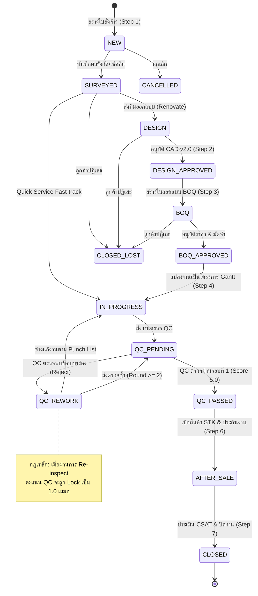

# 📐 PMT Flow v2 Rebuild — Business Rules & Logic Specification

> **Phase 0 Artifact**: เอกสารสรุปกฎทางธุรกิจ (Business Rules), สูตรการคำนวณ (Formulas), วงจรสถานะงาน (State Machine), ตรรกะงานเร่งด่วน vs งานรีโนเวท, กฎคะแนน QC, และข้อกำหนดมาตรฐานการแสดงผลทั้งหมดที่สกัดจาก Source Code จริงของระบบ PMT Flow v1 (`app.js`, `server.ts`, `database.ts`, `schema.sql`)

---

## 1. 💰 Financial & Calculation Formulas (สูตรการคำนวณทางการเงินและเวลา)

### 1.1 BOQ Calculation (การคำนวณราคาถอดแบบวัสดุและค่าแรง)
- **ตำแหน่งในโค้ด**: `app.calculateBOQSummary()`, `app.calculateItemSubtotal()`, API `POST /api/boq`
- **สูตรคำนวณ**:
  $$\text{Item Subtotal} = \text{round}(\text{quantity} \times \text{unit\_price}, 2)$$
  $$\text{Material Total} = \sum_{\text{category}=\text{'MATERIAL'}} \text{Item Subtotal}$$
  $$\text{Labor Total} = \sum_{\text{category}=\text{'LABOR'}} \text{Item Subtotal}$$
  $$\text{BOQ Subtotal} = \text{Material Total} + \text{Labor Total}$$
  $$\text{BOQ Grand Total} = \max(0, \text{round}(\text{BOQ Subtotal} - \text{Discount}, 2))$$
- **กฎเหล็กด้านภาษีมูลค่าเพิ่ม (Strict VAT Rule)**:
  - **VAT 7% = 0 เสมอ (`vat = 0.00`)**: ใน PMT Flow v1 ไม่มีการคิด VAT 7% เพิ่มใน Grand Total ของ BOQ และใบสั่งจ้าง เนื่องจากระบบถูกออกแบบให้คิดยอดเงินสุทธิตามราคางานจริง
  - หากฟอร์มในอดีตมีฟิลด์ VAT ให้แสดงผลเป็น `0.00 บาท` หรือระบุว่า *"รวมภาษีมูลค่าเพิ่มแล้ว / ยกเว้นภาษี"*

### 1.2 Project Pricing & Margin Calculation (การคำนวณกำไรขั้นต้นและมาร์จิ้น)
- **ตำแหน่งในโค้ด**: `app.calculateMargin()`, `app.updatePricingSummary()`, `page-project-pricing`
- **สูตรคำนวณ**:
  $$\text{Total Cost} = \text{Material Cost} + \text{Labor Cost} + \text{Equipment Cost} + \text{Other Expenses}$$
  $$\text{Gross Profit (กำไรขั้นต้น)} = \text{Selling Price} - \text{Total Cost}$$
  $$\text{Margin \%} = \begin{cases} \text{round}\left(\left(\frac{\text{Gross Profit}}{\text{Selling Price}}\right) \times 100, 2\right), & \text{Selling Price} > 0 \\ 0.00, & \text{Selling Price} \le 0 \end{cases}$$
  $$\text{Markup \%} = \begin{cases} \text{round}\left(\left(\frac{\text{Gross Profit}}{\text{Total Cost}}\right) \times 100, 2\right), & \text{Total Cost} > 0 \\ 0.00, & \text{Total Cost} \le 0 \end{cases}$$
- **Threshold เตือน Margin ต่ำ**:
  - `Margin < 15.0%`: แสดงแถบสถานะสีแดง (High Risk / Low Margin Alert)
  - `15.0% <= Margin < 25.0%`: แสดงแถบสถานะสีเหลือง (Warning Margin)
  - `Margin >= 25.0%`: แสดงแถบสถานะสีเขียว (Healthy Margin)

### 1.3 Work Hours & Overtime Calculation (การคำนวณชั่วโมงทำงานช่าง)
- **ตำแหน่งในโค้ด**: `app.calculateWorkHours()`, `modal-daily-work-log`
- **สูตรคำนวณ**:
  - เวลาทำงานอิงตามรูปแบบ 24 ชั่วโมง (`HH:mm`)
  $$\text{Total Minutes} = (\text{End Hour} \times 60 + \text{End Min}) - (\text{Start Hour} \times 60 + \text{Start Min}) - \text{Break Minutes}$$
  $$\text{Total Hours} = \text{round}\left(\frac{\text{Total Minutes}}{60}, 2\right)$$
  - หาก `Total Hours > 8.0`: ส่วนที่เกินจะถูกบันทึกเป็น `Overtime Hours (OT)` โดยอัตโนมัติ

---

## 2. 🔄 State Machine & Status Lifecycle (วงจรสถานะงานและกฎการเปลี่ยนสถานะ)

### 2.1 Job Status Enum (`jobs.status`)
สถานะหลักของงานในฐานข้อมูล (`schema.sql` และ `server.ts`):

| สถานะ (`status`) | ป้ายภาษาไทย | ขั้นตอน (Step) | สิทธิ์ที่สามารถปรับสถานะได้ |
|---|---|---|---|
| `NEW` / `DRAFT` | รับเรื่องใหม่ / รอรังวัด | Step 1: Intake & Survey | AE, ADMIN |
| `SURVEYED` | รังวัดเสร็จสิ้น | Step 1 ➔ Step 2 | AE, ADMIN |
| `DESIGN` | ออกแบบ CAD / 3D | Step 2: 3D/CAD Design | AE, ADMIN |
| `DESIGN_APPROVED` | แบบได้รับการอนุมัติ | Step 2 ➔ Step 3 | AE, ADMIN, ลูกค้า |
| `BOQ` | จัดทำ BOQ & เสนอราคา | Step 3: BOQ Pricing | AE, ADMIN |
| `BOQ_APPROVED` | ลูกค้าอนุมัติใบเสนอราคา | Step 3 ➔ Step 4 | AE, ADMIN |
| `IN_PROGRESS` | กำลังก่อสร้าง / งานช่าง | Step 4: Work & Gantt | AE, ADMIN, ช่าง |
| `QC_PENDING` | รอดำเนินการตรวจสอบ QC | Step 4 ➔ Step 5 | AE, QC, ADMIN |
| `QC_PASSED` | ผ่านการตรวจสอบ QC | Step 5 ➔ Step 6 | QC, ADMIN |
| `QC_REWORK` | งานไม่ผ่าน QC (ต้องแก้งาน) | Step 5 ➔ Step 4 | QC, ADMIN |
| `AFTER_SALE` | ส่งมอบงาน / บริการหลังการขาย | Step 6 ➔ Step 7 | AE, CONTACT_CENTER, ADMIN |
| `CLOSED` | ปิดงานสมบูรณ์ (เสร็จสิ้น) | Step 7: Completed & CSAT | AE, ADMIN |
| `CANCELLED` | ยกเลิกงาน | ทุกขั้นตอน | ADMIN, AE |
| `CLOSED_LOST` | ลูกค้าไม่ตกลง / ปิดหลุด | Step 1, 2, 3 | AE, ADMIN |

### 2.2 Diagram การเปลี่ยนสถานะ (State Transition Diagram)



### 2.3 กฎการเปลี่ยนผ่านสถานะที่ต้องควบคุม (Validation Guard Rules)
1. **ห้ามข้ามขั้นตอนสำหรับ Renovate**: ห้ามเปลี่ยนเป็น `IN_PROGRESS` หากยังไม่มีเอกสาร BOQ ที่ได้รับการอนุมัติ
2. **ห้ามปิดงานก่อนผ่าน QC**: ห้ามเปลี่ยนเป็น `AFTER_SALE` หรือ `CLOSED` หากสถานะงานล่าสุดยังไม่ได้เป็น `QC_PASSED`
3. **Audit Log อัตโนมัติ**: ทุกการเปลี่ยนสถานะจะต้องบันทึกในตาราง `sys_audit_logs` พร้อม `user_id`, `old_status`, `new_status`, และ `timestamp`

---

## 3. ⚡ Quick Service vs Renovate Projects (ความต่างระหว่างงานเร่งด่วนและงานรีโนเวท)

ระบบ PMT Flow แบ่งประเภทงานออกเป็น 2 ประเภทหลักด้วยฟิลด์ `job_type` ในตาราง `jobs`:

| มิติการเปรียบเทียบ | ⚡ Quick Service (`job_type = 'quick'`) | 🏗️ Renovate (`job_type = 'renovate'`) |
|---|---|---|
| **ขอบเขตงาน** | ซ่อมด่วน, ล้างแอร์, ติดตั้งสุขภัณฑ์, งานบริการมาตรฐานวันเดียว | ต่อเติมบ้าน, รีโนเวทห้องครัว, รีโนเวทอาคารทั้งหลัง (หลายสัปดาห์/เดือน) |
| **Step 1 (Intake)** | รับงาน ➔ Auto Stamp ช่างจากทีม INT ทันที | รับงาน ➔ นัดหมายช่างรังวัดพื้นที่หน้างาน (Survey Appointment) |
| **Step 2 (Design)** | **Bypass ข้ามขั้นตอนนี้ทันที** (ไม่ต้องทำแบบ CAD/3D) | บังคับอัปโหลดแปลน CAD, 3D Mockup, อนุมัติ CAD v2.0 |
| **Step 3 (BOQ)** | **Bypass ข้ามขั้นตอนนี้ทันที** (ใช้ราคามาตรฐาน Fix-rate) | ถอดแบบวัสดุและค่าแรงแยกหมวดหมู่, คำนวณ Margin |
| **Step 4 (Work)** | บันทึกเช็คอินหน้างาน ➔ ปฏิบัติงาน ➔ แนบรูป 5 รูป | จัดสรรตาราง Gantt Chart, แบ่ง WBS Subtasks, บันทึก Daily Work Log ประจำวัน |
| **Step 5 (QC)** | **QC Online 1 คำถาม** (ตรวจผ่านรูปถ่ายโดยไม่ต้องลงพื้นที่) | **QC On-site 5 คำถาม** (จองคิว QC ล่วงหน้า 5 วันทำการ) |
| **Step 6 (STK)** | ตัดเบิกอะไหล่ด่วน | ออกใบเบิกวัสดุตามงวดงาน BOQ |
| **ระยะเวลาเฉลี่ย** | 1 - 24 ชั่วโมง | 14 - 90 วัน |

### 3.1 Fast-Track Logic สำหรับ Quick Service ในโค้ด
- เมื่อสร้างงานและเลือก `job_type === 'quick'`:
  1. ระบบข้ามการตรวจสอบแบบแปลน CAD และ BOQ ใน Step 2 & 3
  2. เปิดใช้งานปุ่ม Quick Jump: `app.quickServicesJump(jobId)` เพื่อนำทางตรงสู่หน้าบันทึกผลงาน / QC Online ทันที
  3. ป้าย Tag หน้ารายการงานจะแสดง `⚡ งานด่วน (Quick Service)` สีส้มอำพันเด่นชัด

---

## 4. 🎯 QC Scoring Rules & Inspection Logic (กฎการให้คะแนนและการตรวจสอบ QC)

### 4.1 กฎเหล็กตัดคะแนน Re-inspection (Strict 1.0 Penalty Rule)
- **ตำแหน่งในโค้ด**: `app.submitQCInspection()`, `server.ts` (`POST /api/qc/inspections`)
- **เงื่อนไข**:
  - หากเป็นการตรวจครั้งแรก (`round_number == 1` หรือไม่มีประวัติ `QC_REWORK` มาก่อน) และผลการตรวจผ่านเกณฑ์ ➔ คำนวณคะแนนตามแบบฟอร์มการประเมินปกติ (**คะแนนเต็ม 5.0**)
  - **หากงานเคยถูกปฏิเสธให้แก้งาน (`QC_REWORK`) หรือเป็นการตรวจรอบที่ 2 ขึ้นไป (`round_number >= 2`)**:
    - **ระบบจะทำการล็อกคะแนนสูงสุด (Cap Score) เหลือ 1.0 คะแนนเท่านั้นทันที (`qc_score = 1.0`)**
    - มีข้อความเตือนเด่นชัดบนหน้าจอ: *"งานนี้เคยถูกตีกลับให้แก้ไข คะแนนสูงสุดที่ได้รับจะถูกปรับเป็น 1.0 ตามกฎความคุมคุณภาพมาตรฐาน"*

### 4.2 แบบฟอร์มการตรวจ QC Online (สำหรับ Quick Service)
- **จำนวนคำถาม**: 1 คำถามเดี่ยว (Single Question)
- **ข้อคำถาม**: *"ช่างทำงานได้ตามมาตรฐานการทำงานที่กำหนด (มีรูปภาพครบ 5 จุด และสภาพแวดล้อมเรียบร้อย) หรือไม่"*
- **ตัวเลือกผลการตรวจ**:
  - `PASSED` (ผ่าน): ให้คะแนน 5.0 (หรือ 1.0 หากเป็นรอบแก้งาน) ➔ สถานะงานเปลี่ยนเป็น `QC_PASSED`
  - `REWORK` (แก้งาน): ระบุหมายเหตุจุดบกพร่อง ➔ สถานะงานเปลี่ยนเป็น `QC_REWORK` ส่งกลับไปให้ช่างแก้

### 4.3 แบบฟอร์มการตรวจ QC On-site (สำหรับ Renovate)
- **จำนวนคำถาม**: 5 หัวข้อมาตรฐาน (5-Point Inspection Checklist):
  1. **ความปลอดภัยในการทำงาน (Safety Standard)**: สวมหมวกนิรภัย, ถุงมือ, มีอุปกรณ์ดับเพลิง (1.0 คะแนน)
  2. **ความถูกต้องตามแบบแปลน (Structural & Dimensional Accuracy)**: ขนาดและระยะตรงตาม CAD v2.0 (1.0 คะแนน)
  3. **คุณภาพการติดตั้งและงานสี (Installation & Finish Quality)**: ผิวงานเรียบ, ปูกระเบื้องไม่กลวง, เก็บสีเนียน (1.0 คะแนน)
  4. **ระบบวิศวกรรมไฟฟ้าและสุขาภิบาล (MEP & Sanitary Testing)**: ทดสอบแรงดันน้ำ, ระบบตัดไฟรั่ว RCD (1.0 คะแนน)
  5. **ความสะอาดและการส่งมอบพื้นที่ (Cleanliness & Handover Ready)**: ทำความสะอาดเศษวัสดุก่อสร้างทั้งหมด (1.0 คะแนน)
- **เกณฑ์การผ่าน**: ต้องผ่านทั้ง 5 หัวข้อครบถ้วน (ได้คะแนน 5.0 เต็ม) จึงจะได้สถานะ `QC_PASSED`
- **กฎการจอง QC ล่วงหน้า (5-Day Advance Booking Rule)**:
  - การจองคิวผู้ตรวจสอบ QC ลงหน้างาน Renovate ต้องระบุวันนัดหมายล่วงหน้าอย่างน้อย **5 วันทำการ** เพื่อให้ฝ่ายควบคุมคุณภาพจัดตารางตรวจได้ทัน

---

## 5. 📸 5-Photo Rule & Media Handling (กฎเหล็กภาพถ่าย 5 จุดและการประมวลผลรูป)

### 5.1 ช่องภาพถ่ายบังคับ 5 จุด (Mandatory 5 Photo Slots)
- **ตำแหน่งในโค้ด**: `app.bindPhotoSlots()`, `modal-daily-work-log`, `modal-qc-inspection`
- **คำจำกัดความ 5 รูปถ่าย**:
  1. `photo_before`: ภาพก่อนเริ่มงาน (แสดงสภาพพื้นที่เดิมก่อนดำเนินการ)
  2. `photo_during_1`: ภาพระหว่างการทำงาน จุดที่ 1 (แสดงขั้นตอนติดตั้งโครงสร้าง/ระบบภายใน)
  3. `photo_during_2`: ภาพระหว่างการทำงาน จุดที่ 2 (แสดงรายละเอียดชิ้นงานเชิงลึก)
  4. `photo_testing`: ภาพการทดสอบการทำงาน (เช่น การวัดระดับน้ำ, การใช้เครื่องตรวจกระแสไฟ)
  5. `photo_after`: ภาพเมื่องานเสร็จสิ้น (แสดงพื้นที่หลังเก็บกวาดและติดตั้งสมบูรณ์)
- **Validation Rule**:
  - ในฟอร์ม Daily Work Log และการส่งตรวจ QC: บังคับให้ต้องมีรูปอย่างน้อย `photo_before` และ `photo_after` เป็นไฟลต์บังคับ (และแนะนำให้ครบทั้ง 5 รูปสำหรับเบิกงวดงาน)

### 5.2 การบีบอัดภาพฝั่ง Client-Side (Client-Side Compression Spec)
- **ฟังก์ชันในโค้ด**: `app.compressImageFile(file, maxWidth, maxHeight, quality)`
- **ข้อกำหนดทางเทคนิค**:
  - `maxDimension = 1200 px` (ทั้งกว้างและสูง โดยคงอัตราส่วนเดิม Aspect Ratio)
  - `quality = 0.8` (JPEG format)
  - ปลายทางเป็น Base64 Data URL เพื่อส่งเข้า API และเก็บในตาราง PostgreSQL `daily_work_logs.photos` หรือ `qc_inspections.photos` (แบบ JSON Array)
  - มีระบบพรีวิวและปุ่มคลิกดูภาพขยายใหญ่ (Lightbox Preview) เสมอ

---

## 6. 📍 Check-in & Geofencing Rules (กฎการเช็คอินและรัศมีพิกัด 400 เมตร)

### 6.1 ข้อกำหนดรัศมีพิกัด (400m Radius Specification)
- **ตำแหน่งในโค้ด**: `app.verifyGeofence()`, `sys_config` (`CHECKIN_RADIUS_METERS = 400`), `server.ts`
- **สูตรคำนวณระยะทาง Haversine Formula**:
  $$a = \sin^2\left(\frac{\Delta \phi}{2}\right) + \cos(\phi_1) \cdot \cos(\phi_2) \cdot \sin^2\left(\frac{\Delta \lambda}{2}\right)$$
  $$c = 2 \cdot \text{atan2}(\sqrt{a}, \sqrt{1-a})$$
  $$d = R \cdot c \quad (\text{เมื่อ } R = 6,371,000 \text{ เมตร})$$
- **เกณฑ์การตัดสิน**:
  - หากระยะทาง $d \le 400$ เมตร: การเช็คอิน **สมบูรณ์ (Valid / Within Range)** แสดงป้ายเขียว
  - หากระยะทาง $d > 400$ เมตร: ถือว่า **นอกพื้นที่ (Out of Range Alert)**:
    - ระบบจะแจ้งเตือน: *"ตำแหน่งของคุณอยู่ห่างจากหน้างาน $d$ เมตร (เกินกำหนด 400 ม.)"*
    - บันทึกพิกัดจริงที่กดลงในฟิลด์ `actual_lat`, `actual_lng` พร้อมระบุสถานะเตือนใน Audit Log

### 6.2 Timestamping & Anti-Tamper Rule
- เวลาที่ใช้บันทึกการเช็คอินจะต้องดึงจาก **Server Timestamp (`CURRENT_TIMESTAMP`)** เสมอ ห้ามเชื่อถือเวลาในเครื่องของผู้ใช้ (Local Device Clock) เพื่อป้องกันการปรับแก้เวลาของช่าง

---

## 7. ⏳ SLA Timers & Warning Rules (ระบบจับเวลา SLA และการเตือนล่าช้า)

### 7.1 โครงสร้างการนับเวลา SLA แต่ละขั้นตอน
- กำหนดค่า SLA สูงสุดในหน่วยชั่วโมง (`sys_config.sla_hours`):
  - **Step 1 รังวัด (Survey SLA)**: 48 ชั่วโมง (2 วัน)
  - **Step 2 ออกแบบ (Design SLA)**: 72 ชั่วโมง (3 วัน)
  - **Step 3 ถอดแบบ BOQ (BOQ SLA)**: 48 ชั่วโมง (2 วัน)
  - **Step 5 ตรวจ QC (QC SLA)**: 24 ชั่วโมงสำหรับ Quick / 72 ชั่วโมงสำหรับ Renovate
- **ระดับการแจ้งเตือน (SLA Threshold Levels)**:
  - **ปกติ (Normal / On-track)**: เวลาที่ใช้ไป $< 75\%$ ของ SLA Limit ➔ Badge สีเขียว `ตรงเวลา`
  - **ใกล้ครบกำหนด (Warning / Approaching)**: เวลาที่ใช้ไป $\ge 75\%$ และ $\le 100\%$ ➔ Badge สีเหลืองกระพริบ `ใกล้ครบกำหนด`
  - **เกินกำหนด (Overdue / Breached)**: เวลาที่ใช้ไป $> 100\%$ ➔ Badge สีแดงสด `ล่าช้ากว่ากำหนด`

---

## 8. 🎨 Mandatory UI Display Standards (กฎเหล็กมาตรฐานการแสดงผล UI)

เพื่อความสอดคล้องตามข้อกำหนดใน [GEMINI.md](file:///c:/atgv/pmt_flow/GEMINI.md) หน้าจอทั้งหมดของ PMT Flow v2 ต้องยึดถือกฎเหล็ก 5 ประการต่อไปนี้โดยไม่มีข้อยกเว้น:

1. **Strict Pure Light Theme (ธีมสว่าง 100% เท่านั้น)**:
   - ห้ามมี Dark Mode หรือปุ่มสลับธีมใด ๆ
   - พื้นหลังหลักต้องเป็น `#f8fafc` หรือ `#ffffff` เสมอ
2. **Date Format: `DD/MM/YYYY` เท่านั้น**:
   - ห้ามใช้ Native `<input type="date">` เด็ดขาด (เนื่องจากระบบ OS Windows/Chrome จะสลับเป็น MM/DD/YYYY)
   - ต้องใช้ Custom Flatpickr (`data-datepicker="true"`, `placeholder="DD/MM/YYYY"`)
   - ห้ามแสดง `YYYY-MM-DD` หรือ `MM/DD/YYYY` บน UI ที่ผู้ใช้มองเห็น
3. **Time Format: 24-Hour Clock (`HH:mm`) เท่านั้น**:
   - ห้ามมีปุ่มหรือข้อความ `AM` / `PM` โดยเด็ดขาด
   - ตัวอย่างที่ถูกต้อง: `08:30 น.`, `13:00 น.`, `17:45 น.`
4. **Strict Pure Black Text (`#000000` 100%)**:
   - ตัวหนังสือ หัวข้อ ป้ายกำกับ ค่าในตาราง และ Form Input ต้องใช้สีดำคมชัด `#000000` (Pure Black)
   - ห้ามใช้สีเทาจาง เช่น `text-gray-400` หรือ `#71717a` บนข้อมูลสำคัญ
5. **Default View: Strictly List View (เริ่มต้นแบบตารางรายการเสมอ)**:
   - ทุกหน้าจอที่มีฟังก์ชันสลับมุมมอง (Table vs Card) เช่น งานออกแบบ, BOQ, ใบสั่งจ้าง, แผนงานโครงการ **จะต้องเปิดมาเป็น List View (ตาราง) เสมอ** Card View ให้คงไว้เฉพาะปุ่มกดสลับด้วยความสมัครใจของผู้ใช้

---

## 9. 🗑️ Redundant & Deprecated Features (ข้อเสนอแนะฟีเจอร์ที่ควรตัด/รวมใน v2)

จากการตรวจสอบ Source Code ของ PMT Flow v1 พบจุดที่ซ้ำซ้อน ไม่ได้ถูกใช้งานจริง หรือสร้างความสับสนแก่ผู้ใช้ ซึ่งแนะนำให้ตัดออกหรือรวมเข้าด้วยกันในการสร้าง v2 ดังนี้:

| ลำดับ | รายการใน v1 | ปัญหาและสาเหตุที่พบในโค้ด | ข้อเสนอแนะสำหรับ v2 Rebuild | สถานะข้อเสนอ |
|---|---|---|---|---|
| 1 | **หน้าจอ `page-completed-jobs`** | ใน `app.js` ฟังก์ชัน `app.navigate('completed-jobs')` เขียนคำสั่ง redirect ไปที่ `page-csat` ทันที ทำให้หน้าจอนี้ไม่มี UI แสดงผลจริง | **ตัดทิ้งถาวร**: รวมข้อมูลงานเสร็จสิ้นไว้ในหน้า `page-master-orders` (ฟิลเตอร์แท็บ "เสร็จสิ้น") และหน้า `page-csat` | 🔴 ตัดออก |
| 2 | **หน้าจอ `page-daily-logs`** | ถูกยกเลิกไปแล้วตามกฎเดิม แต่ยังมีโค้ดและ Router หลงเหลืออยู่ โดยระบบปัจจุบันรวมการบันทึกไว้ใน Gantt Chart modal | **ตัดทิ้งถาวร**: ใช้โมดอล `#modal-daily-work-log` จากหน้า Gantt เพียงจุดเดียวตามมาตรฐาน | 🔴 ตัดออก |
| 3 | **โมดอล `modal-unified-order-studio`** | มีขนาดยาวกว่า 600 บรรทัด มีการซ้อนแท็บ 4 ชั้น และเกิดปัญหา ID ซ้ำซ้อนกับหน้าจอหลัก | **ยุบและแทนที่**: ใช้ Master/Detail Grid สไตล์ Lark (Split View ด้านข้าง) ตาม Master Plan v2 แทนโมดอลยักษ์นี้ | 🟡 ยุบรวม/ปรับแบบ |
| 4 | **Lightbox แสดงภาพซ้ำซ้อน** | มีทั้ง `#modal-photo-lightbox` และ `#modal-ticket-receipt-lightbox` ซึ่งทำงานเหมือนกันทุกประการ | **รวมเป็นโมดอลเดียว**: ใช้ `Global Image Lightbox` ตัวเดียวสำหรับพรีวิวภาพถ่ายหน้างานและสลิปการโอนเงิน | 🟡 ยุบรวม |
| 5 | **SLA Config ใน LocalStorage** | ระบบเดิมเก็บค่า SLA ใน LocalStorage (`pmt_sla_config`) ทำให้เครื่องอื่นมองไม่เห็นค่าที่ตั้งไว้ | **ย้ายเข้า Database**: เชื่อมโยงผ่าน `GET /api/sys/config` และจัดเก็บในตาราง `sys_config` ของ PostgreSQL | 🟢 ปรับปรุงโครงสร้าง |
| 6 | **Native Date & Time Inputs ที่ตกค้าง** | ยังพบ input บางตัวในหน้าจอรองที่ยังไม่ได้ติด `data-datepicker="true"` หรือใช้ `<input type="time">` | **ทำความสะอาด 100%**: แปลงเป็น Flatpickr `DD/MM/YYYY` และ 24-hr Dropdown ทุกจุด | 🟢 ปรับปรุงมาตรฐาน |

---

## 10. 📅 Datetime & Date/Time Separation Standard (กฎเหล็ก: แยกวันนัดและเวลานัด + ฟิลด์วันเวลาต้องเป็น Type จริง ไม่ใช่ String)

เพื่อให้การคำนวณ การกรองช่วงเวลา การจัดเรียง (Sorting) และการนัดหมายหน้างานมีความถูกต้องแม่นยำ 100% ระบบ PMT Flow v2 ต้องปฏิบัติตามมาตรฐานดังนี้:

### 10.1 🗓️ การแยก "วันนัด" และ "เวลานัด" (Strict Date & Time Separation)
- **วันนัดหมาย (Plan / Appointment Date)**:
  - ฟิลด์ **`plan_date`**: เก็บเฉพาะ **วันที่** (Pure Date) ไม่รวมเวลา
  - **Database (PostgreSQL)**: กำหนดประเภทเป็น **`DATE`** (ห้ามใช้ `VARCHAR(50)`)
  - **Frontend State (React/TS)**: เก็บเป็น **`Date | null`** (แสดงผลผ่าน `formatDMY(plan_date)` ➡️ `DD/MM/YYYY`)
  - **ฟิลด์วันที่อื่นๆ ที่ต้องเป็น `DATE`**: `core_daily_work_logs.log_date`, `core_qc_bookings.booking_date`, `staging_survey_reports.visit_date`, `ma_contracts.contract_start_date`, `ma_rounds.scheduled_date`
- **เวลานัดหมาย (Plan Time / Time Slot)**:
  - ฟิลด์ **`plan_time`** หรือ **`time_slot`**: แยกออกจาก `plan_date` อย่างเด็ดขาด
  - **Database (PostgreSQL)**: กำหนดเป็น `VARCHAR(50)`
  - **รูปแบบเวลา**: ใช้ระบบ **24 ชั่วโมง (`HH:mm` หรือ `HH:mm - HH:mm`)** เช่น `08:30 - 12:00`, `13:00 - 17:00`, `09:00` **ห้ามมี AM/PM เด็ดขาด**

### 10.2 ⏱️ ฟิลด์ประทับเวลาที่มีจุดเวลาแน่นอน (Audit & Event Timestamps)
- ฟิลด์บันทึกเหตุการณ์จริง (Timestamps) เช่น `created_at`, `updated_at`, `checkin_at`, `checkout_at`, `qc_passed_at`, `pmt_accepted_at`, `csat_evaluated_at`:
  - **Database (PostgreSQL)**: ต้องกำหนดประเภทเป็น **`TIMESTAMP WITH TIME ZONE`** เสมอ
  - **Frontend State (React/TS)**: ต้องเป็น Native **`Date`** Object
  - **API Payload**: ส่งผ่าน ISO 8601 UTC (`YYYY-MM-DDTHH:mm:ss.sssZ`)
  - **การแสดงผล UI**: แสดงผลผ่าน `formatDateTimeDMY(date)` (`DD/MM/YYYY HH:mm น.`) ปลอด AM/PM 100%

---

## 11. 🗄️ Data Architecture — PostgreSQL as Single Source of Truth

> **สถานะ**: ✅ เสร็จสมบูรณ์ (24/09/2026) — Branch `refactor/repository-pattern` merged to `main`

### 11.1 หลักการสำคัญ (Core Principles)
1. **PostgreSQL = Single Source of Truth**: ทุก API route อ่าน/เขียนข้อมูลจาก PostgreSQL โดยตรงผ่าน `database.ts` functions เท่านั้น
2. **ไม่มี In-Memory Business Data Store**: ลบ 11 in-memory arrays (`coreJobStore`, `coreTaskStore`, `coreQCBookingStore`, `coreDailyWorkLogStore`, `stagingSurveyStore`, `maContractStore`, `maRoundStore`, `coreCustomerStore`, `coreJobServiceStore`, `coreVisitCheckinStore`, `coreSitePhotoStore`) ออกทั้งหมดแล้ว
3. **DB Connection Mandatory**: Server จะ crash ทันทีถ้าต่อ PostgreSQL ไม่ได้ (ไม่มี fallback mode)
4. **No `isDatabaseConnected` Guards**: ลบ 45 guards ออกจาก `database.ts` — ทุก DB function ทำงาน unconditionally

### 11.2 สิ่งที่ยังคงเป็น In-Memory (ยอมรับได้)
| Store | เหตุผล |
|---|---|
| `sysUserStore` | Auth cache — syncs from DB on boot, write-through |
| `sysSessionStore` | Active login tokens — ไม่มี DB table (user logout ทุกรอบ restart) |
| `sysLoginLogStore` | Login audit log cache — writes to DB |
| `sysApiLogStore` | API request log cache — writes to DB |
| `maChecklistTemplateStore` | Static hardcoded reference data (4 templates) — read-only |

### 11.3 Data Flow
```
Frontend (app.js) → fetch('/api/v1/...') → Express Route → database.ts function → PostgreSQL
```

---
*เอกสารนี้จัดทำขึ้นเพื่อใช้เป็นแม่แบบ Business Logic สำหรับ Phase 1 ถึง Phase 6 ของ PMT Flow v2 Rebuild อย่างเคร่งครัด*

